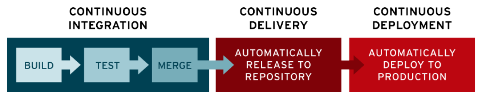

# CI/CD

**Continuous Integration/Delivery & Deployment**

## 파이프라인

코드 구축부터 시작해서 배포까지의 일련의 과정을 CI/CD 파이프라인이라고 함

- continuous integration: 코드를 빌드하고 테스트하고 합침
- continuous delivery: 해당 레포지토리에 릴리즈
- continuous deployment: 릴리즈 한 것을 프로덕션, 즉 실제 서비스에 배포

⇒ **코드 배포까지 좀 더 체계적으로 만들어주고, 테스트를 강제한다는 점**

### Build(빌드)

대표적인 예로 webpack

Modules with Dependencies (.js, .cjs, .sass, .png) ⇒ Static Assets(.js, .css, .jpg, .png)

html의 경우, .html이 아니면 화면에서 확인할 수 없다. 즉, vue 모듈은 html 화면에서 보여질 수 없지만 html, css, js로 변환해주는 것을 `빌드` 라고 한다.

### 테스트

1. 함수 등 작은 단위로 테스팅하는 단위테스트
2. 모듈을 통합할 때 테스트하는 통합 테스트
3. 사용자가 서비스를 사용하는 상황을 가정해서 테스트하는 엔드투엔드 테스트
4. 보안 테스트

### 머지

**충돌을 최소화** 하기 위해 git이나 svn을 통해 머지 ⇒ 요즘은 git을 많이 사용

작은 issue 단위로 머지를 하는 것을 추천하며, 화면 공유를 통해 해당 문제를 서로 해결해 나가는 것이 중요하다.

### 배포

사용자를 위한 서비스를 배포하는 것을 포함해 QA엔지니어나 관리자페이지를 위한 배포, 데이터웨어하우스로부터 데이터를 가공해서 백엔드 개발자를 위한 배포 등을 포함

### 툴

github action, genkins, circle ci를 통해 가능

heroku를 통해 CI, CD 설정 없이 자동으로도 가능
