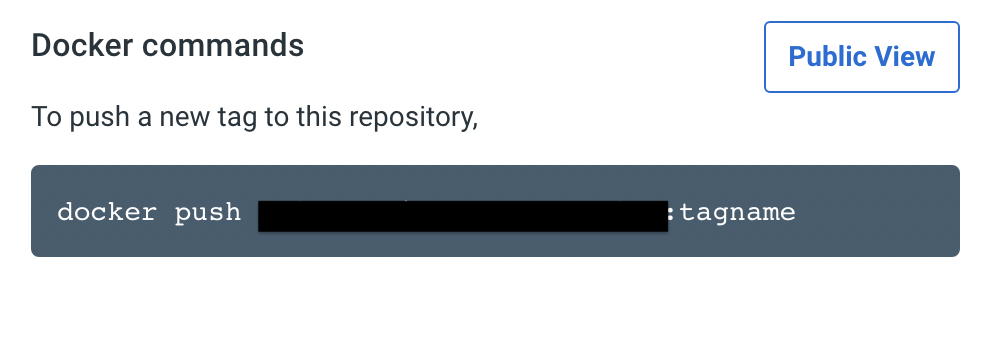

# Docker

## Docker

어플리케이션을 패키징 할 수 있는 툴

## Docker Container

어플리케이션과 필요한 System Tools, 환경설정과 같은 모든 Dependencies를 하나로 묶어서 어디서든 쉽게 배포하고 안정적으로 구동할 수 있게 도와주는 툴

VM과 다르게 운영체제를 포함하지 않고, Container 엔진이 설치된 Host OS를 공유한다.

이 Container엔진에서 가장 많이 사용하는 것이 Docker이다.


## Docker의 3대 구성요소

1. Dockerfile

   컨테이너를 어떻게 만들지에 대한 설명서

   어플리케이션 구동을 위한 파일, 설치해야 하는 dependencies, 환경 변수, 실행 파일 (run setup script)

2. Image

   Docker파일을 캡쳐해서 가지고 있는 이미지, 만들어진 이미지는 변경이 불가능

3. Container

   Image를 고립된 환경에서 실행할 수 있는 것

   Container 내부에서 어플리케이션이 동작

## Container 배포 방법

1. Local Machine에서 이미지를 만든다.
2. Container Registy에 만든 이미지를 push한다.
3. 필요한 server에서 이미지를 pull해서 실행한다.

## Dockerfile 만들기

**Dockerfile의 경우 Layer 시스템이기 때문에 빈번히 사용 되는 아이일 수록 뒤쪽에 적어주는 것이 좋다.**

```docker
## node의 경우 node:16-alpine
FROM BaseImage
```

```docker
# workdir 내부 /app에 필요한 것을 저장해두겠다는 의미
WORKDIR /app
```

```docker
# 필요한 package.json과 package-lock/json 파일을 workdirectory라고 지정한 /app
# 내부로 모두 가져온다.
COPY package.json package-lock.json ./
```

```docker
# run 명령어를 통해 실행하는데 필요한 모든 package들을 설치한다.
RUN npm install

# 우리가 개발할 때 썼던 package-lock.json에 저장되어있던 버전을 가지고 온다.
# 일반 npm install은 버전이 업그레이드 되면 함께 반영한다.
RUN npm ci
```

```docker
# dockerfile이 시작되었을 때, 실행될 파일
ENTRYPOINT ["node", "index.js"]
```

## Dockerfile 실행

- .(build context): 필요한 파일이 최상위 폴더에 있다는 것을 의미, 명령어를 수행하는 위치
- -f: 어떤 docker-file을 사용할 것인지 명시해주는 옵션
- -t: docker-file에 이름을 만들어주는 옵션 (태그와 비슷하다고 생각하면 쉽다)

```bash
docker build -f Dockerfile -t anna-docker .
```

## DockerImage 확인

위의 도커 파일을 실행하면 Docker Image가 만들어진다.

아래 명령어를 통해 docker image를 확인 가능하다.

```bash
docker images

REPOSITORY    TAG       IMAGE ID       CREATED          SIZE
anna-docker   latest    c9324d160f8d   59 seconds ago   118MB
```

## Docker 실행

- -d: detached를 위한 옵션(background에서 docker가 동작해야 하기 때문에)
- -p: port를 지정하기 위한 옵션

```bash
docker run -d -p 8080:8080 anna-docker
```

## Docker push

내가 만든 도커를 Repository에 올리기 위해서 Docker hub에 create-repository를 하면,

어떤 명령어로 push를 해줘야 하는지 아래처럼 뜬다.



그러면 해당 이름으로 바꿔주면 된다.

```bash
docker tag anna-docker:latest 바꿔줄 이름:latest
```

만들어진 이미지를 확인한 후,

```bash
docker images
```

도커에 로그인을 한다. 이때 docker-hub에 가입된 아이디와 비밀번호를 입력하면 된다.

```bash
docker login
```

아래 명령어를 입력하면 docker hub에 내가 만든 docker 이미지가 잘 올라가있는 것을 확인할 수 있다.

```bash
docker push 바뀐이름:latest
```
