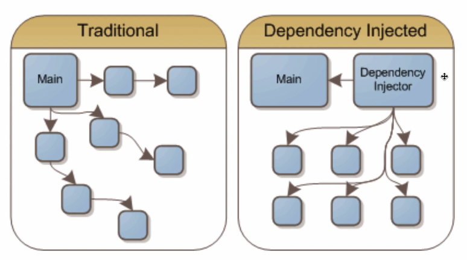

# DI(Dependency Injection) 의존성 주입

메인 모듈이 ‘직접’ 다른 하위 모듈에 대한 의존성을 주기보다는 **중간에 의존성 주입자(Dependency Injector)가 이 부분을 가로채 메인 모듈이 ‘간접’적으로 의존성을 주입**하는 방식



메인 모듈과 하위 모듈간의 의존성을 조금 더 느슨하게 만들 수 있으며 모듈을 **쉽게 교체 가능한 구조**로 만듦

### 의존한다. 라는 의미

A가 B에 의존한다 ⇒ B가 변하면 A에 영향을 미치는 관계 ⇒ A → B

```java
class B {
	public void go() {
		System.out.println("B의 go()함수");
	}
}

	class A {
		public void go() {
			new B().go();
		}
}

// B의 메서드를 바꾸면 A의 메서드 실행시 오류가 발생하기 때문에 A에도 영향을 끼침
public class main {
	public static void main(String[] args) {
		new A().go();
	}
}
```

\*\* 자바에서 DI를 적용한 사례

Developer라는 인터페이스를 두면서 BackendDeveloper와 FrontendDeveloper가 의존하게 만듦

```java
interface Developer {
	void develop();
}

class BackendDeveloper implements Developer {
	@Override
	public void develop() {
		writeJava();
	}
	public void writeJava() {
		System.out.println("자바가 좋아~");
	}
}

class FrontendDeveloper implements Developer {
	@Override
	public void develop() {
		writeJavascript();
	}
	public void writeJavascript() {
		System.out.println("자바스크립트가 좋아~");
	}
}

public class Project {

	private final List<Developer> developers;

	public Project(List<Developer> developers) {
		this.developers = developers;
	}

	public void implement() {
		developers.forEach(Developer::develop);
	}

	public static void main(String args[]) {
		List<Developer> dev = new ArrayList<>();
		dev.add(new BackendDeveloper());
		dev.add(new FrontendDeveloper());
		Project a = new Project(dev);
		a.implement();
	}
}
```

## 의존관계역전원칙

의존성 주입을 할 때 의존관계역전원칙(DIP, Dependency Inversion Principle)이 적용

**규칙**

- 상위 모듈이 하위 모듈에 의존X ⇒ 모두 추상화에 의존해야 함
- 추상화는 세부 사항에 의존X ⇒ 세부사항은 추상화에 따라 달라져야 함

### 의존성 주입의 장점

1. 외부에서 모듈을 생성하여 dev.add(new BackendDeveloper()) 이런 식으로 집어넣는 구조가 되기 때문에 모듈들을 쉽게 교체할 수 있는 구조
2. 단위 테스팅과 마이그레이션이 쉬워짐
3. 애플리케이션 의존성 방향이 좀 더 일관되어 코드를 추론하기가 쉬워짐

### 의존성 주입의 단점

1. 모듈이 더 생기게 됨 (비용이 추가로 들어감)
2. 종속정 주입 자체가 컴파일을 할 때가 아닌 런타임에 일어나기 때문에 컴파일을 할 때 **종속성 주입에 관한 에러를 잡기가 어려워짐**
