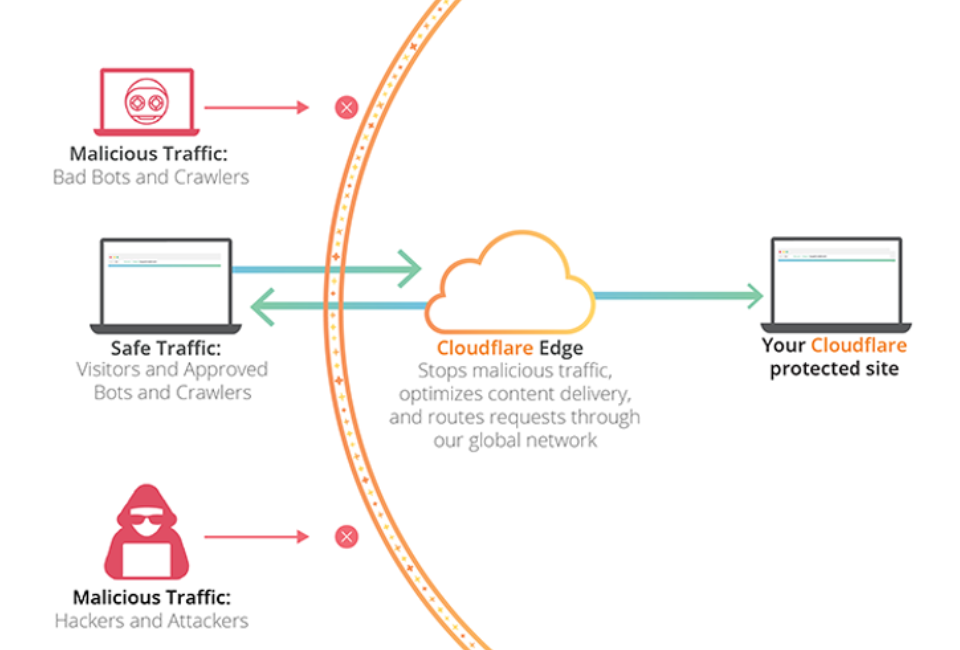
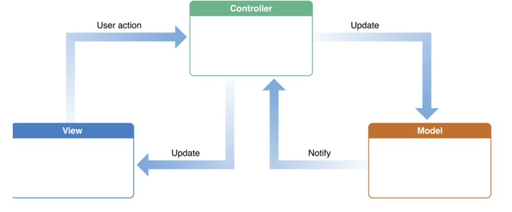
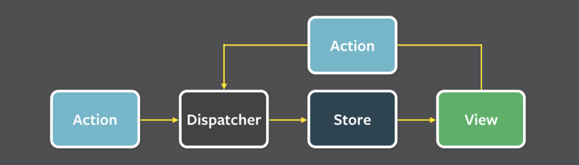

# 디자인패턴

프로그램을 설계할 때 발생했던 문제점들을 객체 간의 상호 관계 등을 이용하여 해결할 수 있도록 하나의 `규약` 형태로 만들어 놓은 것

라이브러리나 프레임워크를 만드는데 기초적인 원리가 됨

|        | 라이브러리                                                  | 프레임워크                                                |
| ------ | ----------------------------------------------------------- | --------------------------------------------------------- |
| 공통점 | 공통으로 사용될 수 있는 특정한 기능들을 모듈화 한 것        |
| 차이점 | 폴더명, 파일명 등에 대한 규칙 x, 프레임워크에 비해 자유로움 | 폴더명, 파일명 등에 대한 규칙 o, 라이브러리에 비해 엄격함 |
| 예시   | 차, axios                                                   | 비행기, vue.js, 장고                                      |

### 📍 생성패턴

**객체 생성 방법**이 들어간 디자인패턴

⇒ 싱글톤, 팩토리, 추상팩토리, 빌더, 프로토타입 패턴

### 📍 구조패턴

객체, 클래스 등으로 큰 구조를 만들 때 **유연하고 효율적으로 만드는 방법**이 들어간 디자인패턴

⇒ 프록시, 어댑터, 브리지, 복합체, 데코레이터, 퍼사드, 플라이웨이트 패턴

### 📍 행동 패턴

객체나 클래스 간의 알고리즘, 책임 할당에 관한 디자인패턴

⇒ 이터레이터, 옵저버, 전략, 책임연쇄, 커맨드, 중재자, 메멘토, 상태, 템플릿메서드, 비지터패턴

## ✨ 싱글톤 패턴

하나의 클래스에 오직 하나의 인스턴스만을 가지는 패턴

하나의 클래스를 기반으로 여러 개의 개별적인 인스턴스를 만들 수 있지만 그렇게 하지 않고 **하나의 클래스를 기반으로 단 하나의 인스턴스**만 만듦

보통 데이터베이스 연결모듈에 많이 사용

### ⭕️ 장점

하나의 인스턴스를 기반으로 해당 **인스턴스를 다른 모듈들이 공유하여 사용** → **인스턴스 생성 시 비용 감소**

인스턴스 생성에 많은 비용이 드는 I/O 바운드 작업(디스크 연결, 네트워크 통신, 데이터베이스 연결)에 사용

### ❌ 단점

의존성이 높아지며 TDD(Test Driven Development)에 걸림돌

TDD를 할 때 단위 테스트를 주로 하는데, 단위 테스트는 서로 독립적이어야 하며 테스트를 어떤 순서로든 실행할 수 있어야 하지만, 싱글톤 패턴은 미리 생성된 하나의 인스턴스를 기반으로 구현하는 패턴이므로 **각 테스트마다 ‘독립적인’ 인스턴스를 만들기 어려움**

## ✨ 팩토리 패턴

**상속** 관계에 있는 두 클래스에서 **상위 클래스가 중요한 뼈대를 결정**하고, **하위 클래스에서 객체 생성에 관한 구체적인 내용을 결정**하는 패턴

상위 클래스에서는 객체 생성방식에 대해 알 필요가 없어져 유연성을 갖게 되며 객체 생성 로직은 하위클래스에서 관리되기 때문에 **유지보수성 증가**

자바스크립트 예시

```js
// 상위클래스
class CoffeeFactory {
  static createCoffee(type) {
    const factory = factoryList[type];
    return factory.createCoffee();
  }
}

class Latte {
  constructor() {
    this.name = 'latte';
  }
}

class Espresso {
  constructor() {
    this.name = 'Espresso';
  }
}

// 하위 클래스들 => 생성에 관한 로직 모두 포함
class LatteFactory extends CoffeeFactory {
  static createCoffee() {
    return new Latte(); // 라떼 생성
  }
}

class EspressoFactory extends CoffeeFactory {
  static createCoffee() {
    return new Espresso(); // 에스프레소 생성
  }
}

const factoryList = { LatteFactory, EspressoFactory };

const main = () => {
  // 라떼 커피를 주문한다.
  const coffee = CoffeeFactory.createCoffee('LatteFactory');
  // 커피 이름을 부른다.
  console.log(coffee.name); // latte
};
main();
```

자바 예시

```java
enum CoffeeType {
	LATTE,
	ESPRESSO
}

abstract class Coffee {
	protected String name;

	public String getName() {
		return name;
	}
}

class Latte extends Coffee {
	public Latte() {
		name = "latte";
	}
}

class Espresso extends Coffee {
	public Espresso() {
		name = "espresso";
	}
}

class CoffeeFactory {
	public static Coffee createCoffee(CoffeeType type) {
		switch (type) {
			case LATTE:
				return new Latte();
			case ESPRESSO:
				return new Espresso();
			default:
				throw new IllegalArgumentException("Invalid coffee type: " + type);
		}
	}
}

public class Main {
	public static void main(String[] args) {
		Coffee coffee = CoffeeFactory.createCoffee(CoffeeType.LATTE);
		System.out.println(coffee.getName()); // latte
	}
}
```

## ✨ 이터레이터 패턴

이터레이터(iterator)를 사용하여 **컨테이너**의 요소들에 접근하는 디자인 패턴

각기 다른 자료구조들을 똑같은 인터페이스로 순회를 쉽게 할 수 있다는 장점

## ✨ 전략 패턴

전략이라고 부르는 ‘캡슐화한 알고리즘’ 컨텍스트 안에서 바꿔주면서 상호 교체가 가능하게 만드는 디자인 패턴

ex) 소셜 로그인을 할 때 카카오로도 가능하고, 네이버로도 가능하고, 구글로도 가능하게 하는 것

```java
public class HelloWorld {
	public static void main(String []args) {
		ShoppingCart cart = new ShoppingCart();

		Item A = new Item("kundolA", 100);
		Item B = new Item("kundolB", 300);

		cart.addItem(A);
		cart.addItem(B);

		// 전략마다 매개변수가 다를 수 있음
		// 페이 내부에 전략을 캡슐화하여 생성
		cart.pay(new LUNACardStrategy("kundol@example.com", "pukubababo"));
		cart.pay(new KAKAOCardStrategy("Ju hongchul", "123456789", "123", "12/01"));
	}
}
```

## ✨ 옵저버 패턴

주체가 어떤 객체의 상태 변화를 관찰하다가 상태 변화가 있을 때마다 메서드 등을 통해 옵저버 목록에 있는 옵저버들에게 변화를 알려주는 디자인 패턴

```java
import java.util.ArrayList;
import java.util.List;

interface Subject {
	public void register(Observer obj);
	public void unregister(Observer obj);
	public void notifyObservers();
	public Object getUpdate(Observer obj);
}

// 옵저버 인터페이스 선언
interface Observer {
	public void update();
}

class Topic implements Subject {
	private List<Observer> observers; // 옵저버를 담을 리스트 선언
	private String message;

	public Topic() {
		this.observers = new ArrayList<>();
		this.message = "";
	}

	@Override
	public void register(Observer obj) {
		if (!observers.contains(obj)) observers.add(obj);
	}

	@Override
	public void unregister(Observer obj) {
		observers.remove(obj);
	}

	@Override
	public void notifyObservers() {
		this.observers.forEach(Observer::update);
	}

	@Override
	public Object getUpdate(Observer obj) {
		return this.message;
	}

	public void postMessage(String msg) {
		System.out.println("Message sended to Topic: " + msg);
		this.message = msg;
		notifyObservers();
		}
}
	// 옵저버를 상속받아 만든 TopicSubscriber
	class TopicSubscriber implements Observer {
		private String name;
		private Subject topic;

		public TopicSubscriber(String name, Subject topic) {
			this.name = name;
			this.topic = topic;
		}

		@Override
		public void update() {
			String msg = (String) topic.getUpdate(this);
			System.out.println(name + ":: got message >> " + msg);
		}
}

public class HelloWorld {
	public static void main(String[] args) {
		Topic topic = new Topic();
		Observer a = new TopicSubscriber("a", topic); // 옵저버 생성
		Observer b = new TopicSubscriber("b", topic); // 옵저버 생성
		Observer c = new TopicSubscriber("c", topic); // 옵저버 생성

		topic.register(a); // 옵저버를 토픽에 등록
		topic.register(a); // 옵저버를 토픽에 등록
		topic.register(a); // 옵저버를 토픽에 등록

		// 메세지를 아래 매개변수 안에 있는 것으로 변경하고, notifyObservers() -> Observer update -> 옵저버 한꺼번에 업데이트
		topic.postMessage("amumu is op champion");
	}
}
```

## ✨ 프록시 패턴 (많이 쓰임!!!!!)

객체가 어떤 대상 객체에 접근하기 전, 그 접근에 대한 흐름을 가로채서 해당 접근을 필터링하거나 수정하는 등의 역할을 하는 계층이 있는 디자인패턴

**형태: Interface - proxy - Interface**

\*\* 서비스 앞단에 프록시 서버로 cloudflare를 둬서 불필요한, 공격적인 트래픽을 막는데 많이 사용

```jsx
// 값이 변경될 때 미리 확인해서 변경되었다는 callback을 알려주는 함수
function createReactiveObject(target, callback) {
  const proxy = new Proxy(target, {
    set(obj, prop, value) {
      if (value !== obj[prop]) {
        const prev = obj[prop];
        obj[prop] = value;
        callback(`${prop}가 [${prev}] >> [${value}] 로 변경되었습니다.`);
      }
      return true;
    },
  }); // proxy 생성 끝
  return proxy;
} // function 끝

const a = {
  형규: '솔로',
};

const b = createReactiveObject(a, console.log);
b.형규 = '솔로';
b.형규 = '커플';
```

proxy서버의 대표적인 예시


## ✨ MVC MVP MVVM패턴

## ✨ MVC

모델(Model), 뷰(View), 컨트롤러(Controller)로 이루어진 디자인 패턴



### 모델

애플리케이션의 데이터인 데이터베이스, 상수, 변수 등을 뜻함

뷰에서 데이터를 생성하거나 수정할 때 컨트롤러를 통해 모델이 생성 또는 업데이트 됨

### 뷰(UI)

inputbox, checkbox, textarea 등 사용자 인터페이스 요소를 나타내며 모델을 기반으로 사용자가 볼 수 있는 화면(UI)

**모델이 가지고 있는 정보를 따로 저장하지 않아야 하며** 변경이 일어나면 컨트롤러에 이를 전달해야 함

### 컨트롤러

하나 이상의 모델과 하나 이상의 뷰를 잇는 다리 역할을 하며 이벤트 등 메인 로직을 담당

모델과 뷰의 생명주기도 관리하며, 모델이나 뷰의 변경 통지를 받으면 이를 해석하여 각각의 구성 요소에 해당 내용에 대해 알려줌

비즈니스 로직을 참조

### ⭕️ MVC 패턴의 장점

1. 애플리케이션의 구성 요소를 세 가지 역할로 구분하여 개발 프로세스에서 각각의 구성 요소에만 집중해서 개발할 수 있음
2. 재사용성과 확장성이 용이하다는 장점

### ❌ MVC 패턴의 단점

애플리케이션이 복잡해질수록 모델과 뷰의 관계가 복잡해지는 단점

## ✨ MVP

C가 P(presenter)로 교체된 패턴, **V와 P는 1:1 관계이므로 MVC보다 더 강한 결합**을 지닌 디자인 패턴

## ✨ MVVM

C가 VM(view model)로 바뀐 패턴

VM은 뷰를 추상화한 계층이며 VM : V = 1 : N(1대 다)

\*\* 특징

커멘드 : 여러 요소에 대한 처리를 하나의 액션으로 처리할 수 있는 기법

데이터 바인딩 : 화면에 보이는 데이터와 브라우저 상의 메모리 데이터를 일치시키는 방법

| 특징 | MVC 패턴              | MVP 패턴              | MVVM 패턴           |
| ---- | --------------------- | --------------------- | ------------------- |
| 관계 | 컨트롤러와 뷰는 1 : n | 프레젠터와 뷰는 1 : 1 | 뷰모델과 뷰는 1 : n |
| 참조 | 뷰: 컨트롤러 참조x    | 뷰: 프레젠터 참조 o   | 뷰: 뷰모델 참조 o   |

## ✨ flux 패턴

단방향으로 데이터를 관리하는 디자인 패턴

**Action → Dispatcher → Store → View**



### Action

사용자의 이벤트를 담당

이벤트에 관한 객체를 만들어내 dispatcher에 전달

### Dispatcher

들어오는 Action 객체 정보를 기반으로 어떠한 ‘행위’를 할 것인가를 결정

보통 Action 객체의 **type**을 기반으로 미리 만들어 놓은 로직을 수행하고 이를 store에 전달

### Store

애플리케이션 상태를 관리하고 저장하는 계층

도메인의 상태, 사용자의 인터페이스 등의 상태를 모두 저장

### View

데이터를 기반으로 표출이 되는 사용자 인터페이스

### ⭕️ 장점

일관성 증가 → 테스팅하기 쉬움 → 버그를 찾기도 쉬움

## ✅ 전략 패턴과 DI의 차이

**공통점: 모두 무언가를 쉽게 교체하기 위한 디자인패턴**

### 전략패턴

어떠한 동일한 행동 계약을 기반으로 다양한 구현이 명시되어 있는 인터페이스를 만드는 것을 포함

### 의존성 주입

단지 일부 동작을 구현하고 **의존성을 주입**하기만 하는 패턴

## ✅ 컨텍스트

1. 어떤 종류의 상태, 환경을 캡슐화한 것을 의미
2. 작업이 중단되고 나중에 같은 지점에서 계속 될 수 있도록 저장하는 최소 데이터 집합(컨텍스트스위칭)
