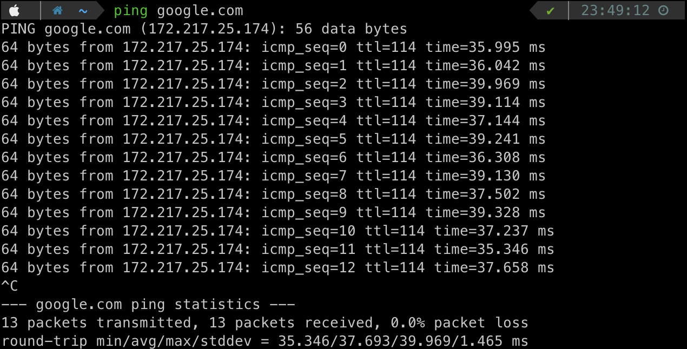
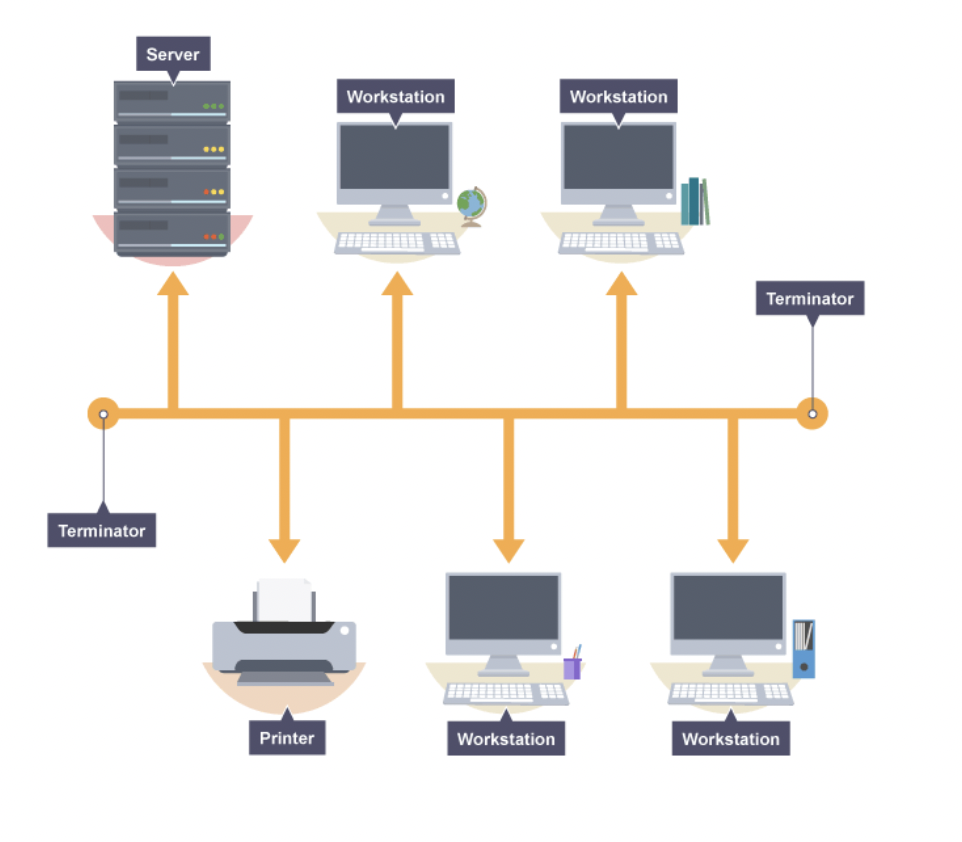
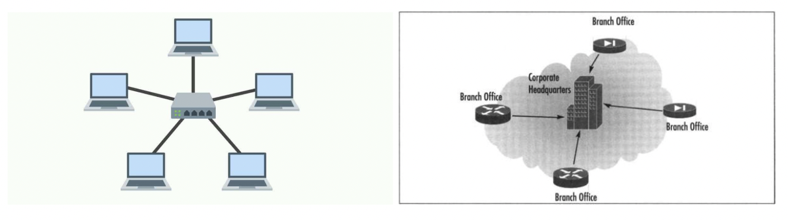
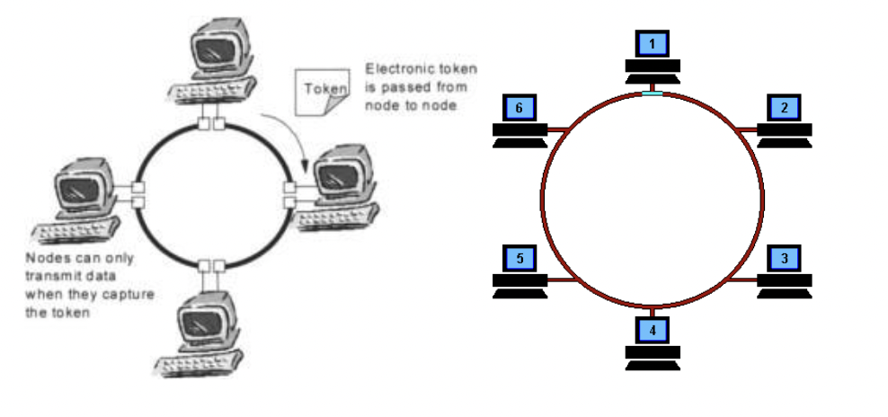

# 네트워크

## 📍 네트워크

노드(node)와 링크(link)가 서로 연결되어 있으며 리소스를 공유하는 집합

- 노드: 서버, 라우터, 스위치 등 네트워크 장치
- 링크(엣지): 유선 또는 무선과 같은 연결매체 (와이파이나 LAN)

핸드폰도 노드, naver서버도 노드 → 이 사이를 연결하는 매체를 링크라고 한다.

## 📍 트래픽

특정시점에 링크 내의 `흐르는` 데이터의 양

ex) 서버에 저장된 파일(문서, 이미지, 동영상 등)을 클라이언트(사용자)가 다운로드시 발생되는 데이터의 누적량

- 트래픽이 많아졌다 = 흐르는 데이터가 많아졌다
- 처리량이 많아졌다 = 처리되는 트래픽이 많아졌다

단위: bps(bits per second)

<aside>
💡 10MB 동영상을 10명이 다운로드 시 누적 트래픽은 ?
10MB * 10 = 100MB

</aside>

## 📍 처리량

**링크 내에서 성공적으로 전달된 데이터의 양**을 말하며 보통 얼만큼의 트래픽을 처리했는지를 나타냄

많은 트래픽을 처리한다 = 많은 처리량을 가진다.

단위: bps(bits per second) ⇒ 초당 전송 또는 수신되는 비트 수

처리량은 사용자들이 많이 접속할 때마다 커지는 트래픽, 네트워크 장치 간의 대역폭, 네트워크 중간에 발생하는 에러, 장치의 하드웨어 스펙에 영향을 받음

ex) 10만명이 한 서버에 접속하면 트래픽은 많아지지만, 처리량은 줄어듦

## 📍 대역폭

주어진 시간 동안 네트워크 연결을 통해 흐를 수 있는 **최대 비트 수**를 의미(최대 트래픽)

<aside>
💡 10Mbps라는 대역폭을 가진 서버가 있고 한 사용자당 100kbps로 동영상 파일을 요청할 때 최대 동접자수는 ?
100Mbps / 100kbps = 약 1000명

</aside>

## 📍 RTT

Round Trip Time: 왕복 지연시간

RTT = 신호 전송 + 해당 신호의 수신 확인에 걸린 시간 = 어떤 메시지가 두 장치 사이를 왕복하는데 걸린 시간

## 📍 네트워크 토폴로지

노드와 링크가 어떻게 구성되어있는지를 의미

### ✨ 버스 토폴로지

- 특징
  - 하나의 회선에 여러 개의 노드
  - 노드 추가, 삭제 쉬움
  - 하나의 회선을 사용하기 때문에 설치비용 적음
- 장점
  - 소규모 네트워크를 구축하기 매우 쉬움
  - 한 노드에 장애가 발생해도 다른 노드에 영향x
- 단점
  - 메인 링크에 많은 트래픽이 생기면 정체현상 발생 가능성 높음(패킷 손실율 높음)
  - 메인 링크 망가지면 큰 문제 ⇒ 전체 네트워크에 문제 생길 수 있음

### ✨ 스타 토폴로지

- 특징
  - 중앙에 있는 노드를 기반으로 연결된 형태
  - 노드 추가, 삭제 쉬움
- 장점
  - 중앙 노드가 아닌 한 노드에 장애가 발생해도 **다른 노드에 영향X**
  - 안정성이 높음(중앙 노드가 아닌 한 노드에 침해가 발생했을 때 다른 노드로 확장하기가 어렵기 때문)
  - **다른 노드로 가려면 중앙 노드를 무조건 거쳐야 하고** 보통의 스타토폴로지는 **중앙 노드의 방화벽** 등을 더욱 깐깐하게 해놓음
  - 한 링크에 문제가 생겨도 해당 부분만 영향을 받고 나머지 부분은 정상적으로 작동함
- 단점
  - 중앙노드 에러시 큰 문제

### ✨  트리 토폴로지

- 특징
  - 트리형태(계층적 토폴로지라고도 함)
  - 노드 추가, 삭제 보통(리프 노드를 기반으로 확장은 용이하지만, 다른 노드는 어려움)
  - **버스 토폴로지와 스타 토폴로지의 하이브리드 형태**
- 장점
  - **노드 확장이 용이**(주로 리프 노드로 확장함)
  - 리프 노드의 에러는 나머지 부분에 영향을 미치지 않음
- 단점
  - 특정 노드 트래픽 집중시 하위 노드에 영향
  - 루트 노드에 문제가 생기면 전체 네트워크에 큰 문제

\*\* 백본케이블 : 여러 소형 네트워크들을 묶어 대규모 파이프라인을 통해 극도로 높은 대역폭으로 다른 네트워크들의 집합과 연결되는 네트워크 (대규모 패킷 통신망)

### ✨ 링형 토폴로지

- 특징
  - 고리 형태
  - **노드 추가, 삭제가 쉬움**
- 장점
  - 노드 수가 많아져도 데이터 손실이 없음
  - 토큰을 기반으로 연속적으로 노드를 거치며 **통신 권한 여부를 따지고 해당 권한이 없는 노드는 데이터를 전달받지 않음**
- 단점
  - 링크 또는 노드가 하나만 에러 발생해도 전체 네트워크에 영향 ⇒ 다리가 끊겼다고 생각하면 쉬움
  - 토큰이 없는 노드는 통신에 참여를 못하며 데이터 공유가 안됨

### ✨ 메시 토폴로지

- 특징
  - 그물망 형태
  - **노드 추가, 삭제 어려움**
  - 풀(full) 메시 토폴로지의 경우 n \* (n - 1) / 2의 회선이 필요함
- 장점
  - **안정성이 높음(회선이 많이 연결되어 있기 때문에) ⇒** 한 노드가 장애가 나도 다른 노드에 영향을 미치지 않음
  - 트래픽을 분산할 수 있음 (회선이 많기 때문에 분산을 할 수 있음)
- 단점
  - 회선이 비효율적으로 많기 때문에 구축 비용이 고가

## 📍 토폴로지의 필요성

토폴로지는 병목 현상을 해결하는 척도가 됨

### ✨  병목현상

트래픽에 의해 데이터 흐름이 제한되는 상황 (네트워크 한정 핫스팟)

\*\* 문제가 발생했을 때 해결할 수 있는 방법

1. 자원의 양을 확인(메모리)
2. **토폴로지를 확인한 후 회선의 양을 늘림 ⇒ 해결의 척도**가 될 수 있다.

---

## 📍 유니캐스트

1 : 1 통신을 의미

대표적으로 HTTP 통신이 있으며, 가장 일반적인 네트워크 전송 형태

(ex. 네이버 요청)

## 📍 멀티캐스트

1 : N 통신을 의미

N이지만 모든 노드들에게 데이터를 전달하지는 않고 특정 그룹에게만 데이터를 전달

## 📍 브로드캐스트

1 : N 통신을 의미

그룹이 아닌 **연결되어있는 모든 노드에게 데이터를 전달**하며, ARP가 있음

(멀티캐스트랑 비슷하지만, 연결이 되어있으면 그냥 전달한다.)

## 📍  네트워크의 분류

LAN < WAN < MAN 순서대로 큰 단위이며, 보통은 반경, 속도의 크기를 기반으로 분류

### ✨  LAN

Local Area Network으로 근거리 통신망

- 특징
  - MAN, WAN 보다 높은 안정성과 속도
  - **소규모 네트워크(집, 사무실)** - 보통 허브나 스위치로 연결
  - **하나의 논리적 주소인 IP를 기반으로 여러개의 물리적 주소인 MAC 주소로 구별하는 네트워크**
- 종류
  - MAC 주소: 물리적 주소 ⇒ 공장에서 핸드폰이 나올 때 받는 고유 주소이며 변하지 않음
  - IP 주소: 논리적 주소 ⇒ 변할 수 있음(각 나라의 스타벅스에서 연결하는 IP는 모두 다름)
    ⇒ 가상의 IP를 할당 ⇒ 내부적 기술로는 MAC주소를 기반으로 구분

### ✨  MAN

Metropolitan Area Network으로 대도시 통신망

- 특징
  - **도시와 도시의 통신망**을 뜻하며 2개 이상의 LAN이 연결되어 구성
  - 라우터, 브리지 등으로 연결됨

### ✨  WAN

Wide Area Network으로 광역 통신망

- 특징
  - 국가와 국가와의 통신망을 뜻하며 인터넷이라고도 함
  - 많은 라우터를 거쳐 다른 국가와도 연결
