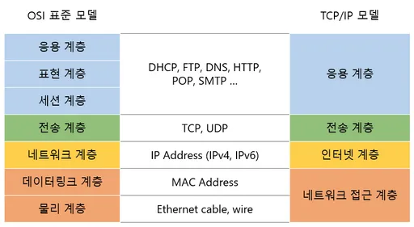
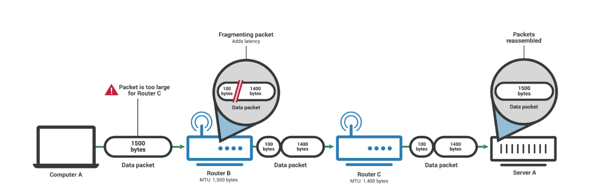
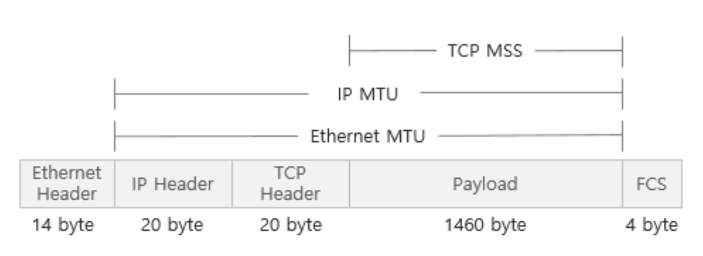
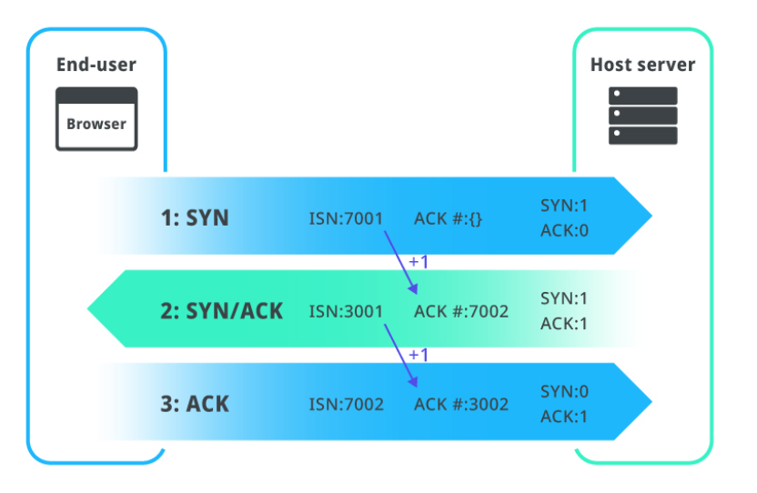
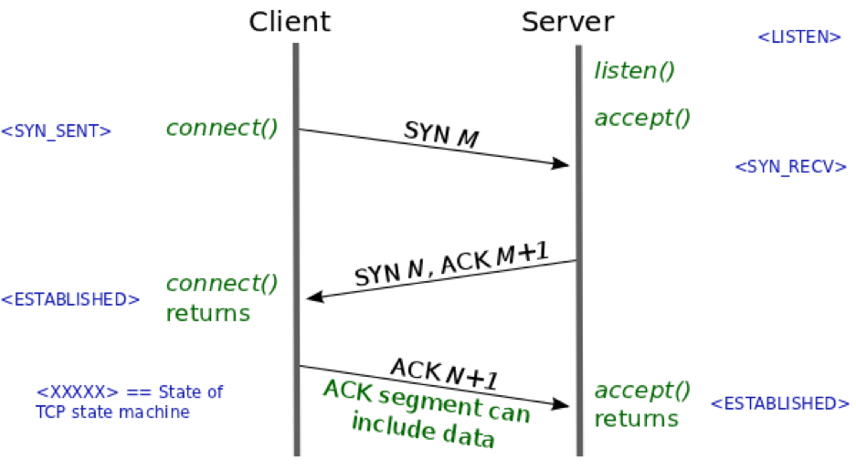
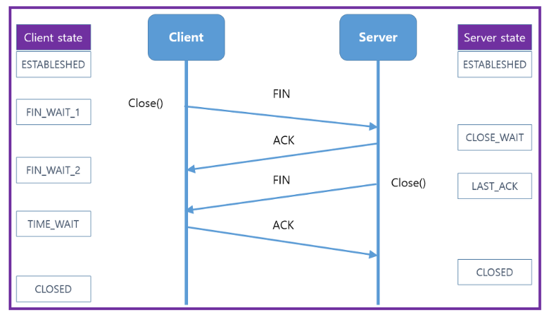

# TCP/IP

## 📍 TCP/IP 4계층

### ✨ 개념

**장치들이 인터넷 상에서 데이터를 주고 받을 때 쓰는 `독립적인` 프로토콜**의 집합이며, 각 계층이 독립적이다.

TCP(Transmission Control Protocol) / IP(Internet Protocol) ⇒ 인터넷을 통해 데이터를 보낼 때 주로 사용하여 보내기 때문



### Application 계층(응용 계층)

HTTP, SMTP, SSH, FTP가 대표적이며 웹 서비스, 이메일 등 서비스를 실질적으로 사람들에게 제공하는 층

### Transport 계층(전송 계층)

TCP, UDP가 대표적이며 **애플리케이션에서 받은 메시지**를 기반으로 세그먼트(TCP) 또는 데이터그램(UDP)으로 데이터를 쪼개고 데이터가 오류 없이 순서대로 전달되도록 도움을 주는 층

오류 체크가 가능한 계층

### Internet 계층(network)

IP, ICMP, ARP가 대표적이며 한 노드에서 다른 노드로 전송 계층에서 받은 세그먼트 또는 데이터그램을 패킷화 하여 목적지로 전송하는 역할을 담당

주소 역할을 하는 계층

### link 계층 (네트워크 접근 계층)

전선, 광섬유, 무선 등으로 데이터가 네트워크를 통해 물리적으로 전송되는 방식을 정의

데이터링크 계층과 물리 계층을 합친 계층

## 📍 캡슐화와 비캡슐화

### ✨  캡슐화

송신자가 수신자에게 데이터를 보낼 때 데이터가 각 계층을 지나며 각 계층의 특징들이 담긴 헤더들이 붙여지는 과정

응용 계층 → 전송 계층 → 인터넷 계층 → 링크 계층

### ✨  비캡슐화

수신자측에서 캡슐화된 데이터를 역순으로 제거하면서 응용 계층까지 도달하는 것

링크 계층 → 인터넷 계층 → 전송 계층 → 응용 계층

## 📍 PDU

PDU(Protocol Data Unit): TCP/IP 4계층을 기반으로 설명했을 때 각 계층의 데이터 단위

- 어플리케이션 계층: 메시지
- 전송 계층: 세그먼트(TCP), 데이터그램(UDP)
- 인터넷 계층: 패킷
- 링크 계층: 프레임(데이터 링크 계층), 비트(물리 계층)

\*\* 세그먼트: 적절한 크기로 쪼갠 조각(세그먼트 = 데이터그램)

\*\* 패킷: 세그먼트에 SP와 DP가 포함된 IP 헤더가 붙은 형태의 조각

\*\* 프레임: MAC 주소 헤더와 CRC/체크섬 트레일러가 붙은 조각

## 📍 CRC/체크섬 트레일러

**데이터의 오류감지**를 위한 수학적 함수가 적용된 값들이 있는 필드

링그의 오류(과도한 트래픽 등)로 인해 데이터 손상을 감지하는 역할 ⇒ CRC/체크섬 두가지 과정을 기반으로 데이터 전송오류 및 데이터 무결성을 방지

- CRC: CRC-1, CRC-16등의 알고리즘으로 나온 값을 통해 데이터 전송 오류 감지를 수행
- 체크섬: MD5, SHA-256등의 알고리즘으로 나온 값을 통해 데이터 무결성을 방지

---

## 📍 MTU, MSS, PMTUD

### ✨ MTU

네트워크가 통신할 때 할 수 있는 가장 큰 PDU의 크기(IP 헤더와 TCP 헤더의 크기를 합친 것)

패킷으로 쪼개질 때 MTU(Maximum Transmission Unit)를 기반으로 쪼개짐

통신을 하는 양쪽 끝은 두 장치의 MTU만이 아니라 중간의 모든 라우터, 스위치, 서버를 고려해야 함

네트워크 경로 상에 있는 아무 장치나 MTU보다 패킷이 크면 그 패킷은 분할 가능성이 있음



Router C의 MTU가 1400바이트이기 때문에 패킷이 분할되고 있음

### ✔️ 패킷이 분할되지 않는 경우

패킷을 분할할 수 없어 네트워크 경로 상에 있는 어떠한 라우터나 장치의 MTU를 초과할 때 분할해서 전달하는 것이 아니라 아예 전달을 하지 않을 수도 있음

특히 IPv6는 분할을 허용하지 않음!

### ✨ MSS

Maximum Segment Size를 의미

TCP에서 사용할 수 있는 데이터의 크기이자 TCP헤더, IP 헤더를 뺀 크기

일반적으로 MTU는 1500바이트, MSS는 1460바이트 ⇒ 데이터는 보통 1460바이트 이하의 크기로 보내야 전달이 가능!



이더넷 프레임 = 이더넷 헤더 14바이트, FCS 4바이트가 포함된 것 ⇒ 1518byte

\*\* FCS(Frame Check Sequence): 데이터의 에러 검출을 돕기 위해 삽입되는 필드(CRC 생성 값 포함)

### ✨ PMTUD

PMTUD(Path MTU Discovery)는 수신자와 송신자의 경로 상에서 장치가 패킷을 누락한 경우 **테스트 패킷의 크기를 낮추면서 MTU에 맞게끔 반복해서 보내는 과정**

---

## 📍 Application 계층

### ✨ HTTP

HTTP(Hypertext Transfer Protocol): 처음에는 서버와 브라우저 간의 데이터를 주고 받기 위해 설계된 프로토콜이지만 현재는 서버와 서버간의 통신때도 많이 이용함

1. 헤더를 통한 확장이 쉽다.

   헤더값에다가 어떠한 값을 넣어서 HTTP 요청을 할 때 쉽게 다른 값을 추가할 수 있음

2. stateless 하다.

   동일한 연결에서 연속적으로 수행되는 두 요청 사이에 연속적인 상태(state)값이 없음

### ✨ SSH

SSH(Secure Shell Protocol): 보안되지 않은 네트워크에서 네트워크 서비스를 안전하게 운영하기 위한 암호화 네트워크 프로토콜

```bash
#ssh서버에 연결할 때 사용하는 명령어의 일종
ssh <pem> <user>@<serverIP>
```

### ✨  FTP

FTP(File Transfrer Protocol): 노드와 노드간의 파일을 전송하는데 사용되는 프로토콜

현재는 파일을 암호화해서 전송하는 FTPS 또는 SFTP로 대체

### ✨ SMTP

인터넷을 통해 메일을 보낼 때 사용되는 프로토콜 (Simple Mail Transfer Protocol)

보통 서비스를 운영하면 메일링 서비스를 하게 되는데 node.js를 통해 메일을 보낸다면 이를 통해 보내야 함

---

## 📍 전송 계층 TCP, UDP

애플리케이션에서 받은 메세지를 기반으로 세그먼트(TCP) 또는 데이터그램(UDP)으로 데이터를 쪼개고 데이터가 오류 없이 순서대로 전달되도록 도움을 주는 층

### ✨  TCP

- 가상회선패킷교환방식
  가상회선을 기반으로 패킷을 **순차적으로** 전송
  
- 오류검사 매커니즘
  - 재전송: 시간 초과 기간이 지나면 서버는 전달되지 않은 데이터에 대해 재전송을 시도
  - 체크섬: 체크섬을 통해 **무결성**을 평가
    즉, 송신된 데이터의 체크섬과 수신된 데이터의 체크섬 값을 비교해서 올바르게 왔는지를 확인

\*\* TCP Header: 20~60바이트로 가변적

### ✨  UDP

- 데이터그램패킷교환방식
  딱히 순서는 고려하지 않고 패킷을 전송
- 오류검사
  - 단순한 체크섬만 지원
- 헤더
  - 8바이트로 고정길이

### TCP와 UDP

|                  | TCP                                                                                              | UDP                                                                                  |
| ---------------- | ------------------------------------------------------------------------------------------------ | ------------------------------------------------------------------------------------ |
| 패킷교환방식     | 가상회선패킷교환방식                                                                             | 데이터그램패킷교환방식                                                               |
| 신뢰성           | o                                                                                                | x                                                                                    |
| 오류검사         | 재전송, 체크섬                                                                                   | 체크섬                                                                               |
| 패킷의 순서보장  | o                                                                                                | x                                                                                    |
| 헤더길이         | (20-60)바이트 가변 길이                                                                          | 8바이트 고정 길이                                                                    |
| 연결보장         | 연결을 보장함. 3웨이 - 핸드셰이크로 연결을 맺고 4-웨이 핸드셰이크로 연결을 해제하는 작업이 필요. | 연결을 보장하지 않음.그냥 데이터를 보냄. 연결을 유지하고 해제하는데 드는 비용이 없음 |
| 브로드캐스트지원 | x                                                                                                | o                                                                                    |
| 속도             | 느림                                                                                             | 빠름                                                                                 |

---

## 📍 인터넷 계층(newwork)과 ICMP

### ✨  인터넷 계층

IP, ICMP, ARP가 대표적이며 한 노드에서 다른 노드로 전송 계층에서 받은 세그먼트 또는 데이터그램을 패킷화하여 전송함

### ✨  ICMP

ICMP(Internet Control Message Protocol) : 노드와 노드 사이에서 통신이 잘되나를 확인할 때 쓰는 프로토콜

데이터를 교환하는데 사용되지 않는 프로토콜

일반적으로 테스팅에 사용되며, 독립적인 비연결형 프로토콜이며 ping확인을 ICMP로 할 수 있음

---

## 📍 TCP의 연결성립과정: 3-way handshake

1. SYN 단계: 클라이언트는 서버에 클라이언트의 ISN을 담아 SYN을 보냄
2. SYN + ACK 단계: 서버는 클라이언트의 SYN을 수신하고 서버의 ISN을 보내며 승인번호로 클라이언트의 ISN + 1을 보냄
3. ACK 단계: 클라이언트는 서버의 ISN + 1한 값인 승인번호를 담아 ACK를 서버에 보냄

   SYN(Synchronization의 약자, 연결 요청 플래그)

   ACK(Acknowledgement의 약자, 응답 플래그)



\*\* **ISN**

- TCP기반 데이터 통신에서 각각의 새 연결에 할당된 고유한 32비트 시퀀스 번호를 나타냄.
- TCP연결을 통해 전송되는 다른 데이터 바이트와 충돌하지 않는 시퀀스 번호를 할당하는데 도움이 됨

### 클라이언트와 서버의 상태



서버와 클라이언트 간의 연결설정과정이 있기 때문에 TCP는 신뢰성이 있고, UDP는 신뢰성이 없다고 판단!

### Listen

서버는 클라이언트의 연락을 기다리는 상태, 이를 기반으로 서버 메서드의 이름이 결정됨

---

## 📍 TCP의 연결 해제 과정: 4-way handshake와 TIME_WAIT

1. 클라이언트가 연결을 닫으려고 할 때 FIN으로 설정된 세그먼트를 보냄. 이후 클라이언트는 FIN_WAIT_1 상태로 들어가고 서버의 응답을 기다림
2. 서버는 클라이언트로 ACK라는 승인 세그먼트를 보내고 CLOSE_WAIT 상태에 들어감. 클라이언트가 세그먼트를 받으면 FIN_WAIT_2 상태에 들어감
3. 서버는 LAST_ACK 상태가 되며 일정 시간 이후에 클라이언트에 FIN이라는 세그먼트를 보냄
4. 클라이언트는 TIME_WAIT 상태가 되고 다시 서버로 ACK를 보내서 CLOSED 상태가 되며 이후 클라이언트는 어느 정도의 시간(TIME_WAIT)를 대기한 후 연결이 닫힘



### TIME_WAIT

- TIME_WAIT는 지연 패킷 등이 발생했을 때 데이터 무결성을 해결하기 위해 패킷을 기다리는 시간
- 2 \* MSL(Maximum Segment Lifetime - 최대 패킷 수명)동안 기다리며 대략적으로 window에서는 4분, 우분투는 60초로 설정되어 있음
- 연결이 올바르게 닫히고, 데이터 무결성과 안정성을 보장하기 위해서 존재
