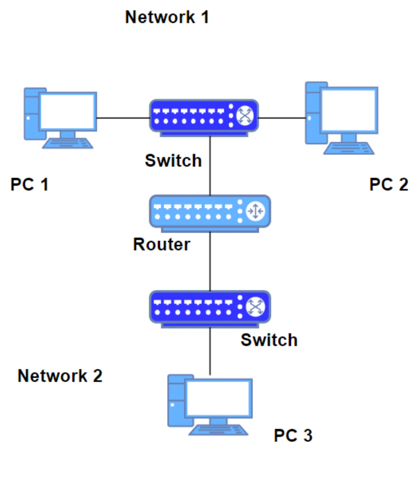
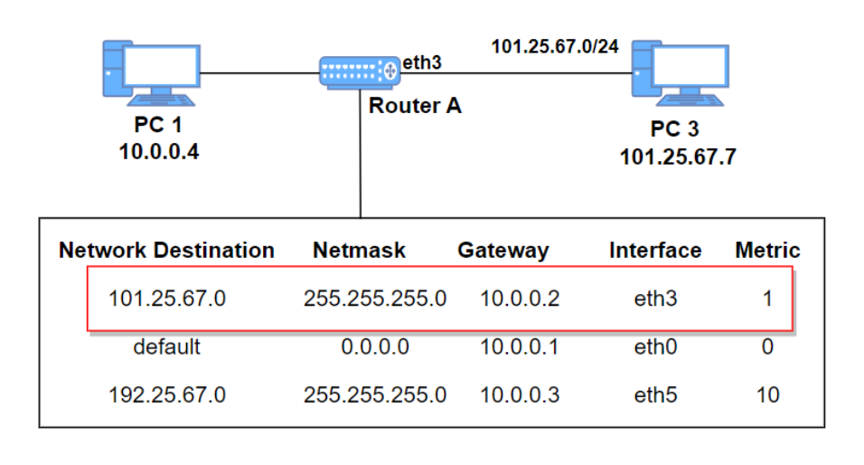
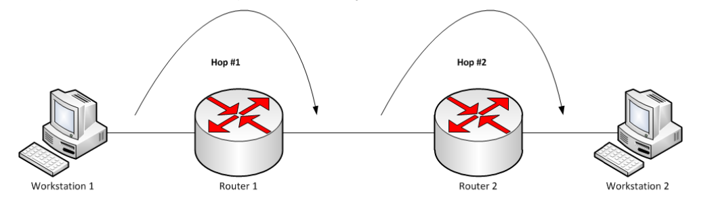
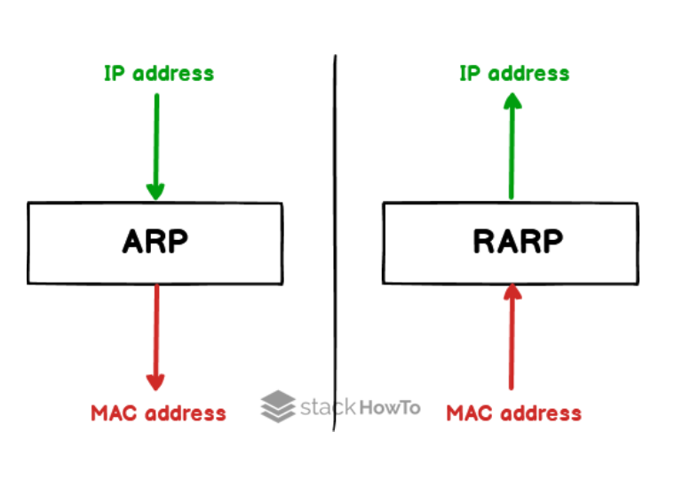
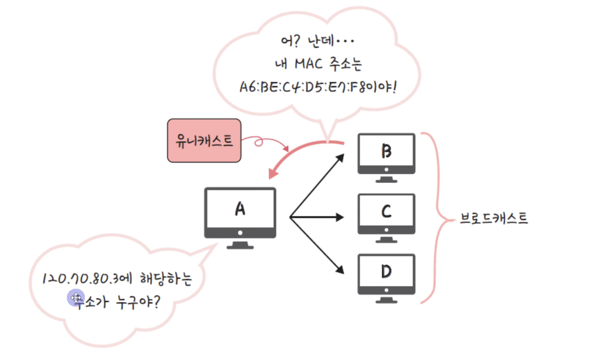

# 라우팅와 IP주소 체계

## 📍 라우팅

네트워크에서 데이터를 보낼 때 최적의 경로를 선택하는 과정 ⇒ 라우터가 수행

데이터는 보통 출발지에서 목적지로 가는 동안 여러 개의 라우터를 거치며 여러 번의 라우팅을 수행

## 📍 라우터

**네트워크 사이에서 데이터를 전달하는 장치**

보통 둘 이상의 서로 다른 네트워크에 연결함

데이터를 목적지로 보낼 때 최적의 경로를 결정하고 경로가 결정되면 해당 경로로 데이터를 넘겨주는 일(라우팅)을 수행

라우터는 라우팅 테이블을 기반으로 데이터를 다음 목적지에 전달

## 📍 라우팅 테이블

IP주소를 기반으로 라우터의 위치를 저장한 테이블 또는 데이터베이스

다양한 네트워크에 대한 정보와 해당 네트워크에 연결하는 방법 포함

⇒ 네트워크에 연결하는 방법이 포함되어 있는 리스트

## 📍 라우팅 테이블의 구성요소

- 네트워크 대상 (Network Destination): 목적지 네트워크의 IP 주소
- 서브넷 마스크 (Netmark): 대상 주소를 설명할 때 쓰이는 값
- 게이트웨이 (Gateway): 이 장치와 연결되어 있는 홉, 패킷이 전달되는 다음 IP 주소(외부 네트워크와 연결된 장치)
  만약 목적지가 로컬 네트워크라면 “connected”라고 표기되며 다른 네트워크라면 해당 네트워크의 게이트웨이를 가리킴
- 인터페이스 (Interface): 게이트웨이로 가기 위해 거치는 장치 / 10.0.0.2는 eth3을 통해 접근이 가능
- 메트릭 (Metric): 우선순위라고도 불리며 패킷 전송을 위해 최적의 경로가 선택되도록 참고되는 값. 동일한 라우팅 테이블 요소가 두 개 있을 때 이 **값이 낮은 요소가 선택**됨
  메트릭은 일반적으로 홉 수(hop count)가 들어가며 지연시간, 처리량 등이 들어갈 수 있음

### 게이트웨이

프로토콜 변환기라고도 하며 네트워크와 네트워크를 잇는 장치.

라우터와 하는 기능 자체는 비슷

### 홉

네트워크에서 **출발지와 목적지 사이에 위치한 장치**를 의미하며, 홉 카운트(hop count)는 데이터가 출발지와 목적지 사이에서 통과해야 하는 홉의 개수를 의미

→ 홉 카운트는 적은게 좋음 (여러 개를 거치는 것보다 직통으로 가는 것이 좋기 때문)

## 📍 IP주소, MAC주소, ARP, RARP

### IP(Internet Protocol)주소

논리적(`변한다`) 주소이며 컴퓨터 네트워크에서 장치들이 서로를 인식하고 통신을 하기 위해서 사용하는 특수한 번호

IP를 기반으로 통신한다고도 하지만 사실상 그 밑에 물리적 주소인 MAC 주소를 통해 통신

### MAC(Media Access Control) 주소

네트워크 인터페이스에 할당된 고유 식별자이며 보통 장치의 NIC(Network Interface Card - LAN카드라고도 함)에 할당

- OUI: IEEE에서 할당한 제조사 코드 (앞 3개)
- UAA: 제조사에서 구별되는 코드(뒤 3개)

\*\* MAC 주소는 보통은 유일무이하며 변경이 불가능하다.

⇒ 하지만 유일하지 않을수도 있고, 의도적으로 UAA를 중복되게 만들 수도 있지만, 권장하지 않고 변경을 어렵게 한 OS도 존재한다.

### ARP

ARP를 통해 논리적 주소인 IP 주소를 물리적 주소인 MAC 주소로 변환

RARP를 통해 물리적 주소인 MAC 주소를 논리적 주소인 IP 주소로 변환

### ARP의 과정

1. 해당 IP주소에 맞는 MAC 주소를 찾기 위해 해당 데이터를 `브로드캐스팅`을 통해 연결된 네트워크에 있는 장치에게 모두 보냄
2. 맞는 장치가 있다면 해당 장치는 보낸 장치에게 `유니캐스트`로 데이터를 전달해 주소를 찾게 됨

## 📍 IPv4와 IPv6

### IPv4

32비트, 2^32개의 주소(41억 9천만) 표현

8비트 단위로 점을 찍어 4개로 구분, 8비트(옥텟)를 10진수로 표현 ⇒ 부족하기 때문에 NAT, 서브네팅 여러개의 부수적인 기술이 필요함 ⇒ 아직까지 version 4를 많이 사용함

<aside>
    
    💡 172.16.254.1
    → 각자가 .을 단위로 8비트로 표현

</aside>

⇒ 점점 주소가 부족해지는 문제가 발생

### IPv6

128비트, 2^128개의 주소 표현 ⇒ 많은 주소가 처리 가능하며 NAT, 서브네팅이 필요하지 않음

16비트씩 8개로 구분

16비트는 16진수로 변환되어 콜론(:)으로 구분하여 표시하며 앞의 연속되는 0은 생략할 수 있음

<aside>

    💡 2001:0DB8:AC10:FE01:0000:0000:0000:0000
    앞의 64비트 : 네트워크 주소, 뒤 64비트: 인터페이스 주소

</aside>

\*\* IPSec이 내장되어 있음 ⇒ IPSec은 데이터 패킷을 암호화하는 보안 네트워크 제품군

**IPv4는 체크섬이 있지만 IPv6는 체크섬이 없다.**

IPv6는 헤더의 효율화를 위해 CRC(순환중복검사)를 제외하지만, 상위 프로토콜(TCP, UDP)에서 이미 체크섬이 있기 때문에 이를 제거할 수 있다.

TCP를 사용할 때 체크섬 필드는 선택사항이지만 UDP + IPv6로 사용할 때는 반드시 체크섬 필드를 사용한다고 설정해야 한다.

**IPv4는 헤더가 가변길이이지만 IPv6는 고정길이(40바이트)라서 ‘인터넷 헤더길이’에 대한 정보, 식별, 플래그가 삭제되었다.**

## 📍 CRC

순환중복검사로 네트워크상에서 데이터에 오류가 있는지 확인하기 위한 체크값을 결정하는 방식

데이터를 전송하기 전에 주어진 데이터의 값에 따라 CRC값을 계산하여 데이터에 붙여 전송하고, 데이터 전송이 끝난 후 받은 값으로 다시 CRC값을 계산

두 값을 비교했을 때 다르면 데이터 전송 과정에서 잡음 등에 의해 오류가 덧붙여 전송된 것임을 확인할 수 있음

## 📍 HOP limit로 대체된 TTL

TTL이란?

IPv4에서 TTL필드는 패킷이 네트워크에서 **무한순환하지 않도록 하는 변수**

패킷이 네트워크에서 라우터를 거칠 때마다 TTL 값이 1씩 감소되며 값이 0이 되면 패킷은 폐기

<aside>
    
    💡 IPv4와 IPv6 누가 더 빠를까?
    보통은 IPv6가 속도가 더 빠르지만 IPv6이 사용하는 더 큰 패킷 크기로 인해 일부 사용 사례에서는 속도가 느려질 수 있다.

</aside>

<aside>
    
    💡 IPv4와 IPv6 어떤 것이 더 좋을까?
    IPv6는 주소 커버리지가 IPv4보다 크고, 헤더가 단순해져서 조금 더 빠르게 처리가 가능하며, 속도는 IPv6가 빨라서 대체적으로 좋지만, 일부 사례에서는 속도가 느려질 수 있다.

</aside>

## 📍 클래스풀(Classful IP Addressing)

IP주소 (인터넷 주소): 네트워크 주소, 호스트 주소로 나눌 수 있음

- 네트워크 주소 ⇒ 모든 네트워크를 지칭, 네트워크 주소가 동일 = 로컬네트워크
- 호스트 주소 ⇒ 호스트를 구분하기 위한 주소

### 정의

네트워크 주소를 매기고 그에 따라 네트워크 크기를 다르게 구분하여 클래스를 할당하는 주소체계

구분하는 기준자(첫, 2, 3옥텟)을 서브넷 마스크라고 함

### classA

첫번째 옥텟만 네트워크 아이디로 사용하고, 나머지는 모두 호스트 아이디로 사용

범위 : 0 ~ 127.255.255.255

- 2^24 - 2 = 한 네트워크 당 16,777,214 호스트 ID(약 1600만개)
- 네트워크 주소 범위 : 1 ~ 126로 시작
  원래는 127.255.255.255까지 포함하지만 127.x는 루프백 주소이기 때문에 포함하지 않음
  0.0.0.0도 특수주소로 포함하지 않음(알 수 없는 대상에 달아 놓는 임시 주소)

\***\* 루프백 주소**

보통 로컬 네트워크 안에 서버를 구축하는데 보통은 127.0.0.1로 접속한다. ⇒ 본인 네트워크를 지칭하는 특정 주소

### classB

둘째 옥텟까지 네트워크 아이디로 사용하고, 나머지는 모두 호스트 아이디로 사용

범위 : 128.0.0.1 ~ 191.0.255.255

- 2^16 - 2 = 한 네트워크 당 65534 호스트 ID(6만 5천개)
- 네트워크 주소 범위가 128 ~ 191

### classC

세번째 옥텟까지 네트워크 아이디로 사용하고, 나머지는 모두 호스트 아이디로 사용

범위: 192.0.0.1 ~

- 2^8 - 2 = 한 네트워크 당 254 호스트 ID
- 네트워크 주소 범위: 192 ~ 223

<aside>
    
    💡 왜 2개를 빼나요 ?
    
    맨 앞자리는 네트워크 주소로 남겨두며 마지막 주소는 브로드캐스팅 주소로 남겨놓기 때문에 -2를 해준다.

</aside>

### 문제점

네트워크의 크기가 모두 작은 경우 큰 네트워크를 필요로 하는 조직은 여러개를 확보해야 하는 어려움이 있으며, 작은 네트워크가 필요한 조직의 경우 너무 많은 IP를 가져가므로 IP가 낭비됨

## 📍 클래스리스, 서브넷 마스크, 서브네팅

### 클래스리스

클래스풀의 단점을 해결하기 위해 나온 것

클래스로 나누는 것이 아닌 서브넷마스크를 중심으로 어디까지가 네트워크 주소고 어디까지가 호스트 주소인지 나눔

- 서브네팅: 네트워크를 나눈다는 의미
- 서브넷: 서브 네트워크, 쪼개진 네트워크
- 서브넷마스크: 서브네트워크를 위한 비트마스크

### 서브넷마스크

네트워크 주소 부분만 모두 1, 호스트주소 부분은 모두 0으로 설정해서 나눔

> 192.168.50.112(세번째 옥텟까지 네트워크 주소, 마지막만 호스트 주소)

| IPv4 address (binary) | 11000000.10101000.00110010.01110000 |
| --------------------- | ----------------------------------- |
| subnet mask (binary)  | 11111111.11111111.11111111.11111111 |
| Network address       | 11000000.10101000.00110010.0000000  |

⇒ 서로 and 연산을 하여 네트워크 주소와 호스트 주소를 구분한다. (2개 다 true여야 true)

<aside>
    
    💡 10개의 사무실이 있으며 사무실당 12개의 장치를 연결해야 한다면?

    한 서브네트워크(서브넷) 당 123.12.12.12/28로 16개의 네트워크를 확보해야 함 => 16 - 2 = 14개 장치까지 가능

</aside>

## 📍 Public IP, Private IP, NAT

- IP주소의 부족을 공인IP와 사설IP로 나누고 중간에 NAT라는 기술을 통해 해결하는 것

### NAT(Network Address Translation)

패킷이 트래픽 라우터 장치를 통해 전송되는 동안 패킷의 IP 주소를 변경, IP 주소를 다른 IP 주소로 매핑하는 방법

⇒ 내부에서 통신할 때는 사설 IP로 소통하고, 외부랑 통신할 때는 공인IP로 소통하면서 내부에서도 공인 IP로 소통하는 것처럼 보이게 함

⇒ 내부 네트워크 IP가 노출되지 않는다는 점이 장점

\*\* 대표적인 예: WIFI

공인IP로 wifi를 연결하고, 사람들은 NAT을 통해 wifi에서 사설 IP로 연결하는 것
