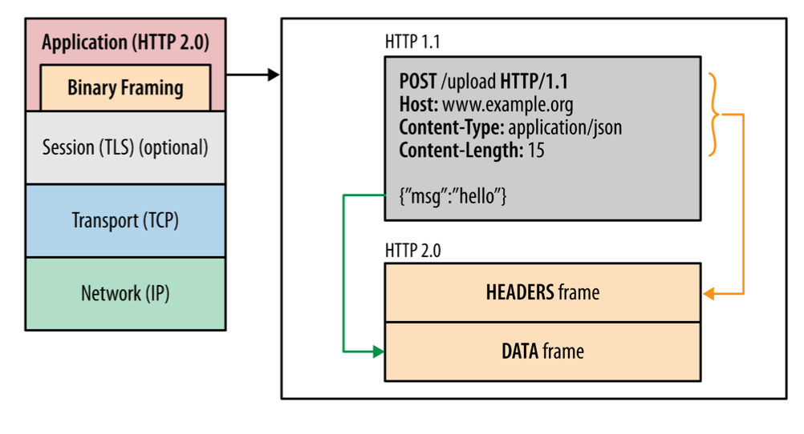

# HTTP 헤더

## HTTP Header

\*\* HTML, XML, JSON 등 본문 : http body에 담김

예시)

네이버 요청시 count.nhn의 preview에 담기는 내용이 http body

headers에 담기는 내용

헤더는 콜론 ‘:’ 으로 서로 구분되는 key-value 형태로 설정

HTTP 요청을 할 때 3가지의 헤더인 일반헤더, 요청헤더, 응답헤더가 자동으로 생김

**서버에서 설정하는 헤더를 응답헤더**, **클라이언트에서 설정한 헤더를 요청헤더**라고 함

### 일반헤더

요청한 URL, 요청메서드, 해당 자원을 요청할 때 해당 자원의 출처를 나타내는 URL을 노출시킬지 말지를 정하는 보안 정도가 설정되어있는 Referrer Policy가 들어감

### 요청헤더

클라이언트가 서버에 요청할 때 클라이언트가 설정하는 또는 자동으로 설정되는 헤더

요청헤더에는 메서드, 클라이언트의 OS, 브라우저의 정보가 담김

클라이언트: 사람이 들고 있는 장치

### 응답헤더

서버가 클라이언트에게 응답을 보낼 때 설정하는 또는 자동으로 설정되는 헤더

서버의 소프트웨어 정보가 담김 ⇒ 대부분의 서버는 일반적으로 해커가 서버에서 어떤 소프트웨어가 사용되고 있는지 알기 어렵기 하기 위해 서버 정보를 숨김

## HTTP/1.0

수명이 짧은 연결이며, 자체 요청에서 완료가 됨

각 HTTP 요청당 TCP 핸드셰이크가 발생되며 기본적으로 한 연결당 하나의 요청을 처리하도록 설계 ⇒ 연결할 때마다 TCP 연결을 계속해야 하니 RTT가 늘어나는 문제점 있음

\*\* 리소스당 TCP 연결을 반복해야 함

## HTTP/1.1

HTTP/1.0의 단점을 보완한 프로토콜

1. keep-alive default

   매번 데이터를 요청할 때마다 TCP 연결을 하는게 아닌 한번 해놓고 계속해서 데이터를 받을 수 있게 만든 것. keep-alive가 기본 옵션!

   ⇒ 즉, TCP 연결을 언제까지 유지할 것인지 결정하는 옵션

   

2. 호스트 헤더

   HTTP/1.0은 서버가 하나의 호스트만 가진다고 가정하기 때문에 헤더에 호스트를 포함하지 않았음 ⇒ 하나의 호스트만 가질 수 있었음

   서버는 여러개의 호스트를 가질 수 있으며 이런 유연성을 위해 HTTP/1.1은 헤더에 특정 호스트를 포함할 수 있게 변경되었으며 항상 호스트를 포함해서 요청하도록 변경

3. 대역폭 최적화

   HTTP/1.0은 파일을 다운로드 받다가 끊기면 다시 다운로드 받는 것이 불가능 ⇒ 다시 다운로드 받을 수 있도록 변경

   5KB까지만 받고 나머지 부분을 다시 받을 때 헤더에 Range:bytes=5000-라는 헤더를 추가해서 다운로드 재개 요청을 할 수 있게 변경

## 요청을 줄이기 위한 기술

### 1️⃣ 이미지 스프라이트

개발자도구 ⇒ network ⇒ image에서 확인할 수 있음

수많은 이미지를 하나의 이미지로 만들어 하나의 이미지만 다운받아놓고 이를 통해 수많은 이미지를 다운받는 듯한 효과를 내는 것

### 2️⃣ 코드 압축

코드를 압축해서 서빙

크기가 큰 파일은 RTT가 조금 더 크기 때문에 코드를 줄여 조금이라도 크기를 줄이는 것

### 3️⃣ 이미지 Base64 인코딩

이미지 파일을 64진법으로 이루어진 문자열로 인코딩해서 이미지 서버에 HTTP 요청을 할 필요가 없이 만드는 것

하지만 Base64 인코딩을 할 경우 파일이 37퍼센트 크기가 더 커지는 단점 발생

### HTTP/1.1의 고질적인 문제 : HOL

HOL(Head of Line Blocking)

네트워크에서 같은 큐에 있는 패킷이 그 첫번째 패킷에 의해 지연될 때 발생하는 성능저하현상을 의미

즉, 크기가 큰 파일을 먼저 받게 되면 그 이후의 파일이 다운로드를 하기까지 엄청난 시간이 걸리게 된다.

## HTTP/2

SPDY를 기반으로 하는 HTTP/2 프로토콜

### 바이너리 포맷 계층

애플리케이션 계층과 전송 계층 사이에 바이너리 포맷 계층을 추가

HTTP/1.0은 일반 텍스트 메시지를 전송하고 줄바꿈으로 데이터를 나눔

HTTP/2.0은 0과 1로 이루어진 바이너리 데이터로 변경되었고 **더 작은 메시지가 프레임으로 캡슐화**되어서 전송됨

### 멀티플렉싱

단일 TCP연결의 여러 스트림에서 여러 HTTP 요청과 응답을 비동기적으로 보낼 수 있는데, 이를 통해 HOL을 해결

HTTP/1.1에서는 병렬 요청을 하려면 다중TCP 연결을 통해서 하고 일반적으로는 TCP 연결 하나당 병렬 요청은 불가능

⇒ HTTP/2.0에서는 리소스를 **작은 프레임으로 나누고 이를 스트림으로 프레임을 전달**, 각각의 프레임은 스트림ID, 해당 청크의 크기를 나타내는 프레임이 추가되었기 떄문에 작게 나눠서 다운로드가 되더라도 결과적으로 응답데이터에서는 올바른 순서로 재조립할 수 있게 됨

### 서버 푸시

서버가 리소스를 클라이언트에 푸시할 수 있음.

요청된 html파일과 함께 다른 개체를 별도로 보낼 수 있는데, 요청한 html에 css가 포함되어 있다면 별도 요청없이 css를 같이 보낼 수 있음

### 헤더압축

HTTP/1.1의 무거운 헤더를 허프만 인코딩 압축 방법으로 압축

똑같은 서버에서 2개의 이미지를 준다고 했을 때 중복되는 헤더는 제외한채 보내고, 해당 공통 필드로 헤더를 재구성하며 중복되지 않은 헤더값은 허프만 인코딩 압축 방법으로 압축해 전송

\*\* 허프만 인코딩: 문자열을 문자 단위로 쪼개 빈도수를 세어 빈도가 높은 정보는 적은 비트수를 사용해 표현하고, 빈도가 낮은 정보는 비트 수를 많이 사용하여 전체 데이터 표현에 필요한 비트양을 줄이는 알고리즘

### 우선순위

서버에서 원하는 순서대로 우선순위를 정해 리소스를 전달할 수 있음

## HTTP/3

HTTP/2는 여전히 TCP를 사용하기 때문에 초기 연결에 대한 RTT로 인한 지연시간이라는 문제점이 있었는데, 이를 해결한 버전

QUIC(Quick UDP Internet Connections)라는 계층 위에서 돌아가며, TCP 기반이 아닌 UDP 기반으로 돌아감

HTTP/2에서 장점이었던 멀티플렉싱 등을 가지고 있으며 초기연결설정시 지연시간 감소라는 대표적 특성을 가지고 있음
