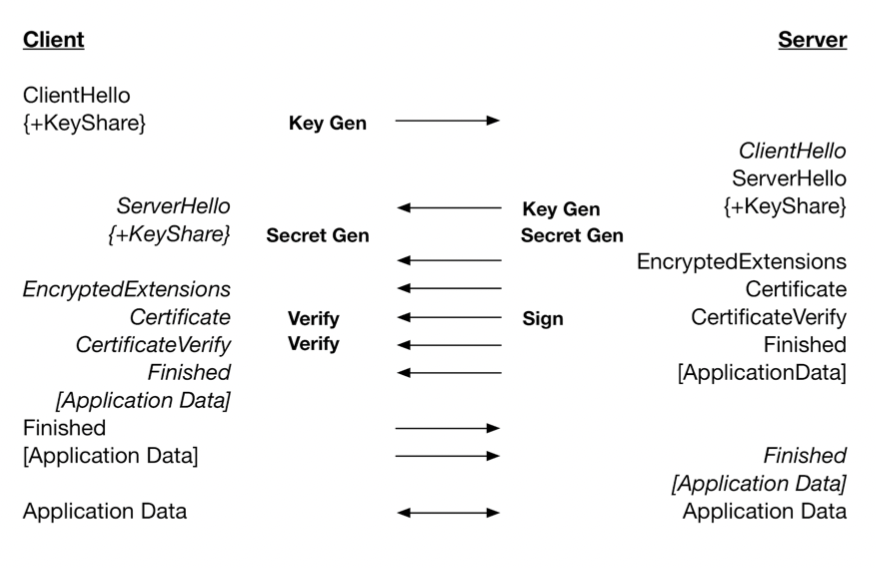
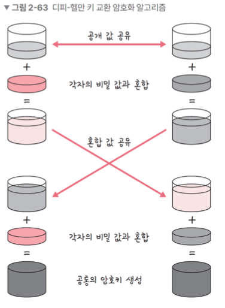
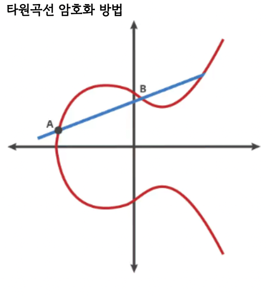
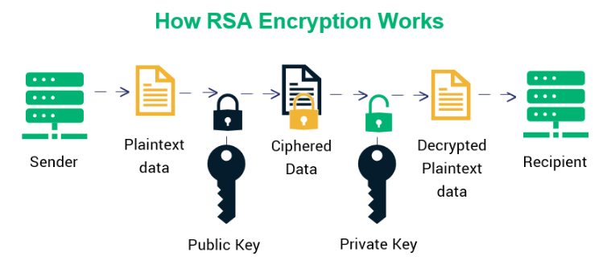

# HTTPS와 TLS

## 1️⃣ 암호화

암호화는 승인된 당사자만 정보를 이해할 수 있도록 데이터를 `스크램블` 한 방법

⇒ 복호화하려면 송신자와 수신자가 서로 동의한 `키` 가 필요함

\*\* 스크램블 : 각 단어나 문자를 패턴에 따라 암호화 하는 것이 아니라 무작위 방식으로 개별 데이터 비트를 섞는 것

### 대칭 암호화

키를 하나만 사용하는 암호화 방법

Plaintext + key = ciphertext (hello + 2jd8932kd8 = X5xJCSycg14)

Ciphertext + key = plaintext (X5xJCSycg14 = hello + 2jd8932kd8)

### 비대칭 암호화

공개키 암호화

두 개의 다른 키(공개키, 개인키)로 데이터를 암호화하거나 서명하고, 키 중 하나인 공개 키를 누구나 사용할 수 있도록 하는 방법

**공개키로 암호화된 데이터는 개인키로만 복호화 가능**

알고리즘 : RSA, DH

✔️ 일반적으로 HTTPS를 가능하게 하는 프로토콜인 TLS는 부분적으로 **비대칭 암호화 사용** , 비대칭암호화로 인증 한 후, **대칭 암호화로 보안적 통신 시작**

✔️ TLS 핸드셰이크 과정에서 처음 인증할 때 비대칭 암호화를 하고, 그 이후 클라이언트와 서버는 `세션키` 라고 하는 키를 기반으로 대창 암호화를 기반으로 암호화된 통신을 함

### 암호화의 필요성

의도된 수신자 또는 송신자를 제외하고는 통신을 하이제킹(가로채기)하여 읽을 수 없게 하며, 이를 통해 민감한 데이터의 유출을 방지하고 데이터 무결성을 보장

## 2️⃣ TLS 핸드셰이크

### TLS

전송 계층에서 보안을 제공하는 프로토콜

클라이언트와 서버가 통신할 때 TLS를 통해 제 3자가 메시지를 도청하거나 변조하지 못하도록 함

### 과정

한 번의 RTT(비대칭암호화)를 통해 암호화된 통신을 하는 것, 이후 대칭 암호화

1. Client Hello

   클라이언트는 TLS 버전, 사이퍼슈트와 클라이언트 랜덤값(무작위 문자열), 임시 DH 매개변수를 서버에게 보냄

2. Server Hello, EncryptedExtensions, Certificate, CertificateVerify

   서버는 클라이언트로부터 받은 옵션을 확인

   서버와 클라이언트 모두에서 지원하는 **가장 높은 TLS 버전을 식별**하여 결정, **사이퍼슈트 지원 여부를 확인**

   공개키가 포함된 SSL 인증서, 서버 랜덤값, 임시 DH 매개변수를 보냄

   클라이언트와 서버 각각 서로 교환한 DH 매개변수를 사용하여 임시 암호 키(세션키)를 생성

3. Finished

   클라이언트와 서버는 세션키를 기반으로 **대칭 암호화된 통신이 시작** = 보안 세션의 시작

   키교환 알고리즘은 대표적으로 RSA와 DH

   RSA는 취약점이 있기 때문에 현재 버전에서는 지원하지 않음, DH는 타원곡선 DH 사용

### DH 매개변수

DH = Diffie-Hellman ⇒ 서로 공개값 공유, 비밀값과 혼합, 혼합값과 공유, 각자의 비밀값과 혼합해서 공통의 암호키를 만드는 알고리즘

\*\* 디피헬만을 사용하는 DHE와, 타원곡선 암호화 방법과 DH를 섞은 ECDHE가 있는데 ECDHE를 사용!

⇒ 공개값 공유와 혼합값 공유는 한 번에 일어날 수 있기 때문에 1RTT만에 가능

타원곡선 암호화 방법: 곡선을 사용하여 **개인 키 보유자만 알 수 있는 타원 곡선을 그리며, 이를 기반으로 교차점을 생성**. 이 교차점의 수를 기반으로 암호를 설정하는 방법

## 사이퍼슈트

프로토콜, AEAD 사이퍼 모드, 해싱 알고리즘이 나열된 구약을 의미하며 암호제품군이라고 불림 ⇒ 취약점이 모두 제거된 암호제품군

<aside>
    
    💡 TLS_AES_128_GCM_SHA256

    TLS: 프로토콜
    AES_128_GCM: AEAD 사이퍼 모드
    SHA256: 해싱 알고리즘

</aside>

### AEAD 사이퍼 모드

AEAD(Authenicated Encryption with Associated Data): 데이터 암호화 알고리즘

예) AES_128_GCM: 128비트의 키를 사용하는 표준 블록 암호화 기술과 병렬 계산에 용이한 암호화 알고리즘 GCM이 결합된 알고리즘

### 해싱 알고리즘

데이터를 추정하기 힘든 더 작고, 섞여 있는 조각으로 만드는 알고리즘

SHA-256 알고리즘: **해시 함수의 결과값이 256비트인 알고리즘**이며 비트 코인을 비롯한 많은 블록체인 시스템에서 사용

✔️ 해싱 알고리즘이 TLS에서 어떻게 쓰이는지 ?

인증서가 올바른 인증서인지 확인할 때 전자서명을 이용하는데, 이 때 해싱 알고리즘이 상용됨

1. 인증 생성작업: 전자 서명을 만드는데 서명되는 메시지를 해싱
2. 인증 확인작업: 메시지를 복호화해서 해시를 서로 비교해 올바른 메시지인지 확인

⇒ 유효성 검증에 사용됨 (유효성 검증: 인증서가 변조되지 않았고, 인증서가 ‘서비스제공자’ 것임을 확인하는 절차)

## 인증서

1. 주체(인증서 발급한 CA, 도메인, 웹사이트 소유자, 인증서 소유자)
2. 공개키(공개키, 공개키 암호화방법)

   ⇒ 위의 두 가지를 포함하는 단순한 데이터 파일

   ⇒ 자신의 웹사이트 안에서 SSL 인증서를 만들 수도 있지만 보통은 인증기관인 CA에서 발급한 SSL 인증서를 기반으로 인증 작업을 수행

✔️ 주체는 클라이언트가 접속한 서버가 클라이언트가 의도한 서버가 맞는지 확인할 때 사용

✔️ 공개키는 처음 인증 작업을 수행할 때 쓰임

## CA

인증서가 클라이언트가 접속한 서버가 클라이언트가 의도한 서버가 맞는지를 보장하는 역항을 하는데, 이 **인증서를 발급하는 기업들을 CA**라고 함

- 단일 도메인: 단 하나의 도메인에 적용되는 인증서
- 와일드 카드: 도메인의 하위 도메인도 포함하는 인증서.
- 멀티 도메인: 이름 이 의미하는 것처럼 멀티 도메인 SSL인증서는 관련되지 않은 다수의 도메인에 적용될 수 있는 인증서

## RSA의 취약점

RSA의 경우 **클라이언트가 생성**한 임시 암호값을 서버로 전송하지만, DH의 경우 **클라이언트와 서버가 서로 교환한 DH 매개변수**를 사용해 개인키를 만듦

⇒ RSA는 클라이언트에서 생성한 임시 암호값이 탈취당한 경우 해킹의 위험이 있음

⇒ DH의 경우 탈취당해도 공통의 암호키를 만들 수 없음

## 0-RTT

세션키가 생성된 이후 다시 그 사이트에 방문한다면 미리 만들어 놓은 세션키를 기반으로 연결을 생성하기 때문에 이 때 인증에 드는 비용은 없음

⇒ 인증에 관한 RTT가 발생되지 않기 때문에 0-RTT라는 특성을 갖음

✔️ 네트워크 상 보안을 해야하는 이유 ?\
민감한 금융 정보를 다루는데 이점이 있고, HTTP/2를 구현할 수 있기 때문
