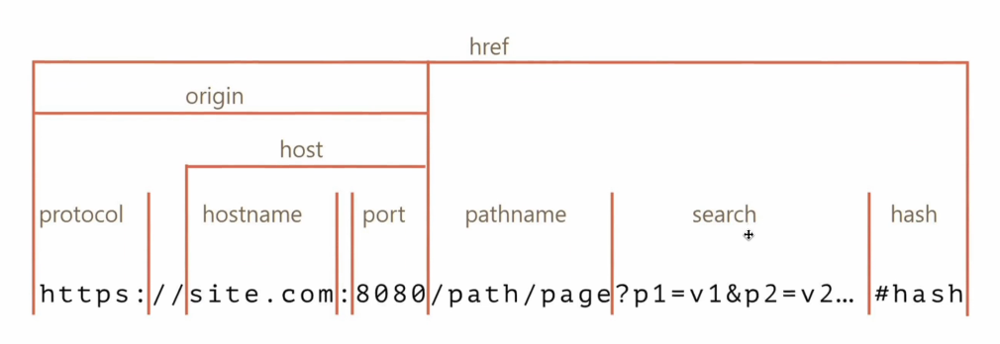

# 웹브라우저

## 1️⃣ 로컬 스토리지

웹 스토리지 객체로 브라우저 내에 {key: value} 형태로 오리진에 종속되어 저장되는 데이터

✔️ 하나의 키에 오로지 하나의 값만 저장 ⇒ 키는 하나이고, 더 많은 값을 담고 싶을 경우 배열로 담을 수 있다.

✔️ 데이터는 사용자가 브라우저에서 수동으로 삭제되지 않는 한 평생 동안 로컬 저장소에 저장되며 만료 날짜가 없음. ⇒ 사용자가 창이나 탭을 닫아도 컴퓨터를 종료해도 만료되지 않음

✔️ 최대 저장용량은 5MB

✔️ 로그인을 유지하기 위한 값으로 사용되며, 로컽스토리지 데이터는 자동으로 서버로 전송되지 않음(쿠키는 자동 전송됨)

### 사용법

✔️ 설정 : localStorage.setItem(key, value)

✔️ key에 해당하는 value 가져오기: localStorage.getItem(key);

✔️ 제거: localStorage.removeItem(key);

✔️ 전체제거: localStorage.clear();

## 2️⃣ 오리진



포트번호는 생략되는 경우가 많음 (https의 기본 포트번호는 = 443)

https://naver.com과 https://naver.com:443은 동일함

✔️ 오리진이 같으면 로컬스토리지는 모두 같은 곳을 사용함

## 3️⃣ 캐싱

자동완성: 이전에 입력한 값을 다시 입력하는 수고를 줄일 수 있어 사용자 경험(UX)를 높일 수 있다.

## 4️⃣ 세션스토리지

로컬 스토리지와 비슷하지만, **사용자가 브라우저에서 탭을 닫으면 데이터가 만료된다.**

세션스토리지보다는 로컬스토리지를 많이 사용

### 사용법

✔️ 설정 : sessionStorage.setItem(key, value)

✔️ key에 해당하는 value 가져오기: sessionStorage.getItem(key);

✔️ 제거: sessionStorage.removeItem(key);

✔️ 전체제거: sessionStorage.clear();

## 4. 쿠키(Cookie)

브라우저에 저장된 데이터 조각

클라이언트에서 먼저 설정할 수도 있고 서버에서 먼저 설정할 수 있으나 보통은 서버에서 먼저 설정해서 쿠키를 만드는게 일반적

✔️ 서버에서 응답헤더로 set-cookie로 설정해서 쿠키를 보내면 그 때부터 클라이언트에서 요청헤더 cookie에 설정되어 자동으로 서버에 전달되게 되고 브라우저에도 저장


✔️ 쿠키는 클라이언트와 서버 둘 다 조작 가능하지만, 보통 서버에서 만료기한 등을 설정 및 컨트롤 함.

✔️ 최대 4kb까지 저장 가능

✔️ 로그인, 장바구니, 사용자 커스터마이징, 사용자 행동분석(주로 개인화된 광고에 활용되는 것들)에 사용

### 세션 쿠키

세션 쿠키는 Expires 또는 Max-Age 속성을 지정하지 않은 것

브라우저가 종료되면 쿠키도 사라짐

### 영구 쿠키

Expires 또는 Max-Age 속성을 지정해서 특정날짜 또는 일정기간이 지나면 삭제되게 만든 쿠키, 브라우저를 닫을 때 만료되지 않음

### secure

```jsx
Set-Cookie: <cookie-name>=<cookie-value>; Secure
```

https로만 쿠키를 주고받을 수 있게 하는 옵션

하지만 현재 일부 브라우저는 보안을 강화하고 안전하지 않은 사이트(HTTP)가 Secure 지시문으로 쿠키를 설정하는 것을 금지하기 위해 **이 사양을 무시함**

### httponly

공격자가 자바스크립트로 빼낼 수 없게 만듦(document.cookie로 접근 불가)

### samesite

요청이 동일한 도메인에서 시작된 경우에만 쿠키가 애플리케이션으로 전송되도록 허용

### 쿠키의 시큐어코딩

쿠키-세션으로 로그인을 처리한다면 아래와 같은 시큐어 코딩을 해야 함

1. cookie에 세션ID를 담을 때 이 세션ID를 기반으로 클라이언트의 개인정보를 유추할 수 없게 해야 함
2. 자바스크립트로는 파악할 수 없게 http only 옵션을 걸어야 함
3. 일정시간의 세션 타임아웃을 걸어야 함

### 쿠키 허용 관련 알림창

서비스 운용시 쿠키를 사용한다면 쿠키 허용 관련 알림창을 만들어야 함 ⇒ 방문 기록을 추적할 때 쿠키가 사용됨 ⇒ 사용자의 데이터 간접수집에 해당하며 거기에 해당하는 KISA 지침을 준수해야 함

## 5️⃣ 로컬스토리지, 세션스토리지, 쿠키의 공통점과 차이점

### ✔️ 공통점

1. 브라우저에 캐싱을 함으로써 서버에 대한 요청을 줄여 서버부하를 방지할 수 있음
2. 캐싱으로 인해 다운로드 하는 컨텐츠가 줄어들어 웹사이트의 컨텐츠를 더 빨리 다운로드 가능
3. 사이트 기본 설정 커스터마이징(색상, 글꼴 크기 등)을 저장하거나 로그인 상태를 유지할 때 사용 가능

### ✔️ 차이점 ⭐️⭐️⭐️

|                                   | 쿠키              | 로컬 스토리지 | 세션 스토리지  |
| --------------------------------- | ----------------- | ------------- | -------------- |
| 최대저장용량                      | 4KB               | 5MB           | 5MB            |
| 브라우저 허용                     | HTML4 + 5         | HTML5         | HTML5          |
| 접근 범위                         | 창                | 창            | 탭             |
| 만료 기한                         | 수동으로 설정     | 영구적        | 탭 닫으면 소멸 |
| 설정할 수 있는 주체               | 클라이언트 + 서버 | 클라이언트    | 클라이언트     |
| 요청과 함께 서버에 자동 전송 유무 | O                 | X             | X              |
