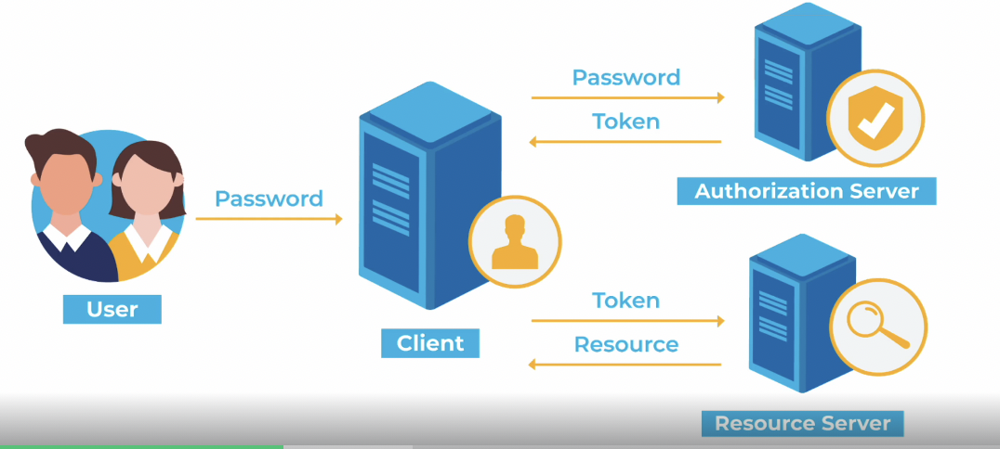
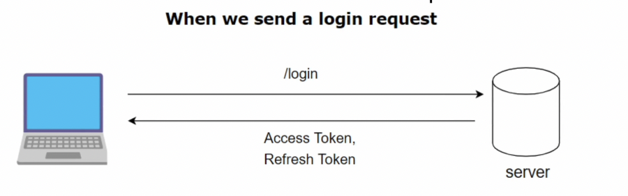

## 로그인을 구현하는 방법 1️⃣ 세션기반인증방식

✔️ HTTP의 특징

- 상태 없음(statelsee)
- HTTP 요청을 통해 데이터를 주고 받을 때 요청이 끝나면 요청한 사용자의 정보를 유지하지 않음

✔️ 세션: 서버와 클라이언트의 연결이 활성화된 상태를 의미

✔️ 세션ID: 웹 서버 또는 DB에 저장되는 클라이언트에 대한 유니크한 ID

### ✨ 로그인 순서

1. POST로 로그인 요청
2. 정확한 아이디와 비밀번호가 들어왔다면 로그인 성공
3. 서버에서 해당 유저에 대한 세션 아이디 생성

   여기에서 서버나 DB 모두 가능하지만, DB에 저장하면 직렬화 역직렬화 비용문제가 있음. 다만 서버에 저장하면 사용자가 많아졌을 때 메모리가 많아지는 문제가 있음

4. 응답헤더 set-cookie에다가 해당 세션 아이디를 담아서 보냄
5. 클라이언트는 요청헤더로 cookie로 설정이 됨
6. cookie를 가지고 있다가 다시 들어왔을 때 유효한지 확인한 이후, 로그인 되어있다는 상태값을 보냄

## 로그인을 구현하는 방법 2️⃣ 토큰기반인증방식

주로 JWT 토큰을 활용

1. 인증 로직 이후 JWT 토큰 생성(access 토큰, refresh토큰)
2. 사용자가 이후에 access 토큰을 HTTP Header - Authorizaton 또는 HTTP Header-Cookie에 담아 인증이 필요한 서버에 요청해 원하는 컨텐츠를 가져옴

### JWT란?

JWT는 Json Web Token을 의미

헤더, 페이로드, 서명으로 이루어져 있음

JSON 객체로 인코딩 되며 메세지 인증, 암호화에 사용

✔️ Header

토큰 유형과 서명 알고리즘, base64URI로 인코딩

✔️ Payload

데이터, 토큰 발급자, 토큰 유효기간, base64URI로 인코딩

✔️ Signature

(인코딩된 header + payload) + 비밀키를 기반으로 헤더에 명시된 알고리즘으로 다시 생성한 서명값

### 장점

1. 사용자 인증에 필요한 모든 정보는 토큰 자체에 포함되기 때문에 별도의 인증 저장소가 필요 없음
2. 다른 유형의 토큰과 비교했을 때 경량화 되어있음.

   SAML이란 토큰이 있지만 이에 비해 훨씬 경량화 되어있음

3. 디코딩했을 때 JSON이 나오기 때문에 JSON을 기반으로 쉽게 직렬화, 역직렬화가 가능

### 단점

1. 토큰이 비대해질 경우 당연히 서버과부하에 영향을 줄 수 있음
2. 토큰을 탈취당할 경우 디코딩했을 때 데이터를 볼 수 있음

### access토큰과 refresh토큰

access토큰의 수명을 짧게, refresh토큰의 수명은 길게

refresh토큰은 access토큰이 만료되었을 때 다시 access 토큰을 얻기 위해 사용되는 토큰 ⇒ access토큰이 만료됐을 때마다 인증에 관한 비용이 줄어들게 됨

로그인을 할 때 access token과 refresh token 두 가지를 얻고,

access token이 만료가 되거나 사용자가 새로고침을 할 때 refresh token을 기반으로 새로운 access token을 얻음

access token은 인증을 위한 토큰

탈취의 위험이 있기 때문에 만료기한을 짧게 가져가는데, 로그인 유지기간이 짧음

⇒ refresh 토큰을 길게 해 계속 유지할 수 있게끔 만들어줌

✔️ 주의할 점

Bearer<token>으로 Bearer을 앞에 둬서 토큰기반인증방식이라는 것을 알려주어야 함

https를 사용해야 함

쿠키에 저장한다면 sameSite: ‘Strict’을 써야 함

수명이 짧은 access token을 발급해야 함

url에 토큰을 전달하지 말아야 함

## HTTP 상태코드(status code)

### 1xx(정보)

서버가 요청을 잘 받았으며 해당 프로세스를 계속 이어가며 처리하는 것

- 100: 계속함을 의미

### 2xx(성공)

서버가 요청을 잘 받았고 이를 기반으로 클라이언트에게 성공적으로 데이터를 보낸 것

- 200 OK: 요청이 성공적
- 201 Created: 요청이 성공적이었으며 그 결과로 새로운 리소스가 생성

### 3xx(리다이렉션)

서버가 클라이언트의 요청에 대해 완료를 위해 추가 작업 조치가 필요

- 301 Moved Permanently: 요청한 리소스의 URI가 변경되었음을 의미, 변경된 새로운 URI를 301 상태코드와 함께 주어야 함

### 4xx(클라이언트 오류)

클라이언트가 요청한 페이지를 제공할 수 없거나 클라이언트의 요청이 잘못되어 결과적으로 요청을 처리할 수 없음

- 400 Bad Request: 서버가 클라이언트 요청을 이해할 수 없음
- 401 Unauthorized: 클라이언트의 인증이 되지 않음
- 404 Not Found: 요청받은 컨텐츠를 찾을 수 없다는 것을 의미

### 5xx(서버 오류)

서버가 클라이언트의 요청을 처리하지 못하는 상태

- 501 Internal Server Error: 서버에 오류가 있음을 의미
- 502 Bad Gateway: 게이트웨이 또는 프록시 서버가 오류가 생겼음을 의미
- 504 Gateway Timeout: 게이트웨이 또는 프록시 서버가 정해진 Timeout 시간 동안 클라이언트의 요청을 처리하지 못함

## HTTP 메서드

### 1️⃣ GET

데이터를 읽는 메서드

url을 기반으로 데이터를 요구하는 방법

url을 기반으로 하기 때문에 길이 제한(2000자 미만)이 있음

성공시 HTTP 상태코드 200을 반환

캐싱이 가능

url를 기반으로 요청하기 때문에 해당 요청의 파라미터가 브라우저 기록에 남음

url를 기반으로 요청하기 때문에 요청할 때 ASCII 문자열만을 보낼 수 있음

사용자 이름, 비밀번호 등 민감한 정보를 전달할 때 사용하지 않음

### 2️⃣ POST

데이터를 생성하는 메서드

url이 아닌 HTTP message body를 통해 데이터 전달

HTTP message body를 통해 전달되기 때문에 길이 제한이 없음

성공적으로 데이터를 생성할 경우 HTTP 상태코드 201을 반환 (생성한 경우 201, 생성하지 않은 경우 200을 반환하기도 함)

캐싱이 불가능

url를 기반으로 요청하지 않기 때문에 해당 요청의 파라미터가 브라우저 기록에 남지 않음

HTTP message body로 요청하기 때문에 ASCII 문자열 뿐만 아니라 모든 유형의 데이터를 기반으로 요청 가능

사용자 이름, 비밀번호 등 민감한 정보를 전달할 때 사용

### 3️⃣ PUT

업데이트 하는 데이터의 전체를 보내는 메서드

요청을 보낼 때 해당 데이터 전체를 보내야 하고 전체 데이터의 교체를 의미

해당 데이터가 없다면 새로이 생성하고 있다면 요청할 때 보낸 데이터와 교체를 진행

ex ) `{”a”: 1, “b”: 2}` 의 b를 3으로 바꾼다고 했을 때 ‘put’의 경우는 `{”a”: 1, “b”: 3}` 으로 전체 데이터를 보내야 함

### 4️⃣ PATCH

업데이트하는 데이터의 일부를 보내는 메서드

ex ) `{”a”: 1, “b”: 2}` 의 b를 3으로 바꾼다고 했을 때 ‘patch’의 경우는 `{"b": 3}` 으로 데이터를 부분적으로 보내야 함
