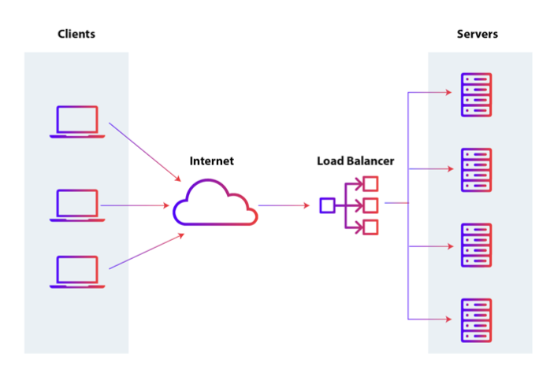

## 1️⃣ 애플리케이션 계층

### L7 스위치

로드 밸런서라고도 하며, 서버의 부하를 분산하는 기기

서버 이중화, 보안에 강점이 있는 장치

IP, Port 뿐만 아니라 url, 헤더, 쿠키 등을 기반으로 트래픽을 분산

헬스체크를 통해 장애가 발생한 서버를 확인하고 해당 서버로 트래픽을 보내지 못하게 하는 역할

### 헬스 체크

만약 한 대의 서버가 장애가 났을 경우, 다른 서버로 보내는 것을 로드밸런서라고 하는데 이렇게 만들려고 할 경우 헬스 체크가 필요함

서버들한테 TCP 연결을 해서 3-way 핸드셰이크를 해서 살아있는지 여부를 확인

L4 스위치 또는 L7 스위치 모두 헬스 체크를 통해 정상적인 서버 또는 비정상적인 서버를 판별하는데, 헬스 체크는 전송 주기와 재전송 횟수 등을 설정한 이후 반복적으로 서버에 요청을 보내는 것

\*\* AWS에서 L7스위치를 이용한 로드밸런싱은 ALB라는 컴포넌트를 통해서 하며, L4스위치를 이용한 로드밸런싱은 NLB컴포넌트를 통해서 구축

## 2️⃣ 전송 계층

### L4 스위치

로드밸런서의 특징인 트래픽 분산을 할 수 있음

패킷의 IP주소와 Port 번호를 참고해서 적절히 트래픽 분산을 할 수 있음

또한 전송 계층의 TCP, UDP 등의 헤더를 기반으로 우선순위를 판단해서 분산이 가능

L7와 똑같이 헬스체크가 가능

## 3️⃣ 인터넷 계층

### 라우터

라우팅은 하나 이상의 네트워크에서 경로를 선택하는 프로세스를 말하는데, 이 라우팅을 하는 장비를 의미

다른 네트워크에 존재하는 장치들끼리 서로 데이터를 주고받을 때 “패킷소모 최소화”, “경로 최적화”하는 장비

### L3 스위치

L2 스위치의 기능 + 라우팅을 하는 장비

라우팅테이블을 참조해서 IP패킷에 IP주소를 담아 보냄

## 4️⃣ 데이터링크계층

데이터 링크 계층은 ‘이더넷 프레임’을 통해 에러 확인, 흐름 제어, 접근 제어를 담당하는 계층

물리 계층은 무선LAN과 유선LAN을 통해 0과 1로 이루어진 데이터를 보내는 계층을 의미

### L2스위치

장치들의 MAC 주소를 MAC주소 테이블을 통해 관리하며, 해당 테이블을 기반으로 인터넷 계층에서 받은 패킷을 기반으로 이더넷 프레임을 만들어, 목적지 MAC 주소로 패킷을 보내주는 역할

| L3  | 라우팅테이블    | IP 주소 | IP 패킷      | 인터넷 계층     |
| --- | --------------- | ------- | ------------ | --------------- |
| L2  | MAC 주소 테이블 | MAC     | 이더넷프레임 | 데이터링크 계층 |

### 브리지

두 개의 근거리 통신망(LAN)을 상호 접속할 수 있도록 하는 통신망 연결 장치

통신망의 범위를 확장하고 서로 다른 LAN을 기반으로 하나의 통신망을 구축할 때 쓰임

## 5️⃣ 물리 계층

### NIC

LAN 카드라고 하는 네트워크 인터페이스 카드는 네트워크에 연결하기 위해 PC에 설치된 회로기판을 의미

PC 고유의 식별번호인 MAC 주소가 있음

### 리피터

들어오는 약해진 신호 정도를 증폭하여 다른 쪽으로 전달하는 장치

### AP

Access Point의 약자로 패킷을 복사하는 장치를 의미

AP에 유선 LAN을 연결한 후 무선 LAN 기술을 기반으로 무선 네트워크마을 구축할 수 있음
