## 유선LAN

### 전이중화(full duplex) 통신

양쪽 장치가 동시에 송수신할 수 있는 방식, 송신로와 수신로를 나눠서 데이터를 주고 받을 수 있음

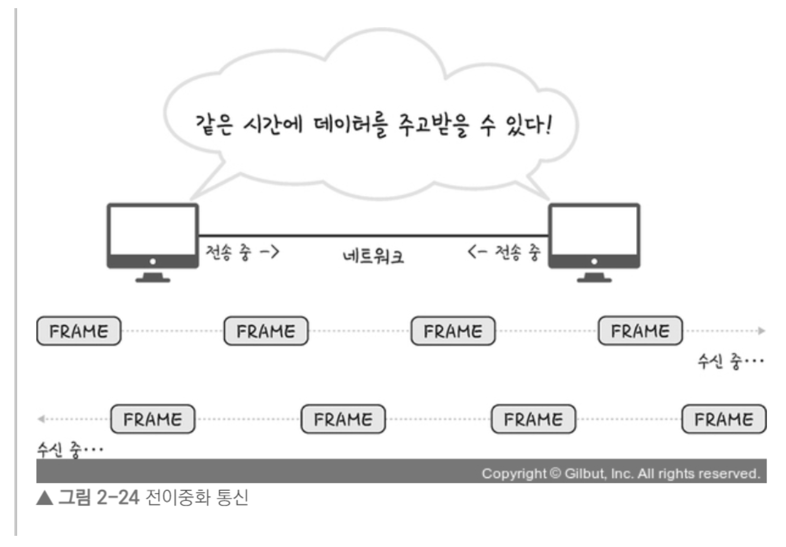

동축케이블, 광케이블 등을 기반으로 만들어진 유선 LAN을 이루는 이더넷은 IEEE802.3 프로토콜을 기반으로 전이중화 통신을 씀

✔️ IEEE 802.3: 이더넷프레임은 어떤 구조를 기반으로 할 것인지, 케이블의 최대 전송량, 어떤 케이블만이 가능하도록 할 것인지 등을 정한 규칙

### CSMA/CD

이전에는 유선 LAN에 ‘반이중화 통신’ 중 하나인 CSMA/CD(Carrier Sense Multiple Access with Collision Detection) 방식 사용

회선을 사용하는지를 파악한 후 사용하지 않는다면 데이터를 보내고 충돌이 발생한다면 일정 시간 이후 재전송하는 방식

### 케이블

✔️ 트위스트페어케이블 : 실드 처리를 한 STP케이블과 실드 처리를 하지 않은 UTP케이블

✔️ 유선 LAN을 구축할 때 쓰는 케이블인 **LAN 케이블은 UTP 케이블타입**

### 광섬유케이블

레이저를 이용해 통신하며 보통 100Gbps의 데이터를 전송하는 케이블

빛의 굴절율이 높은 부분을 코어, 낮은 부분을 클래딩 ⇒ 이렇게 다른 밀도를 가지는 유리나 플라스틱 섬유를 기반으로 제작

한번 들어간 빛이 내부에서 계속해서 반사하며 전진하여 반대편 끝까지 가는 원리를 이용

## 무선LAN

무선랜은 IEEE802.11 표준규격을 따르며 반이중화 통신을 사용

무선 신호 전달 방식을 이용하여 2대 이상의 장치를 연결하는 기술

### 반이중화 통신(half duplex)

양쪽 장치는 서로 통신할 수 있지만, 동시에는 통신할 수 없으며 한 번에 한 방향만 통신할 수 있는 방식

### CSMA/CA

반이중화 통신 중 하나로 장치에서 데이터를 보내기 전에 일련의 과정을 기반으로 사전에 가능한 한 충돌을 방지하는 방식

- 과정
  1. 사용 중인 채널이 있다면 다른 채널을 감지하다 유후 상태인 채널을 발견
  2. 프레임 간 공간 시간인 IFS(InterFrame Space)시간만큼 기다림. IFS는 프레임의 우선순위를 정의할 때도 사용되며, IFS가 낮으면 우선순위가 높음
  3. 프레임을 보내기전 랜덤상수를 기반으로 결정된 시간만큼 기다린 뒤 프레임을 보냄.
  4. 프레임을 보낸 뒤 제대로 송신이 되었고 ACK 세그먼트를 받았다면 마침, 만약 받지 못했다면 k = k + 1을 하며 이 과정을 반복 ⇒ 반복하다가 k가 정해진 Kmax 보다 커진다면 해당 프레임 전송은 버림 (abort)

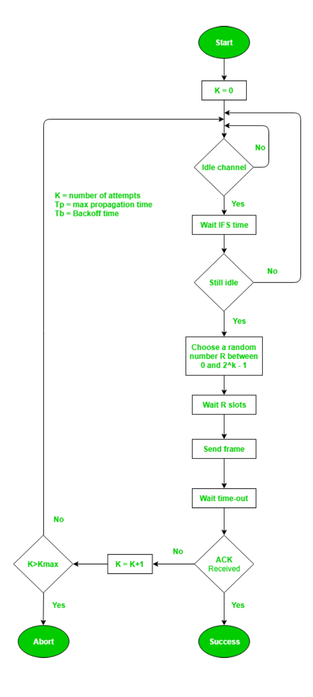

### 와이파이(wifi)

전자기기들이 무선 LAN 신호에 연결할 수 있게 하는 기술

근거리 무선망이라고도 할 수 있지만, 근거리 무선망은 블루투스, 지그비 등도 있기 때문에 구별해서 써야 함

## 무선랜) 주파수와 2.4GHz 5GHz

비유도 매체인 공기에 주파수를 쏘아 무선 통신망을 구축하는데, 주파수 대역은 2.4GHz 대역 또는 5GHz 대역 중 하나를 써서 구축

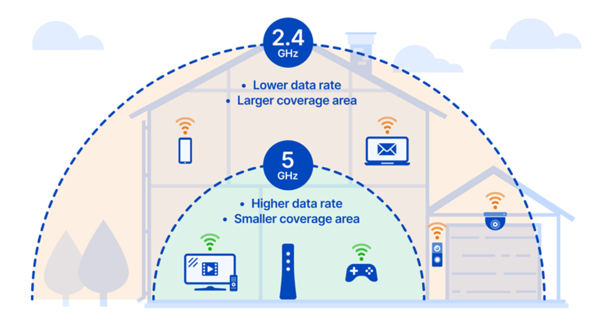

### 2.4GHz

장애물에 강하나 속도가 더 느림

호환성이 좋음(오래된 노트북, 휴대폰과도 연결 가능)

커버리지가 높음

### 5GHz

장애물이 있을 때 연결이 끊기기도 하나 속도가 더 빠름

호환성이 낮음

커버리지가 작음

## ✨ 대규모 트래픽으로 인한 서버 과부하 해결 방법

### ✔️ 서버 과부하

서버가 리소스를 소진하여 들어오는 요청을 처리하지 못할 때 발생

서버는 사용자의 웹요청을 처리하지 못해 응답없음이 발생

### 1️⃣ 모니터링을 통한 자원 할당

`자원의 한계점에 도달`했을 경우 `모니터링을 통한 자원의 적절한 할당`으로 해결 가능

📝 **AWS 오토 스케일링**

서비스 이용불가능 상태 발생 이전 cloud watch가 계속해서 모니터링하여 서버 대수를 늘려주는 방법

AWS 오토 스케일링은 애플리케이션을 자동으로 모니터링하고 자원의 용량을 자동으로 조정함

📝 **netdata를 이용한 모니터링**

설정한 임계치를 기반으로 알림 서비스 구축 가능

**✔️ 모니터링을 해야하는 이유**

1. 서버 과부화로 인해 서버 중지에 대한 대처 가능

   ⇒ 어떤 페이지에 어떤 트레픽이 얼마나 발생했는지, 어떤 네트워크에서 병목현상이 일어났는지를 확인 가능

2. 활용도가 낮은 페이지, 높은 페이지를 파악할 수 있어 나중에 서비스 개선에 도움이 됨

### 2️⃣ 로드밸런서

AWS 오토스케일링 구성에 시간이 걸리기 때문에 앞단 로드밸런서를 통해 트래픽을 분산해야 함

한 서버에 장애가 발생하면 로드 밸런서는 트래픽을 다른 기능 서버로 리디렉션하여 시스템 중단을 방지할 수 있음

### 3️⃣ 블랙스완 프로토콜

📝 블랙스완이란?

예측할 수 없는 사고가 일어난 것

사후에는 이 사고의 원인 등을 분석할 수 있지만 사전에는 이 사고를 예측할 수 없는 것을 의미 ⇒ 항상 대비하는 것이 필요 !

일반적으로 아래와 같은 규칙을 정해놓는 것이 좋다.

1. 영향을 받은 시스템과 각 시스템의 상대적 위험 수준을 확인

   체계적으로 데이터를 수집하고 원인에 대한 가설을 수립한 후 이를 테스팅

2. 잠재적으로 영향을 받을 수 있는 내부의 모든 팀에 연락
3. 최대한 빨리 취약점에 영향을 받는 모든 시스템을 업데이트
4. 복원계획을 포함한 우리의 대응 과정을 파트너와 고객 등 외부에 전달

### 4️⃣ 서킷 브레이커

서킷 브레이커 패턴이라고도 불리며 서비스 장애를 감지하고 연쇄적으로 생기는 에러를 방지하는 기법

서비스와 서비스 사이에 서킷브레이커 계층을 두고 미리 설정해놓은 timeout 임계값에 도달하면 서킷브레이커가 그 이후의 추가 호출에 무조건 에러를 반환하게 함

**✔️ 서킷브레이커 동작 과정**

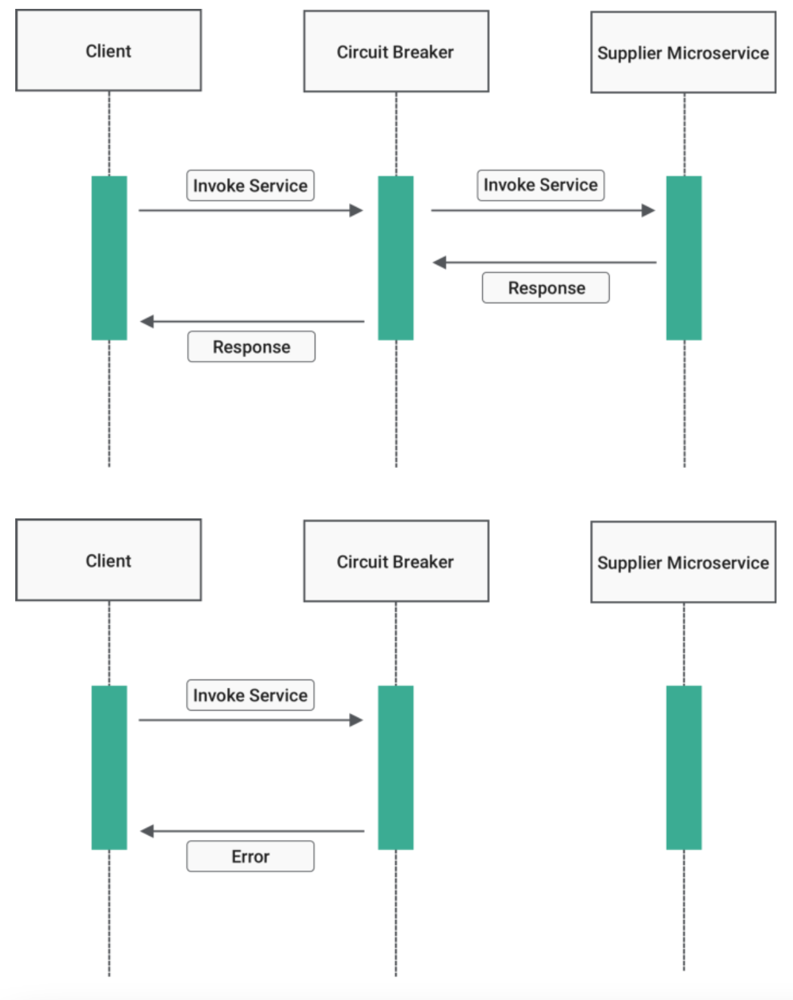

첫번째 상황은 정상적인 상황인데 반해, 에러가 발생한 두번째 상황의 경우 기다리지 않고 바로 에러를 반환한다.

**✔️ 서킷브레이커 상태**

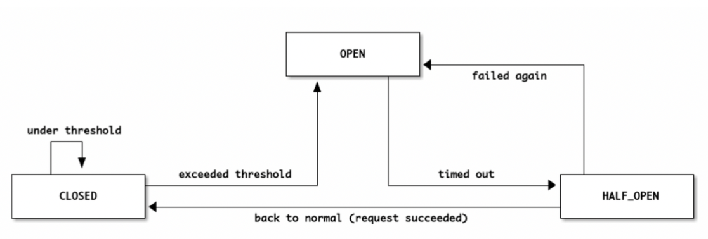

- closed[정상]: 네트워크 요청의 실패율이 임계치보다 낮음
- open[에러]: 임계치 이상의 상태. 요청을 서비스로 전송하지 않고 바로 오류를 반환하며, 이를 fail fast라고 함
- half_open[확인중]
  open상태에서 일정 timeout으로 설정된 시간이 지나면 장애가 해결되었는지 확인하기 위해 half_open 상태로 전환.
  여기서 요청을 전송하여 응답을 확인.
  장애가 풀리는지를 확인해서 성공하면 closed, 실패하면 다시 open으로 변경

**✔️ 서킷브레이커의 장점**

연속적인 에러 발생을 막아주며 일부서비스가 종료되더라도 다른 서비스들은 이상없이 동작하게 만들 수 있으며 사용자경험을 높여줌

### 5️⃣ 컨텐츠 관리

1. 불필요한 컨텐츠 제거
2. CDN을 통한 컨텐츠 제공

   CDN을 통해 사용자 가까이, 그리고 분산된 대규모 서버 네트워크를 기반으로 컨텐츠를 제공해서 메인 서버에 대한 부하를 줄임

3. 컨텐츠 캐싱

   브라우저 캐시(쿠키, 로컬저장소, 세션저장소)를 통해 해당 요청에 관한 항목을 캐시에서 응답을 읽어 네트워크 요청에 관한 비용을 모두 제거함

4. 컨텐츠 압축

   텍스트 기반 리소스를 압축하면 70% 정도까지 압축할 수 있음

   압축을 풀기위해 서버에서 자원을 사용하는 양까지 고려해야하지만, 보통은 압축하면 더 좋음

5. 컨텐츠의 우하한 저하(미리 준비된 응답)

   시스템의 과도한 부하를 줄이기 위해 제공하는 컨텐츠 및 기능을 일시적으로 줄이는 전략

   ex) 정적 텍스트 페이지를 제공하거나, 검색을 비활성화하거나 더 적은 수의 검색 결과를 반환하거나, 필수적이지 않은 기능을 비활성화함

# REST API

RESTful한 API를 말하며 일련의 특징과 규칙 등을 지키는 API

## 1️⃣ Uniform-Interface

API에서 자원들은 각각의 독립적인 인터페이스를 가지며 각각의 자원들이 url 자원식별 표현을 통한 자원조작, Self-descriptive message, HATEOAS 구조를 가지는 것을 의미

독립적인 인터페이스 = 서로 종속적이지 않은 인터페이스

ex ) 웹페이지를 변경했다고 웹 브라우저를 업데이트하는 일은 없어야 하고 HTTP명세나 HTML명세가 변경되어도 웹페이지는 잘 작동해야 함

### url 자원식별

identification of resources을 의미하며, 자원은 url로 식별되어야 함

### 표현을 통한 자원조작

manipulation of resources through representations

url은 GET, DELETE 등 http 표준메서드 등을 통해 자원을 조회, 삭제 등 작업을 설명할 수 있는 정보가 담겨야 하는 것을 의미

### Self-descriptive message

HTTP Header에 타입을 명시하고 각 메세지(자원)들은 MIME types에 맞춰 표현되어야 함

MIME types: 문서, 파일 등의 특성과 형식을 나타내는 표준

ex) application/json, font/ttf, text/plain, text/csv

### HATEOAS 구조

HATEOAS(Hypermedia as the Engine of Application State)

하이퍼링크에 따라 다른 페이지를 보여줘야 하며 데이터마다 어떤 URL에서 원했는지 명시해주어야 하는 것을 의미

보통은 href, links, link, url 속성 중 하나에 해당 데이터의 URL을 담아서 표기

## 2️⃣ Stateless

HTTP 자체가 Stateless 이기 때문에 HTTP를 이용하는 것만으로 만족

REST API를 제공해주는 서버는 세션을 해당 서버 쪽에 유지하지 않는다는 의미

## 3️⃣ Cacheable

HTTP는 자동적으로 캐싱이 됨

HTTP 메서드 중 GET에 한정되며 ‘Cache-Control: max-age=100’(100초)와 같이 한정된 시간을 정할 수 있으며, 캐싱된 데이터가 유효한지를 판단하기 위해 ‘Last-modified’ 와 ‘Etag’라는 헤더값을 사용

'Etag'는 전달되는 값에 태그를 붙여서 캐싱되는 자원인지를 확인해주는 것

## 4️⃣ Client-Server구조

클라이언트와 서버가 서로 독립적인 구조를 가져야 함 ⇒ HTTP를 통해 가능

## 5️⃣ Layered System

계층구조로 나눠져있는 아키텍처를 의미

WEB기반 서비스는 보통 이러한 시스템을 가지고 있음

## ✨ REST API의 URI 규칙

1. 동작은 HTTP 메소드로만 해야 하고 url에 해당 내용이 들어가면 안됨

   수정 = put, 삭제 = delete, 추가 = post, 조회 = get을 이용해야 함

2. .jpg, .png 등 확장자는 표시하지 말아야 함
3. 동사가 아닌 명사로만 표기
4. 계층적인 내용을 담고 있어야 함 (ex. ‘/집/아파트/전세’)
5. 대문자가 아닌 소문자로만 쓰며 너무 길 경우에 바를 써야할 경우 \_(언더바)가 아닌 그냥 -(바)를 사용
6. HTTP 응답 상태코드를 적재적소에 활용

# 📝 브라우저 렌더링 과정

브라우저는 브라우저엔진, 렌더링엔진, 네트워크통신부, 자바스크립트 해석기, UI백엔드, 자료 저장소로 이루어져 있음

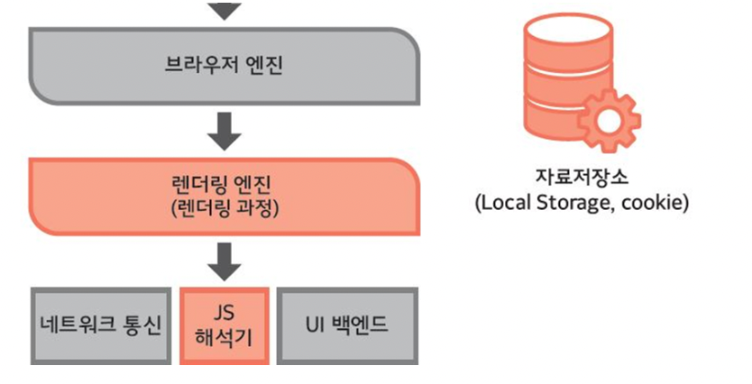

이 때 랜더링엔진이 브라우저 랜더링을 관정하며 아래와 같은 과정으로 이루어짐.

DOM트리 CSS파서 등을 기반으로 렌더트리를 구축해 결과적으로 우리가 보는 화면을 구축하는 과정을 의미

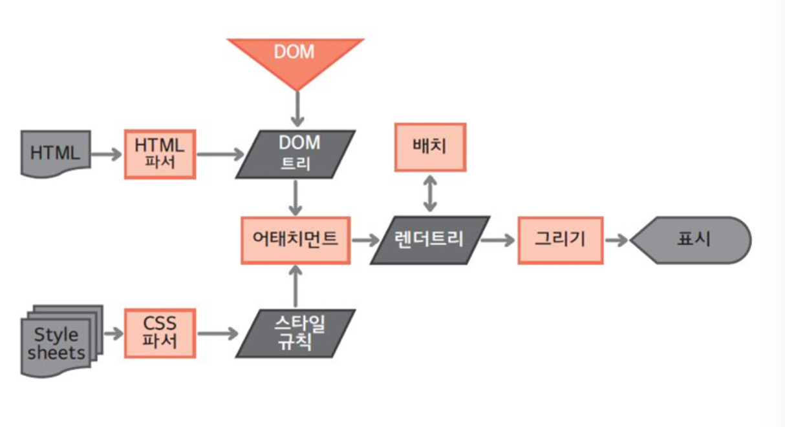

## 1. DOM 트리와 CSSOM트리 구축

### DOM트리 구축

HTML 파서에 의해 각 태그들이 “구문분석” 됨

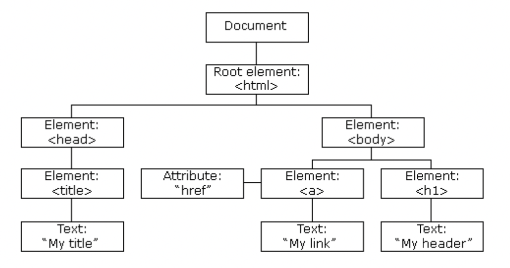

### CSSOM 트리 구축

CSS파서에 의해 정해진 스타일 규칙이 적용되어 있으며, 이런 것을 기반으로 CSSOM 트리가 만들어짐

이 과정은 DOM트리 구축과 “동시에” 일어남

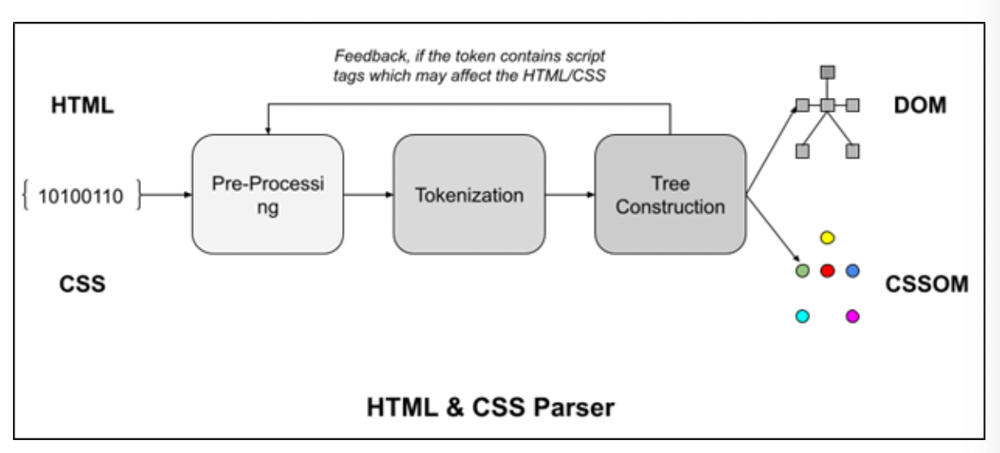

## 2. 렌더트리와 렌더레이어 생성

DOM 트리와 CSSOM 트리가 합쳐져 랜더객체가 생성

이들이 모여 병렬적인 렌더트리가 생성

렌더레이어가 완성될 때 GPU에서 처리되는 부분(CSS3D / video&canvas / filter / animation / transform)이 있으면 이 요소들은 각각 강제적으로 그래픽레이어로 분리됨

## 3. 렌더레이어를 대상으로 Layout 설정

좌표는 보통 부모를 기준으로 설정.

Global Layout은 브라우저 사이즈가 증가하거나 폰트 사이즈가 커지면 변경

## 4. 렌더레이어를 대상으로 칠하기(paint)

픽셀마다 점을 찍듯 칠하는 것 ⇒ 레스터화

## 5. 레이어 합치기 (composite layer) 및 표기

각각의 레이어로부터 비트맵이 생성되고 GPU에 텍스쳐로 업로드 됨

그다음 텍스쳐들이 서로 합쳐져 하나의 이미지로 랜더링되며 화면으로 출력

### 👀 렌더트리와 DOM 트리는 1:1 대응일까 ?

❌ DOM 트리 > 렌더 객체 > 렌더트리가 되는 과정에서 display:none 으로 사라지는 렌더 객체(노드)들이 있을 수 있기 때문에 1:1 대응이 아님

# 📝 URL를 쳤을 때 생기는 과정과, DNS

리다이렉트, 캐싱, DNS, IP 라우팅 & ARP, TCP 연결 구축을 거쳐 요청, 응답이 일어나는 TTFB(Time to First Byte)가 시작됨

이 후 컨텐츠를 다운 받고, 브라우저 렌더링 과정을 거쳐 화면이 나타남

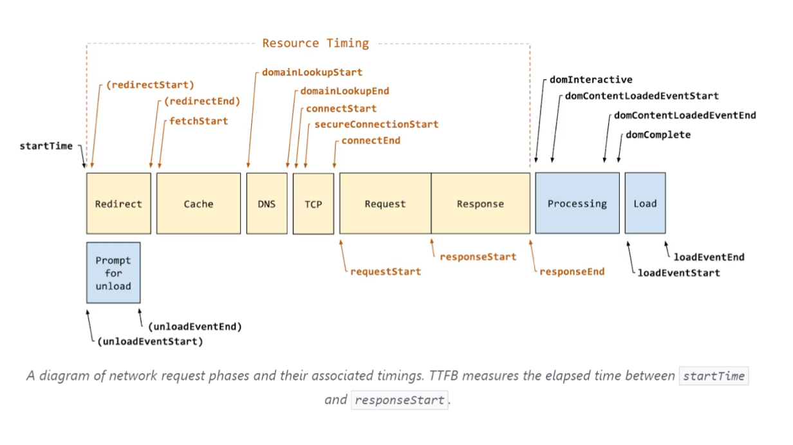

## 1️⃣ 리다이렉트

리다이렉트가 있다면 진행하고 없다면 그대로 해당 요청에 대한 과정 진행

## 2️⃣ 캐싱

**요청된 값의 결과물을 저장하고 그 값을 다시 요청하면 다시 제공하는 기술**

해당 요청에 캐싱이 가능한지 가능하지 않은지 파악

캐싱이 이미 된 요청이라면 캐싱된 값을 반환하며 캐싱이 되지 않은 새로운 요청이라면 그 다음 단계로 넘어감

### 브라우저 캐시

쿠키, 로컬스토리지 등을 포함한 캐시 = Private cache(개인캐시)라고도 함

브라우저 자체가 사용자가 HTTP 를 통해 다운로드하는 모든 문서를 보유하는 것을 의미

### 공유 캐시

공유 캐시는 클라이언트와 서버 사이에 있으며 사용자간에 공유할 수 있는 응답을 저장할 수 있음

## 3️⃣ DNS

실제 서버에 요청할 단계

브라우저가 요청한 FQEN(Fully Qualified Domain Name)의 이름을 DNS를 통해 실제 IP 주소를 확인함

\*\* www은 호스트, naver.com은 도메인

DNS(Domain Name System)은 계층적인 도메인 구조와 분산된 데이터베이스를 이용한 시스템으로

FQDN을 인터넷 프로토콜인 IP로 바꿔주는 시스템

예) DNS 쿼리가 왔을 때 Root DNS → .com DNS → .naver DNS → .www DNS 과정을 거쳐 IP 주소를 매핑

## 4️⃣ TCP 연결 구축

TCP 3way-handshake 및 SSL 연결 등을 통해 연결을 설정

요청을 보낸 후 해당 요청 서버로부터 응답을 받음

\*\* HTTP/2까지 TCP 연결이 일어나고, HTTP/3는 QUIC를 통해 연결하고 데이터를 주고 받음

## 5️⃣ 콘텐츠 다운로드

브라우저는 사용자가 요청한 컨텐츠를 서버로부터 다운

## 6️⃣ 브라우저 랜더링

받은 데이터를 바탕으로 브라우저 엔진이 브라우저 렌더링 과정을 거쳐 화면을 만듦

# 📝 이더넷 프레임과 구조

이더넷 프레임: 데이터 링크 계층의 데이터 단위이며, 이를 기반으로 데이터 전달

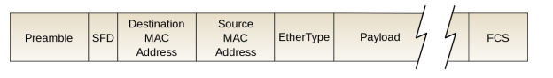

- Preamble[7바이트] : 이더넷 프레임의 시작
- SFD[1바이트] : Start frame delimiter, 다음 필드부터 주소필드가 시작됨을 알려주는
- Destination Address[6바이트] : 목적지 주소
- Source Address[6바이트] : 시작지 주소
- EtherType[2바이트] : 데이터링크계층 위의 IP 프로토콜을 정의 (IPv4, Ipv6)
- Payload[가변바이트] : 데이터 또는 페이로드. 가변길이 필드. 해당
  필드는 이진데이터(0과1 로 이루어진 데이터)로 구성. IEEE 표준은 최대
  페이로드를 1500 바이트로 지정.
- FCS[4바이트] : frame check sequence이며 수신측의 에러검출을 위해 삽입하는
  필드.
  CRC 에러검출 기법에 의해 생성된 비트배열이 담김.

  비트배열을 기반으로 수신된 데이터가 손상되었는지를 확인하고 에러 확인시에는 해당 프레임을 폐기하고 송신측에 재전송을 요구
