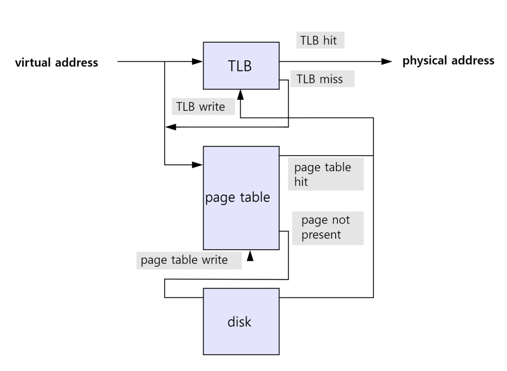
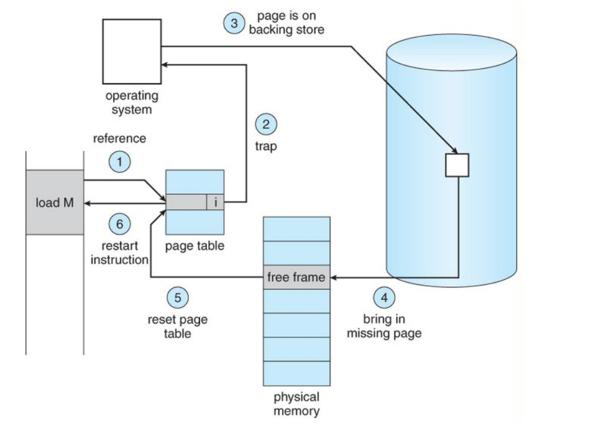

## 운영체제와 컴퓨터시스템의 구조

### 운영체제의 종류

- GUI: Graphical User Interface는 그래픽을 사용하여 컴퓨터와 상호작용하는 인터페이스 ⇒ windowOS, macOS 등 현대의 OS
- CUI: Character User Interface는 사용자가 키보드만을 사용하여 문자를 기반으로 컴퓨터와 상호작용하는 인터페이스 ⇒ 예전 OS인 MS-DOS가 대표적

### 운영체제의 역할

아래는 운영체제 중 커널이 담당하고 있음

1. OS의 중추적인 역할을 담당하는 것이 커널(OS가 하는 것은 커널이 한다고 봐도 됨
2. 프로그램을 SSD에 설치하고 실행하면 메모리에 올라가서 프로세스가 됨
3. CPU가 왔다갔다하며 메모리에 있는 명령어들을 실행함

- CPU 스케줄링과 프로세스 상태관리
- 메모리관리
- 디스크 파일 관리
- I/O 디바이스 관리

### 운영체제의 구조

유저프로그램

✔️ 인터페이스(GUI 또는 CUI)

✔️ 시스템콜(system call)

✔️ 커널(I/O 드라이버, 파일시스템 등)

✔️ 하드웨어(hardware)

### 컴퓨터 시스템의 구조

CPU : 인터럽트에 의해 메모리에 존재하는 명령어를 해석해서 실행하는 일꾼

DMA컨트롤러 : CPU의 일을 보조하는 일꾼

메모리 : 전자회로에서 데이터, 상태 등을 기록하는 장치(작업장) ⇒ RAM

타이머 : 특정 프로그램에 시간을 다는 역할 ⇒ 무한 루프에 빠지는 프로그램을 제한하기 위해서 존재

디바이스 컨트롤러 : IO디바이스들의 작은 CPU

로컬버퍼 : 디바이스에 달려 있는 작은 메모리

### CPU

산술논리연산장치, 제어장치, 레지스터로 구성되어있는 장치.

인터럽트에 의해 메모리에 존재하는 명령어를 해석해서 실행하는 일꾼.

**메모리에 있는 것을 해석해서 실행하기만 하는 것**

- 산술논리연산장치(ALU): 덧셈, 뺄셈, 곱셈, 나눗셈 등 산술연산과 논리연산을 하는 회로장치
- 제어장치(CU- control unit): 프로세스의 조작을 지시하며 명령어들을 읽고 해석하며 데이터 처리를 위한 순서를 결정
- 레지스터: CPU 안에 있는 매우 빠른 임시기억장치

1. 제어장치가 메모리에 있던 것을 레지스터에 올림
2. 제어장치가 레지스터에 있는 값을 읽으라고 ALU에게 시켜서 결과를 메모리에 반영

## 인터럽트

어떤 신호가 들어왔을 때 CPU를 잠깐 정지시키는 것

발생시점: 0으로 숫자를 나누는 산술 연산오류, 프로세스 오류, 키보드, 마우스 등 IO 디바이스를 사용할 때의 인터럽트, 우선순위가 높은 프로세스의 발생

### 인터럽트 발생과정

1. CPU가 메모리에 있는 명령어를 순차적으로 실행하다 인터럽트가 발생하면 인터럽트 핸들러 함수가 모여있는 인터럽트 백터로 이동
2. 인터럽트핸들러 함수(인터럽트 서비스 루틴, ISR)가 실행되며 특정 명령어를 실행하게 됨
3. 이후 인터럽트가 종료되면 다시 순차적으로 실행

### 인터럽트의 종류

- 하드웨어 인터럽트
  IO 디바이스 등 하드웨어에서 발생하는 인터럽트
  마우스를 기반으로 버튼을 클릭할 때, 디스크에서 파일읽기, 쓰기 작업이 완료되었을 때 발동
- 소프트웨어 인터럽트
  트랩(trap)이라고도 하며, 프로세스 오류, 프로세스의 종료, 시작 등을 기반으로
  프로세스에서 발생하는 인터럽트
  하드웨어 인터럽트보다 우선순위가 높은 인터럽트

## 시스템콜과 modebit

운영체제가 커널에 접근하기 위한 인터페이스

유저 프로그램이 운영체제의 서비스를 받기 위해 커널 함수를 호출할 때 이를 거쳐서 호출하도록 설계

프로세스 관리(생성, 삭제 등), 파일관리, 디바이스 관리, 시간 및 날짜 관련 시스템, 프로세스 간 통신 때 이를 통해 커널함수를 호출

프로세스를 종료하는 kill()이라는 함수를 호출하면 시스템 콜을 거쳐서 커널 함수가 호출됨

### 시스템 콜의 과정

1. 유저 프로그램이 I/O 요청 트랩발동합니다.
2. 올바른 I/O 요청인지 확인합니다.
3. 유저 모드가 시스템콜을 통해 커널모드로 변환합니다.
4. 이후 커널함수를 실행합니다.

### 커널함수

커널안에 있는 여러개의 함수(native function)

### 커널

운영체제의 핵심 부분이자 시스템콜을 제공하며 보안, 메모리, 프로세스, 파일 시스템, I/O 디바이스, I/O 요청 관리 등 운영체제의 중추적인 역할

### 유저모드

유저가 접근할 수 있는 영역을 제한적으로 두며 컴퓨터 자원에 함부로 침범하지 못하는 모드

### 커널모드

모든 컴퓨터 자원에 접근할 수 있는 모드

### modebit

시스템콜이 작동될 때 modebit을 기반으로 유저 모드와 커널 모드를 구분

modebit은 1 또는 0의 값을 가지는 플래그 변수이며 1은 유저모드, 0은 커널모드를 가리킴

### 시스템콜의 장점

- 유저 프로그램은 시스템콜을 기반으로 커널과 분리됨
- 유저프로그램은 복잡한 파일 시스템과 프로세스 생성 등에 대한 내부동작을 신경쓸 필요가 없음
- 운영체제의 관리하에 프로그램이 운영되므로 시스템의 안정성과 보안이 강화됨

## 메모리계층

레지스터, 캐시, 주기억장치, 보조기억장치로 구성

- 레지스터: CPU 내의 작은 메모리, **휘발성**, 속도 가장 빠름, 기억 용량이 가장 적음.
- 캐시: CPU내의 L1, L2 캐시를 지칭합니다. **휘발성**, 속도 빠름, 기억 용량이 적음.
- 주기억장치: RAM을 가리킵니다. **휘발성**, 속도 보통, 기억 용량이 보통
- 보조기억장치: HDD, SSD를 일컬으며 **비휘발성**, 속도 낮음, 기억 용량이 많음

### 계층이 존재하는 이유

- 더 빠른 접근과 처리속도가 증가
  보통 쓰던 것을 많이 쓰기 때문에 특정 데이터에 많이 접근하게 되는데 좀 더 작은 캐시 메모리에 해당 데이터가 있다면 더 빠르게 해당 데이터에 접근이 가능하며, 이로 인해 처리속도도 증가
- 비용의 효율성
  캐시메모리는 비싸고 아래로 갈 수록 비용은 더 저렴함
  계층이 있고 캐싱 떄문에 비용을 좀 더 효율적으로 쓸 수 있음
- 자원의 효율적 사용
  메모리 계층 구조는 자주 접근하는 데이터는 빠른 메모리에, 덜 접근하는 데이터는 느린 메모리에 저장하여 자원을 효율적으로 사용
  거의 접근하지 않은 데이터에 비싸고 빠른 메모리를 사용하지 않게 되어 자원을
  낭비하지 않게 됨

✨ 흔히 볼 수 있는 로딩중은 내부에서 하드디스크 또는 인터넷에서 데이터를 읽어 RAM으로 전송하는 과정이 아직 끝나지 않았음을 의미

## 가상메모리와 스와핑, 페이지폴트, 스레싱

## 가상 메모리

OS에서 사용하는 메모리 관리 기법의 하나로 컴퓨터가 실제로 이용가능한 메모리 자원(실제주소, physical address)을 추상화하여 이를 사용하는 사용자들에게 매우 큰 메모리로 보이게 만드는 것

✔️ 가상주소는 MMU와 페이지테이블에 의해 실제 주소로 변환

⭐️ **✔️ 페이지: 가상 메모리를 사용하는 최소 크기 단위**

⭐️ **✔️ 프레임: 실제 디스크나 메모리를 사용하는 최소 크기 단위**

### 페이지 테이블

가상 메모리는 가상주소와 실제주소가 매핑되어있는 페이지 테이블로 관리되며 이 때 속도 향상을 위해 **캐싱계층인 TLB**를 활용

가상주소에서 바로 페이지테이블을 가는게 아니라 TLB에서 있는지를 확인하고 만약 없다면 페이지테이블로 가서 실제주소를 가져옴

### 페이지 폴트와 스와핑

가상 메모리는 실제 영역에는 없을 수도 있음

즉, 가상메모리에는 존재하지만 실제 메모리인 RAM에는 현재 없는 데이터나 코드에 접근할 경우가 있으며 이 때 페이지 폴트가 발생

메모리의 당장 사용하지 않는 영역을 하드디스크로 옮기고 하드디스크의 일부분을 “마치 메모리처럼” 불러와 쓰는 것을 스와핑

### 페이지 폴트의 과정

1. 어떤 명령어가 유효한 가상주소에 접근했으나, 해당 페이지가 만약 없다면 트랩 발생으로 운영체제에 알리게 됨
2. 운영체제는 실제 디스크로부터 사용하지 않은 프레임을 찾음
3. 해당 프레임을 실제 메모리에 가져와서 페이지교체알고리즘을 기반으로 특정페이지와 교체 ⇒ 이 때 스와핑이 일어남
4. 페이지테이블을 갱신시킨 후 해당 명령어 다시 시작

### 스레싱

메모리의 페이지 폴트율이 높은 것을 의미하며, 메모리에 너무 많은 프로세스가 동시에 올라가게 되면 스와핑이 많이 일어나서 발생함

페이지폴트가 일어나면 CPU이용율 낮아짐 → 운영체제는 CPU의 가용성을 높이기 위해 더 많은 프로세스를 메모리에 올림 → 스레싱 일어남

**⭕️ 해결 방법**

- 하드웨어적 : 메모리를 늘리거나 HDD → SSD로 변경
- 운영체제적 : 작업세트와 PFF

### 작업세트

프로세스의 과거 사용이력을 기반으로 많이 사용하는 페이지집합을 만들어 한꺼번에 미리 메모리에 로드하는 것

### PFF(page fault frequency)

페이지 폴트 빈도를 조절하는 방법으로 상한선과 하한선을 만들고 상한선에 도달한다면 프레임을 늘리고 하한선에 도달한다면 프레임을 줄이는 방법

### 가상 메모리의 필요성

1️⃣ 주기억장치의 효율적 관리 (스와핑)

필요할 때만 램에 데이터를 불러와 올리고 다시 사용하지 않으면 하드디스크로 내림으로써 램을 효과적으로 관리

2️⃣ 메모리 관리의 단순화

가상메모리의 통일된 주소 공간 배정으로 메모리 관리가 단순해짐

3️⃣ 메모리 용량 및 안정성 보장

무한한 가상메모리 공간을 배정함으로써 프로세스들끼리 메모리 침범이 일어날 여지를 줄이게 됨

## 페이지 교체 알고리즘: FIFO, LRU, NUR, LFU

스와핑이 일어날 때 페이지교체 알고리즘에 의해 페이지가 교체

### 오프라인 알고리즘

가장 좋은 알고리즘이라고 일컫는 알고리즘

가장 먼 미래에 참조되는 페이지와 현재의 페이지를 바꾸는 알고리즘(**LFD,** Longest Forward Distance)

⇒ 미래에 사용되는 페이지를 알 수가 없기 때문에 실질적으로 구현할 수 없음, 그래서 상한선을 만들어준다고 보면 됨 (비교 기준)!

### FIFO(First In First Out)

가장 먼저 온 페이지부터 교체하는 방법

### LRU(Least Recently Used)

최근에 사용되지 않은 페이지를 바꾸는 방법

즉, 참조가 오래된 페이지를 바꾸는데 이를 위해 각 페이지마다 최근 사용한 횟수를 나타내는 자료구조를 따로 만들어야 할 수도 있음

### NUR

LRU에서 발전한 알고리즘이자 NUR(Not Used recently) 또는 NRU(Not Recently Used) 라고도 불리는 알고리즘

1. lock 알고리즘이라고 하며 먼저 0과 1을 가진 비트로 구성
2. 1은 최근에 참조되었고 0은 참조되지 않음을 의미함
3. 만약 한 바퀴 도는 동안 사용되지 않으면 0이 됨.
4. 시계 방향으로 돌면서 0을 찾고 0을 찾은 순간 해당 페이지를교체하고, 해당 부분을1로 바꿈

### LFU(Least Frequently Used)

참조 횟수가 가장 적은 페이지를 교체하는 알고리즘

## 프로세스와 스레드의 차이

### 프로세스(process)

컴퓨터의 **메모리에 올라와 실행되고 있는 프로그램**. task와 같은 의미

### 스레드(thread)

프로세스 내 작업의 흐름

### 프로세스와 스레드의 차이

✔️ **프로세스**

1. 코드, 데이터, 스택, 힙 메모리 영역을 기반으로 작업
2. 다른 프로세스와 격리되어있기 때문에 서로 통신을 위해서 IPC를 사용해야 함
3. 한 프로세스에 문제가 생겨도 다른 프로세스에 영향을 끼치지 않음
4. 생성과 종료에 더 많은 시간이 듦

✔️ **스레드**

1. 프로세스 내의 스택 메모리를 제외한 다른 메모리 영역을 프로세스 내의 다른 스레드들과 공유 ⇒ 메모리적 이점 o
2. 다른 스레드와 서로 격리되어 있지 않으므로 그냥 통신할 수 있어 프로세스보다 빠름
3. 격리가 되어있지 않아 한 스레드에 문제가 생기면 다른 스레드에도 영향을 끼쳐 스레드로 이뤄져있는 프로세스에 영향을 줄 수 있음
4. 생성과 종료에 더 적은 시간이 듦

## 프로그램 컴파일 과정

✔️ 프로그램 : 컴파일러가 컴파일 과정을 거쳐 컴퓨터가 이해할 수 있는 기계어로 번역되어 실행될 수 있는 파일이 된 것

1. 전처리

   소스코드의 주석제거, #include 등 헤더파일을 병합하고 매크로를 치환

2. 컴파일러

   오류처리, 코드최적화 작업을 하여 어셈블리어로 변환

3. 어셈블러

   어셈블리어는 목적코드(object code)로 변환

   확장자는 운영체제마다 다르지만 리눅스는 .o

4. 링커

   프로그램 내 있는 라이브러리 함수 등과 결합해 실행파일이 만들어지는데, 확장자는 .exe, .out로 생성

## 프로세스의 메모리 구조

1. 스택 ⇒ 동적
   1. 지역변수, 매개변수, 함수가 저장되고 컴파일 시에 크기가 결정
   2. 함수가 함수를 호출 하는 등에 따라 런타임시에도 크기가 변경
2. 힙 ⇒ 동적
   1. 동적 할당할 때 사용되며 런타임시 크기가 결정
3. 데이터영역 ⇒ 정적
   1. BSS영역과 Data 영역으로 나뉨
4. 코드영역 ⇒ 정적
   1. 소스코드

### 정적할당

컴파일 단계에서 메모리를 할당하는 것

아래 3단계로 나뉘어서 저장

| Data Segment      |
| ----------------- |
| BSS Segment       |
| Code/Text Segment |

- Data Segment: 전역변수, static, const로 선언되어 있는 변수 중 0이 아닌 값으로 초기화된 변수가 이 메모리 영역에 할당
- BSS segment: 전역변수,static, const로 선언되어있는 변수 중 0으로 초기화 또는 초기화가 어떠한 값으로도 되어 있지 않은 변수들이 이 메모리 영역에 할당
- Code/Text Segment: 프로그램의 코드가 들어감

### 동적 할당

런타임 단계에서 메모리를 할당받는 것

✔️ Stack

지역변수, 매개변수, 실행되는 함수에 의해 늘어나거나 줄어드는 메모리 영역

함수가 호출될 때마다 호출될 때의 환경 등 특정 정보가 stack에 계속해서 저장

✔️ Heap

동적으로 할당되는 변수를 담음

malloc(), free() 함수를 통해 관리할 수 있으며 동적으로 관리되는 자료구조의 경우 Heap 영역을 사용

ex) vector

## PCB(Process Control Block)와 컨텍스트 스위칭

운영체제에서 관리하는 프로세스에 대한 메타데이터를 저장한 데이터블록

커널 스택에 저장되며 각 프로세스가 생성될 때마다 고유의 PCB가 생성되고 프로세스가 종료되면 PCB는 제거

### PCB 구조

| Process State      |
| ------------------ |
| Process Number     |
| Program Counter    |
| Registers          |
| Memory Limits      |
| List of Open Files |

- 프로세스 상태: 대기중,실행중 등 프로세스의 상태
- 프로세스 번호(PID): 각 프로세스의 고유 식별 번호(프로세스 ID)
- 프로그램 카운터(PC): 이 프로세스에 대해 실행될 다음 명령의 주소에 대한 포인터
- 레지스터: 레지스터 관련 정보
- 메모리 제한: 프로세스의 메모리 관련정보
- 열린 파일 정보: 프로세스를 위해 열린 파일 목록들

### 컨텍스트 스위칭

PCB를 기반으로 프로세스의 상태를 저장하고 다시 복원시키는 과정

프로세스가 종료되거나 인터럽트에 의해 발생

### 컨텍스트 스위칭의 비용

1. 유후시간(Idle time)의 발생 : 컨텍스트 스위칭을 할 때마다 유후시간이 생겨서 CPU의 가용성이 떨어지는 비용이 발생
2. 캐시미스 : 프로세스가 가지고 있는 메모리 주소가 그대로 있으면 잘못된 주소 변환이 생기므로 캐시클리어 과정이 무조건 일어남 ⇒ 캐시미스 발생

\*\* 스레드에서의 컨텍스트 스위칭 : 스레드는 스택 영역을 제외한 모든 메모리를 공유하기 때문에 비용이 더 적고 시간도 더 적게 걸린다는 장점이 있음

## 프로세스의 상태

### 1️⃣ 생성 상태

프로세스가 생성된 상태를 의미하며 fork() 또는 exec() 함수를 통해 프로세스가 생성된 상태

PCB 할당

1. fork()
   1. fork()는 부모 프로세스의 주소 공간을 그대로 복사하며, 새로운 자식 프로세스를 생성하는 함수
   2. 주소 공간만 복사하며 부모 프로세스의 비동기 작업을 상속하지는 않음
2. exec()
   1. 새롭게 프로세스를 생성하는 함수

### 2️⃣ 대기 상태

대기 상태(ready)는 처음 프로세스가 생성(create)된 이후 메모리 공간이 충분하면 메모리를 할당받고 아니면 아닌 상태로 준비큐(준비 순서열)에 들어가서 대기중인 상태

CPU 스케줄러로부터 CPU 소유권이 넘어오기를 기다리는 상태

### 3️⃣ 대기 중단 상태

대기 중단 상태(ready suspended)는 준비큐가 꽉찬 상태

메모리 부족으로 일시 중단된 상태

### 4️⃣ 실행 상태

실행 상태(running)는 CPU 소유권과 메모리를 할당받고 인스트럭션(명령어)을 수행 중인 상태를 의미

CPU burst가 일어났다고도 표현

### 5️⃣ 중단 상태

중단 상태(blocked)는 어떤 이벤트가 발생한 이후 기다리며 프로세스가 차단된 상태

ex ) 프린트 인쇄 버튼을 눌렀을 때 실행하고 있던 프로세스가 잠깐 멈춘 듯할 때가 있는데 이는 프린트 인쇄에 관한 IO요청으로 인해 인터럽트가 발생되어 현재 실행하고 있던 프로세스가 중단 상태로 잠시 변경된 것

### 6️⃣ 일시 중단 상태

일시 중단 상태(blocked suspended)는 대기 중단과 유사

중단된 상태에서 프로세스가 실행되려고 했지만 메모리 부족으로 일시 중단된 상태

### 7️⃣ 종료 상태

종료 상태(terminated or exit)는 프로세스 실행이 완료되어 해당 프로세스에 대한 자원을 반납하며 PCB가 삭제되는 상태

종료는 자연스럽게 종료되는 것도 있지만 부모 프로세스가 자식 프로세스를 강제적으로 종료시켜 비자발적 종료(abort)로 종료될 수도 있음

자식 프로세스에 할당된 자원의 한계치를 넘어서거나 부모 프로세스가 종료되거나 사용자가 process.kill 등 여러 명령어로 프로세스를 종료시킬 때 발생

## 멀티프로세싱과 멀티스레딩

### 멀티프로세싱

여러 개의 ‘프로세스’, 즉 멀티프로세스를 통해 동시에 두 가지 이상의 일을 수행할 수 있는것

특정 프로세스 중 일부에 문제가 발생되더라도 다른 프로세스에 영향을 미치지 않으며 격리성과 신뢰성이 높음

### 멀티스레딩

프로세스 내 작업을 멀티스레드로 처리하는 기법

스레드끼리 서로 자원을 공유하고 프로세스보다는 가볍기 때문에 효율성이 높음

한 스레드에 문제가 생기면 다른 스레드에도 영향을 끼쳐 스레드로 이루어져 있는 프로세스에 영향을 줄 수 있는 단점이 있음

## IPC(Inter-Process Communication)

프로세스끼리 데이터를 주고받고 공유 데이터를 관리하는 메커니즘

공유메모리, 파일, 소켓, 파이프, 메시지 큐가 있음

### 공유메모리

여러 프로세스가 서로 통신할 수 있도록 메모리를 공유하는 것

IPC 방식 중 어떠한 매개체를 통해 데이터를 주고 받는게 아니라 메모리 자체를 공유하기 때문에 불필요한 데이터 복사의 오버헤드가 발생하지 않아 가장 빠름

같은 메모리 영역을 여러 프로세스가 공유하기 때문에 동기화가 필요함

IPC 중 가장 빠른 통신 방법

### 파일

디스크에 저장된 데이터를 기반으로 통신하는 것

### 소켓

네트워크 인터페이스(TCP, UDP, HTTP 등)를 기반으로 통신하는 것

### 파이프

**✔️ 익명 파이프**

프로세스 사이에 FIFO 기반의 통신 채널을 만들어 통신하는 것

파이프 하나당 단방향 통신이기 때문에 만약 양방향 통신을 하려면 2개의 익명 파이프를 만들어야 함

부모, 자식 프로세스 간에만 사용할 수 있으며 다른 네트워크상에서는 사용이 불가능

파이프의 데이터 용량은 제한되어 있으며 쓰기 프로세스가 읽기 프로세스보다 더 빠르게 데이터를 쓸 수 없음

**✔️ 명명 파이프**

익명 파이프의 확장된 개념

부모, 자식 뿐만 아니라 다른 네트워크 상에서도 통신할 수 있는 파이프

보통 서버, 클라이언트용 파이프를 구분해서 동작

### 메시지 큐

메시지를 큐(queue) 자료구조 형태로 관리하는 버퍼를 만들어 통신하는 것

1. 프로세스가 메시지를 보내거나 받기 전에 큐를 초기화
2. 보내는 프로세스의 메시지는 큐에 복사되어 받는 프로세스에 전달
