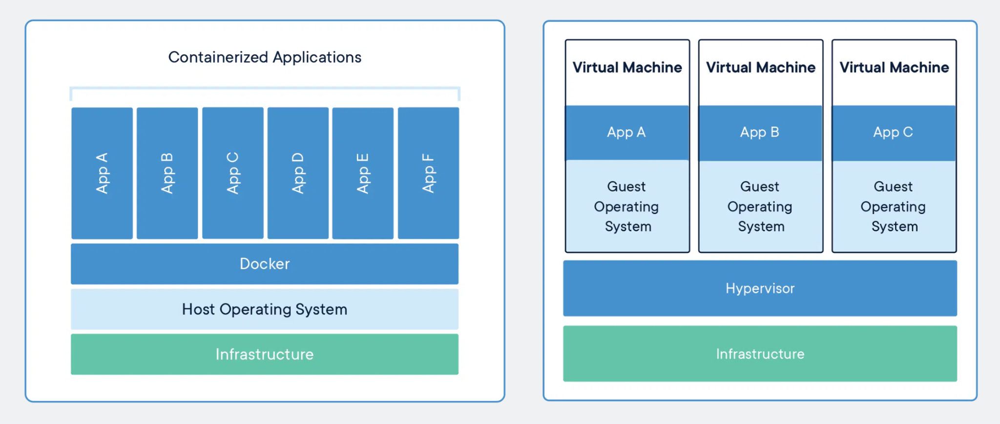

# 0. 개발자 필수지식 - week02

# 1. Iass와 PaaS와 SaaS

## IaaS

- Infrastructure-as-a-Service
- 인프라형 클라우드 서비스
- 클라우드가 단지 “인프라”만 제공해서 특정 서비스에 종속되지 않음
- 단순히 빈방을 준다고 생각하면 됨
- node.js, MongoDB등을 개발자가 일일이 직접 설치해야함
- ex) AWS의 EC2, NCP등

## PaaS

- Platform-as-a-Service
- 플랫폼형 클라우드 서비스
- 클라우드가 플랫폼을 제공
- node.js, MongoDB등이 설치되어있으며 그저 클릭을 통해 해당 서비스를 이용 가능
- 빌트인 방을 준다고 생각하면 됨
- 모니터링, CI/CD가 제공
- ex) heroku

## SaaS

- Software-as-a-Service
- 서비스형 클라우드 서비스
- 완전한 서비스를 클라우드 서비스로부터 제공받아 사용
- ex) 구글docs

## IaaS와 PaaS 비교

|            | IaaS | PaaS |
| ---------- | ---- | ---- |
| 유연성     | 높음 | 낮음 |
| 이식성     | 높음 | 낮음 |
| 운영비효율 | 낮음 | 높음 |

- IaaS는 다른 서버로 옮길 때(빈방이라) 쉬워서 유연성과 이식성이 높지만 , PaaS는 (빌트인 방이라) 플랫폼 종속적이라 옮기기 어려움
- 운영비 효율은 IaaS는 명령어로 일일이 설치해야해서 낮지만, PaaS는 클릭만으로 쉽게할수 있어 높다. 또한 PaaS 는 CI/CD 무료로 가능, 모니터링 가능, 로깅도 가능, 그래서 비용이 잘 안듬

---

# 2. 컨테이너(container)와 도커(docker)

## 컨테이너

- 애플리케이션이 한 컴퓨팅 환경에서 다른 컴퓨팅 환경으로 빠르고 안정적으로 실행되도록 코드와 모든 종속성을 패키징하는 소프트웨어의 표준 단위이다
- 컨테이너는 OS를 공유하기 때문에 빠르고, 경량화되어 있으며 격리성도 훌륭
- 가상머신 배포 방식은 OS를 공유안하고 일일이 하나씩 설치해줘야했지만, 컨테이너 배포방식은 OS를 공유하고 컨네이너가 격리돼 OS를 일일이 설치 안해도 됌 → 조금더 빠르고 경량화 됌
- 단점: 컨테이너 배포방식에서 OS에 문제가 생기면 다른 앱들에 영향을 미침

## 도커

- IaaS 의 이식성과 유연성, PaaS 운영비효율의 장점을 모두 가진게 “도커”
- 애플리케이션 구동에 필요한 환경설정관련 절차를 작성 → 빌드 → 도커 이미지 생성 → 도커 이미지 실행 → 도커 컨테이너 생성

### 도커의 과정

1. 도커 파일: 패키지, 환경변수설정 등을 기록한 파일. 이를 빌드해 도커이미지로 변환
2. 도커 이미지: 컨테이너 실행에 필요한 파일과 설정값, 데이터 등을 포함된 “상태값”이며 “불변”하다. 하나의 이미지에서 여러개의 컨테이너를 생성할 수 있으며 컨테이너의 상태와는 무관하게 이미지는 그대로 존재한다.

   - ex) 1대의 서버에 환경설정해야 한다면 미리 만들어 놓은 이미지를 다운받아서 이를 통해 컨테이너만 만들면 끝

3. 도커 컨테이너: 컨테이너가 실행시키면 도커이미지에 설정된 프로그램, 데이터 등이 실제 컴퓨팅자원과 연결된다.

### 도커의 활용사례

- 도커컨테이너를 기반으로 클라우드에 컨테이너배포방식으로 서비스가 많이 운영되고 있다
- 예를들어 2014년에 구글에서 발표한 자료에 따르면 구글에서 만드는 서비스들 대부분이 도커컨테이너에 기반하여 쓰이고 있으며, 매주 약 20억개의 서비스가 운영된다 함

---

# 3. CI/CD(Continuous Integration/Delivery & Deployment)

- 개발자가 코드를 짠 뒤에는 지속적으로 코드를 합치고 코드를 배포해야함
- 이를 CI/CD(Continuous Integration/Delivery & Deployment)라고 함

## 파이프라인

- 코드구축부터 시작해서 배포까지의 일련의 과정들을 CI/CD 파이프라인이라고 함
- 총 3단계 (Continuous Integration - Continuous Delivery - Continuous Deployment)

- Continuous Integration: 코드를 빌드하고 테스트하고 합침
- Continuous Delivery: 해당 레퍼지토리에 릴리스
- Continuous Deployment: 이를 프로덕션, 즉 실제 서비스에 배포

## 파이프라인 장점

- 코드 배포까지 좀 더 체계적으로 만듦
- 테스트가 강제됨
- 파이프라인 자체내에 테스트가 있기 때문에 테스트 없으면 코드 머지 자체가 안되게 만들 수 있음

## 빌드

- 대표적인 예로 webpack이 있음

## 테스트

- 테스트는 단위테스트, 통합테스트, 엔드투엔드테스트가 있다
- 대표적인 프레임워크로는 mocha가 있다
- 단위테스트: 함수 등 작은 단위를 테스팅
- 통합테스트: 모듈을 통합할 때 테스트
- 엔드투엔드테스트: 사용자가 서비스를 사용하는 상황을 가정해서 테스트

## 머지

- git이나 svn을 이용해 머지한다
- 요새는 그냥 git을 씀

## 배포

- 사용자를 위한 서비스 배포
- 내부적으로 QA엔지니어나 관리자페이지를 위한 배포, 데이터웨어하우스로부터 데이터를 가공해서 백엔드 개발자를 위한 배포등을 포함

## 툴

- github action, genkins, circle ci가 유명하며 heroku를 통해 CI, CD 설정 없이 자동 가능
- 참고) heroku + github action으로 설정도 가능

---

# 4. 클래스와 객체와 인스턴스의 차이

## 클래스

- 클래스란 객체를 만들어 내기 위한 틀
- 객체의 속성과 메서드의 집합을 담아놓은 것

## 객체

- 클래스로부터 만들어지는 실체
- 클래스로 선언된 변수를 객체라 함
- Person a; // 객체

## 인스턴스

- 객체가 메모리에 할당이 된 상태이며 런타임에 구동되는 객체를 말함
- a = new Person(); // 인스턴스 → 메모리에 할당되면 인스턴스
- 참고: 인스턴스는 AWS의 클라우드의 가상서버를 의미하기도 함

---

# 5. static 키워드는 왜 사용하며 단점은?

## static을 사용하는 이유

- 클래스의 인스턴스가 아닌 클래스에 속하기 때문에 클래스의 변수, 메소드 등을 공유하는데 사용
- 위와 같은 사용으로 해당 클래스로 만들어지는 객체사이에서 중복되는 메소드, 속성을 효율적으로 정의할 때 쓰임
- ex) talk()와 같이 중복되는 속성(메소드)은 static으로 하는게 좋음 → 효율적으로 메모리를 쓸 수 있음

## static을 사용할 때 단점

- 단점: static이 붙은건 선언을 하자마자 메모리에 올라감 → 코드상에 안써도 메모리에 올라가서 메모리 낭비
- 자바에서 static으로 선언하지 않은 변수는 힙(heap)에 할당됌. 가비지 컬렉터(GC)가 메모리 관리를해 메모리 회수를 하지만, static으로 선언한 변수는 method area에 할당돼 GC가 메모리 회수를 하지 않음. 프로그램이 종료되어야 메모리가 회수됨

---

# 6. 오버로딩과 오버라이딩은 무엇인가?

## 오버로딩(Overloading)

- 이름이 같아도(메소드명이 같아도) 매개변수 개수, 타입, 순서를 다르게 해서 같은 이름의 함수를 여러개 정의할 수 있는 것을 말함
- 같은 클래스 내에서 사용
- 장점: 프로그램의 유연성을 높이고 코드를 깔끔하게 함
- ex) 매개변수가 다르다해서 multiply1, multiply2, multiply3… 이렇게 만들면 코드가 복잡해짐
- 몰랐던 사실: 매개변수의 타입, 개수 말고도 “순서”를 다르게 해도 오버로딩

## 오버라이딩(Overriding)

- 상위 클래스가 가지고 있는 메소드를 하위 클래스가 재정의 하는 것
- 상속 관계 클래스에서 사용되며 static, final로 선언한 메소드는 오버라이딩 불가능
- 자바에서는 @Override 어노테이션으로 오버라이딩 판별 → 굳이 안써도 되지만 IDE가 오류를 검증해 주는 걸로 알고 있음
- 오버라이딩 나의 질문: 왜 static, final은 오버라이딩 불가능일까?

---

# 7. 추상화란?

## 추상화

- 복잡한 데이터, 구조, 시스템등으로부터 핵심만을 가려내 덜 자세하게 만드는 것
- 세부사항, 절차 등을 감추고 인터페이스 등을 만드는 것으로 복잡도를 낮추는 방법

## 추상화 종류

### 데이터 추상화

- 어떠한 데이터들의 공통점을 모으고 차이점은 버림
- ex) 고양이, 강아지, 원숭이 등의 객체들의 공통적인 특징을 묶어 동물이라는 카테고리로 카테고리화 시킴

### 프로세스 추상화

- 어떠한 내부 프로세스를 숨기는 것을 말함
- ex) 데이터베이스가 어떻게 데이터를 저장하는지는 모르지만, 단순하게 insert, upsert 등의 쿼리로 데이터를 저장

---

# 8. IT 대기업 100% 합격하는 방법

## 프로젝트 - 알고리즘 - CS - 오픈소스 4가지를 하자!

## 프로젝트:

- 원하는 기업의 모집공고를 확인해 사용하는 기술을 공부하자
- 프로젝트에 사용하는 기술들을 어느정도는 깊게 공부
- 모든 기술들을 다 깊게 배울수는 없지만, 자신이 강점으로 내새울만한 기술들은 깊게
- ex) 스프링을 강점으로 내새울거면, 스프링에 대해 깊게 공부하자
- Docs + 강의 + 책
- 결론: 지원자격은 무조건 충족 + 우대사항 기술 base + 깊게

## 알고리즘

순서대로

- 누적합, 구현, 그래프이론, DFS, BFS, 트리순회, 완탐, 백트래킹, 비트마스킹, 그리디, 라인스위핑, 투포인터, LIS, 이분탐색, DP, 최단거리, 펜윅트리
- 플래티넘 or 프로그래머스 레벨 5 수준까지 → 최소 다 합쳐서 160문제는 풀어야함

## CS

- 디자인패턴 - 네트워크 - 운영체제 - 자료구조 - 데이터베이스

## 오픈 소스

- 6개월동안 하루 2시간씩
- 이슈분석, 코어분석, 댓글, 지속된 pr
- Github Star 1만 이상의 오픈소스를 목표로
- 목표 오픈소스 주변의 오픈소스부터

## Overall

순서대로

1. 알고리즘: 필요개념 & 플레티넘 이상
2. 프로젝트: 지원자격, 우대사항, 깊게
3. CS: 중요한 것 이상 모두 외우자 - 하루 30분씩만
4. 오픈소스: star 1만 이상의 기여자
