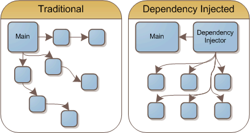

# 1. 디자인패턴 - week03

# 1. 디자인패턴 소개

디자인 패턴이란?

- 프로그램을 설계할 때 발생했던 문제점들을 객체 간의 상호 관계 등을 이용하여 해결할 수 있도록 하나의 “규약” 형태로 만들어 놓은 것

종류 3가지:

- 생성패턴
  - 객체 생성 방법이 들어간 디자인패턴
  - ex) 싱글톤, 팩토리, 추상팩토리, 빌더, 프로토타입패턴
- 구조패턴
  - 객체, 클래스 등으로 큰 구조를 만들때 유연하고 효율적으로 만드는 방법이 들어간 디자인 패턴
  - ex) 프록시, 어댑터, 브리지, 복합체, 데코레이터, 퍼사드, 플라이웨이트패턴
- 행동패턴
  - 객체나 클래스 간의 알고리즘, 책임 할당에 관한 디자인패턴
  - ex) 이터레이터, 옵저버, 전략, 책임연쇄, 커맨드, 중재자, 메멘토, 상태, 템플릿메서드, 비지터 패턴
- 이외에도 수천가지 디자인패턴이 있음
  - ex) MVC패턴, flux패턴, …

---

# 2. 라이브러리와 프레임워크 차이

- 공통
  - 공통으로 사용될 수 있는 특정한 기능들을 모듈화 한 것
- 라이브러리
  - 폴더명, 파일명 등에 대한 규칙이 없고, 프레임워크에 비해 자유로움
  - ex) 차, axios
- 프레임워크
  - 폴더명, 파일명 등에 대한 규칙이 있으며 라이브러리에 비해 좀 더 엄격함
  - ex) 비행기, Vue.js, Django

---

# 3. 싱글톤 패턴

- 하나의 클래스에 오직 하나의 인스턴스만 가지는 패턴
- 보통 데이터베이스 연결모듈에 많이 사용

장점

- 하나의 인스턴스를 기반으로 해당 인스턴스를 다른 모듈들이 공유하여 사용하기 때문에 인스턴스를 생성할 때 드는 비용이 줄어듬
- I/O 바운드 작업에 많이 사용

단점

- 의존성이 높아지기 때문에 TDD(Test Driven Development)를 할 때 어려움

---

# 4. 싱글톤 패턴을 구현하는 7가지 방법 #1

1. 단순한 메서드 호출

- 싱글톤 패턴 생성 여부를 확인하고 싱글톤이 ㅇ벗으면 새로 만들고 있다면 만들어진 인스턴스를 반환
- 단점: 멀티스레드 환경에서는 싱글톤 인스턴스를 2개 이상 만들 수 있음 → 이를 해결하기 위해 synchronized 키워드 사용

1. Synchronized

- 인스턴스를 반환하기 전까지 격리 공간에 놓기 위해 synchronized 키워드로 잠금 → 최초로 접근한 스레드가 해당 메소드 호출시에 다른 스레드가 접근 불가
- 장점: 스레드 세이프하게 만듬
- 단점: 락 걸려있을 때 여러 모듈들이 메서드를 호출하면 성능 저하가 발생함 → 이를 해결하기 위해 static 키워드 사용

1. 정적 멤버(static)

- 정적(static) 멤버나 블록은 런타임이 아니라 최초에 JVM이 클래스 로딩 때 모든 클래스들을 로드할 때 미리 인스턴스를 생성하는데 이를 이용한 방법
- 클래스 로딩과 동시에 싱글톤 인스턴스 생성
- 단점: 싱글톤 인스턴스가 필요없는 경우도 무조건 싱글톤 클래스를 호출해 인스턴스를 만들어야 하기 때문에 자원낭비

1. 정적 블록

- 앞서 정적 멤버를 사용할 때 정적(static) 블록을 사용 가

---

# 5. 싱글톤 패턴을 구현하는 7가지 방법 #2

1. 정적 멤버와 Lazy Holder(중첩 클래스) → 추천(가장 많이 쓰임)

- singleInstanceHolder라는 내부클래스를 하나 더 만듬으로써, Singleton클래스가 최초에
  로딩되더라도 함께 초기화가 되지 않고. getInstance()가 호출될 때 singleInstanceHolder
  클래스가 로딩되어 인스턴스를 생성하게

```java
class Singleton {
	private static class singleInstanceHolder {
		private static final Singleton INSTANCE = new Singleton();
	}
	public static Singleton getInstance() {
		return singleInstanceHolder.INSTANCE;
	}
}
```

1. 이중 확인 잠금(DCL)

- 인스턴스 생성 여부를 싱글톤 패턴 잠금 전에 한번, 객체를 생성하기 전에 한 번 2번 체크

```java
public class Singleton {

	private volatile Singleton instance;

	private Singleton() {
	}

	public Singleton getInstance() {
		if (instance == null) {
			synchronized (Singleton.class) {
				if (instance == null) {
					instance = new Singleton();
				}
			}
		}
		return instance;
	}

}
```

여기서 volatile 이란?

- JAVA에서는 스레드 2개가 열리면 변수를 메인 메모리(RAM)으로부터 가져오는 것이 아니라
  캐시메모리에서 각각의 캐시메모리를 기반으로 가져오게 됨
- volatile 키워드를 추가하게 되면 Main Memory를 기반으로 저장하고 읽어옴

1. ENUM → 추천(이펙티브 자바 저자 조슈아 블로크가 추천한 방법)

- enum의 인스턴스는 기본적으로 스레드세이프(thread safe)한 점이 보장되기 때문에 이를
  통해 생성할 수 있음

---

# 6. 팩토리패턴

- 팩토리패턴이란 상속 관계에 있는 두 클래스에서 상위 클래스가 중요한 뼈대를 결정하고,
  하위 클래스에서 객체 생성에 관한 구체적인 내용을 결정하는 패턴
- 상위 클래스에서는 객체 생성방식에 대해 알 필요가 없어져 유연성을 갖게 되며 객체 생성
  로직은 하위클래스에서만 관리 되기 때문에 유지보수성이 증가

---

# 7. 이터레이터패턴

- 이터레이터패턴은 이터레이터(iterator)를 사용하여 컨테이너의 요소들에 접근하는 디자인
  패턴
- 장점: 각기 다른 자료구조들을 똑같은 인터페이스로 순회를 쉽게 할 수 있음

컨테이너란?

- 동일한 요소들을 담아놓는 집합
- ex) 배열, 맵 등

---

# 8. DI와 DIP

- 의존성주입(DI, Dependency Injection)이란 메인 모듈(main mudule)이 ‘직접’ 다른 하위
  모듈에 대한 의존성을 주기보다는 중간에 의존성 주입자(dependency injector)가 이 부분을
  가로채 메인 모듈이 ‘간접’적으로 의존성을 주입하는 방식
- 장점:
  - 메인 모듈과 하위모듈간의 의존성을 조금 더 느슨하게 만들 수 있음
  - 모듈을 쉽게 교체 가능한 구조로 만듦



“의존한다”란?

- A가 B에 의존한다. = B가 변하면 A에 영향을 미치는 관계 = A - > B

```java
import java.util.*;
class B {
	public void go() {
	System.out.println("B의 go()함수");
	}
}

class A {
	public void go() {
		new B().go();
	}
}

public class main{
	public static void main(String args[]) {
		new A().go();
	}
}
// B의 go()함수
```

DI를 적용하지 않은 사례와 적용한 사례

1. 적용 하지 않은 사례


```java
import java.util.*;

class BackendDeveloper {
	public void writeJava() {
		System.out.println("자바가 좋아 인터네셔널~");
	}
}

class FrontEndDeveloper {
	public void writeJavascript() {
		System.out.println("자바스크립트가 좋아 인터네셔널~");
	}
}

public class Project {
	private final BackendDeveloper backendDeveloper;
	private final FrontEndDeveloper frontEndDeveloper;

	public Project(BackendDeveloper backendDeveloper, FrontEndDeveloper frontEndDeveloper) {
		this.backendDeveloper = backendDeveloper;
		this.frontEndDeveloper = frontEndDeveloper;
	}

	public void implement() {
		backendDeveloper.writeJava();
		frontEndDeveloper.writeJavascript();
	}

	public static void main(String args[]) {
		Project a = new Project(new BackendDeveloper(), new FrontEndDeveloper());
		a.implement();
	}
}
```

1. 적용한 사례


의존적인 화살표가 “역전" 된 것을 볼 수 있다.
DI를 하게 되면 의존관계역전원칙(Dependency Inversion Principle)이 적용 됨

```java
import java.util.*;

interface Developer {
	void develop();
}

class BackendDeveloper implements Developer {
	@Override
	public void develop() {
		writeJava();
	}
	public void writeJava() {
		System.out.println("자바가 좋아~ 새삥새삥");
	}
}

class FrontendDeveloper implements Developer {
	@Override
	public void develop() {
		writeJavascript();
	}
	public void writeJavascript() {
		System.out.println("자바스크립트가 좋아~ 새삥새삥");
	}
}

public class Project {

	private final List<Developer> developers;

	public Project(List<Developer> developers) {
		this.developers = developers;
	}

	public void implement() {
		developers.forEach(Developer::develop);
	}

	public static void main(String args[]) {
		List<Developer> dev = new ArrayList<>();
		dev.add(new BackendDeveloper());
		dev.add(new FrontendDeveloper());
		Project a = new Project(dev);
		a.implement();
	}
}

```

의존성 주입 장점:

- 외부에서 모듈을 생성하여 dev.add(new BackendDeveloper()) 이런식으로 집어넣는
  구조가 되기 때문에 모듈들을 쉽게 교체할 수 있는 구조가 됨
- 단위 테스팅과 마이그레이션이 쉬워짐
- 애플리케이션 의존성 방향이 좀 더 일관되어 코드를 추론하기가 쉬워짐

의존성 주입 단점:

- 결국에는 모듈이 더 생기게 되므로 복잡도가 증가
- 종속성 주입자체가 컴파일을 할 때가 아닌 런타임 때 일어나기 때문에 컴파일을 할
  때 종속성 주입에 관한 에러를 잡기가 어려워짐

---

# 9. 전략패턴

- 전략패턴이란 전략이라고 부르는 '캡슐화한 알고리즘'을 컨텍스트 안에서 바꿔주면서 상호
  교체가 가능하게 만드는 디자인 패턴

---

# 10. 옵저버 패턴

- 옵저버패턴이란 주체가 어떤 객체(subject)의 상태 변화를 관찰하다가 상태 변화가 있을
  때마다 메서드 등을 통해 옵저버 목록에 있는 옵저버들에게 변화를 알려 주는 디자인
  패턴
- ex) 트위터의 메인 로직, 그리고 MVC패턴에도 적용

---

# 11. 프록시 패턴

- 프록시패턴이란 객체가 어떤 대상 객체에 접근하기 전, 그 접근에 대한 흐름을 가로채서 해당
  접근을 필터링하거나 수정하는 등의 역할을 하는 계층이 있는 디자인패턴


보통은 서비스 앞단에 프록시 서버로 cloudflare를 둬서 불필요한, 또는 공격적인 트래픽을
막는다


---

# 12. MVC패턴과 MVP패턴 그리고 MVVM패턴

## MVC 패턴

- 모델(Model), 뷰(View), 컨트롤러(Controller)로 이루어진 디자인 패턴


모델

- 애플리케이션의 데이터인 데이터베이스, 상수, 변수 등을 의미
- 뷰에서 데이터를 생성하거나 수정할 때 컨트롤러를 통해 모델이 생성 또는 업데이트 됨
- ex) 사용자가 네모박스에 글자를 적을 때 모델은 네모박스의 크기정보, 글자내용, 글자의 위치, 글자의 포맷 정보 등이 된

뷰

- inputbox, checkbox, textarea 등 사용자 인터페이스 요소를 나타냄
- 모델을 기반으로 사용자가 볼 수 있는 화면을 뜻함
- 모델이 가지고 있는 정보를 따로 저장하지 않아야 하며 변경이 일어나면 컨트롤러에 이를 전달해야 한다

컨트롤러

- 하나 이상의 모델과 하나 이상의 뷰를 잇는 다리 역할
- 이벤트 등 메인 로직을 담당
- 또한, 모델과 뷰의 생명주기도 관리하며, 모델이나 뷰의 변경 통지를 받으면 이를 해석하여 각각의 구성 요소에 해당 내용에 대해 알려준다

MVC패턴의 장단점

- 장점
  - 애플리케이션의 구성 요소를 세 가지 역할로 구분하여 개발 프로세스에서 각각의
    구성 요소에만 집중해서 개발할 수 있다
  - 재사용성과 확장성이 용이하다는 장점이 있다
- 단점
  - 애플리케이션이 복잡해질수록 모델과 뷰의 관계가 복잡진다

## MVP 패턴

- C가 P(프레젠터, presenter) 로 교체된 패턴. V와 P는 1:1 관계이므로 MVC보다 더 강한
  결합을 지닌 디자인 패턴


## MVVM 패턴

- MVC의 C가 VM(뷰모델, view model)로 바뀐 패턴
- VM은 뷰를 추상화한 계층이며 VM : V = 1 : N 이라는 관계를 가


---

# 13. Spring의 MVC패턴 적용사례

---

# 14. flux패턴

- flux패턴은 단방향으로 데이터 흐름을 관리하는 디자인패턴

구조


- Action
  - 사용자의 이벤트를 담당
  - 마우스 클릭이나, 글을 쓴다던가 등을 의미하며 해당 이벤트에 관한 객체를 만들어내 dispatcher에게 전달
- Dispatcher
  - Dispatcher는 들어오는 Action 객체 정보를 기반 어떠한 “행위”를 할 것인가를 결정
  - 보통 action객체의 type를 기반으로 미리 만들어 놓은 로직을 수행하고 이를 Store에
    전달
- Store
  - 스토어는 애플리케이션 상태를 관리하고 저장하는 계층
  - 도메인의 상태, 사용자의 인터페이스 등의 상태를 모두 저장
- view
  - 데이터를 기반으로 표출이 되는 사용자 인터페이스

장점:

- 데이터 일관성의 증대
- 버그를 찾기가 쉬워짐.
- 단위테스팅이 쉬워짐.

---

# 15. 전략패턴과 의존성주입의 차이

공통점

- 전략패턴, 의존성주입 모두 무언가를 쉽게 교체하기 위한 디자인패턴

차이점

- 전략패턴: 어떠한 동일한 행동 계약을 기반으로 다양한 구현이 명시되어있는
  인터페이스를 만드는 것을 포함
- 의존성주입 : 단지 일부 동작을 구현하고 의존성을 주입하기만 하는 패턴

---

# 16. 컨텍스트란?
