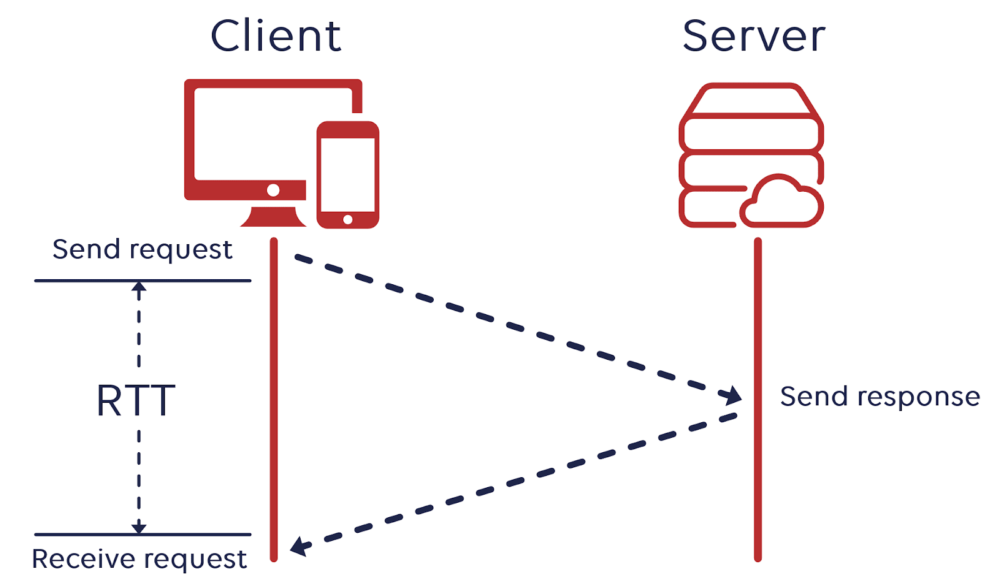

# 2. 네트워크 - week04

## 💡네트워크 기초 #1. 네트워크, 처리량, 트래픽, 대역폭, RTT

### 네트워크

- 노드(node)와 링크(link)가 서로 연결되어 있으며 리소스를 공유하는 집합
  - 노드: 서버, 라우터, 스위치 등 네트워크 장치
  - 링크(엣지): 유선 또는 무선과 같은 연결매체(와이파이나 LAN)

### 트래픽

- 특정시점에 링크 내의 “흐르는” 데이터의 양
  - 트래픽이 많아졌다 → 흐르는 데이터가 많아졌다
  - 처리량이 많아졌다 → 처리되는 트래픽이 많아졌다

### 처리량(throughput)

- 링크 내에서 성공적으로 전달된 데이터의 양을 뜻함
- 단위: bps(bits per second) 초당 전송 또는 수신되는 비트 수
- 처리량은 사용자들이 많이 접속할 때 마다 커지는 트래픽, 네트워크 장치 간의 대역폭, 네트워크 중간에 발생하는 에러, 장치의 하드웨어 스펙에 영향을 받는다

### 대역폭(bandwidth)

- 주어진 시간 동안 네트워크 연결을 통해 흐를 수 있는 최대 비트 수, 최대로 처리할 수 있는 트래픽
- 단위: bps

### RTT(Round Trip Time)

- 왕복 지연 시간
- 신호를 전송하고 해당 신호의 수신 확인에 걸린 시간을 더한 값
- 어떤 메시지가 두 장치 사이를 왕복하는데 걸린 시간

---

## 💡네트워크 기초 #2. 네트워크 토폴로지: 버스, 스타, 트리

### 네트워크 토폴로지

- 토폴로지(topology): 컴퓨터 네트워크의 요소들(링크, 노드 등)을 물리적으로 연결해 놓은 것, 또는 그 연결 방식
- 종류: 버스, 스타, 트리 등등

### 버스 토폴로지

특징

- 하나의 회선에 여러개의 노드
- 노드 추가, 삭제 쉬움
- 설치 비용 적음

장점

- 소규모 네트워크를 구축하기 매우 쉬움
- 한 노드에 장애가 발생해도 다른 노드에 영항 X

단점

- 메인 링크에 많은 트래픽이 생기면 정체현상 발생가능성 높음(패킷 손실율 높음)
- 메인 링크 망가지면 큰 문제

### 스타 토폴로지

특징

- 중앙에 있는 노드를 기반으로 연결된 형태
- 노드 추가, 삭제 쉬움

장점

- 중앙 노드가 아닌 한 노드에 장애가 발생해도 다른 노드에 영향 X
- 안정성이 높음
  - 중앙 노드가 아닌 한 노드에 침해가 발생했을 때 다른 노드로 확장하기가 어렵기 때문 → 다른 노드로 가려면 중앙 노드를 무조건 거쳐야 하고 보통의 스타 토폴로지는 중앙노드의 방화벽 등을 더욱 깐깐하게 해놓음
- 한 링크에 문제가 생겨도 해당 부분만 영향을 받고 나머지 부분은 정상적으로 작동

단점

- 중앙 노드 에러시 큰 문제

### 트리 토폴로지

특징

- 트리형태(=계층적 토폴로지)
- 노드 추가, 삭제 보통(리프 노드를 기반으로 확장은 용이하지만 다른 노드는 어려움)
- 버스 토폴로지와 스타 토폴로지의 하이브리드 형태

장점

- 노드 확장이 용이(주로 리프노드로 확장)
- 리프 노드의 에러는 나머지 부분에 영향 X

단점

- 특정 노드 트래픽 집중 시 하위 노드에 영향
- 루트 노드에 문제가 생기면 전체 네트워크에 큰 문제
- ex) 백본 케이블: 여러 소형 네트워크들을 묶어 대규모 파이프라인을 통해 극도로 높은 대역폭으로 다른 네트워크들의 집합과 연결되는 네트워크(대규모 패킷 통신망)

---

## 💡네트워크 기초 #3. 네트워크 토폴로지: 링, 메시

### 링 토폴로지

특징

- 고리형태
- 노드 추가, 삭제 쉬움

장점

- 노드 수가 많아져도 데이터 손실 X
- 토큰을 기반으로 연속적으로 노드를 거치며 통신권한 여부를 따지고 해당 권한이 없는 노드는 데이터를 전달받지 않음

단점

- 링크 또는 노드가 하나만 에러 발생해도 전체 네트워크에 영향
- 토큰이 없는 노드는 통신에 참여를 못하며 데이터 공유가 안됨

### 메시 토폴로지

특징

- 그물망 형태
- 노드 추가, 삭제 어려움
- 풀(full) 메시 토폴로지의 경우 n\*(n-1) / 2 의 회선이 필요

장점

- 안정성 높음 → 한 노드가 장애가 나도 다른 노드에 영향 X
- 트래픽 분산 가능

단점

- 회선이 비효율적으로 많음 → 구축 비용 고가

---

## 💡네트워크 기초 #4. 네트워크 토폴로지의 필요성과 병목현상

### 토폴로지의 필요성

- 병목현상을 해결하는 척도가 됨
- 구축된 시스템의 토폴로지를 알고 있다면 어떠한 부분에 어떠한 회선 또는 어떠한 서버의 용량을 증가시켜야 하는지 알 수 있다

### 병목현상(bottleneck)

- 트래픽에 의해 데이터 흐름이 제한되는 상황을 뜻함
- 핫스팟이라고도 함

---

## 💡네트워크 기초 #5. 유니캐스트, 멀티캐스트, 브로드캐스트

### 유니캐스트

- 1:1 통신
- ex) HTTP통신
- 가장 일반적인 네트워크 전송 형태

### 멀티캐스트

- 1:N 통신
- 연결된 모든 노드들에게 데이터 전달하는게 아니라 특정 그룹에게만 데이터 전달

### 브로드캐스트

- 1:N 통신
- 그룹이 아닌 연결되어 있는 모든 노드에게 데이터 전달
- ex) ARP

---

## 💡네트워크의 분류: LAN, MAN, WAN

### LAN

- local area network, 근거리 통신망
- MAN, WAN보다 높은 안정성, 속도
- 소규모 네트워크(집, 사무실) → 보통 허브나 스위치로 연결된 네트워크
- 하나의 논리적 주소인 IP를 기반으로 여러개의 물리적 주소인 MAC 주소로 구별하는 네트워크라고도 볼 수 있음

### MAN

- metropolitan area network, 대도시 통신망
- 도시와 도시의 통신망을 뜻하며 2개 이상의 LAN이 연결되어 구성
- 라우터, 브리지 등으로 연결

### WAN

- wide area network, 광역 통신망
- 국가와 국가와의 통신망 → 인터넷
- 수많은 라우터를 구쳐 다른 국가와도 연결되는 범위

---

## 💡TCP/IP 4계층 #1. 개념, 캡슐화, 비캡슐화, PDU, OSI 7계층

### TCP/IP 4계층

- 장치들이 인터넷 상에서 데이터를 주고받을 때 쓰는 독립적인 프로토콜의 집합
- TCP: Transmission Control Protocol
- IP: Internet Protocol
- 인터넷을 통해 데이터를 보낼 때 주로 TCP와 IP를 이용해서 보내기 때문에 이런 이름임
- 애플리케이션 계층 - 전송 계층 - 인터넷 계층 - 링크 계층(네트워크 계층)

### 애플리케이션 계층(application)

- HTTP, SMTP, SSH, FTP가 대표적
- 웹 서비스, 이메일 등 서비스를 실질적으로 사람들에게 제공하는 층

### 전송 계층(transport)

- TCP, UDP가 대표적이
- 애플리케이션 계층에서 받은 메시지를 기반으로 세그먼트 또는 데이터그램으로 데이터를 쪼개고 데이터가 오류없이 순서대로 전달되도록 도움을 주는 층

### 인터넷 계층(network)

- IP, ICMP, ARP가 대표적
- 한 노드에서 다른 노드로 전송 계층에서 받은 세그먼트 또는 데이터그램을 패킷화 하여 목적지로 전송하는 역할을 담당

### 링크 계층(link)

- 전선, 광섬유, 무선 등으로 데이터가 네트워크를 통해 물리적으로 전송되는 방식을 정의
- OSI 7계층에서 데이터 링크 계층과 물리 계층을 합친 계층

### 캡슐화

- 송신자가 수신자에게 데이터를 보낼 때 데이터가 각 계층을 지나며 각 계층의 특징들이 담긴 헤더들이 붙여지는 과정
- ex) 전송계층은 TCP 헤더, 네트워크 계층은 IP 주소 헤더를 추가하는 것

### 비캡슐화

- 캡슐화의 역과정
- 수신자측에서 캡슐화된 데이터를 역순으로 제거하면서 응용계층까지 도달하는 것

### PDU

- protocol data unit
- TCP/IP 4계층을 기반으로 설명했을 때 각 계층의 데이터의 단위
  - 애플리케이션 계층: 메시지
  - 전송 계층: 세그먼트(TCP), 데이터그램(UDP)
  - 인터넷 계층: 패킷
  - 링크 계층: 프레임(데이터 링크 계층), 비트(물리 계층)
- 참고
  - 세그먼트: 적절한 크기로 쪼갠 조각(세그먼트와 데이터그램의 의미는 동일)
  - 패킷: 세그먼트에 SP와 DP가 포함된 IP 헤더가 붙은 형태의 조각
  - 프레임: MAC 주소 헤더와 CRC/체크섬 트레일러가 붙은 조각
  - IPv4 기준 → SP: 송신자의 32비트 IP 주소, DP: 수신자의 32비트 IP 주

### CRC/체크섬 트레일러

- 데이터의 오류감지를 위한 수학적 함수가 적용된 값들이 있는 필드
- 링크의 오류(과도한 트래픽 등)로 인해 데이터 손상을 감지하는 역할
- 이 과정에서 CRC와 체크섬 두 가지의 과정을 기반으로 데이터 전송오류 및 데이터 무결성을 방지
- CRC
  - CRC-1, CRC-16 등의 알고리즘으로 나온 값을 통해 데이터 전송 오류 감지를 수행
- 체크섬
  - MD5, SHA-256 등의 알고리즘으로 나온 값을 통해 데이터 무결성을 방지

### OSI 7계층

---

## 💡TCP/IP 4계층 #2. MTU와 MSS와 PMTUD

### MTU

- Maximum Transmission Unit
- 네트워크에 연결된 장치가 받아들일 수 있는 최대 데이터 패킷의 크기
- 이 크기 기준으로 데이터는 쪼개져서 패킷화 됨
- 네트워크 경로 상에 있는 아무 장치나 MTU보다 패킷이 크면 그 패킷은 분할될 수도 있다

### 패킷이 분할되지 않는 경우

- 패킷을 분할할 수 없어 네트워크 경로 상에 있는 어떠한 라우터나 장치의 MTU를 초과할 때 분할해서 전달하는 것이 아니라 아예 전달 하지 않을 수 있음
- IPv6
  - 분할을 허용 X
- IPv4
  
  - IPv4 헤더에는 flags라는 필드가 있음
  - 이 bit가 1이 되면 “Don’t Fragment” 플래그가 활성화
  - 플래그가 활성화되면 분할 불가능

### MTU와 MSS

- MSS - Maximum Segment Size
- MTU는 IP헤더와 TCP헤더의 크기까지만 합치지만 MSS는 데이터의 크기(payload의 크기)만을 가리킨다

### PMTUD

- Path MTU Discovery
- 수신자와 송신자의 경로 상에서 장치가 패킷을 누락한 경우 테스크 패킷의 크기를 낮추면서 MTU에 맞게끔 반복해서 보내는 과정

---

## 💡TCP/IP 4계층 #3. 애플리케이션 계층(application)

### HTTP

- Hypertext Transfer Protocol
- 처음에는 서버와 브라우저 간에 데이터를 주고 받기 위해 설계된 프로토콜
- 지금은 브라우저 뿐만 아니라 서버와 서버 간의 통신할 때도 많이 사용
- 특징
  - 헤더를 통한 확장이 쉽다
    - 헤더값에다가 어떠한 값을 넣어서 HTTP요청을 할 때 쉽게 다른 값을 추가할 수 있다
    
  - stateless(무상태)하다
    - 동일한 연결에서 연속적으로 수행되는 두 요청 사이에 연속적인 상태값은 없다
    

### SSH

- Secure SHhell Protocol
- 보안되지 않은 네트워크에서 네트워크 서비스를 안전하게 운영하기 위한 암호화 네트워크 프로토콜

### FTP

- File Transfer Protocol
- 노드와 노드간의 파일을 전송하는데 사용되는 프로토콜
- 지금은 파일을 암호화해서 전송하는 FTPS 또는 SFTP로 대체

### SMTP

- Simple Mail Transfer Protocol
- 인터넷을 통해 메일을 보낼 때 사용되는 프로토콜

---

## 💡TCP/IP 4계층 #4. 전송 계층(transport)

### TCP

- 가상회선 패킷 교환방식

- 오류검사 메커니즘
  - 재전송: 시간 초과 기간이 지나면 서버는 전달되지 않은 데이터에 대해 재전송을 시도
  - 체크섬: 체크섬을 통해 무결성을 평가, 송신된 데이터의 체크섬과 수신된 데이터의 체크섬 값을 비교해서 올바르게 왔는지를 확인
  
- 헤더
  
  - 20 ~ 60 바이트로 가변적

### UDP

- 데이터그램 패킷 교환방식
  
- 오류검사
  - 단순한 체크섬만 지원
- 헤더
  - 8바이트로 고정길이
  

|                                                                  | TCP                            | UDP                    |
| ---------------------------------------------------------------- | ------------------------------ | ---------------------- |
| 패킷교환방식                                                     | 가상회선패킷교환방식           | 데이터그램패킷교환방식 |
| 신뢰성                                                           | O                              | X                      |
| 오류검사                                                         | 재전송, 체크섬                 | 체크섬                 |
| 패킷의 순서보장                                                  | O                              | X                      |
| 헤더 길이                                                        | (20-60)바이트 가변 길이        | 8바이트 고정 길이      |
| 연결보장                                                         | 연결을 보장 - 3웨이 핸드셰이크 |
| 연결 해제 - 4웨이 핸드셰이크                                     | 연결 보장 X                    |
| 그냥 데이터를 보내서 연결을 유지하고 해제하는데 드는 비용이 없음 |
| 브로드캐스트지원                                                 | X                              | O                      |
| 속도                                                             | 느림                           | 빠름                   |

---

## 💡TCP/IP 4계층 #5. 인터넷 계층(network)

### ICMP

- Internet Control Message Protocol
- 노드와 노드 사이에서 통신이 잘되나를 확인할 때 쓰는 프로토콜
- 데이터를 교환하는데 사용되지 않는 프로토콜
- 보통 테스팅에 사용
- IP와는 달리 TCP 또는 UDP 와 같은 전송
  계층 프로토콜과 연관되지 않고 독립적인 비연결형 프로토콜로 . 이것은 ICMP를 비연결형
  프로토콜을 기반으로 구축된다

---

## 💡TCP의 연결성립: 3-웨이 핸드셰이크

- SYN: 클라이언트는 서버에 클라이언트의 ISN을 담아 SYN을 보냄
- SYN + ACK: 서버는 클라이언트의 SYN을 수신하고 서버의 ISN을 보내며 승인번호로 클라이언트의 ISN+1 을 보냄
- ACK: 클라이언트는 서버의 ISN+1한 값인 승인번호를 담아 ACK를 서버에 보냄
  

---

## 💡TCP의 연결해제: 4-웨이 핸드셰이크와 TIME_WAIT

### TCP의 연결해제 4단계

1. 클라이언트가 연결을 닫으려고 할 때 FIN으로 설정된 세그먼트를 보냄. 그리고 클라이언트는 FIN_WAIT_1 상태로 들어가고 서버의 응답을 기다림
2. 서버는 클라이언트로 ACK라는 승인 세그먼트를 보내고 CLOSE_WAIT 상태에
   들어감. 클라이언트가 세그먼트를 받으면 FIN_WAIT_2 상태에 들어감
3. 서버는 LAST_ACK상태가 되며 일정 시간 이후에 클라이언트에 FIN이라는
   세그먼트를 보냄
4. 클라이언트는 TIME_WAIT 상태가 되고 다시 서버로 ACK를 보내서 서버는 CLOSED
   상태가 되며 이후 클라이언트는 어느 정도의 시간(TIME_WAIT으로 설정된 시간)을
   대기한 후 연결이 닫힘

### TIME_WAIT

- 지연 패킷 등이 발생했을 때 데이터 무결성을 해결하기 위해 패킷을 기다리는
  시간. 2 \* MSL동안 기다립니다.
