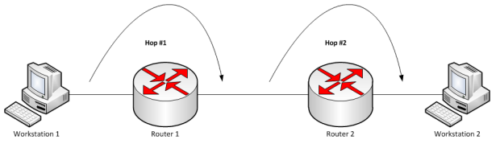

# 2. 네트워크 - week05

## 💡라우팅 #1. 개념과 라우터

### 라우팅(routing)

- 네트워크에서 데이터(패킷)를 보낼 때 최적의 경로를 선택하는 과정(초당 수백만번 수행)

### 라우터(router)

- 라우팅을 수행하는 네트워크 장치
- 라우팅 테이블을 기반으로 데이터를 다음 목적지에 전달
- OSI 7계층에서 네트워크 계층(L3)에 속해서 L3 스위치라고도 불림

---

## 💡라우팅 테이블

### 정의

- IP 주소를 기반으로 라우터의 위치를 저장한 테이블(데이터베이스)

### 구성요소

| Network Destination | Netmask       | Gateway  | Interface | Metric |
| ------------------- | ------------- | -------- | --------- | ------ |
| 101.25.67.0         | 255.255.255.0 | 10.0.0.2 | eth3      | 1      |

- 네트워크 대상(Network Destination)
  - 목적지 네트워크의 IP 주소
- 서브넷 마스크(Netmask)
  - 대상 주소를 설명할 때 쓰이는 값
- 게이트웨이(Gateway)
  - 이 장치와 연결되어있는 홉, 패킷이 전달되는 다음 IP주소(외부 네트워크와 연결된 장치) 만약 목적지가 로컬 네트워크라면 “연결됨(connected)”라고 표기 되며 다른 네트워크라면 해당 네트워크의 게이트웨이를 가리킴
  - 프로토콜 변환기라고도 하며 네트워크와 네트워크를 잇는 장치(라우터와 기능자체가 비슷)
- 인터페이스(Interface)
  - 게이트웨이로 가기위해 거치는 장치 / 10.0.0.2는 eth3을 통해 접근이 가능.
- 메트릭(Metric)
  - 우선순위라고도 불리며 패킷 전송을 위해 최적의 경로가 선택되도록 참고되는 값. 동일한 라우팅테이블 요소가 2개 있을 때 이 값이 낮은 요소가 선택됨. 메트릭은 일반적으로 홉 수(hop count)가 들어가며 지연시간, 처리량 등이 들어갈 수 있음
  - 홉
    - 네트워크에서 출발지와 목적지 사이에 위치한 장치
    - 홉 카운트(hop count)는 데이터가 출발지와 목적지 사이에서 통과해야 하는 홉의 개수
    - 라우팅을 홉바이홉통신이라고도 함
    

---

## 💡IP주소, MAC주소, ARP, RARP

### IP주소

- Internet Protocol address는 논리적 주소이며 컴퓨터 네트워크에서 장치들이 서로를 인식하고 통신 하기 위해서 사용하는 특수한 번호
- 사실상 IP 기반 통신은 그 밑에 물리적 주소인 MAC 주소를 통해 통신

### MAC주소

- Media Access Control Address는 네트워크 인터페이스에 할당된 고유 식별자
- 보통 장치의 NIC에 할당
- NIC
  - network interface card
  - LAN카드
- 48비트로 이루어져있으며 24비트의 OUI와 24비트의 UAA로 이루어짐
  - OUI: IEEE에서 할당한 제조사 코드
  - UAA: 제조사에서 구별되는 코드

### ARP

- MAC주소는 ARP를 통해 파악이 가능
- Address Resolution Protocol로써 IP주소를 MAC 주소와 매칭 시키기 위한 프로토콜
- 과정
  - 해당 IP주소에 맞는 MAC주소를 찾기 위해 해당 데이터를 “브로드캐스팅”을 통해 연결된 네트워크에 있는 장치한테 모두 보냄
  - 맞는 장치가 있다면 해당 장치는 보낸 장치에게 유니캐스트로 데이터를 전달해 주소를 찾게 됨

### RARP

- ARP의 반대로 물리적 주소인 MAC 주소를 논리적 주소인 IP 주소로 변환
- Reverse Address Resolution Protocol

---

## 💡IP주소체계 #1: 이진수 이해하기

### 이진수의 표현

- 100101b (b를 덧붙임(b는 binary의 약자))(binary = 이진)
- 100101(2) ((2)를 덧붙임, 주로 수학에서 쓰임)
- 0b100101 (앞에 0b를 덧붙임)

---

## 💡IP주소체계 #2: IPv4와 IPv6

### IPv4

- 32비트(41억 9천만)로 표현되는 주소체계
- 8비트 단위로 점을 찍어 4개로 구분해서 표현 → 8비트를 10진수로 표현
- ex) 172.16.254.1
- 단점
  - 32비트만으로는 부족
  - 그래서 NAT, 서브네팅 등의 부수적인 기술이 생김

### IPv6

- 128비트로 표현되는 주소체계
- NAT, 서브네팅이 필요하지 않음
- 16비트씩 8개로 구분하고 16비트 단위로 콜론(:)으로 구분하여 표현 → 16비트를 16진수로 표현(연속되는 0은 생략 가능)

  

- 앞의 64비트는 네트워크 주소를 말하고, 뒤의 64비트는 인터페이스 주소로 이루어짐

  

- IPSec이 내장됨
  - 데이터 패킷을 암호화 하는 보안 네트워크 프로토콜 제품군

### IPv4 vs IPv6

- 단순해진 헤더 포맷
  - IPv4 헤더의 불필요한 필드를 제거하여 보다 빠른 처리 가능
- IPv4는 체크섬이 있고, IPv6는 체크섬이 없다
  - IPv4는 CRC를 통한 손상된 패킷을 확인하고 폐기하는데 쓰는 체크섬 필드가 있음
  - IPv6는 상위 프로토콜인 TCP와 UDP에 체크섬 필드가 있기 때문에 헤더의 효율화를 위해 버전이 업그레이드 되면서 사라짐
  
- IPv6는 IPv4보다 많은 주소를 표현할 수 있고 불필요한 헤더가 삭제되어서 빠름. 또한 IPSec이라는 네트워크 보안제품군이 포함되어있기 때문에 보안적인 측면에서도 좋다. 따라서 IPv6가 IPv4보다 속도가 더 빠르지만 일부 사용사례에서는 속도가 느린 경우도 있다.

---

## 💡IP주소체계 #3: 클래스풀(Classful IP Addressing)

- IPv4 기반으로 IP 주소는 네트워크주소-호스트주소 두 부분으로 나뉨
- 네트워크 주소는 호스트들을 모은 네트워크를 지칭
- 네트워크 주소가 동일 = 로컬 네트워크
- 호스트 주소: 호스트를 구분하기 위한 주소
- 네트워크 호스트(network host)는 컴퓨터 네트워크에 연결된 컴퓨터나 기타 장치

### 정의

- 네트워크 주소를 매기고 그에 따라 네트워크의 크기를 다르게 구분하여 클래스를 할당하는 주소체계
- 구분하는 기준자(1, 2, 3옥텟)을 서브넷마스크라고 함
- IP주소체계는 처음에는 A, B, C, D, E 다섯 개의 클래스로 구분하는 클래스 기반 할당 방식(classful network addressing)을 썼음
- 앞에 부분을 네트워크 주소, 뒤에 부분을 컴퓨터에 부여하는 호스트 주소로 사용
- 클래스 A, B, C는 일대일 통신으로 사용, 클래스 D는 멀티캐스트 통신, 클래스 E는 앞으로 사용할 예비용

### 클래스 A

- 2^24 – 2 = 한 네트워크당 16,777,214 호스트 ID(약 1600만개) / 0
- 네트워크 주소 범위 : 1 ~ 126 로 시작 / 원래는 127.255.255.255까지 포함하지만
  127.X는 루프백 주소이기 때문에 포함 x / 0.0.0.0 도 특수주소로 포함 x(알 수 없는
  대상에 달아 놓는 임시 주소)

### 클래스 B

- 2^16 – 2 = 한 네트워크당 65534 호스트 ID(6만 5천개) / 10
- 네트워크 주소 범위 : 128 ~ 191 로 시작

### 클래스 C

- 2^8 – 2 = 한 네트워크당 254 호스트 ID / 110
- 네트워크 주소 범위 : 192 ~ 223 로 시작

### 문제점

- 사용하는 주소보다 버리는 주소가 많음
  → 해결하기 위해 DHCP, IPv6, NAT가 나옴

---

## 💡IP주소체계 #4: 클래스리스와 서브넷마스크, 서브네팅

### 클래스리스

- 클래스풀의 단점을 해결하기 위해 나옴
- 클래스로 나누는 것이 아닌 서브넷마스크를 중심으로 어디까지가 네트워크 주소고 어디까지가 호스트 주소인지 나눔
- **현대 주소체계는 클래스리스**를 사용

### 서브넷마스크, 서브네팅, 서브넷

- 서브네팅 : 네트워크를 나눈다는 의미
- 서브넷 : 서브네트워크, 쪼개진 네트워크
- 서브넷마스크 : 서브네트워크를 위한 비트마스크

---

## 💡IP주소체계 #5: 공인IP(public IP)와 사설IP(private IP)와 NAT

### 공인IP와 사설IP의 등장배경

- IP주소의 부족으로 공인IP(public IP)와 사설(private IP)로 나누고 중간에 NAT 기술을 통해 해결

### NAT

- Network Address Translation는 패킷이 트래픽 라우팅 장치를 통해 전송되는 동안 패킷의 IP주소를 변경, IP 주소를 다른 IP 주소로 매핑하는 방법
