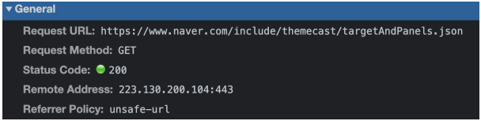

# 2. 네트워크 - week06

## HTTP 헤더(header)

- 사용자는 HTTP 요청을 할 때 header와 body를 주고 받는다
- header는 바디를 설명하는 정보를 포함해서 여러가지 정보가 담긴 정보 묶음이고, body는 본문, 즉 서버에서 보내고자 하는 컨텐츠 본문인 JSON, html, image등이 담김
- 헤더는 콜론(”:”)으로 서로 구분되는 key-value 형태로 설정
- **종류**
  - 일반헤더
    - 요청한 URL, 요청 메소드, 해당 자원을 요청할 때 해당 자원의 출처를 나타내는 URL을 노출시킬지 말지를 정하는 보안정도가 설정되어있는 Referrer Policy 등이 들어감
    
  - 요청헤더
    - 클라이언트에서 설정한 또는 자동으로 설정되는 헤더
    - 메소드, 클라이언트의 OS, 브라우저 정보 등이 담김
    
  - 응답헤더
    - 서버에서 설정하는 또는 자동으로 설정되는 헤더
    - 서버의 소프트웨어 정보 등이 담김
    - 하지만 대부분의 서버는 해킹의 위험을 대비해 서버 정보를 숨김
    

## HTTP 1.0, HTTP 1.1, HTTP 2, HTTP 3

### HTTP/1.0

- 수명이 짧은 연결
- HTTP 요청은 자체 요청에서 완료 됨
- 각 HTTP 요청당 TCP 핸드셰이크가 발생되며 기본적으로 한 연결당 하나의 요청을 처리하도록 설계되어 있음
- 한번 연결할 때마다 TCP 연결을 해야 함 → RTT가 늘어나는 문제점

### HTTP/1.1

- HTTP/1.0의 문제점을 해결하기 위해 나옴
- 크게 3가지 차이점이 있음
  1. keep-alive defalut
     - 데이터를 요청할 때마다 TCP 연결을 하는게 아니라 한번 해놓고 계속해서 데이터를 받을 수 있게 만듬
  2. 호스트 헤더
     - HTTP 1.0은 서버가 하나의 호스트만 가진다고 가정했기 때문에 헤더에 호스트를 포함하지 않았음 → 따라서 하나의 IP에 하나의 호스트만 가짐
     - 하지만 사실 서버는 여러개의 호스트를 가짐 → HTTP 1.1은 특정 호스트를 포함할 수 있게 변경되어서 항상 호스트를 포함해서 요청해야 함
  3. 대역폭 최적화
     - HTTP 1.0은 데이터를 다운로드 받다가 연결이 끊기면 다시 받는게 불가능 했지만 HTTP 1.1은 가능
- 하지만 RTT는 계속 증가 → 이를 해결하기 위한 여러가지 기술들(이미지스프라이트, 코드압축, Base64 인코딩)
  - 이미지 스프라이트
    - 수많은 이미지를 하나의 이미지로 만들어 하나의 이미지만 다운받아놓고 이를 통해 수많은 이미지를 다운받는 듯한 효과를 나타냄
    
  - 코드압축
    - 코드를 압축해서 서빙
  - 이미지 Base64 인코딩
    - 이미지 파일을 64짅법으로 이루어진 문자열로 인코딩
    - 단점: 파일 크기가 37퍼센트 커짐
- 문제점
  - HOL
    - Head of Line Blocking
    - 네트워크에서 같은 큐에 있는 패킷이 그 첫번째 패킷에 의해 지연될 때 발생하는 성능저하현상

### HTTP 2

- 등장 배경
  - 2009년 구글은 HTTP 1.1의 한계를 극복하기 위해 SPDY 프로토콜 개발
  - 2015년 SPDY를 기반으로 하는 HTTP 2 프로토콜을 만듦
- 특징
  - 바이너리 포맷 계층
    - 애플리케이션 계층과 전송 계층 사이에 바이너리 포맷 계층 추가
    - HTTP 1.0은 일반 텍스트 메시지를 전송하고 줄바꿈으로 데이터를 나눴다면, HTTP 2.0은 0과 1로 이루어진 바이너리 데이터로 변경 → 더 작은 메세지가 프레임으로 캡슐화 되어서 전송
      
  - 멀티플렉싱
    - 단일 TCP연결의 여러 스트림에서 여러 HTTP 요청과 응답을 비동기적으로 보낼 수 있음 → HOL 해결
  - 서버푸시
    - 서버가 리소스를 클라이언트에 푸시 가능
    - 요청된 html파일과 함께 다른 개체를 별도로 보낼 수 있다
    - ex) 요청한 html에 css가 포함되어있다면 별도 요청없이 css를 같이 보낼 수 있음
    
  - 헤더압축
    - 헤더를 허프만 인코딩 압축 방법 등으로 압축
  - 우선순위
    - 서버에서 원하는 순서대로 우선순위를 정해 리소스를 전달

### HTTP 3

- QUIC(Quick UDP Internet Connections)라는 계층 위에서 돌아가며 TCP가 아닌 UDP 기반으로 돌아감
- 전송된 패킷이 손실 되었다면 수신측에서 에러를 검출하고 수정하는 방식
- 네트워크 환경이 열악해도 낮은 패킷손실률을 자랑하는 손방향 오류 수정 메커니즘(FEC, Forward Error Correction)의 특징을 가짐

## HTTPS와 TLS

HTTPS → HTTP+TLS: 이렇게 해서 암호화된 통신이 가능

### 암호화

- 정의
  - 승인된 당사자만 정보를 이해할 수 있도록 데이터를 “스크램블”한 방법
  - 이를 복호화하려면 송신자와 수신자가 서로 동의한 “키”가 필요
- 종류
  - 스크램블
    - 각 단어나 문자를 패턴에 따라 암호화하는 것이 아니라 무작위 방식으로 개별 데이터 비트를 섞는 것
      
  - 대칭 암호화
  - 비대칭 암호화
- 필요성
  - 의도된 수신자 또는 송신자를 제외하고는 통신을 하이재킹하여 읽을 수 없게 함
  - 이를 통해 민감한 데이터의 유출을 방지하고 데이터 무결성을 보장

### TLS

- SSL(Secure Socket Layer) 1.0부터 시작해서 2.0, → 3.0 → TLS(TransprtLayer Security Protocol) 1.0 → TLS 1.3까지 버전이 올라가서 TLS로 명칭 변경
- 전송 계층에서 보안을 제공하는 프로토콜
- 클라이언트와 서버가 통신 할 때 TLS를 통해 제3자가 메시지를 도청하거나 변조하지 못하도록 함

## 로컬스토리지

- 정의
  - 웹 스토리지 객체로 브라우저 내에 {key: value} 형태로 **오리진**에 종속되어 저장되는 데이터(오리진이 같은 브라우저 내에서 공유 됨)
    - **오리진(origin)이란?**
      
- 특징
  - 하나의 키에 오로지 하나의 값만 저장 됨
  - 데이터는 사용자가 브라우저에서 수동으로 삭제하지 않는 한 평생 동안 로컬 저장소에 저장되며 만료 날짜가 없음 → 사용자가 창이나 탭을 닫아도, 컴퓨터를 종료해도 만료되지 않음
  - 최대 저장용량: 5MB
  - 보통 사용자의 행위를 기억할 때, 로그인을 유지하기 위한 값 등으로 사용되며 **로컬 스토리지 데이터는 자동으로 서버로 전송되지 않음**(쿠키는 자동 전송됨)
- 사용법
  - 설정: localStorage.setItem(key, value);
  - key에 해당하는 value 가져오기: localStorage.getItem(key);
  - 제거: localStorage.removeItem(key);
  - 전체제거: localStorage.clear()

## 세션스토리지

- 정의
  - 로컬 스토리지와 매우 유사
  - 웹 스토리지 객체로 브라우저 내에 {key: value} 형태로 **오리진**에 종속되어 저장되는 데이터(오리진이 같은 브라우저 내에서 공유 됨)
- 특징
  - 하나의 키에 오로지 하나의 값만 저장
  - 최대 저장용량: 5MB
  - 사용자가 브라우저에서 탭을 닫으면 데이터는 만료 됨
  - **보통 세션 스토리지는 잘 안쓰고 로컬 스토리지를 많이 씀!**
- 사용법
  - 설정: sessionStorage.setItem(key, value);
  - 탐색: sessionStorage.getItem(key);
  - 제거: sessionStorage.removeItem(key);
  - 전체 제거: sessionStorage.clear();

## 쿠키(Cookie)

- 브라우저에 저장된 데이터 조각
- 보통 서버에서 먼저 설정해서 쿠키를 만듦
- 서버에서 응답 헤더로 Set-Cookie로 설정해서 쿠키를 보내면 그때부터 클라이언트에서 요청 헤더 Cookie에 설정되어 자동으로 서버에 전달되게 되고 브라우저에도 저장되게 됨
  
- 보통 서버에서 만료기한 등을 설정 및 컨트롤
- 저장용량은 최대 4KB
- 보통 로그인, 장바구니, 사용자 커스터마이징, 사용자 행동분석(주로 개인화된 광고)에 사용

## 로컬스토리지, 세션스토리지, 쿠키의 공통점과 차이점

면접 질문 top10임

- 공통점
  - 브라우저에 캐싱을 함으로써 서버에 대한 요청을 줄여 서버부하를 방지할 수 있음
  - 캐싱으로 인해 다운로드 하는 컨텐츠가 줄어들어 웹사이트의 컨텐츠를 더 빨리 다운 가능
  - 사이트 기본 설정 커스터마이징(색상, 글꼴 크기 등)을 저장하거나 로그인 상태를 유지할 때 사용 됨
- 차이점
  |                                 | 쿠키              | 로컬 스토리지 | 세션 스토리지  |
  | ------------------------------- | ----------------- | ------------- | -------------- |
  | 최대 저장 용량                  | 4KB               | 5MB           | 5MB            |
  | 브라우저 허용                   | HTML 4 + 5        | HTML 5        | HTML 5         |
  | 접근 범위                       | 창                | 창            | 탭             |
  | 만료 기한                       | 수동으로 설정     | 영구적        | 탭 닫으면 소멸 |
  | 설정할 수 있는 주체             | 클라이언트 + 서버 | 클라이언트    | 클라이언트     |
  | 요청과 함께 서버에 자동전송유뮤 | O                 | X             | X              |
