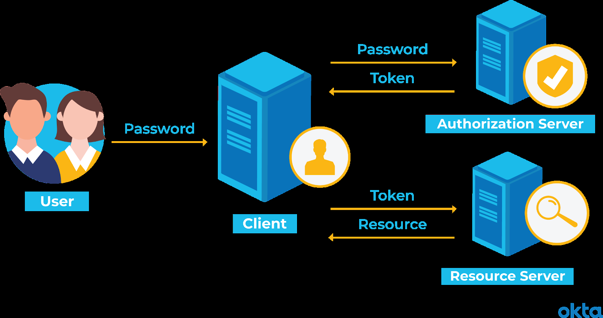

# 2. 네트워크 - week07

## 인증 방식

참고: [https://hudi.blog/session-based-auth-vs-token-based-auth/](https://hudi.blog/session-based-auth-vs-token-based-auth/)

### 들어가기전 용어 정리

### 세션 기반 인가와 토큰 기반 인가

<aside>
💡 강의에선 세션/토큰 기반 인증이랬는데… **인가**는 뭐지?

</aside>

- 인증(Authentication)
  - 쉽게 말해 로그인이다. 클라이언트가 스스로가 맞다고 검증하는 과정
  - ex) 로그인 화면에서 아이디, 패스워드를 입력해 제출했을 때, 서버에서 아이디, 패스워드가 맞는지 확인하는 것
- 인가(Authorization)
  - 인증이 완료된 사용자의 자원에 대한 접근 확인 절차를 의미
  - ex1) user1은 user2가 작성한 글을 수정하거나 제거 할 수 없음
  - ex2) user1과 user2는 관리자 페이지에 접속할 수 없음 → 관리자 페이지에 대해 인가되어 있지 않기 때문

### 세션기반 인증 vs 토큰기반 인증

1. 사이즈
   - 토큰 기반이 더 사이즈가 커서 더 많은 트래픽을 사용함
   - 세션은 쿠키 헤더에 세션ID만 실어 보내면 되지만, JWT는 사용자 인증 정보, 토큰 발급시간, 만료 시간 등등 많음
2. 안정성과 보안
   - 세션이 더 안전. 왜냐면 모든 인증 정보를 서버에서 관리하기 때문
   - 토큰은 서버가 트래킹하지 않고 클라이언트가 모든 인증 정보를 가지고 있어서 해킹되면 큰일!
   - 그럼에도 최근에는 토큰 기반 인증을 사용함 → 그 이유는 **확장성** 때문
3. 확장성
   - 보통 웹 어플리케이션의 서버 확장 방식은 수평 확장을 사용. 즉, 한대가 아닌 여러대의 서버가 요청을 처리 함 → 별도의 작업을 해주지 않으면 세션 기반 인증은 **세션 불일치 문제**를 겪음
   - 하지만 토큰 기반 인증 방식은 클라이언트가 저장하는 방식을 취해서 세션 불일치 문제로부터 자유로움 → HTTP stateless를 유지할 수 있고 높은 확장성을 가짐
4. 서버 부담
   - 세션 기반 인증 방식은 서버가 세션 데이터를 직접 관리해 서버 부담 증가
   - 토큰 기반 인증 방식은 클라이언트가 인증 데이터를 가지고 있어 서버 부담이 증가하지 X
   - 따라서 서버 부담 측면에서도 토큰 기반이 세션 기반보다 더 유리!

## 세션 기반 인증/ 토큰 기반 인증

- 세션 기반 인증 방식
  - 프로세스
    1. 로그인을 하면, 해당 인증 정보를 서버의 세션 저장소에 저장
    2. 저장된 세션 정보의 식별자인 세션ID 발
    3. 서버에서 세션ID를 쿠키로 설정해서 클라이언트에 전달
    4. 클라이언트가 서버에 요청을 보낼 때 해당 세션ID를 쿠키로 담아서 보냄
    5. 로그인을 유지
  - 단점
    - 사용자 상태에 관한 데이터를 서버에 저장하면, 로그인 중인 유저 수가 많을 때 서버의 메모리 과부하가 일어남
    - DB 중 RDBMS에 저장하면 직렬화 및 역직렬화에 관한 오버헤드가 발생
- 토큰 기반 인증 방식
  - 프로세스
    1. 인증 로직 → JWT토큰생성(access 토큰, refresh 토큰)
    2. 사용자가 이후에 access 토큰을 HTTP 헤더-Authorization 또는 HTTP 헤더-Cookie에 담아 인증이 필요한 서버에 요청해 원하는 컨텐츠를 가져옴
    
  - 장점
    - 토큰 자체에 인증에 필요한 정보가 있어서 별도의 인증 저장소가 필요 없음
    - JWT가 다른 유형의 토큰보다 경량화되어 있음
    - 디코딩했을 때 JSON이 나오기 때문에 JSON 기반으로 쉽게 직렬화, 역직렬화가 가능
  - Access 토큰과 Refresh 토큰
    - 수명: access 토큰은 짧음, refresh 토큰은 긺
    - refresh 토큰은 access토큰이 만료 되었을 때 다시 access 토큰을 얻기 위해 사용되는 토큰 → access 토큰이 만료되었을 때마다 인증에 관한 비용이 줄어듬

## HTTP 상태 코드

- 100번대(정보)
  - 서버가 요청을 잘 받았으며 해당 프로세스를 계속 이어가며 처리하는 것을 의미
- 200번대(성공)
  - 서버가 요청을 잘 받았고 이를 기반으로 클라이언트에게 성공적으로 데이터를 보낸 것을 의미
- 300번대(리다이렉션)
  - 서버가 클라이언트의 요청에 대해 완료를 위해 추가 작업 조치가 필요함
- 400번대(클라이언트 오류)
  - 클라이언트가 요청한 페이지를 제공할 수 없거나 클라이언트의 요청이 잘못되어 결과적으로 요청을 처리할 수 없음
- 500번대(서버 오류)
  - 서버가 클라이언트의 요청을 처리하지 못하는 상태

## HTTP 메소드

- GET
  - “데이터를 읽다”
  - url을 기반으로 데이터를 요구하는 방법 → 길이 제한(2000자 미만)이 있음
  - 캐싱이 가능
  - url 기반 요청이기 때문에 해당 요청의 파라미터가 브라우저 기록에 남음
  - ASCII 문자열만 보낼 수 있음
  - 사용자 이름, 비밀번호 등 민감한 정보는 전달 하지 않음
- POST
  - “데이터를 생성하다”
  - url이 아니라 HTTP message body에 데이터를 전달 → 길이 제한 X
  - 캐싱 불가능
  - url 기반 요청이 아니라서 해당 요청의 파라미터가 브라우저 기록에 남지 않음
  - ASCII 문자열 뿐만 아니라 모든 유형의 데이터를 기반을오 요청 가능
  - 사용자 이름, 비밀번호 등 민감한 정보를 전달할 때 사용
- PUT
  - “데이터 수정”
  - 업데이트 하는 데이터의 **전체**를 다시 보냄
- PATCH
  - “데이터 수정”
  - 업데이트 하는 데이터의 **일부**를 보냄
- DELETE

## 네트워크 장치

- 상위 계층을 처리하는 기기는 하위 계층을 처리할 수 있지만 그 반대는 불가
- **애플리케이션 계층**
  - L7 스위치
- **전송 계층**
  - L4 스위치
- **인터넷 계층**
  - 라우터
  - L3 스위치
- **데이터링크 계층**
  - L2 스위치
  - 브리지
- **물리 계층**
  - NIC
  - 리피터
  - AP
