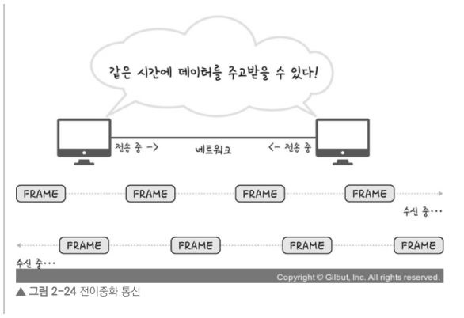

# 2. 네트워크 - week08

---

- [유선 랜](https://www.notion.so/2-week08-53f5b7d4b9654b39a3a8e5d86387cc0d?pvs=21)
- [무선 랜](https://www.notion.so/2-week08-53f5b7d4b9654b39a3a8e5d86387cc0d?pvs=21)
- [대규모 트래픽으로 인한 서버 과부하 해결 방법](https://www.notion.so/2-week08-53f5b7d4b9654b39a3a8e5d86387cc0d?pvs=21)
- [REST API](https://www.notion.so/2-week08-53f5b7d4b9654b39a3a8e5d86387cc0d?pvs=21)
- [브라우저 렌더링](https://www.notion.so/2-week08-53f5b7d4b9654b39a3a8e5d86387cc0d?pvs=21)
- [네트워크 동작 과정](https://www.notion.so/2-week08-53f5b7d4b9654b39a3a8e5d86387cc0d?pvs=21)
- [이더넷 프레임](https://www.notion.so/2-week08-53f5b7d4b9654b39a3a8e5d86387cc0d?pvs=21)

---

## 유선 랜

- 동축 케이블, 광 케이블 등을 기반으로 만들어짐
- IEEE802.3 프로토콜을 기반으로 **전이중화 통신**을 씀
  - 전이중화 통신
    - full duplex
    - 양쪽 장치가 동시에 송수신 할 수 있는 방식, 송신로와 수신로를 나눠서 데이터를 주고 받을 수 있음
    
- 종류
  - 트위스트페어케이블
    
    - STP - 실드처리 한 케이블
    - UTP - 실드처리 안한 케이블
      - 유선랜을 구출할 때 쓰는 LAN케이블은 UTP 케이블 타입
      - LAN 케이블을 꽂을 수 있는 커넥터를 RJ45 커넥터라고 함
      
  - 광섬유케이블
    
    - 레이저를 이용해 통신
    - 보통 100Gbps의 데이터를 전송
    - 빛의 굴절률이 높은 부분을 코어, 낮은 부분을 클래딩

## 무선 랜

- IEEE802.11 표준규격을 따르며 반이중화 통신을 사용
  - 반이중화 통신
    - 이전에는 유선 랜에 ‘반이중화 통신’ 중 하나인 **CSMA/CD(Carrier Sense Multiple Access with Collision Detection)** 방식을 썼음
    - 회선을 사용하는지 파악 후, 사용하지 않으면 데이터를 보내고 충돌이 발생하면 일정 시간 이후 재전송하는 방식
    
- 대표적 기술 : **WIFI**
  - 전자기기들이 무선 LAN 신호에 연결할 수 있게 하는 기술
  - 보통 유선랜은 AP 또는 공유기에 꽂아서 무선랜 신호를 만들어 구축
  - 2.4GHz vs 5GHz
    
    - 비유도 매체인 공기에 주파수를 쏴 무선 통신망을 구축

      2.4GHz

    - 장애물에 강하나 속도가 더 느림
    - 호환성 좋음(오래된 노트북, 휴대폰과도 연결가능)
    - 커버리지가 높음
    5GHz
    - 장애물이 있을 때 연결이 끊기기도 하나 속도가 더 빠름
    - 호환성이 낮음
    - 커버리지가 작음

## 대규모 트래픽으로 인한 서버 과부하 해결 방법

1. 모니터링을 통한 자원 할당
   - 자원의 한계점에 도달할때를 대비해 모니터링을 통해 자원을 적절하게 할당한다
   - ex) AWS 오토 스케일링
     - 서비스 이용불가 상태 발생 이전 cloud watch가 계속해서 모니터링하여 서버 대수를 늘려주는 방법
     - AWS 오토 스케일링은 빠르긴 하나 구성에 시간이 걸리기 때문에 앞단에 **로드 밸런서**를 통해 트래픽을 분산해야 함
     - 로드 밸런서는 한 서버에 장애가 발생하면 로드 밸런서는 트래픽을 다른 기능 서버로 리디렉션하여 시스템 중단을 방지할 수도 있음
     
   - 이점
     - 서버 과부하로 인해 서버 중지에 대한 대처를 할 수 있음
2. 서킷 브레이커
   - 서비스 장애를 감지하고 연쇄적으로 생기는 에러를 방지하는 기법
   - 서비스와 서비스 사이에 서킷브레이커 계층을 두고 미리 설정해놓은 timeout 임계값에 도달하면 서킷브레이커가 그 이후의 추가 호출에 무조건 에러를 반환
3. 컨텐츠 관리
   1. 불필요한 컨텐츠 제거

      ex) 쿼리문 수정

   2. CDN을 통한 컨텐츠 제공
   3. 컨텐츠 캐싱
   4. 컨텐츠 압축
   5. 컨텐츠의 우하한 저하(미리 준비된 응답)

## REST API

- 정의
  - RESTful한 API
  - 일련의 특징과 규칙 등을 지키는 API
- 특징
  1. Uniform-Interface
  2. Stateless
  3. Cacheable
  4. Client-Server 구조
  5. Layered System
- 규칙
  1. 동작은 HTTP 메소드로만 해야함
  2. .jpg, .png 등과 같은 확장자는 표시 X
  3. 동사가 아닌 명사로만 표기
  4. 계층적인 구조
  5. 대문자가 아닌 소문자로 쓰고, 너무 길 경우 언더바가 아닌 그냥 바(-)를 사용
  6. HTTP 응답 상태코드를 적재적소에 활용

## 브라우저 렌더링

- 브라우저의 렌더링엔진이 DOM트리, CSS 파서 등을 기반으로 렌더트리를 구축해 웹 화면을 구축
- 렌더링 순서
  1. DOM 트리와 CSSOM트리 구축
     - DOM 트리
       - html 페이지의 각 태그 요소들이 노드로 설정되어 트리 형태로 저장
       
     - CSSOM 트리
       - 각각의 DOM 트리의 노드들이 CSS 파서에 의해 CSSOM이라는 트리가 만들어짐
       - 이 과정은 DOM 트리 구축과 “동시에” 일어남
       
  2. 렌더트리와 렌더레이어 생성

     - DOM 트리와 CSSOM 트리가 합쳐져 렌더객체(Render Object) 생성 → 이것이 모여 병렬적인 **렌더트리**생성
     - 이 때 display:none이 포함된 노드는 지워지고 font-size 등 상속적인 스타일은 부모노드에만 위치하도록 설계하는 등의 최적화를 거쳐 **렌더레이어**가 완성됨
       - display:none은 렌더트리에서 삭제되지만 visibility: hidden은 요소를 보이지 않게
         하지만 요소는 여전히 레이아웃에서 공간을 차지

     

  3. 렌더레이어를 대상으로 Layout 설정

     

  4. 렌더레이어를 대상으로 칠하기(paint)
     - 픽셀마다 점을 찍듯 칠함 → 레스터화
  5. 레이어 합치기(composite layer) 및 표기
     - 각각의 레이어로부터 비트맵이 생성되고 GPU에 텍스처로 업로드됨
     - 그 다음 텍스터들은 서로 합쳐저 하나의 이미지로 렌더링되어 화면에 출력

## 네트워크 동작 과정

- 순서
  - **리다이렉트 - 캐싱 - DNS - IP 라우팅 & ARP - TCP 연결**
- 리다이렉트
  - 리다이렉트가 있으면 리다이렉트, 없으면 그대로 해당 요청에 대한 과정 진행
- 캐싱
  - 해당 요청이 캐싱이 가능한지 파악해 캐싱이 된 요청이면 캐싱된 값을 반환하고, 캐싱이 되지 않은 요청이면 그 다음 단계로 넘어감
    - 브라우저 캐시
      - 쿠키, 로컬스토리지 등을 포함한 캐시
      - 개인 캐시(private cache)라고도 함
    - 공유 캐시
      - 클라이언트와 서버 사이에서 사용자간에 공유할 수 있는 응답을 저장
      - ex) 서버 앞단에 프록시 서버가 캐싱, 이를 리버스 프록시를 둬서 내부서버로 포워드한다고도 말함
- DNS
  - 캐싱을 거쳐 실제 서버에 요청할 단계
  - 브라우저가 요청한 FQDN(Fully Qualified Domain Name)인 [www.naver.com](http://www.naver.com) 등의 이름은 DNS를 통해 실제 IP 주소를 확인
    - DNS 캐싱
      - 미리 해당 도메인 이름을 요청했다면 로컬 PC에 자동적으로 저장됨
      - 종류: 브라우저 캐싱, OS 캐싱
- IP 라우팅
  - 해당 IP를 기반으로 IP 라우팅이 일어나고 ARP 과정을 거쳐 실제 서버를 찾음
- TCP 연결 구축
  - 브라우저가 TCP 3way-handshake 및 SSL 연결등을 통해 연걸을 설정
  - 이 후 해당 요청한 서버로부터 응답을 받음
- 콘텐츠 다운로드
  - 브라우저는 사용자가 요청한 컨텐츠를 서버로부터 다운
- 브라우저 렌더링
  - 받은 데이터를 바탕으로 브라우저 엔진이 브라우저 렌더링 과정을 거쳐 화면을 만듬

## 이더넷 프레임

- 데이터 링크 계층의 데이터 단위
  - Preamble[7Byte]
    - 이더넷 프레임이 시작임을 알려줌
  - SFD[1Byte]
    - Start Frame Delimiter
    - 다음 필드부터 주소 필드가 시작됨을 알려줌
  - Destination Address[6Byte]
    - 목적지 주소
  - Source Address[6Byte]
    - 시작지 주소
  - Ether Type[2Byte]
    - 데이터 링크 계층 위의 IP 프로토콜 정의(IPv4,IPv6)
  - Payload[가변Byte]
    - 데이터(또는 페이로드)
    - 최대 1500Byte
  - FCS[4Byte]
