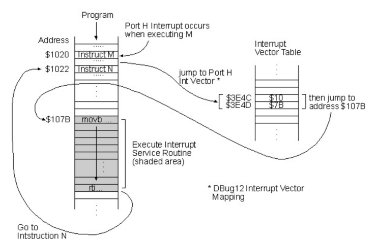

# 3. 운영체제 - week09

태그: 운영체제, 정리
생성 일시: 2023년 10월 19일 오후 8:27
진행 상황: 진행중

## 목차

- 운영체제와 컴퓨터 시스템의 구조
- 인터럽트
- 시스템콜과 modebit
- 메모리계층
- 가상메모리와 스와핑, 페이지폴트 그리고 스레싱
- 페이지 교체 알고리즘: FIFO, LRU, NUR, LFU
- 프로세스와 스레드 차이
- 프로그램의 컴파일 과정
- 프로세스 메모리 구조
- PCB와 컨텍스트 스위칭
- 프로세스의 상태
- 멀티프로세싱과 멀티스레딩
- IPC

---

## 운영체제와 컴퓨터 시스템의 구조

## 운영체제

### 종류

- GUI - Graphical User Interface
- CUI - Charcter User Interface
- OS의 뇌는 커널 (즉 OS가 뭐뭐한다 = 커널이 뭐뭐한다)
- 어떤 프로그램을 SSD에 설치하고 실행시키면 메모리에 올라간다. 이 때 메모리에 올라가면 프로세스가 됌

### 구조

- 유저프로그램과 하드웨어 사이에 차례대로 인터페이스 - 시스템콜 - 커널의 구조를 가짐

### 역할

1. CPU 스케줄링과 프로세스 상태관리
2. 메모리 관리
3. 디스크 파일 관리
4. I/O 디바이스 관리

## 컴퓨터 시스템

### 구조

- CPU: 인터럽트에 의해 메모리에 존재하는 명령어를 해석해서 실행하는 것
- DMA컨트롤러: CPU의 일을 보조함
- 메모리: 전자회로에서 데이터, 상태 등을 기록하는 장치
- 타이머: 특정 프로그램에서 시간을 다는 역할
- 디바이스 컨트롤러: I/O디바이스들의 작은 CP
- 로컬버퍼: 디바이스에 달려 있는 작은 메모리

### CPU

- 구성
  - 산술논리연산장치(ALU)
    - 산술연산과 논리연산을 하는 회로장치
  - 제어장치(CU)
    - 프로세스의 조작을 지시하며 명령어들을 읽고 해석하며 데이터 처리를 위한 순서를 결정
  - 레지스터
    - CPU안에 매우 빠른 임시기억장치
- CPU 순서
  - 제어장치가 메모리에 있는 일을 레지스터에 올림
  - 레스터에 있는 값을 읽어 ALU보고 계산하라 해서 레지스터 반영
  - 레지스터에서 메모리에 다시 옮겨 하드디스크나 SSD에 영구저장
- 인터럽트에 의해 메모리에 존재하는 명령어를 해석해서 실행함

### 인터럽트

- 역할
  - 인터럽트란 어떤 신호가 들어왔을 때 CPU를 잠깐 정지시키는 것
  - 우선순위가 높은 프로세스의 발생 등으로 발생
  - CPU는 인터럽트가 발생되면 인터럽트 핸들러 함수가 모여 있는 인터럽트 벡터로 가서 인터럽트핸들러함수(ISR, 인터럽트 서비스 루틴)가 실행되며 특정 명령어를 실행
  
- 종류
  - 하드웨어 인터럽트
    - I/O 디바이스 등 하드웨어에서 발생하는 인터럽트
  - 소프트웨어 인터럽트
    - 프로세스에서 발생하는 인터럽트
    - 하드웨어 인터럽트보다 우선순위가 높음

## 시스템 콜

- 정의
  - 운영체제가 커널에 접근하기 위한 인터페이스
  - 유저 프로그램이 운영체제의 서비스를 받기 위해 커널 함수를 호출할 때 거쳐서 호출함
- 과정
  - 가정: 유저프로그램이 I/O 요청을 위한 트랩을 발동했을 때
  - 유저 프로그램이 I/O 요청 트랩 발동
  - 올바른 I/O 요청인지 확인
  - 유저 모드가 시스템콜을 통해 커널모드로 변환
  - 이후 커널함수 실행

### Modebit

- 시스템콜이 작동될때 modebit을 기반으로 유저모드와 커널모드를 구분
- 1 또는 0의 값을 가지는 플래그 변수
- 1은 유저모드, 0은 커널모드

## 메모리 계층

- 메모리 계층구조
  - 레지스터: CPU 내의 작은 메모리, 휘발성, 속도 가장 빠름, 기억 용량이 가장 적음
  - 캐시: CPU내의 L1, L2 캐시를 지칭, 휘발성, 속도 빠름, 기억 용량이 적음
  - 주기억장치: RAM, 휘발성, 속도 보통, 기억 용량이 보통
  - 보조기억장치: HDD, SSD, 비휘발성, 속도 낮음, 기억 용량이 많음
- 계층 존재 이유
  - 더 빠른 접근과 처리 속도 증가
  - 비용의 효율성
  - 자원의 효율적 사용

## 가상 메모리와 스와핑 페이지 폴트 그리고 스레싱

### 가상 메모리(Virtual Memory)

- OS에서 사용되는 메모리 관리 기법의 하나
- 실제 이용가능한 메모리 자원을 추상화하여 이를 사용하는 사용자들에게 매우 큰 메모리로 보이게 만드는 것
  - 가상주소: MMU와 페이지테이블(page table)에 의해 실제 주소로 변환됨
  - 중요) 페이지와 프레임
  - 페이지: 가상 메모리를 사용하는 최소 크기 단위
  - 프레임: 실제 디스크나 메모리를 사용하는 최소 크기 단위
  
- 필요성
  - 주기억장치의 효율적 관리(스와핑)
  - 메모리 관리의 단순화
  - 메모리 용량 및 안정성 보장

### 페이지 테이블

- 가상 메모리는 가상주소와 실제주소가 매핑되어있는 페이지 테이블로 관리되며 이 때 속도 향상을 위해 “캐싱계층인 TLB”를 씀
- 가상주소에서 바로 페이지테이블을 가지 않고 TLB에서 있는지 먼저 확인하고 없다면 페이지테이블로 가서 실제주소를 가져옴

### 페이지폴트와 스와핑

- 가상메모리는 참조하려는 메모리 영역이 실제 메모리(RAM)에는 데이터가없을 수 있음 → 이 때 페이지 폴트 발생
- 메모리의 당장 사용하지 않는 영역을 하드디스크로 옮기고 하드디스크의 일부분을 “마치 메모리처럼” 불러와 씀 → 이를 “스와핑”이라고 함
  
- 과정
  1. 어떤 명령어가 유효한 가상주소에 접근했으나 해당 페이지가 만약 없다면 트랩이 발생되어 운영체제에 알림
  2. 운영체제는 실제 디스크로부터 사용하지 않은 프레임을 찾음
  3. 해당 프레임을 실제 메모리에 가져와서 “페이지 교체 알고리즘”을 기반으로 특정 페이지와 교체(스와핑)
  4. 페이지 테이블을 갱신시킨 후 해당 명령어를 다시 시작
  
  ### 스레싱
  - 정의
    - 메모리의 페이지 폴트율이 높은 것을 의미
  - 발생이유
    - 메모리에 너무 많은 프로세스가 동시에 올라가면 스와핑이 많이 일어남
    - 페이지폴트가 일어나면 CPU 이용률은 낮아짐
    - CPU 이용률이 낮아지면 운용체제는 CPU의 가용성을 높이기 위해 더 많은 프로세스를 메모리에 올림
    - 악순환이 반복되어 스레싱이 발생
  - 해결방법
    - HDD를 사용한다면 SSD로 교체
    - 운영체제에서 해결하는 방법은 작업세트와 PFF가 있음
      - 작업세트
        - 프로세스의 과거 사용이력을 기반으로 많이 사용하는 페이지 집합을 만들어 한꺼번에 미리 메모리에 로드하는 것
      - PFF
        - page fault frequency
        - 페이지 폴트 빈도를 조절하는 방법으로 상한선과 하한선을 만듦
        - 상한선에 도달하면 프레임을 늘리고 하한선에 도달하면 프레임을 줄이는 방법
        

### 페이지 교체 알고리즘

- 정의
  - 스와핑이 일어날 때 페이지 교체 알고리즘(page replacement algorithm)에 의해 페이지가 교체되게 됨
- 종류
  - 오프라인 알고리즘
    - 가장 좋은 알고리즘
    - 가장 먼 미래에 참조되는 페이지와 현재의 페이지를 바꾸는 LFD(Longest Forward Distance) 알고리즘
    - 하지만 미래에 사용되는 프로세스를 우리는 알지 못함 → 따라서 다른 알고리즘과의 성능비교에 대한 상한선
  - FIFO
    - 가장 먼저 온 페이지부터 교체하는 방법
  - LRU
    - Least Recently Used
    - 최근에 사용되지 않은 페이지를 바꾸는 방법
  - NUR
    - Not Used Recently
    - 혹은 NRU(Not Recently Used)
    
    - 일명 clock 알고리즘
    - 0(참조 되지 않음)과 1(참조 됨)을 가진 비트를 두어서 0을 찾은 순간 해당 페이지를 교체하고, 해당 부분을 1로 바꾸는 알고리즘
  - LFU
    - Least Frequently Used 알고리즘
    - 가장 참조 횟수가 적은 페이지를 교체하는 알고리즘

## 프로세스와 스레드

### 프로세스

- 컴퓨터의 메모리에 올라와 실행되고 있는 프로그램

### 스레드

- 프로세스 내 작업의 흐름
- 종류
  - 싱글스레드 프로세스
  - 멀티스레드 프로세스

### 프로세스와 스레드 차이

1. 프로세스: 코드, 데이터, 스택, 힙 메모리 영역을 기반으로 작업
   스레드: 프로세스 내의 스택 메모리를 제외한 다른 메모리 영역을 프로세스 내의 다른 스레들과 공유하기 때문에 메모리적 이점이 있음
2. 프로세스끼리 통신을 하기 위해서는 IPC를 사용해야하지만, 스레드는 서로 격리되어있지 않으므로 그냥 통신 가능(빠름)
3. 프로세스는 문제가 생겨도 다른 프로세스에 영향을 끼치지 않음
   스레드는 문제가 생기면 다른 스레드에 영향을 끼쳐 스레드로 이루어져 있는 프로세스에 영향을 줌
4. 프로세스는 생성과 종료에 더 많은 시간이 듦
   스레드는 더 적은 시간이 듦

## 프로그램의 컴파일 과정

- 프로그램은 컴파일러가 컴파일 과정을 거쳐 컴퓨터가 이해할 수 있는 기계어로 번역되어 실행될 수 있는 파일이 된 것을 의미
- 과정
  1. 전처리
     - 소스코드의 주석제거, #include 등 헤더파일을 병합하고 매크로를 치환
  2. 컴파일러
     - 오류처리, 코드 최적화 작업을 하여 어셈블리어로 변환
  3. 어셈블러
     - 어셈블리어는 목적코드(object code)로 변환됨
  4. 링커
     - 프로그램 내 있는 라이브러리 함수 등과 결합해 실행파일이 만들어짐
  

## 프로세스의 메모리 구조

- 위에서부터 스택, 힙, 데이터 영역(BSS segment, Data segment), 코드 영역으로 나누어짐
- 스택은 위 주소부터 할당되고 힙은 아래 주소부터 할당
- 스택
  - 지역변수, 매개변수, 함수가 저장되고 컴파일 시에 크기가 결정됨. 함수가 함수를 호출 하는 등에 따라 런타임시에도 크기가 변경됨(동적인 특징)
- 힙
  - 동적 할당할 때 사용되며 런타임 시 크기가 결정됨(동적인 특징)
- 데이터 영역
  - BSS영역과 Data 영역으로 나뉘고 정적할당에 관한 부분을 담당(정적인 특징)
- 코드 영역
  - 소스코드 들어감(정적인 특징)

### 정적 할당

- 컴파일단계에서 메모리를 할당하는 것
- BSS segement와 Data segment, Code/Text segment로 나뉘어서 저장됨
  
- BSS segment는 전역변수, static, const로 선언되어있는 변수 중 0으로 초기화 또는 초기화가 어떠한 값으로도 되어 있지 않은 변수들이 이 메모리 영역에 할당됨
- Data segment는 전역변수, static, const로 선언되어있는 변수 중 0이 아닌 값으로 초기화된 변수가 이 메모리 영역에 할당됨

### 동적 할당

- 런타임단계에서 메모리를 할당받는 것이며 Stack과 Heap으로 나눠짐
  
- Stack
  - 지역변수, 매개변수, 실행되는 함수에 의해 늘어나거나 줄어드는 메모리 영역
- Heap
  - 동적으로 할당되는 변수들을 담음
  - malloc(), free() 함수를 통해 관리함

## PCB와 컨텍스트 스위칭

### PCB

- 정의
  - Process Control Block
  - 운영체제에서 관리하는 프로세스에 대한 메타데이터를 저장한 데이터 블록
  - 커널 스택에 저장되며 각 프로세스가 생성될 때마다 고유의 PCB가 생성되고 프로세스가 종료되면 PCB는 제거
- 구조
  - 프로세스 상태: 대기중, 실행 중 등 프로세스의 상태
  - 프로세스 번호(PID): 각 프로세스의 고유 식별 번호(프로세스 ID)
  - 프로그램 카운터(PC): 이 프로세스에 대해 실행될 다음 명령의 주소에 대한 포인터.
  - 레지스터: 레지스터관련 정보
  - 메모리 제한: 프로세스의 메모리 관련정보
  - 열린 파일 정보: 프로세스를 위해 열린 파일 목록들
  

### 컨텍스트 스위칭

- 정의
  - PCB를 기반으로 프로세스의 상태를 저장하고 다시 복원시키는 과정
  - 프로세스가 종료되거나 인터럽트에 의해 발생
  
- 컨텍스트 스위칭의 비용
  - 유후시간의 발생
    - 컨텍스트 스위칭을 할 때마다 유후시간이 생겨서 CPU의 가용성이
      떨어지는 비용이 발생함
  - 캐시미스
    - 프로세스가 가지고 있는 메모리 주소가 그대로 있으면 잘못된 주소 변환이 생기므로 캐시클리어 과정이 무조건 일어나게되고 이 때문에 캐시미스가 발생함

## 프로세스 상태

- 생성 상태
  - 프로세스가 생성된 상태를 의미
  - fork() 또는 exec() 함수를 통해 프로세스가 생성된 상태 → 이때 PCB가 할당
  - fork()
    - 부모 프로세스의 주소 공간을 그대로 복사하며, 새로운 자식 프로세스를 생성하는 함수
    - 주소 공간만 복사하고 부모 프로세스의 비동기 작업 등을 상속하지 않음
  - exec()
    - 새롭게 프로세스를 생성하는 함수
- 대기 상태
  - 처음 프로세스가 생성된 이후 메모리 공간이 충분하면 메모리를 할당받고 아니면 아닌 상태로 준비큐에 들어가서 대기중인 상태를 말함
- 대기 중단 상태
  - 준비큐가 꽉찬 상태, 메모리 부족으로 일시 중단된 상태
- 실행 상태
  - CPU 소유권과 메모리를 할당받고 인스트럭션을 수행 중인 상태
- 중단 상태
  - 어떤 이벤트가 발생한 이후 기다리며 프로세스가 차단된 상태
- 일시 중단 상태
  - 중단된 상태에서 프로세스가 실행되려고 했지만 메모리 부족으로 일시 중단된 상태
- 종료 상태
  - 프로세스 실행이 완료되어 해당 프로세스에 대한 자원을 반납하며 PCB가 삭제되는 상태
  - 부모 프로세스가 자식 프로세스를 강제적으로 종료시켜 비자발적 종료(abort)로 종료되는 것도 있음

## 멀티프로세싱과 멀티스레딩

### 멀티프로세싱

- 여러 개의 프로세스
- 두 가지 이상의 일을 수행할 수 있는 것
- 특정 프로세스 중 일부에 문제가 발생되더라도 다른 프로세스에 영향을 미치지 않으며 격리성과 신뢰성이 높음

### 멀티스레딩

- 프로세스 내 작업을 멀티스레드로 처리하는 기법
- 스레드끼리 서로 자원을 공유하고 프로세스보다는 가벼워서 효율성이 높음
- 한 스레드에 문제가 생기면 다른 스레드에도 영향을 끼쳐 프로세스에 영향을 줄 수 있음

## IPC

- Inter-Process Communication
- 프로세스끼리 데이터를 주고받고 공유 데이터를 관리하는 메커니즘
- 종류
  - 공유 메모리
    - 여러 프로세스가 서로 통신할 수 있도록 메모리를 공유하는 것
    - 메모리 자체를 공유해 불필요한 데이터 복사의 오버헤드가 발생하지 않아 가장 빠름
    - 같은 메모리 영역을 여러 프로세스가 공유하기 때문에 동기화 필요
    - IPC 중에서 가장 빠른 통신 방법
    
  - 파일
    - 디스크에 저장된 데이터를 기반으로 통신하는 것을 의미
  - 소켓
    - 네트워크 인터페이스(TCP, UDP, HTTP 등)를 기반으로 통신하는 것을 의미
  - 파이프
    - 익명파이프
      - 프로세스 사이에 FIFO 기반의 통신채널을 만들어 통신
      
      - 단방향 통신 → 양방향 통신 하려면 2개의 익명 파이프 필요
      
      - 부모, 자식 프로세스 간에만 사용 가능하고 다른 네트워크상에서는 사용 X
    - 명명파이프
      - 익명 파이프의 확장된 개념
      - 부모, 자식 뿐만 아니라 다른 네트워크 상에서도 통신 가능
      - 보통 서버, 클라이언트용 파이프를 구분해서 동작
      
  - 메세지 큐
    - 메세지를 큐 자료구조 형태로 관리하는 버퍼를 만들어 통신
    - 동작 과정
      1. 프로세스가 메세지를 보내거나 받기 전에 큐를 초기화
      2. 보내는 프로세스(sender)의 메세지는 큐에 복사되어 받는 프로세스(receiver)에 전달
      
