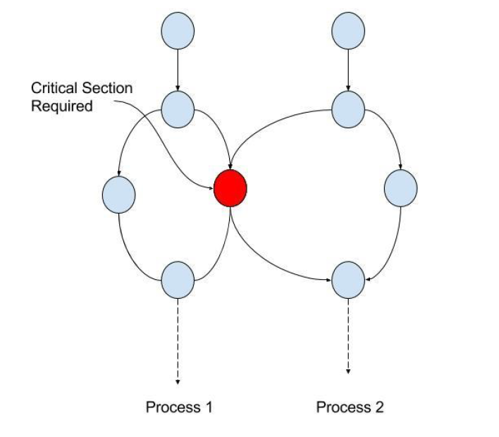

# 3. 운영체제 - week10

태그: 운영체제, 정리
생성 일시: 2024년 1월 15일 오후 10:25
진행 상황: 진행중

## 목차

- 공유자원과 경쟁상태 그리고 임계영역
- 뮤텍스, 세마포어, 모니터
- CPU 스케줄링 알고리즘
  - 비선점형(FCFS, SJF, 우선순위)
  - 선점형(라운드로빈, SRF, 다단계큐)
- 캐시
  - 캐시히트와 캐시미스
  - 캐시매핑: 직접매핑, 연관매핑, 집합-연관매핑
- 매모리 할당
  - 연속할당: 고정분할과 가변분할
  - 불연속할당: 페이징, 세그멘테이션, 페이지드 세그멘테이션

## 공유 자원과 경쟁상태 그리고 임계영역

- 공유 자원
  - shared resource
  - 시스템 안에서 각 프로세스, 스레드가 함께 접근할 수 있는 모니터, 프린터, 메모리, 파일, 데이터 등의 자원이나 변수를 의미
- 경쟁 상태
  - race condition
  - 공유 자원을 둘 이상의 프로세스 또는 스레드가 동시에 읽거나 쓰는 상황을 말함
  - 동시에 접근을 시도할 때의 타이밍이 예상되는 결과 값에 영향을 줄 수 있는 상태
  - 경쟁 상태를 잘 해결하지 못하면 데이터 정합성, 무결성을 지키지 못함
    - 데이터 정합성
      - data consistency
      - 예상되는 데이터의 값과 다른 것
      - ex) 읽을 때 0원 이어야 하는데 1000원인 것
    - 데이터 무결성
      - data integrity
      - 어떠한 규칙을 위반하면 안되는 것
      - 은행에서 0원인데 출금하는 것
- 임계 영역
  - critical section
  - 둘 이상의 프로세스 또는 스레드가 공유자원에 접근할 때 순서 등의 이유로 결과가 달라지는 코드영역을 뜻함
  - 이 영역은 한번에 둘 이상의 프로세스나 스레드가 들어갈 수 없게 설계
    

## 뮤텍스, 세마포어, 모니터

> 경쟁상태를 해결하는 대표적인 3가지 방법
> 상호배제, 한정대기, 진행의 융통성의 조건을 만족시키며 경쟁상태를 해결

- 상호 배제
  - mutual exclusion
  - 한 프로세스가 임계 영역에 들어갔을 때 다른 프로세스는 들어갈 수 없음
- 한정 대기
  - bounded waiting
  - 특정 프로세스가 임계영역 진입을 요청한 후 해당 요청이 승인되기 전까지 다른 프로세스가 임계영역에 진입하는 횟수를 제한하는 것
  - 이를 통해 특정 프로세스가 영원히 임계 영역에 들어가지 못하게 하는 것을 방지
- 진행의 융통성
  - progress
  - 만약 어떠한 프로세스도 임계영역을 사용하지 않는다면 임계영역 외부의 어떠한 프로세스도 들어갈 수 있음
  - 이 때 프로세스끼리 서로 방해하지 않음
- 뮤텍스(mutex)
  - 공유 자원을 lock()을 통해 잠금설정하고 사용한 후에 unlock()을 통해 잠금해제가 되는 객체 lock을 기반으로 경쟁상태 해결
  - 잠금이 설정되면 다른 프로세스나 스레드는 잠긴 코드 영역에 접근 불가, 해제는 그와 반대
  - 한번에 하나의 프로세스만 임계영역에 존재
  - ex) 변기가 1개인 화장실  
    
- 세마포어(semaphore)
  - 일반화된 뮤텍스
  - 간단한 정수 S(현재 쓸 수 있는 공유자원의 수)와 두 가지 함수(wait(), signal())로 공유 자원에 대한 접근 처리
    - wait()은 S를 1씩 감소 → 감소시키다 만약 S가 음수가 된다면 공유자원을 쓸 수 없기 때문에 프로세스는 차단되며 대기열에 프로세스를 집어넣음
    - signal()은 S를 1씩 증가 → 공유자원을 프로세스가 다 쓴 상태. 이 때 만약 S가 0 이하라면 대기열에 있던 프로세스가 동작
    - wait()은 P()라고도 하고 signal()은 V()라고도 함
  - 이를 통해 여러 프로세스가 동시에 임계영역에 접근 가능
  - 종류
    - 바이너리 세마포어
      - 0과 1의 두 가지 값만 가질 수 있는 세마포어
      - 구현의 유사성으로 인해 뮤텍스는 바이너리 세마포어라고 할 수 있지만 뮤텍스는 잠금을 기반으로 상호배제가 일어나는 ‘잠금 메커니즘’을 사용했고, 세마포어는 신호를 기반으로 상호 배제가 일어나는 ‘신호 메커니즘’을 사용
    - 카운팅 세마포어
      - 여러 개의 값을 가질 수 있는 세마포어
  - ex) 5명의 사용자만이 로그인하여 들어갈 수 있는 게임  
      
    
- 모니터(monitor)
  - 둘 이상의 스레드나 프로세스가 공유 자원에 안전하게 접근할 수 있도록 공유자원을 숨기고 해당 접근에 대해 인터페이스만 제공하는 객체
  - 이를 통해 공유자원에 대한 작업들을 순차적으로 처리
  - 모니터는 세마포어보다 구현하기 쉽고 한번에 하나의 프로세스만 공유자원에 접근 가능. 따라서 상호배제가 자동. 인터베이스를 기반으로 구축
  - 세마포어는 모니터보다 구현하기 어렵고 한번에 여러개의 프로세스가 공유자원에 접근. 따라서 상호배제를 명시적으로 구현해야함. 또한 정수변수를 기반으로 구축
    

## 교착 상태(deadlock)

- 정의
  - 두 개 이상의 프로세스들이 서로가 가진 자원을 기다리며 중단된 상태
  - 각 프로세스는 서로가 원하는 자원을 유지한채 다른 프로세스의 자원을 얻기를 기다림
  - 원인
    - 상호 배제
      - 주어진 시간 내에 하나의 프로세스만 자원을 독점 가능 → 다른 프로세스들은 접근 불가능
    - 점유 대기
      - 특정 프로세스가 점유한 자원을 다른 프로세스가 요청하며 대기하는 상태
    - 비선점
      - 다른 프로세스의 자원을 강제적으로 가져올 수 없음
    - 환형 대기
      - 프로세스 A는 프로세스 B의 자원을 요구하고, 프로세스 B는 프로세스 A의 자원을 요구하는 등 서로가 서로의 자원을 요구하는 상황
  - 해결 방법
    1. 자원을 할당할 때 애초에 조건이 성립되지 않도록 설계
    2. 교착 상태 가능성이 없을 때만 자원 할당되며, 프로세스당 요청할 자원들의 최대치를 통해 자원 할당가능 여부를 파악하는 ‘은행원 알고리즘’ 사용
    3. 교착 상태가 발생하면 사이클이 있는지 찾아보고 이에 관련된 프로세스를 한 개씩 지움
    4. 교착 상태는 매우 드물게 일어나서 이를 처리하는 비용이 더 큼 → 따라서 현대 운영체제는 교착 상태가 발생하면 사용자가 작업을 종료하는 방법을 채택함
       

## CPU 스케줄링 알고리즘

- CPU는 스케줄링 알고리즘을 통해 효율적으로 어떤 프로세스를 선택함. 여기서 효율적이란
  - CPU 사용률이 높은가?
  - 단위 시간당 작업을 마친 프로세스의 수(처리량)가 높은가?
  - 작업을 요청한 프로세스가 작업을 시작하기 전 대기하는 시간은 짧은가?
- 비선점형(non-preemptive)
  - 정의
    - 프로세스가 스스로 CPU 소유권을 포기하는 방식
    - 강제로 프로세스를 중지하지 않음
    - 컨텍스트 스위칭으로 인한 부하가 적음
  - 종류
    - FCFS
      - First Come, First Served
      - 가장 먼저 온 것을 가장 먼저 처리하는 알고리즘
      - 단점: 길게 수행되는 프로세스 때문에 준비 큐에서 오래 기다리는 현상(convey effect)이 발생
        
    - SJF
      - Shortest Job First
      - 실행 시간이 가장 짧은 프로세스를 가장 먼저 실행하는 알고리즘
      - 긴 시간을 가진 프로세스가 실행되지 않는 현상(starvation)이 일어날 수 있음
      - 평균 대기 시간이 가장 짧음
      - 하지만 실제로는 실행 시간을 알 수 없기 때문에 과거의 실행했던 시간을 토대로 추측해서 사용
        
    - 우선순위
      - Starvation이 일어나는 SJF 스케줄링에서 오래된 작업일수록 우선순위를 높이는 방법(aging)을 통해 단점을 보완한 알고리즘
      - 여기서 우선순위란 작업의 시간, 프로세스의 메모리 요구사항, 열린 파일 수, 평균 CPU 사용량 등을 고려해서 설정
      - 우선순위 알고리즘은 앞서 설명한 SJF+우선순위를 말하는 것 뿐만 아니라 FCFS를 활용하여 만들기도 하며 선점형, 비선점형적인 우선순위 스케줄링 알고리즘을 말함
- 선점형(preemptive)
  - 정의
    - 현재 사용하고 있는 프로세스를 알고리즘에 의해 중단시키고 강제로 다른 프로세스에 CPU 소유권을 할당할 수도 있는 방식
    - 현대 운영체제가 쓰는 방식
  - 종류
    - 라운드 로빈(RR, Round Robin)
      - 현대 컴퓨터가 쓰는 스케줄링 방법, 단순한 선점형 알고리즘
      - 각 프로세스는 동일한 할당 시간을 주고 그 시간 안에 끝나지 않으면 다시 준비 큐(ready queue)의 뒤로 가는 알고리즘
      - 할당 시간이 너무 크면 FCFS가 되고 짧으면 컨텍스트 스위칭이 잦아져서 오버헤드, 즉 비용이 커짐
      - 일반적으로 전체 작업 시간은 길어지지만 평균 응답 시간은 짧아짐
      - 로드밸런서에서 트래픽 분산 알고리즘으로 쓰임  
          
        
    - SRF(혹은 SRTF)
      - Shortest Remaining Time First
      - 중간에 더 짧은 작업이 들어오면 수행하던 프로세스를 중지하고 해당 프로세스를 수행하는 알고리즘
    - 다단계큐
      - 우선순위에 따른 준비 큐를 여러 개 사용하고, 큐마다 RR이나 FCFS 등 다른 스케줄링 알고리즘을 적용한 것
      - 큐 간의 프로세스 이동이 안돼서 스케줄링 부담이 적지만 유연성이 떨어짐
      - Starvation 현상이 발생할 수도 있음
        

## 캐시

- 정의
  - 데이터를 미리 복사해 놓는 임시 저장소
  - 빠른 장치와 느린 장치에서 속도 차이에 따른 병목 현상을 줄이기 위한 메모리
  - 캐시는 자주 사용하는 데이터를 기반으로 설정해야 함 → 지역성을 기반으로 설정
    - 시간 지역성(Temporal Locality)
      - 최근 사용한 데이터에 다시 접근하려는 특성
    - 공간 지역성(Spatial Locality)
      - 최근 접근한 데이터를 이루고 있는 공간이나 그 가까운 공간에 접근하는 특성
  - 캐시는 우리가 사용하는 서비스 내부에서도 많이 찾아볼 수 있음
    - DB에서의 redis 데이터베이스를 캐시계층으로 둔 사례
      
    - 웹서버 앞단에 nginx 서버를 캐시계층으로 둔 사례
      
- 캐시히트
  - 캐시에서 원하는 데이터를 찾은 것
- 캐시미스
  - 캐시에서 원하는 데이터를 찾지 못한 것
  - 캐시미스가 일어나면 메모리로 가서 원하는 데이터를 레지스터에 등록
- 캐시매핑
  - 종류
    - 직접매핑(직접 사상)
    - 연관매핑(연관 사상)
    - 집합-연관매핑(집합-연관 사상)
- 직접매핑(Direct Mapping)
  - “직접 블록별 매핑을 하다”
  - 메모리의 특정 블록은 특정 캐시 라인에만 매핑할 수 있는 것을 말함
- 연관매핑(Associative Mapping)
  - “자유로이 연관 매핑을 하다”
  - 순서를 일치시키지 않고 관련 있는 캐시와 메모리를 매핑하며 메모리의 컨텐츠가 캐시의 어느 위치에도 올라갈 수 있는 방법
  - 스와핑이 덜 일어나겠지만 캐시의 모든 블록을 탐색해야 해서 속도가 직접매핑보다 느림
- 집합-연관매핑(Set Associate Mapping)
  - 집합을 나누고(정해진 집합을 만들다 - 직접매핑) 해당 집합에는 bd만 같으면 들어올 수 있게 하는데 이 때 어떤 블럭에도 들어올 수 있게 하는 것
  - 따라서 모든 블럭을 찾을 필요 없이 특정 블럭을 찾게 해 탐색비용을 낮춘 직접매핑의 장점과 스와핑을 완화시키는 연관매핑의 장점을 모두 지님

## 메모리 할당

- 정의
  - 프로그램에 필요한 메모리를 할당할 때 시작 메모리 위치, 메모리 할당 크기를 기반으로 할당
- 종류
  - 연속 할당
  - 불연속 할당
- 연속 할당(Contiguous Memory Allocation)
  - 메모리에 ‘연속적’으로 공간을 할당하는 것
  - 사용 가능한 메모리 공간이 같은 위치에 함께 있음. 즉, 메모리 파티션이 전체 메모리 공간에 여기저기서 분산되어 있지 않음
    
  - 고정분할방식과 가변분할방식으로 나뉨  
    
  - 고정분할방식(Fixed Partition Allocation)
    - 메모리를 미리 같은 크기로 분할해서 할당하는 방법 → 내부단편화(Internal Fragmentation)가 발생
      
    - 프로그램이 필요한 공간보다 더 많은 메모리가 할당되어 내부적으로 조각이 많이 생기는 것을 의미
    - 추후에 프로그램에 필요한 메모리를 할당하지 못하는 현상 발생
  - 가변분할방식(Variable Partition Allocation)
    - 프로그램에 필요한만큼 동적으로 할당하는 방법
    - 외부단편화가 발생할 수 있음
      
    - 가변분할방식은 최초적합, 최적적합, 최악적합이 있음
      - 최초적합(first fit) : 위쪽이나 아래쪽부터 시작해 홀을 찾으면 바로 할당합니다.
      - 최적적합(best fit) : 필요한 메모리 크기 이상인 공간 중 가장 작은 홀부터
        할당합니다.
      - 최악적합(worst fit) : 프로세스의 크기와 가장 많이 차이가 나는 홀에 할당합니다.
        
- 불연속할당(Non-contiguous Memory Allocation)
  - 정의
    - 메모리를 연속적으로 할당하지 않는 방법
    - 현대 운영체제가 쓰는 방법
  - 종류
    - 페이징
    - 세그멘테이션
    - 페이지드 세그멘테이션
  - 페이징(Memory Paging)
    - 동일한 크기(보통 4kb)의 페이지 단위로 나누어 메모리의 서로 다른 위치에 프로세스를 할당 → 홀의 크기가 균일하지 않은 문제가 없어지지만 주소 변환을 페이지별로 해야해서 주소변환이 복잡해짐
    - 외부단편화가 해결되지만 내부단편화가 생길 수 있음  
      
  - 세그멘테이션(Memory Segmentation)
    - 페이지 단위가 아닌 의미 단위인 세그먼트(segment)로 나누는 방식
    - 프로세스는 코드, 데이터, 스택, 힙으로 나누어져서 메모리가 할당되는데 코드와 데이터 또는 코드와 스택 등으로 나눌 수도 있으며
      함수 단위로 나눌 수도 있음을 의미함
    - 공유와 보안 측면에서 좋지만 홀 크기가 균일하지 않게 됨
    - 내부단편화가 해결될 수 있지만 외부단편화가 일어날 수 있음  
      
  - 페이지드 세그멘테이션(Paged Segmentation)
    - 세그멘테이션으로 나누되 해당 세그멘테이션을 동일한 크기의 페이지로 나누는 방법
