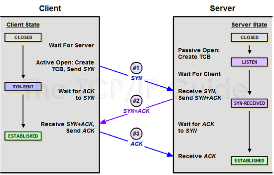
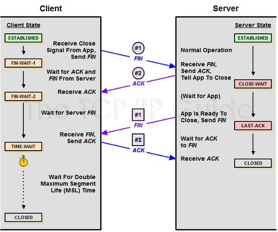
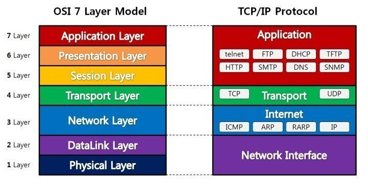

네트워크 총정리
=

---

- [HTTP 프로토콜 설명](#HTTP-프로토콜-설명)
- [HTTP와 HTTPS의 차이점](#HTTP와-HTTPS의-차이점)
- [쿠키와 세션의 차이점](#쿠키와-세션의-차이점)
- [www.naver.com 접속 시 과정 - 웹 동작 방식](#wwwnavercom-접속-시-과정---웹-동작-방식)
- [TCP와 UDP의 차이](#TCP와-UDP의-차이)
- [3way-handshake와 4way-handshake 설명](#3way-handshake와-4way-handshake-설명)
- [OSI 7 layer 설명](#OSI-7-layer-설명)
- [HTTP Method 설명](#HTTP-Method-설명)
- [GET과 POST의 차이](#GET과-POST의-차이)
- [세션 기반 인증과 토큰 기반 인증의 차이](#세션-기반-인증과-토큰-기반-인증의-차이)
- [JWT 토큰 설명](#JWT-토큰-설명)
- [대칭키, 비대칭키 암호화 방식 설명](#대칭키-비대칭키-암호화-방식-설명)
- [Connection Timeout과 Read Timeout의 차이](#Connection-Timeout과-Read-Timeout의-차이)
- [public IP와 private IP의 차이](#public-IP와-private-IP의-차이)

---

## HTTP 프로토콜 설명

- HTTP란 Hyper Text Transfer Protocol의 약자로 데이터를 주고 받기 위한 프로토콜이며 서버/클라이언트 모델을 따른다.
- HTTP는 상태 정보를 저장하지 않는 Stateless의 특징과 클라이언트의 요청에 맞는 응답을 보낸 후 연결을 끊는 Connectionless의 특징을 가지고 있다.
- 장점
    - 통신 간의 연결 상태 처리나 상태 정보를 관리할 필요가 없어 서버 디자인이 간단하다.
    - 각각의 HTTP 요청에 독립적으로 응답만 보내주면 된다.
- 단점
    - 이전 통신의 정보를 모르기 때문에 매번 인증을 해주어야 한다.
    - 이를 해결하기 위해 쿠키나 세션을 사용해서 데이터를 처리한다.

  **데이터 전송 프로토콜 / Stateless / Connectionless / 간단함 / 독립적 / 매번 인증 / 쿠키 & 세션**

---

## HTTP와 HTTPS의 차이점

- HTTP는 평문 데이터를 전송하는 프로토콜이기에, 중요한 정보를 주고 받으면 제 3자에 의해 조회될 수 있는 위험성이 따른다.
- 이를 해결하기 위해 암호화를 추가한 프로토콜이 HTTPS이다.
    - HTTPS는 기존의 HTTP에 Secure Socket을 추가한 프로토콜이다.
    - SSL (Secure Socket Layer) : 인터넷을 통해 전달되는 정보를 보호하기 위해 개발한 통신 규약
    - TLS (Transport Socket Layer) : 과거 SSL에서 발전하여 이름이 변경된 것
- 기존에는 HTTP가 TCP와 직접 통신했으나, HTTPS에서 HTTP는 SSL이 TCP와 통신함으로써 암호화와 증명서, 안정성 보호를 이용할 수 있게 된다.

  **HTTP의 위험성 / 암호화 / SSL & TLS / TCP와 직접 통신 X**

---

## 쿠키와 세션의 차이점

- 쿠키
    - 사용자의 컴퓨터에 저장하는 작은 기록 정보 파일
    - HTTP에서 클라이언트의 상태 정보를 PC에 저장했다가 필요 시 정보를 참조하거나 재사용할 수 있다.
- 세션
    - 일정 시간동안 같은 사용자로부터 들어오는 일련의 요구를 하나의 상태로 보고, 그 상태를 유지시키는 기술
    - 방문자가 웹 서버에 접속해 있는 상태(=세션)를 하나의 단위로 본다.

|  | 쿠키                               | 세션 |
| --- |----------------------------------| --- |
| 저장 위치 | 클라이언트                            | 웹 서버 |
| 저장 형식 | text                             | Object |
| 사용 자원(리소스) | 클라이언트 리소스                        | 웹서버 리소스 |
| 만료 시점 | 쿠키 저장 시 설정, 브라우저 종료 상관없이 만료시점 준수 | 브라우저 종료 시 삭제, 기간 지정 가능 |
| 최대저장용량 | 총 300개, 하나의 도메인 당 20개, 하나의 쿠키 당 4KB | 서버가 허용하는 한 용량 제한 X |
| 속도 | 세션보다 빠름 | 쿠키보다 느림 |
| 보안 | 세션보다 안좋음 | 쿠키보다 좋음 |

  **쿠키 : 저장 및 참조, 재사용, 클라이언트에 저장, 속도 빠름 / 세션 : 접속 상태 유지, 웹서버 저장, 보안 좋음**

---

## www.naver.com 접속 시 과정 - 웹 동작 방식

1. URL 입력
2. DNS 서버에 도메인 네임으로 서버의 실제 주소를 찾는다.
3. IP 주소로 웹 서버에 TCP 3 handshake로 연결
4. 클라이언트는 웹 서버로 HTTP 요청 메세지를 전송
5. 웹 서버는 HTTP 응답 메세지를 전송
6. 도착한 HTTP 응답 메세지는 웹 페이지 데이터로 변환되고, 웹 브라우저에 의해 출력

### 정리

- 리다이렉트 여부 판단 → 진행
- 캐싱 여부 판단 → 진행
- DNS는 FQDN(Fully Qualified Domain Name)을 IP로 바꾼다.
- IP 라우팅 → 해당 IP를 기반으로 라우팅, ARP 과정을 거쳐 실제 서버를 찾음
- TCP 연결 구축
- 컨텐츠 다운로드
- 브라우저 렌더링

**리다이렉트 → 캐싱 → DNS → IP 라우팅 → TCP → HTTP request,response → Rendering**

---

## TCP와 UDP의 차이

- 4계층 중 전송계층
    - 애플리케이션 계층에서 받은 메세지를 기반으로 세그먼트 또는 데이터 그램으로 데이터를 쪼개고 데이터가 오류없이 순서대로 전달되도록 도움을 주는 계층이다. → TCP, UDP
- TCP
    - 연결형 서비스로 3way handshaking 과정을 통해 연결을 설정하기 때문에 높은 신뢰성 보장
    - 속도가 비교적 느리다.
    - 신뢰성이 중요한 파일 교환의 경우 사용
- UDP
    - 비연결형 서비스로 3way handshaing을 사용하지 않기 때문에 신뢰성이 떨어진다.
    - 데이터 수신 여부를 확인하지 않기 때문에 속도가 빠르다. (네트워크 부하가 적음)
    - 실시간성이 중요한 스트리밍에 자주 사용

|  | TCP                                                    | UDP                                                  |
|--------------------------------------------------------|------------------------------------------------------| --- |
| 연결 방식 | 연결형 서비스                                                | 비연결형 서비스                                             |
| 패킷 교환 방식 | 가상 회선 방식                                               | 데이터그램 방식                                             |
| 전송 순서 | 전송 순서 보장                                               | 전송 순서가 바뀔 수 있음                                       |
| 수신 여부 확인 | 수신 여부 확인 O                                             | 수신 여부 확인 X                                           |
| 통신 방식 | 1:1 통신                                                 | 1:1 or 1:N or N:N 통신                                 |
| 신뢰성 | 높다                                                     | 낮다                                                   |
| 속도 | 느리다                                                    | 빠르다                                                  |
| 연결 보장 | 연결을 보장한다, 3웨이-핸드셰이크로 연결을 맺고 4웨이-핸드셰이크로 연결을 해제하는 작업이 필요 | 연결을 보장하지 않는다, 데이터를 그냥 보낸다, 연결을 유지하고 해제하는데 드는 비용이 없다. |
| 브로드 캐스트 지원 | X | O                                                    |
| 신뢰성 | O | X                                                    |
| 오류검사 | 재전송, 체크섬 | 체크섬                                                  |

**TCP : 안정적으로, 순서대로, 에러 없이 교환할 수 있게 한다.**

**UDP : 빠르게, 연속성을 기반으로 교환할 수 있게 한다**

### TCP 통신 종료 시에도 3way-handshaking을 사용하는지

- TCP는 3 way-handshaking 과정을 통해 연결을 설정하고, 4 way-handshaking 과정을 통해 연결을 해제한다.

---

## 3way-handshake와 4way-handshake 설명

- 3way-handshake
    - TCP 네트워크에서 통신하는 장치가 서로 연결이 잘 되었는지 확인하는 방법
    - 송신자와 수신자는 총 3번에 걸쳐 데이터를 주고 받으며 통신이 가능한 상태인지 확인한다.

    

- 4way-handshake
    - TCP 네트워크에서 통신하는 장치의 연결을 해제하는 방법
    - 송신자와 수신자는 총 4번에 걸쳐 데이터를 주고 받으며 연결을 끊는다.

    

---

## OSI 7 layer 설명

  

- TCP/IP 계층과 달리 OSI 계층은 애플리케이션 계층을 세 개로 쪼개고 링크 계층을 데이터 링크 계층, 물리 계층으로 나눠서 표현한다.
- 인터넷 계층을 네트워크 계층으로 부른다.

### 계층

- 7 계층(응용 계층) : 사용자에게 통신을 위한 서비스 제공. 인터페이스 역할
- 6 계층(표현 계층) : 데이터의 형식(Format)을 정의하는 계층 (코드 간의 번역을 담당)
- 5 계층(세션 계층) : 컴퓨터끼리 통신을 하기 위해 세션을 만드는 계층
- 4 계층(전송 계층) : 최종 수신 프로세스로 데이터의 전송을 담당하는 계층 (단위 :Segment)
    - ex) TCP, UDP
- 3 계층(네트워크 계층) : 패킷을 목적지까지 가장 빠른 길로 전송하기 위한 계층 (단위 :Packet)
    - ex) 라우터
- 2 계층(데이터링크 계층) : 데이터의 물리적인 전송과 에러 검출, 흐름 제어를 담당하는 계층 (단위 :frame)
    - ex) 이더넷
- 1 계층(물리 계층) : 데이터를 전기 신호로 바꾸어주는 계층 (단위 :bit)
    - 장비: 케이블,리피터,허브

**APSTNDP**

---

## HTTP Method 설명

- 클라이언트가 서버에게 사용자의 목적을 알리는 수단

### 종류

- GET : 데이터 조회
- POST : 요청 데이터 처리 (주로 데이터 등록에 사용)
- PUT : 데이터 변경 (해당 데이터가 없으면 생성)
- PATCH : 일부 데이터만 변경
- DELETE : 데이터 삭제

---

## GET과 POST의 차이

- GET
    - 데이터를 조회하기 위해 사용되는 방식
    - 데이터를 헤더에 추가하여 전송하는 방식
    - URL에 데이터가 노출되므로 보안적으로 중요한 데이터를 포함해서는 안된다.
    - 캐싱 불가능
    - 멱등성 O (= 안전한 메서드)
- POST
    - 데이터를 추가 또는 수정하기 위해 사용되는 방식
    - 데이터를 바디에 추가하여 전송하는 방식
    - 완전히 안전하지는 않지만, URL에 데이터가 노출되지 않아 GET 보다는 안전하다.
    - 멱등성 X

---

## 세션 기반 인증과 토큰 기반 인증의 차이

- 세션
    - 클라이언트로부터 요청을 받으면 클라이언트의 상태 정보를 저장하므로 Stateful한 구조를 가진다.
- 토큰
    - 클라이언트의 상태 정보를 서버에 저장하지 않으므로 Stateless한 구조를 가진다.

### Stateful한 세션 기반의 인증 방식을 사용할 때의 단점

- 서버에 세션을 저장하기 때문에 사용자가 증가하면 서버에 과부하를 줄 수 있어 확장성이 낮다.
- 해커가 훔친 쿠키를 이용해 요청을 보내면 서버는 올바른 사용자가 보낸 요청인지 알 수 없다.
    - 세션 하이재킹 공격

### 세션 기반 인증과 토큰 기반 인증은 각각 언제 적합한지

- 단일 도메인이라면 세션 기반 인증을 사용, 이외에는 토큰 기반 인증을 사용하는 것이 적합하다.
- 세션을 관리할 때 사용되는 쿠키는 단일 도메인 및 서브 도메인에서만 작동하도록 설계되어 있기 때문에 여러 도메인에서 관리하는 것이 어렵기 때문이다. (CORS 문제)

---

## JWT 토큰 설명

- JSON 포맷을 사용하는 Claim 기반의 웹 토큰
- 토큰 자체를 정보로 사용하는 Self-Contained 방식으로 정보를 안전하게 전달한다.
- 헤더(Header), 내용(Payload), 서명(Signature)로 구성되며 각 파트를 점(.)으로 구분한다.
    - Header : 토큰의 타입과 해시 암호화 알고리즘(방식지정)으로 이루어져 있다.
    - Payload : 토큰에 사용자가 담고자 하는 정보를 담는다. 내용에는 Claim이 담겨있고, JSON(Key/Value) 형태의 한 쌍으로 이루어져 있다.
    - Signature : 토큰을 인코딩하거나 유효성 검증할 때 사용하는 고유한 암호화 코드이다. 헤더와 내용의 값을 인코딩한다.

---

## 대칭키, 비대칭키 암호화 방식 설명

- 대칭키와 비대칭키는 양방향 암호화 방식이다.
- 대칭키
    - 암호화와 복호화에 같은 암호 키를 쓰는 알고리즘
    - 중간에 누군가 암호 키를 가로채면 암호화된 정보가 유출될 수 있다는 단점이 있다.
    - 이를 보완한 새로운 방식이 비대칭키(공개키)이다.
- 비대칭키
    - 암호화와 복호화를 할 때 키를 서로 다른 키로 사용하는 암호화 알고리즘
    - 타인에게 절대 노출되어서는 안되는 개인키(private key)와 공개적으로 개방되어 있는 공개키(public key)를 쌍으로 이룬 형태

---

## Connection Timeout과 Read Timeout의 차이

- Connection Timeout
    - 서버 자체에 클라이언트가 어떤 사유로 접근을 실패했을 시 적용되는 것
    - 접근을 시도하는 시간 제한이 Connection Timeout 되는 것을 의미한다.
- Read Timeout
    - 클라이언트가 접속을 성공했으나 서버가 로직을 수행하는 시간이 너무 길어 제대로 응답을 못 준 상태에서 클라이언트가 연결을 해제하는 것
    - 클라이언트는 해당 상황을 오류로 인지하고, 서버는 계속 로직을 수행하고 있어 성공으로 인지
    - 양 사이드 간 싱크가 맞지 않아 문제가 발생할 확률이 높다.

---

## public IP와 private IP의 차이

- 공인(public) IP
    - ISP(인터넷 서비스 공급자)가 제공하는 IP 주소이며, 외부에 공개되어 있는 IP 주소이다.
- 사설(private) IP
    - 일반 가정이나 회사 내 등에 할당된 네트워크 IP 주소이며, IPv4의 주소 부족으로 인해 서브네팅된 IP이기 때문에 라우터(공유기)에 의해 로컬 네트워크 상의 PC나 장치에 할당된다.
    - 사설 IP 주소만으로는 인터넷에 직접 연결할 수 없고, 라우터를 통해 1개의 공인 IP를 할당하고, 라우터에 연결된 개인 PC는 사설 IP를 각각 할당 받아 인터넷에 접속할 수 있다.

---