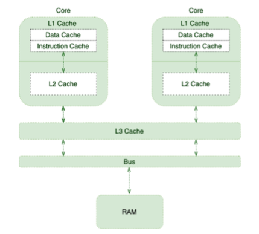
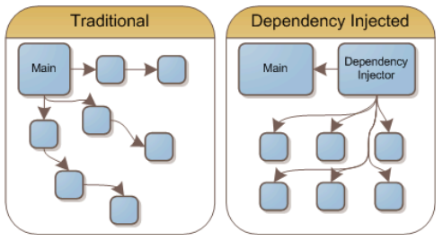
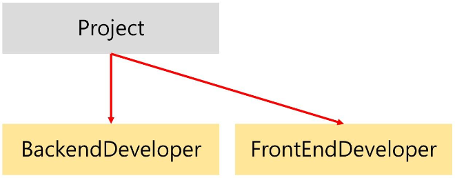
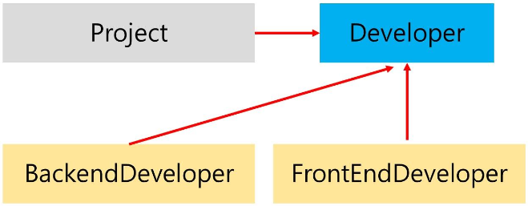
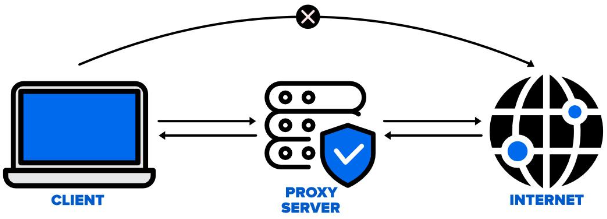
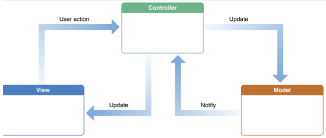
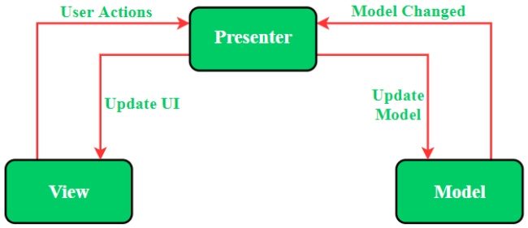
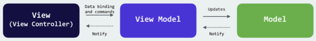
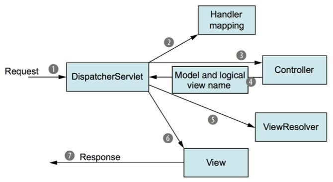
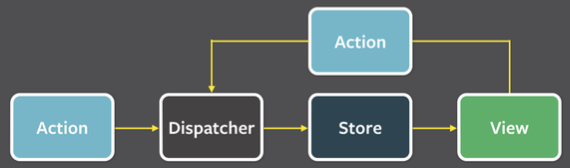

3주차
=

---

- [디자인 패턴](#디자인-패턴)
- [싱글톤 패턴](#싱글톤-패턴)
    - [싱글톤 패턴을 구현하는 7가지 방법](#싱글톤-패턴을-구현하는-7가지-방법)
- [팩토리 패턴](#팩토리-패턴)
- [이터레이터 패턴](#이터레이터-패턴)
- [의존성 주입과 의존관계 역전 원칙](#의존성-주입과-의존관계-역전-원칙)
- [전략 패턴](#전략-패턴)
- [옵저버 패턴](#옵저버-패턴)
- [MVC 패턴](#MVC-패턴)
- [MVP 패턴](#MVP-패턴)
- [MVVM 패턴](#MVVM-패턴)
- [flux 패턴](#flux-패턴)

---

# 디자인 패턴
- 프로그램을 설계할 때 발생했던 문제점들을 객체 간의 상호 관계 등을 이용하여 해결할 수 있도록 하나의 ‘규약’ 형태로 만들어 놓은 것을 의미한다.
- 디자인 패턴은 라이브러리나 프레임워크를 만드는데 기초적인 원리가 되며 지금도 많은 라이브러리, 프레임워크가 어떠한 디자인패턴을 기반으로 만들어지고 있다.
- 이를 기반으로 문제를 해결하는데 있어서 영감을 받을 수 도 있고 빠른 의사소통을 통해 문제를 해결해 나갈 수 있다.

### 종류

- 생성 패턴
    - 클래스로부터 객체를 만들 때 어떻게 만들 것인지
    - 객체 생성 방법이 들어간 디자인 패턴
    - <U>**싱글톤**</U>, <U>**팩토리**</U>, 추상팩토리, 빌더, 프로토타입 등
- 구조 패턴
    - 객체를 기반으로 어떤 구조를 만들어서 처리할 것인지
    - 객체, 클래스 등으로 큰 구조를 만들 때 유연하고 효율적으로 만드는 방법이 들어간 디자인 패턴
    - <U>**프록시**</U>, 어댑터, 브리지, 복합체, 데코레이터, 퍼사드, 플라이웨이트 등
- 행동 패턴
    - 객체들을 어떻게 순회할 것인지, 객체를 기반으로 알고리즘이 구현이 되는데 이를 어떻게 처리할 것인지
    - 객체나 클래스 간의 알고리즘, 책임 할당에 관한 디자인 패턴
    - <U>**이터레이터**</U>, <U>**옵저버**</U>, <U>**전략**</U>, 책임연쇄, 커맨드, 중재자, 메멘토, 상태, 템플릿메서드, 비지터 등

### 라이브러리와 프레임워크의 차이

- 라이브러리
    - 공통으로 사용될 수 있는 특정한 기능들을 모듈화한 것
    - 폴더명, 파일명 등에 대한 규칙이 없고 프레임워크에 비해 자유롭다.
    - 자유도가 높지만 제공되는 것들이 많지는 않다.
- 프레임워크
    - 공통으로 사용될 수 있는 특정한 기능들을 모듈화한 것
    - 폴더명, 파일명 등에 대한 규칙이 있으며 라이브러리에 비해 좀 더 엄격하다.
    - 자유도가 낮지만 제공되는 것들이 많다.

---

# 싱글톤 패턴

- 하나의 클래스에 오직 하나의 인스턴스만 가지는 패턴
- 홀더 방식이 가장 많이 사용된다.
    - 실제로 사용할 때 까지 실행 시점을 미룰 수 있다.
    - 정적 초기화로 생성 되므로 쓰레드 세이프하다.
- 장점
    - 하나의 인스턴스를 기반으로 해당 인스턴스를 다른 모듈들이 공유하여 사용하기 때문에 인스턴스 생성 시 발생하는 비용이 줄어든다.
    - 그렇기 때문에 인스턴스 생성에 많은 비용이 발생하는 I/O 바운드 작업에 많이 사용한다.
- 단점
    - 의존성이 높아진다.
        - 이는 DI(의존성 주입)을 통해 모듈 간 결합을 느슨하게 함으로써 해결할 수 있다.
        - 그러나 클래스 수가 늘어나 복잡성이 증가될 수 있고, 약간의 런타임 페널티가 생기기도 한다.
    - TDD(Test Driven Development)를 할 때 걸림돌이 된다.
        - TDD는 단위테스트로 주로 이루어지는데 이 때 서로 독립적이어야하며 테스트를 어떤 순서로든 실행할 수 있어야 한다.
        - 그러나 싱글톤 패턴은 미리 생성된 하나의 인스턴스를 기반으로 구현하는 패턴이기에 각 테스트마다 ‘독립적인’ 인스턴스를 만들기가 어렵다.

# 싱글톤 패턴을 구현하는 7가지 방법

## 1. 단순한 메서드 호출

- 싱글톤 패턴 생성 여부를 확인하고 싱글톤이 없으면 새로 만들고 있다면 만들어진 인스턴스를 반환
- 그러나 이는 메서드의 <U>원자성이 결여</U>되어 있다. 멀티스레드 환경에서는 싱글톤 인스턴스를 2개 이상 만들 수 있다.(쓰레드 세이프 하지 않다)

    ```java
    public class Singleton {
    
    	private static Singleton instance;
    	
    	private Singleton() {
    
    	}
    	
    	public static Singleton getInstance() {
    		if (instance == null) {
    			instance = new Singleton(); //객체 생성 과정
    		}
    		return instance; 
    	}
    }
    
    ```

- 자바는 멀티 쓰레드 언어이다. → 여러 쓰레드로 발생할 수 있는 상황을 고려해야 한다.
- 만약 2개의 쓰레드에서 각자 `getInstance()` 메서드를 호출했을 때 두 개의 인스턴스가 만들어진다면 이는 싱글톤 패턴이 아니다.

## 2. `synchronized`

- 인스턴스를 반환하기 전까지 격리 공간에 놓기 위해 `synchronized` 키워드로 잠금을 할 수 있다.
    - 1번에 대한 해결방법
- 최초로 접근한 쓰레드가 해당 메서드 호출 시에 다른 쓰레드가 접근하지 못하도록 잠금(lock)을 걸어준다.
- 이 때 `getInstance()` 메서드를 호출할 때 마다 <U>lock이 걸려 성능 저하</U>

```java
public class Singleton {

	private static Singleton instance;
	
	private Singleton() {
	}
	
	public static synchronized Singleton getInstance() {
		if (instance == null) {
			instance = new Singleton(); //객체 생성 과정
		}
		return instance; 
	}
}

```

## 3. 정적 멤버

- 정적(static) 멤버나 블록은 런타임이 아니라 최초에 JVM이 클래스 로딩 시 모든 클래스들을 로드할 때 미리 인스턴스를 생성하는 데 이를 이용한 방법
- 클래스 로딩과 동시에 싱글톤 인스턴스를 만든다. 그렇기 때문에 모듈들이 싱글톤 인스턴스를 요청할 때 그냥 만들어진 인스턴스를 반환하면 된다.
- 그러나 이는 <U>불필요한 자원낭비</U>라는 문제점이 있다. 싱글톤 인스턴스가 필요없는 경우에도 무조건 싱글톤 클래스를 호출해 인스턴스를 만들어야 하기 때문이다.
- 정적 멤버 활용

    ```java
    public class Singleton {
    
    	private final static Singleton instance = new Singleton();
    
    	private Singleton() {
    	}
    
    	public static Singleton getInstance() { 
    	    return instance;
    	} 
    }
    
    ```


## 4. 정적 블록

- 정적 블록 활용 (정적 블록에는 주로 클래스 변수를 초기화시키는 코드를 둔다.)

    ```java
    public class Singleton {
    
    	private static Singleton instance = null;
    
    	static {
    		instance = new Singleton();
    	}
    
    	private Singleton() {
    	}
    
    	public static Singleton getInstance() {
    		return instance;
    	}
    }
    
    ```


## 5. <U>정적 멤버와 LazyHolder(중첩 클래스)</U>

- 기존의 방식에서는 싱글톤 인스턴스를 호출하지 않아도 무조건 초기에 자원을 할당해야하는 문제점이 있었다.
    - 이를 해결하기 위해 <U>모듈이 필요로 할 때에만</U> 정적 멤버로 선언을 하는 것 (자원낭비 문제 해결)
- `SingleInstanceHolder`라는 내부 클래스를 하나 더 만듦으로써, Singleton클래스가 최초에 로딩되더라도 함께 초기화가 되지 않고, `getInstance()`가 호출될 때 `SingleInstanceHolder` 클래스가 로딩되어 인스턴스를 생성하게 된다.

    ```java
    class Singleton {
    
    	private static class singleInstanceHolder {
    		private static final Singleton INSTANCE = new Singleton(); 
    	}
    	
    	public static Singleton getInstance() {
    		return singleInstanceHolder.INSTANCE;
    	} 
    }
    
    ```


## 6. 이중 확인 잠금(DCL)

- 이중 확인 잠금(Double Checked Locking)은 인스턴스 생성 여부를 싱글톤 패턴 lock 전에 한 번, 객체를 생성하기 전에 한 번 총 <U>2번 체크</U>한다.
- 인스턴스가 존재하지 않을 때에만 잠금을 걸 수 있기 때문에 앞서 생겼던 lock으로 인한 성능저하를 어느정도 극복 가능하다.

    ```java
    public class Singleton {
    
    	private volatile Singleton instance;
    
    	private Singleton() {
    	}
    
    	public Singleton getInstance() {
    		if (instance == null) {//인스턴스가 없을 때
    			synchronized (Singleton.class) {//lock
    				if (instance == null) {//인스턴스가 없을 때
    					instance = new Singleton();//객체 생성
    				}
    			}
    		}
    		return instance;
    	}
    }
    
    ```


### `volatile` 키워드

- L1, L2, L3, L4 → 메모리 위의 CPU 캐시 메모리

    

- 자바에서는 멀티쓰레드 환경에서 Task를 수행하는 동안 성능 향상을 위해 메인 메모리에서 읽은 변수 값을 CPU 캐시에 저장하게 된다.
- 이렇게 되면 쓰레드가 변수값을 읽어올 때 변수를 메인 메모리(RAM)으로부터 가져오는 것이 아니라 각각의 CPU 캐시에서 가져오게 된다. → <U>변수 값 불일치 문제 발생</U>
- `volatile` 키워드를 통해서 캐시메모리가 아닌 <U>메인메모리를 기반으로 저장하고 읽어오기 때문에</U> 이 문제를 해결할 수 있다.
- 이는 멀티 쓰레드 환경에서 하나의 쓰레드만 read & write을 하고 나머지 쓰레드가 read하는 상황에서 <U>가장 최신의 값을 보장</U>한다.

## 7.  enum

- enum의 인스턴스는 기본적으로 쓰레드 세이프한 점이 보장되기 때문에 이를 통해 생성할 수 있다.

    ```java
    public enum SingletonEnum {
    	INSTANCE;
    	public void oortCloud() {
    	}
    }
    
    ```


### 추천하는 방법

- 5번(정적 멤버와 LazyHolder)
    - 가장 널리 쓰이는 방식
- 7번(enum)
    - 이펙티브 자바를 쓴 조슈아 블로크가 추천한 방법\
    - “A single-element enum type is the best way to implement a singleton.”

---

# 팩토리 패턴

- 상속 관계에 있는 두 클래스에서 <U>상위 클래스가 중요한 뼈대를 결정하고, 하위 클래스에서 객체 생성에 관한 구체적인 내용을 결정</U>하는 패턴
- 상위 클래스에서는 객체 생성방식에 대해 알 필요가 없어져 <U>유연성</U>을 갖게 되며 객체 생성 로직은 하위클래스에서만 관리되기 때문에 <U>유지보수성이 증가</U>한다.
- 상위 클래스와 하위 클래스가 분리 → <U>느슨한 결합</U>

    ```java
    enum CoffeeType {
        LATTE,
        ESPRESSO
    }
    
    abstract class Coffee {
        protected String name;
    
        public String getName() {
            return name;
        }
    }
    
    class Latte extends Coffee {
        public Latte() {
            name = "latte";
        }
    }
    
    class Espresso extends Coffee {
        public Espresso() {
            name = "Espresso";
        }
    }
    
    class CoffeeFactory {
        public static Coffee createCoffee(CoffeeType type) {
            switch (type) {
                case LATTE:
                    return new Latte();
                case ESPRESSO:
                    return new Espresso();
                default:
                    throw new IllegalArgumentException("Invalid coffee type: " + type);
            }
        }
    }
    
    public class Main {
        public static void main(String[] args) { 
            Coffee coffee = CoffeeFactory.createCoffee(CoffeeType.LATTE); 
            System.out.println(coffee.getName()); // latte
        }
    }
    
    ```
  
---

# 이터레이터 패턴

- 이터레이터(iterator)를 사용하여 컨테이너의 요소들에 접근하는 디자인 패턴
- 접근 기능과 자료구조를 분리시켜서 객체화한다.
- <U>각기 다른 자료구조들을 똑같은 인터페이스로 순회</U>를 쉽게 할 수 있다. (인터페이스 통일)
    - 컨테이너 : 동일한 요소들을 담아놓는 집합 ex) 배열, 맵 등
    - 이터레이터는 객체 접근 방식을 통일시키고자 할 때 사용

---

# 의존성 주입과 의존관계 역전 원칙

### 의존성 주입(Depency Injection)

- 메인 모듈이 ‘직접’ 다른 하위 모듈에 대한 의존성을 주기보다는 중간에 의존성 주입자 (dependency injector)가 이 부분을 가로채 메인 모듈이 ‘간접’적으로 의존성을 주입하는 방식

    


### “A가 B에 의존한다”의 의미

- B가 변하면 A에 영향을 미치는 관계 = A → B

    

    ```java
    class BackendDeveloper {
    	public void writeJava() {
    		System.out.println("자바가 좋아 인터네셔널~");
    	}
    }
    
    class FrontEndDeveloper {
    	public void writeJavascript() {
    		System.out.println("자바스크립트가 좋아 인터네셔널~");
    	}
    }
    
    public class Project {
    	private final BackendDeveloper backendDeveloper;
    	private final FrontEndDeveloper frontEndDeveloper;
    
    	public Project(BackendDeveloper backendDeveloper, FrontEndDeveloper frontEndDeveloper) {
    		this.backendDeveloper = backendDeveloper;
    		this.frontEndDeveloper = frontEndDeveloper;
    	}
    
    	public void implement() {
    		backendDeveloper.writeJava();
    		frontEndDeveloper.writeJavascript();
    	}
    
    	public static void main(String args[]) {
    		Project a = new Project(new BackendDeveloper(), new FrontEndDeveloper());
    		a.implement();
    	}
    }
    ```


### 의존관계역전원칙

- 의존성 주입 시 의존관계역전원칙(DIP, Dependency Inversion Principle)이 적용된다.
- 이는 2가지의 규칙을 지키는 상태
    - 상위모듈은 하위모듈에 의존해서는 안된다.
    - 둘 다 추상화에 의존해야한다. 추상화는 세부사항에 의존해서는 안 된다. 세부 사항은 추상화에 따라 달라져야한다.

    

    ```java
    import java.util.*;
    
    interface Developer {
    	void develop();
    }
    
    class BackendDeveloper implements Developer {
    	@Override
    	public void develop() {
    		writeJava();
    	}
    
    	public void writeJava() {
    		System.out.println("자바가 좋아~ 새삥새삥");
    	}
    }
    
    class FrontendDeveloper implements Developer {
    	@Override
    	public void develop() {
    		writeJavascript();
    	}
    
    	public void writeJavascript() {
    		System.out.println("자바스크립트가 좋아~ 새삥새삥");
    	}
    }
    
    public class Project {
    	private final List<Developer> developers;
    
    	public Project(List<Developer> developers) {
    		this.developers = developers;
    	}
    
    	public void implement() {
    		developers.forEach(Developer::develop);
    	}
    
    	public static void main(String args[]) {
    		List<Developer> dev = new ArrayList<>();
    		dev.add(new BackendDeveloper());
    		dev.add(new FrontendDeveloper());
    		Project a = new Project(dev);
    		a.implement();
    	}
    }
    ```


### <U>의존성 주입의 장점</U>

1. 외부에서 모듈을 생성하여 집어넣는 구조가 되기 때문에 <U>모듈들을 쉽게 교체</U>할 수 있는 구조가 된다.
2. <U>단위 테스팅</U>과 <U>마이그레이션</U>이 쉬워진다.
    - 마이그레이션 : 다른 운영환경으로 이동하는 것(DB이동, 데이터 이동 등)
3. 애플리케이션 의존성 방향이 좀 더 일관되어 코드를 추론하기가 쉬워진다.

### 의존성 주입의 단점

1. 결국에는 모듈이 더 생기게 되므로 <U>복잡도가 증가</U>한다.
2. <U>종속성 주입</U> 자체가 컴파일을 할 때가 아닌 <U>런타임 때</U> 일어나기 때문에 컴파일을 할 때 종속성 주입에 관한 에러를 잡기가 어려워질 수 있다.

---

# 전략 패턴

- 전략 패턴(strategy pattern)은 정책 패턴(policy pattern)이라고도 한다.
- 객체의 행위를 바꾸고 싶은 경우 직접 수정하지 않고 전략이라고 부르는 ‘캡슐화한 알고리즘’을 컨텍스트 안에서 바꿔주면서 <U>상호 교체가 가능하게</U> 만드는 패턴
- ex) 네이버페이, 카카오페이 등 다양 한 방법으로 결제

### 컨텍스트

- 컨텍스트의 두 가지 의미
    1. 어떤 종류의 상태, 환경을 캡슐화한 것
    2. 작업이 중단되고 나중에 같은 지점에서 계속 될 수 있도록 저장하는 최소 데이터 집합 (컨텍스트 스위칭)

### 전략 패턴과 DI의 차이

- 공통점 : 둘 다 모두 <U>무언가를 쉽게 교체</U>하기 위한 디자인 패턴
- 차이점
    - 전략패턴 : 어떤 동일한 행동 계약을 기반으로 다양한 구현이 명시되어있는 인터페이스를 만드는 것을 포함한다. → <U>행위를 기반</U>으로 수행
    - 의존성 주입 : 단지 일부 동작을 구현하고 <U>의존성을 주입하기만</U> 하는 패턴

---

# 옵저버 패턴

- 어떤 객체(subject)의 상태 변화를 관찰
- 상태 변화가 있을 때마다 메서드 등을 통해 옵저버 목록에 있는 옵저버들에게 변화를 알려주는 디자인 패턴
- 트위터의 메인로직, MVC 패턴에도 적용되어 있다.

---

# 프록시 패턴

- 객체가 어떤 대상 객체에 접근하기 전, 그 접근에 대한 흐름을 가로채서 해당 접근을 필터링하거나 수정하는 등의 역할을 하는 계층이 있는 디자인 패턴
- ex) 서버 앞단에 두어 캐싱, 로깅 등에 활용하는 프록시서버

    

---

# MVC 패턴

- 모델(Model), 뷰(View), 컨트롤러(Controller)로 이루어진 디자인 패턴
- 이를 반영한 대표적인 프레임워크로 Spring WEB MVC가 있다.

    

### Model

- 애플리케이션의 데이터인 데이터베이스, 상수, 변수 등을 뜻한다.
- 뷰에서 데이터를 생성하거나 수정할 때 컨트롤러를 통해 모델이 생성 또는 업데이트 된다.
- ex) 사용자가 박스에 글자를 적는다 → 모델 = 박스의 크기정보, 글자 내용, 글자 위치, 글자 포맷 정보 등

### View

- inputbox, checkbox, textarea 등 사용자 인터페이스(UI) 요소를 나타내며 모델을 기반으로 사용자가 볼 수 있는 화면을 뜻한다.
- 모델이 가지고 있는 정보를 따로 저장하지 않아야 하며 변경이 일어나면 컨트롤러에 이를 전달해야 한다.

### Controller

- 하나 이상의 Model과 하나 이상의 View를 잇는 다리 역할을 한다.
- 이벤트 등 메인 로직을 담당한다.
- Model과 View의 생명주기를 관리하며 Model이나 View의 변경 통지를 받으면 이를 해석하여 각각의 구성요소에 해당 내용에 대해 알려준다.

### 장단점

- 장점
    - 애플리케이션의 구성 요소를 세 가지 역할로 구분하여 개발 프로세스에서 각각의 <U>구성 요소에만 집중해서 개발</U>할 수 있다.
    - <U>재사용성과 확장성</U>이 용이하다.
- 단점
    - 애플리케이션이 복잡해질 수록 Model과 View의 <U>관계가 복잡</U>해진다.

# MVP 패턴

- Controller가 Presenter로 교체된 패턴
- V와 P는 1:1 관계이므로 MVC보다 더 강한 결합을 지닌 디자인 패턴이다.  

    


# MVVM 패턴

- Controller가 View Model(VM)로 바뀐 패턴
- VM은 View를 추상화한 계층이며 VM : V = 1 : N 이라는 관계를 갖는다.
- 이를 반영한 대표적인 프레임워크로 Vue.js가 있다.

    

- VM은 커멘드와 데이터 바인딩을 가진다.
    - 커맨드 : 여러 요소에 대한 처리를 하나의 액션으로 처리할 수 있는 기법
    - 데이터 바인딩 : 화면에 보이는 데이터와 브라우저 상의 메모리 데이터를 일치시키는 방법

### 차이점

| 특징 | MVC | MVP | MVVM |
| --- | --- | --- | --- |
| 관계 | 컨트롤러 : 뷰 = 1 : n | 프레젠터 : 뷰 = 1 : 1 | 뷰모델 : 뷰 = 1 : n |
| 참조 | 뷰는 컨트롤러 참조 X | 뷰는 프레젠터 참조 O | 뷰는 뷰모델을 참조 O |

---

# Spring의 MVC 패턴 적용 사례

### Dispatcher Survlet의 요청처리 과정

  

1. 클라이언트 요청 시 가장 먼저 Dispatcher Servlet이 이를 받는다. (프론트 컨트롤러의 역할) 이 때 url이나 form data 등 여러 개의 데이터 등을 기반으로 어떤 컨트롤러에게 이를 처리하게 할지 결정하는 역할을 한다. 보통 클래스 이름, url, xml의 설정 등을 참고 할 수 있지만 보통 `@RequestMapping` 을 참고해서 한다.
2. 하나 이상의 handler mapping을 참고해서 적절한 컨트롤러를 설정한다. 이후 컨트롤러로 요청을 보낸다.
3. 컨트롤러는 데이터베이스에 접근하여 데이터를 가져오는 등 비즈니스 로직을 수행한다.
4. 그렇게 해서 사용자에게 전달해야할 정보인 모델을 생성한다.
5. 그 다음 뷰를 구현하기 위한 view resolver를 참고한다.
6. 해당 정보를 기반으로 뷰를 렌더링한다.
7. 응답 데이터를 보낸다.

---

# flux 패턴

- 페이스북이 만든 패턴
- 기존의 MVC패턴은 어플리케이션이 복잡해질수록 모델과 뷰의 관계도 복잡해지는 문제가 있었다.
    - MVC는 양방향 → 데이터가 일관성있게 공유하기 어려웠다.
    - mark seen(읽은 표시) 기능에 장애 발생
- 이를 해결하기 위에 등장한 flux 패턴은 <U>단방향으로 데이터 흐름을 관리</U>하는 디자인패턴
- 장점
    - <U>단방향이기에 데이터 일관성이 증가 → 테스팅이 쉬워짐 → 버그를 찾기 쉬워진다.</U>

    

- Action
    - 사용자의 이벤트를 담당한다. 마우스 클릭이나, 글을 쓴다던가 등을 의미하며 해당 이벤트에 관한 객체를 만들어내 dispatcher에게 전달한다.
- Dispatcher
    - Dispatcher는 들어오는 Action 객체 정보를 기반 어떠한 “행위”를 할 것인가를 결정한다. 보통 action객체의 type를 기반으로 미리 만들어 놓은 로직을 수행하고 이를 Store에 전달한다.
- Store
    - 애플리케이션 상태를 관리하고 저장하는 계층
    - 도메인의 상태, 사용자의 인터페이스 등의 상태를 모두 저장
- view
    - 데이터를 기반으로 표출이 되는 사용자 인터페이스
