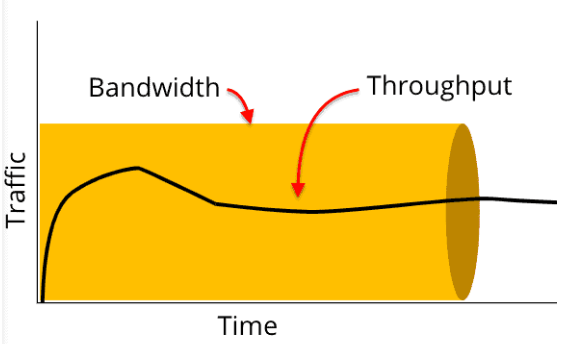
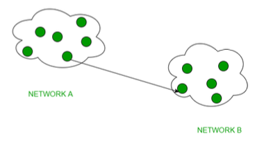
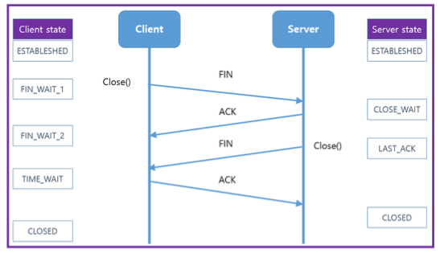

4주차
=

---

- [네트워크 기초](#네트워크-기초)
- [네트워크 토폴로지](#네트워크-토폴로지)
- [유니캐스트, 멀티캐스트, 브로드캐스트](#유니캐스트-멀티캐스트-브로드캐스트)
- [네트워크의 분류](#네트워크의-분류)
- [TCP/IP 4계층 모델](#TCPIP-4계층-모델)
- [애플리케이션 계층](#애플리케이션-계층)
- [전송 계층](#전송-계층)
- [인터넷 계층](#인터넷-계층)
- [3웨이 핸드셰이크](#3웨이-핸드셰이크)
- [4웨이 핸드셰이크와 TIME_WAIT](#4웨이-핸드셰이크와-TIMEWAIT)

---

# 네트워크 기초

## 처리량과 지연시간

### 네트워크

- 노드(node)와 링크(link)가 서로 연결되어 있으며 리소스를 공유하는 집합
    - 노드 : 서버, 라우터, 스위치 등 네트워크 장치
    - 링크(엣지) : 유선 또는 무선과 같은 연결매체 (와이파이나 LAN)

### 트래픽

- 특정 시점에 링크 내의 ‘흐르는’ 데이터의 양
    - ex) 서버에 저장된 파일을 클라이언트가 다운로드 시 발생되는 데이터의 누적량
    - 트래픽이 많아졌다. = 흐르는 데이터가 많아졌다.
    - 처리량이 많아졌다. = 처리되는 트래픽이 많아졌다.

### 처리량

- 처리량(throughput) : 링크 내에서 성공적으로 전달된 데이터의 양
- 보통 얼마만큼의 트래픽을 처리했는지 나타낸다.
- 많은 트래픽을 처리한다. = 많은 처리량을 가진다.
- 사용자들이 많이 접속할 때마다 커지는 트래픽, 네트워크 장치 간의 대역폭, 네트워크 중간에 발생하는 에러, 장치의 하드웨어 스펙에 영향을 받는다.

### 대역폭

- 대역폭(bandwidth) : 주어진 시간 동안 네트워크 연결을 통해 흐를 수 있는 최대 비트 수(최대 트래픽)
- 대략적인 최대 동시 접속자수 유추의 척도가 된다.

  

### 지연시간

- 지연시간(latency) : 요청이 처리되는 시간
- 어떤 메세지가 두 장치 사이를 왕복하는 데 걸린 시간

### RTT

- RTT(Roud Trip Time 왕복 지연 시간) : 신호를 전송하고 해당 신호의 수신확인에 걸린 시간을 더한 값
- 어떤 메세지가 두 장치 사이를 왕복하는 데 걸린 시간

---

# 네트워크 토폴로지

- 버스, 스타, 트리
- 네트워크를 설계할 때 고려하는 것
- 노드와 링크가 어떻게 구성되어 있는지에 대한 방식, 연결형태

### 토폴로지의 필요성

- 토폴로지는 병목형상을 해결하는 척도가 된다.

### 병목 현상

    

- 병목(bottleneck) 현상은 트래픽에 의해 데이터 흐름이 제한되는 상황을 의미한다.
    - 전체 시스템의 성능이나 용량이 하나의 구성 요소로 인해 제한받는 현상
- 핫스팟이라고도 한다.

### 버스 토폴로지

  

- 특징
    - 하나의 회선에 여러 개의 노드
    - 노드 추가, 삭제가 쉽다.
    - 설치 비용이 적다.
- 장점
    - 소규모 네트워크를 구축하기 매우 쉽다.
    - 한 노드에 장애가 발생해도 다른 노드에 영향 X
- 단점
    - 메인 링크에 많은 트래픽이 생기면 정체현상 발생 가능성이 높다.(패킷 손실율이 높다)
    - 메인 링크가 망가지면 큰 문제가 생긴다.

### 스타 토폴로지

  

- 특징
    - 중앙에 있는 노드를 기반으로 연결된 형태
    - 노드 추가, 삭제가 쉽다.
- 장점
    - 중앙 노드가 아닌 한 노드에 장애가 발생해도 다른 노드에 영향 X
    - 안정성이 높다.
        - 침해가 확장하기 어려운 구조
        - 중앙 노드를 무조건 거쳐야 한다. → 중앙 노드의 방화벽 등이 더욱 견고한 편
- 단점
    - 중앙 노드에 에러가 발생하면 큰 문제가 생긴다.

### 트리 토폴로지

  
  

- 특징
    - 트리 형태(계층적 토폴로지)
    - 노드의 추가, 삭제가 보통인 편(리프 노드를 기반으로 확장은 용이하나 다른 노드는 어렵다)
    - 버스 토폴로지와 스타 토폴로지의 하이브리드 형태
- 장점
    - 노드 확장이 용이하다(주로 리프 노드로 확장한다)
    - 리프노드의 에러는 나머지 부분에 영향을 미치지 않는다.
- 단점
    - 특정 노드 트래픽 집중 시 하위 노드에 영향이 간다.
    - 루트 노드에 문제가 생기면 전체 네트워크에 큰 문제가 생긴다.

### 링 형 토폴로지

  

- 특징
    - 고리 형태
    - 노드 추가, 삭제가 쉬움 (연결 리스트)
- 장점
    - 노드 수가 많아져도 데이터 손실이 없다.
    - 토큰을 기반으로 연속적으로 노드를 거치며 통신 권한 여부를 따지고 해당 권한이 없는 노드는 데이터를 전달받지 않는다.
- 단점
    - 링크 또는 노드가 하나만 에러가 발생해도 전체 네트워크에 영향
    - 토큰이 없는 노드는 통신에 참여를 못하며 데이터 공유가 안됨

### 메시 토폴로지

  

- 특징
    - 그물망 형태
    - 노드 추가, 삭제가 어렵다.
    - 풀(full)메시 토폴로지의 경우 n * (n - 1) / 2 의 회선이 필요하다. (대각선 공식)  
      \+ partially connected mesh topology
- 장점
    - 안정성이 높다.
    - 한 노드에 장애가 생겨도 다른 노드에 영향을 미치지 않는다.
    - 트래픽을 분산할 수 있다.
- 단점
    - 회선이 비효율적으로 많기 때문에 구축 비용이 비싸다.

---

# 유니캐스트, 멀티캐스트, 브로드캐스트

### 유니캐스트

  

- 1 : 1 통신
- 대표적으로 HTTP 통신이 있다.
- 가장 일반적인 네트워크 전송 형태

### 멀티 캐스트

  

- 1 : N 통신
- N이지만 모든 노드들에게 데이터를 전달하지는 않고 특정 그룹에게만 데이터를 전달한다.

### 브로드 캐스트

  

- 1 : N 통신
- 그룹이 아닌 연결되어있는 모든 노드에게 데이터를 전달한다.
- ex) ARP

---

# 네트워크의 분류

- 네트워크는 LAN, MAN, WAN 순으로 분류된다.
- LAN 이 가장 작은단위, WAN이 가장 큰 단위이며 보통은 반경, 속도의 크기를 기반으로 분류한다.
- 그러나 개념적으로 이해해서 분류하는게 중요하다.

### LAN

- local area network 근거리 통신망
- MAN, WAN 보다 높은 안정성과 속도를 가지고 있다.
- 소규모 네트워크 (집, 사무실) 에 적합하다. → 보통 허브나 스위치로 연결
- 하나의 논리적 주소인 IP를 기반으로 여러 개의 물리적 주소인 MAC 주소로 구별하는 네트워크

### MAN

- metropolitan area network 대도시 통신망
- 도시와 도시의 통신망을 의미하며 2개 이상의 LAN이 연결되어 구성된다.
- 라우터, 브릿지 등으로 연결된다.

### WAN

- wide area network 광역 통신망
- 국가와 국가와의 통신망을 뜻하며 인터넷이라고도 한다.
- 많은 라우터를 거쳐 다른 국가와도 연결된다.

---

# TCP/IP 4계층 모델

- 장치들이 인터넷 상에서 데이터를 주고받을 때 쓰는 독립적인 프로토콜의 집합(4개)
    - 프로토콜 :  절차를 포함한 통신규약
- TCP = Transmission Control Protocol
- IP = Internet Protocol
- 인터넷을 통해 데이터를 보낼 때 주로 TCP와 IP를 이용해서 보낸다.

### 계층 구조

    

- 애플리케이션 계층 (application)
    - HTTP, SMTP, SSH, FTP가 대표적이다.
    - 웹 서비스, 이메일 등 서비스를 실질적으로 사람들에게 제공하는 계층이다.
- 전송 계층(transport)
    - TCP, UDP가 대표적이다.
    - 애플리케이션 계층에서 받은 메세지를 기반으로 세그먼트 또는 데이터 그램으로 데이터를 쪼개고 데이터가 오류없이 순서대로 전달되도록 도움을 주는 계층이다.
- 인터넷 계층(network)
    - IP, ICMP, ARP가 대표적이다.
    - 한 노드에서 다른 노드로 전송 계층에서 받은 세그먼트 또는 데이터 그램을 패킷화하여 목적지로 전송하는 역할을 담당한다.
- 링크 계층(link)
    - 전선, 광섬유, 무선 등으로 데이터가 네트워크를 통해 물리적으로 전송되는 방식을 정의한다.

### 캡슐화와 비캡슐화

- 캡슐화
    - 송신자가 수신자에게 데이터를 보낼 때 데이터가 각 계층을 지나며 각 계층의 특징들이 담긴 헤더들이 붙여지는 과정을 의미한다.
    - ex) 전송 계층 → TCP 헤더, 네트워크 계층 → IP 주소 헤더 추가
- 비캡슐화
    - 캡슐화의 역과정
    - 하위 계층에서 상위계층으로 가며 각 계층의 헤더 부분을 제거하는 과정
    - 수신자 측에서는 이렇게 캡슐화된 데이터를 역순으로 제거하면서 응용계층까지 도달하는 것을 의미한다.

### PDU

- PDU(protocol data unit)란 TCP/IP 4계층을 기반으로 설명했을 때 각 계층의 데이터 단위를 의미한다.
- 어떠한 계층에서 계층으로 데이터가 전달될 때 한 덩어리의 단위
    - 애플리케이션 계층: 메시지
    - 전송 계층: 세그먼트(TCP), 데이터그램(UDP)
    - 인터넷 계층: 패킷
    - 링크 계층: 프레임(데이터 링크 계층), 비트(물리 계층)
- 세그먼트 : 적절한 크기로 쪼갠 조각 (세그먼트와 데이터그램의 의미는 같다)
- 패킷 : 세그먼트에 SP와 DP가 포함된 IP 헤더가 붙은 형태의 조각
- 프레임 : MAC주소 헤더와 CRC/체크섬 트레일러가 붙은 조각

### CRC/체크섬 트레일러

- 데이터의 오류감지를 위한 수학적 함수가 적용된 값들이 있는 필드
- 링크의 오류(과도한 트래픽 등) 로 인해 데이터 손상을 감지하는 역할을 한다.
- 이 과정에서 CRC와 체크섬 두 가지의 과정을 기반으로 데이터 전송오류 및 데이터무결성을 방지하게 된다.
- CRC : CRC-1, CRC-16 등의 알고리즘으로 나온 값을 통해 데이터 전송오류감지를 수행
- 체크섬 : MD5, SHA-256 등의 알고리즘으로 나온 값을 통해 데이터 무결성을 방지

### <U>OSI 7 계층과 TCP/IP 4계층의 차이</U>

  

- TCP/IP 계층과 달리 OSI 계층은 애플리케이션 계층을 세 개로 쪼개고 링크 계층을 데이터 링크 계층, 물리 계층으로 나눠서 표현한다.
- 인터넷 계층을 네트워크 계층으로 부른다.

## MTU, MSS, PMTUD

### MTU(Maximum Transmission Unit)

- 네트워크에 연결된 장치가 받아들일 수 있는 최대 데이터 패킷의 크기
- 이 크기를 기준으로 데이터는 쪼개져서 패킷화 된다.
- 네트워크 경로 상에 있는 아무 장치나 MTU보다 패킷이 크면 그 패킷은 분할될 수 있다.
- 패킷이 분할되지 않는 경우
    - 패킷을 분할 할 수 없어 네트워크 경로 상에 잇는 어떠한 라우터나 장치의 MTU를 초과할 때 분할해서 전달하는 것이 아니라 전달을 아예 하지 않을 수 도 있다.
    - IPv6 → 분할을 허용하지 않는다.
    - IPv4 → IPv4 헤더에는 `flags`라는 필드가 있는데 여기서 bit 가 1이 되면 “Dont’ Fragment” 플래그가 활성화 된다는 의미이다. 이 때 분할은 불가능 하다.

### MTU와 MSS의 차이

- MTU : IP헤더와 TCP헤더의 크기까지 합친다.
- MSS(Maximum Segment Size) : 데이터의 크기(payload 크기)만을 가리킨다.
- 일반적으로 MTU는 1500byte, MSS는 1460byte 이다.
    - 데이터를 보낼 때 MTU가 1500이라도 데이터는 보통 1460 이하의 크기로 보내야 전달이 된다.
    - (TCP를 쓰지 않는 등의 이유로 달라질 수 도 있다.)

### PMTUD(Path MTU Discovery)

- 수신자와 송신자의 경로 상에서 장치가 패킷을 누락한 경우 테스트 패킷의 크기를 낮추면서 MTU에 맞게끔 반복해서 보내는 과정

---

# 애플리케이션 계층

- HTTP, SMTP, SSH, FTP가 대표적이다.
- 웹 서비스, 이메일 등 서비스를 실질적으로 사람들에게 제공하는 계층

### HTTP

- HTTP(Hypertext Transfer Protocol)은 처음에는 서버와 브라우저간에 데이터를 주고 받기 위해 설계된 프로토콜이었다.
- 현재는 브라우저 뿐만 아니라 서버와 서버간의 통신할 때도 많이 이용한다.
- HTTP는 헤더를 통한 확장이 쉽다.
    - ex) 헤더값에다가 어떠한 값을 넣어서 HTTP요청을 할 때 쉽게 다른 값을 추가할 수 있다.
- HTTP는 stateless하다.
    - 동일한 연결에서 연속적으로 수행되는 두 요청 사이에 연속적인 상태(state)값은 없다.
    - 서버가 상태를 저장하지 않는 상태

### SSH

- SSH(Secure Shell Protocol)은 보안되지 않은 네트워크에서 네트워크 서비스를 안전하게 운영하기 위한 암호화 네트워크 프로토콜

### FTP

- FTP(File Transfer Protocol)는 노드와 노드 간의 파일을 전송하는데 사용되는 프로토콜
- 현재는 파일을 암호화해서 전송하는 FTPS 또는 SFTP로 대체되고 있다.

### SMTP

- SMTP(Simple Mail Transfer Protocol)는 인터넷을 통해 메일을 보낼 때 사용되는 프로토콜
- 보통 서비스를 운영하면 메일링 서비스를 하게 되는데 node.js를 통해 메일을 보낸다면 HTTP가 아닌 SMTP를 통해 보내야 한다.

---

# 전송 계층

- TCP와 UDP가 대표적
- 애플리케이션 계층에서 받은 메세지를 기반으로 세그먼트 또는 데이터그램으로 데이터를 쪼개고 데이터가 오류 없이 순서대로 전달되도록 도움을 주는 계층

### TCP

- 가상회선 패킷 교환방식을 사용한다.
- 오류검사 매커니즘이 다양하다.
    1. 재전송 보장 : 시간 초과 기간이 지나면 서버는 전달되지 않은 데이터에 대해 재전송을 시도
    2. 체크섬 시도 : 체크섬을 통해 무결성을 평가한다. 즉, 송신된 데이터의 체크섬과 수신된 데이터의 체크섬 값을 비교해서 올바르게 왔는지를 확인한다.
- 헤더
    - 20 ~ 60바이트로 가변적

### UDP

- 데이터그램 패킷 교환방식을 사용한다.
    - 그냥 보낸다.
    - 순서가 보장되지 않는다.
- 오류 검사는 단순한 체크섬만 지원한다.
- 헤더
    - 32비트(8바이트)로 고정길이

### <U>TCP와 UDP의 차이</U>

|            | TCP(전송 제어 프로토콜)                                              | UDP(데이터그램 프로토콜)                                            |
|------------|--------------------------------------------------------------|------------------------------------------------------------|
| 패킷 교환 방식   | 가상회선 패킷 교환방식                                                 | 데이터그램 패킷 교환방식                                              |
| 신뢰성        | O                                                            | X                                                          |
| 오류검사       | 재전송, 체크섬                                                     | 체크섬                                                        |
| 패킷의 순서보장   | O                                                            | X                                                          |
| 헤더 길이      | 20~60 바이트 가변 길이                                              | 8바이트 고정 길이                                                 |
| 연결 보장      | 연결을 보장한다. 3웨이-핸드셰이크로 연결을 맺고 4웨이-핸드셰이크로 연결을 해제하는 작업이 필요 | 연결을 보장하지 않는다. 데이터를 그냥 보낸다. 연결을 유지하고 해제하는데 드는 비용이 없다. |
| 브로드 캐스트 지원 | X                                                            | O                                                          |
| 속도         | 느림                                                           | 빠름                                                         |

---

# 인터넷 계층

- IP, ICMP, ARP가 대표적이며 한 노드에서 다른 노드로 전송 계층에서 받은 세그먼트 또는 데이터그램을 패킷화하여 전송한다.

### ICMP

- ICMP(Internet Control Message Protocol)는 노드와 노드 사이에서 통신이 잘 되나 확인할 때 쓰는 프로토콜이다.
- 이는 데이터를 교환하는데 사용되지 않는 프로토콜이다. (단순 확인)
- 일반적으로 테스팅에 사용된다. ex) ping test
- IP와는 달리 TCP 또는 UDP와 같은 전송 계층 프로토콜과 연관되지 않는다.
    - 독립적인 비연결형 프로토콜로 비연결형 프로토콜 기반으로 구축된다.

---

# 3웨이 핸드셰이크

    

1. SYN 단계 (synchronization 연결 요청 플래그)

   - 클라이언트는 서버에 클라이언트의 ISN을 담아 SYN을 보낸다.

2. SYN + ACK 단계

   - 서버는 클라이언트의 SYN을 수신하고 서버의 ISN을 보내며 승인 번호로 클라이언트의 ISN + 1을 보낸다.

3. ACK 단계 (acknowledgement 응답 플래그)

   - 클라이언트는 서버의 ISN + 1 값인 승인번호를 담아 ACK를 서버에 보낸다.

### ISN

- 여러 번 통신할 때마다 통신끼리 충돌되지 않게끔 하기 위해 부여하는 고유한 번호
- TCP 기반 데이터 통신에서 각각의 새 연결에 할당 된 고유한 32 비트 시퀀스 번호를 나타낸다.
- TCP 연결을 통해 전송되는 다른 데이터 바 이트와 충돌하지 않는 시퀀스 번호를 할당하는 데 도움이 된다.

### 클라이언트와 서버의 상태

- TCP 연결 시
    - 클라이언트는 closed, syn-sent, established가 된다.
    - 서버는 closed, listen, syn_received, established 상태가 된다.

  

- 이러한 서버와 클라이언트 간의 연결 설정 과정이 있기 때문에 “TCP는 신뢰성이 있다”라고 한다.
    - 이러한 과정이 없는 UDP는 신뢰성이 없다.

---

# 4웨이 핸드셰이크와 TIME_WAIT

  

1. 먼저 클라이언트가 연결을 닫으려고 할 때 FIN으로 설정된 세그먼트를 보낸다. 그리고 클라이언트는 `FIN_WAIT_1` 상태로 들어가고 서버의 응답을 기다린다.
2. 서버는 클라이언트로 ACK라는 승인 세그먼트를 보내고 `CLOSE_WAIT` 상태에 들어간다. 클라이언트가 세그먼트를 받으면 `FIN_WAIT_2` 상태에 들어간다.
3. 서버는 `LAST_ACK`상태가 되며 일정 시간 이후에 클라이언트에 FIN이라는 세그먼트를 보낸다.
4. 클라이언트는 `TIME_WAIT` 상태가 되고 다시 서버로 ACK를 보내서 서버는 `CLOSED`상태가 되며 이후 클라이언트는 어느 정도 시간(TIME_WAIT으로 설정된 시간)을 대기한 후 연결이 닫힌다.

### TIME_WAIT의 필요성

- 지연 패킷을 받기 위함 → 데이터의 무결성을 지킨다. (일관성, 정확성)
    - 기본적으로 MSL은 2분
- 소켓이 바로 소멸되지 않고 일정 시간 유지되는 상태를 의미
- 연결을 올바르게 닫았는지 보장하기 위함
    - CLOSED가 아닌 LAST_ACK로 되어있으면 그 다음 연결 때 오류가 나타난다.