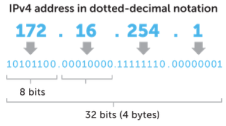

5주차
=

# 라우팅

- 네트워크에서 데이터를 보낼 때 최적의 경로를 선택하는 과정이며 라우터가 이를 수행
- 데이터는 보통 출발지에서 목적지로 가는 동안 여러 개의 라우터를 거치며 여러 번의 라우팅을 수행
    - 라우팅은 보통 초당 수백만번 일어난다.

### 라우터

- 네트워크 사이에서 데이터를 전달하는 장치이며 보통 둘 이상의 서로 다른 네트워크에 연결된다.
- 데이터를 목적지로 보낼 때 최적의 경로를 결정하고 경로가 결정되면 해당 경로로 데이터를 넘겨주는 일(라우팅)을 수행한다.
- 라우터는 라우팅 테이블을 기반으로 데이터를 다음 목적지에게 전달한다.

### 라우팅 테이블

- IP 주소를 기반으로 라우터의 위치를 저장한 테이블 또는 데이터베이스
- 다양한 네트워크에 대한 정보와 해당 네트워크에 연결하는 방법이 포함되어 있다.
- 구성 요소
    - 네트워크 대상(Network Destination) : 목적지 네트워크의 IP 주소
    - 서브넷 마스크(Netmask) : 대상 주소를 설명할 때 쓰이는 값
    - 게이트웨이(Gateway): 이 장치와 연결되어있는 홉, 패킷이 전달되는 다음 IP주소
        - 만약 목적지가 로컬 네트워크라면 connected
        - 다른 네트워크라면 해당 네트워크의 게이트웨이를 가리킴
    - 인터페이스(Interface) : 게이트웨이로 가기 위해 거치는 장치
    - 메트릭(Metric) : 우선순위라고도 불리며 패킷 전송을 위해 최적의 경로가 선택되도록 참고되는 값
        - 동일한 라우팅테이블 요소가 2개 있을 때 이 값이 낮은 요소가 선택된다.
        - 일반적으로 홉 수(hop count)가 들어가며 지연시간, 처리량 등이 들어갈 수 있다.

### 게이트웨이

- 프로토콜 변환기
- 네트워크와 네트워크를 잇는 장치이며 라우터와 하는 기능 자체가 비슷하다.

### 홉

- 네트워크에서 출발지와 목적지 사이에 위치한 장치를 의미한다.
- 홉 카운트 : 데이터가 출발지와 목적지 사이에서 통과해야 하는 홉의 개수
- 라우팅을 홉바이홉 통신이라고도 한다.

---

# IP, MAC, ARP, RARP

### IP 주소

- IP 주소(Internet Protocol address)는 논리적 주소
- 컴퓨터 네트워크에서 장치들이 서로를 인식하고 통신을 하기 위해 사용하는 특수한 번호
- IP를 기반으로 통신한다고 하지만 사실상 그 밑에 물리적 주소인 MAC 주소를 통해 통신한다.

### MAC 주소

- MAC 주소(Media Access Control Address)는 네트워크 인터페이스에 할당된 고유 식별자
- 보통 장치의 NIC에 할당된다.
- 48비트로 이루어져있으며 24비트의 OUI와 24비트의 UAA로 이루어져있다.

    

    - OUI : IEEE에서 할당한 제조사 코드
    - UAA : 제조사에서 구별되는 코드
- 보틍은 유일하지만 유일하지 않을 수도 있다.
    - 실수 또는 의도적으로 UAA를 중복되게 만들 수도 있다. (동일 네트워크에서만 중복되지 않으면 문제 X)
    - NIC에 고정된 MAC 주소를 변경할 수는 있으나 하지 않는 것을 권장하며 하기 어렵게 한 OS도 있다.

### ARP와 RARP

- ARP (Address Resolution Protocol)
    - IP주소를 이용해 상대방의 MAC주소를 알아오는 프로토콜
    - ARP 요청-응답이 완료되면 ARP table에 각 노드의 ARP 정보를 저장한다.
    - 요청 : 특정 IP주소에 대해 MAC주소를 요구, MAC 주소를 알지 못하기 때문에 브로드캐스트 전송
    - 응답 : 요청한 MAC 주소 정보를 유니캐스트로 전송
- RARP (Reverse Address Resolution Protocol)
    - MAC주소에 해당하는 IP 주소를 알아오는 프로토콜
    - 요청 : MAC 정보를 담고있는 RARP 정보를 브로드캐스트로 전송
    - 응답 : 요청자의 IP 주소를 담은 RARP 응답을 유니캐스트로 전송
- MAC 주소는 ARP를 통해 파악이 가능하다.
- ARP를 통해 논리적 주소인 IP 주소를 물리적 주소인 MAC 주소로 변환
- RARP(Reverse~)를 통해 물리적 주소인 MAC 주소를 논리적 주소인 IP 주소로 변환하기도 한다.

      

- ARP의 과정
    1. 해당 IP주소에 맞는 MAC주소를 찾기 위해 해당 데이터를 ‘브로드캐스팅’을 통해 연결된 모든 네트워크에 있는 장치한테 모두 보낸다.
    2. 맞는 장치가 있다면 해당 장치는 보낸 장치에게 유니캐스트로 데이터를 전달해 주소를 찾게 된다.

---

# IP 주소체계

### IPv4

    

- 32비트 → 2^32개의 주소(41억 9천만) 표현 가능
- 8비트 단위(옥텟)로 점을 직어 4개로 구분하며 8비트를 10진수로 표현
- 부족하기 때문에 NAT, 서브네팅 등 여러 부가적인 기술이 필요하다.

### IPv6

    

- 128비트 → 2^128개의 주소 표현 가능
  - 많은 주소 처리가 가능하기에 NAT, 서브네팅이 필요 X
- 16비틕 8개로 구분
  - 16비트는 16진수로 변환되어 콜론(:)으로 구분하여 표시
  - 앞의 연속되는 0은 생략가능

    

- 앞의 64비트는 네트워크 주소, 뒤 64비트는 인터페이스 주소
- IPSec이 내장되어 있다.
  - IPSec : 데이터 패킷을 암호화하는 보안 네트워크 프로토콜 제품군
- 단순해진 헤더 포맷
  - IPv4 헤더의 불필요한 필드를 제거하여 보다 빠른 처리 가능

### IPv4와 IPv6의 차이점

|  | IPv4 | IPv6                                                                                                                |
| --- | --- |---------------------------------------------------------------------------------------------------------------------|
| 체크섬 | 있다. | 없다. 헤더의 효율화를 위해 CRC 제외 상위 프로토콜(TCP,UDP)에서 이미 체크섬이 있기 때문에 제거 가능 (UDP = 체크섬 필드 선택 / UDP + IPv6 = 체크섬 필드 필수 ) |
| 헤더 길이 | 가변 길이 | 고정 길이(40바이트) 인터넷 헤더길이에 대한 정보, 식별, 플래그 등이 삭제되었다.                                                                  |
| TTL | 기존방식 | HOP limit으로 대체됨                                                                                                     |
| 속도 |  | 주소 커버리지 높고, 불필요한 헤더가 제거되어 일반적으로 더 빠르다. 그러나 더 큰 패킷 크기로 인해 일부 사용 사례에서는 느려질 수 있다.                                   |
- CRC
  - 순환 중복 검사
  - 네트워크 상에서 데이터에 오류가 있는지 확인하기 위한 체크값을 결정하는 방식
  - 데이터를 전송하기 전에 주어진 데이터의 값에 따라 CRC값을 계산하여 데이터에 붙여 전송
  - 데이터 전송이 끝난 후 받은 데이터의 값으로 다시 CRC값을 계산
  - 이어서 두 값을 비교하고, 다르면 데이터 전송과정에서 오류가 덧붙여 전송된 것임을 알 수 있다.
- TTL (Time To Live)
  - 패킷이 네트워크에서 무환순환하지 않도록 하는 변수
  - 패킷이 네트워크에서 라우터를 거칠 때마다 TTL 값이 1씩 감소한다.
  - 값이 0이 되면 패킷이 폐기된다.

---

# 클래스풀

- (IPv4를 기준)
- IP주소는 인터넷 주소로 네트워크주소, 호스트주소 두 부분으로 나뉜다.
  - 네트워크 주소 : 호스트들을 모은 네트워크
    - 네트워크 주소가 동일 → 로컬 네트워크
  - 호스트 주소 : 호스트를 구분하기 위한 주소 (호스트 = 컴퓨터 네트워크에 연결된 컴퓨터나 기타 장치)
- 정의
  - 네트워크 주소를 매기고 그에 따라 네트워크의 크기를 다르게 구분하여 클래스를 할당하는 주소 체계

      

    - 구분하는 기준자(1, 2, 3 옥텟)을 서브넷마스크라고 함

### 클래스 A

  

- 2^24 – 2 = 한 네트워크당 16,777,214 호스트 ID(약 1600만개) / 0
- 네트워크 주소 범위 : 1 ~ 126 로 시작
  - 원래는 127.255.255.255까지 포함하지만 127.X는 루프백주소 → 포함 X
  - 0.0.0.0도 특수주소이므로 포함 X (알 수 없는 대상에 달아 놓는 임시 주소)

### 클래스B

      

- 1. 2^16–2 = 한 네트워크 당 65534 호스트 ID(6만5천개) / 10
- 네트워크 주소 범위 : 128 ~ 191로 시작

### 클래스C

  

- 2^8–2= 한 네트워크 당 254 호스트 ID / 110
- 네트워크 주소 범위 : 192 ~ 223로 시작

### 항상 주소 중 2개를 빼는 이유

- 맨 앞자리는 네트워크 주소로 남겨두며 마지막 주소는 브로드캐스팅 주소로 남겨놓는다.

### 클래스풀의 문제점

- 네트워크의 크기가 작은 경우 큰 네트워크를 필요로 하는 조직은 여러개를 확보해야 하는 어려움
- 작은 네트워크가 필요한 조직의 경우 너무 많은 IP를 가져가므로 IP가 낭비될 수 있다.

---

# 클래스리스

- 클래스풀의 단점을 해결하기 위해 등장
- 클래스로 나누는 것이 아닌 서브넷마스크를 중심으로 어디까지가 네트워크 주소이고 호스트주소인지 나눈다.
  - 서브네팅 : 네트워크를 나눈다는 의미
  - 서브넷 : 서브네트워크, 쪼개진 네트워크
  - 서브넷마스크 : 서브네트워크를 위한 비트마스크
- 현재 우리가 사용하는 주소체계는 클래스리스를 사용한다.

### 서브넷마스크

- 네트워크 주소 부분만 모두 1, 호스트 주소 부분은 0으로 설정해서 나눈다.

---

# 공인 IP(public IP), 사설 IP(private IP), NAT

- IP주소의 부족을 공인(public IP)와 사설IP(private IP)로 나누고 중간에 NAT이라는 기술을 통해 해결
- NAT(Network Address Translation)는 패킷이 트래픽 라우팅 장치를 통해 전송되는동안 패킷의 IP주소를 변경, IP 주소를 다른 IP 주소로 매핑하는 방법이다.
- 이를 통해 내부 네트워크 IP를 노출하지 않을 수 있다.
- 공유기의 경우, 인터넷 회선 하나를 개통하고 이를 와이파이로 만들어서 여러 대의 호스트가 하나의 공인 IP 주소를 사용하여 인터넷에 접속한다. → NAT 기능