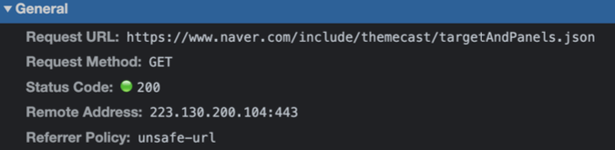
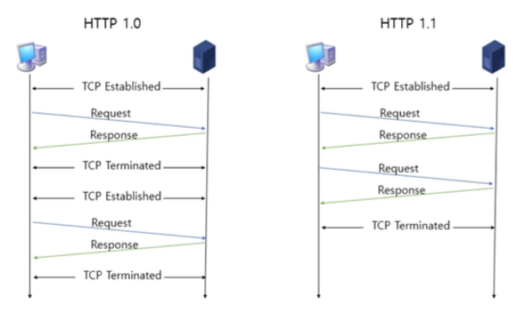
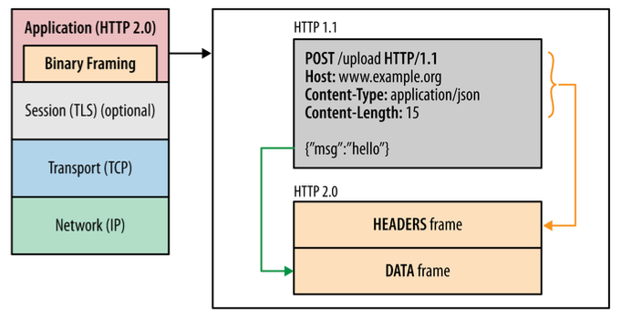
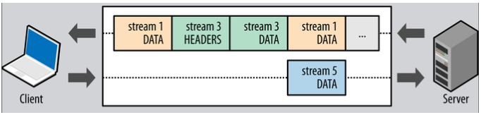
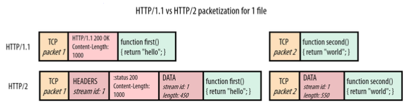
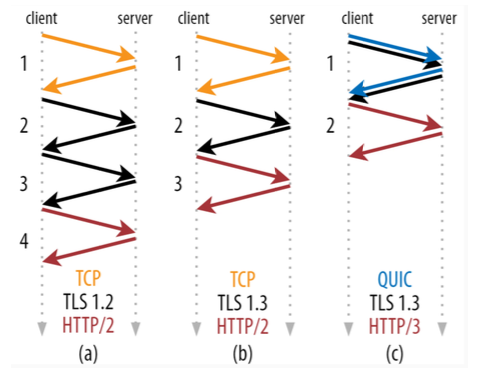
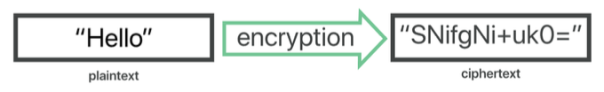
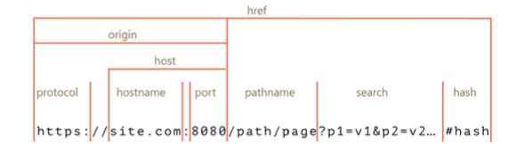
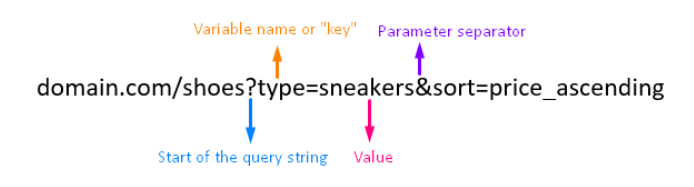
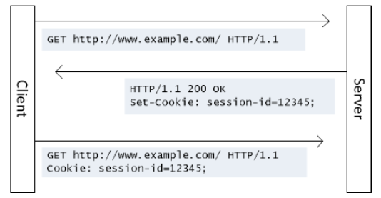

6주차
=

---

- [HTTP 헤더](#HTTP-헤더)
- [HTTP 1.0 ~ 3](#HTTP-10--3)
- [HTTP와 TLS](#HTTP와-TLS)
- [로컬 스토리지](#로컬-스토리지)
- [세션 스토리지](#세션-스토리지)
- [쿠키](#쿠키)
- [로컬 스토리지, 세션 스토리지, 쿠키의 공통점과 차이점](#로컬-스토리지-세션-스토리지-쿠키의-공통점과-차이점)

---

# HTTP 헤더

- 사용자가 HTTP 요청을 하게 되면 헤더와 바디를 주고받는다.
- Resoponse탭에 있는 컨텐츠 = body / Headers에 있는 컨텐츠 = Header
- 서버에서 설정하는 헤더 = 응답 헤더 / 클라이언트에서 설정한 헤더 = 요청 헤더

### 일반 헤더

- 요청한 URL, 요청 메서드, 해당 자원을 요청할 때 해당 자원의 출처를 나타내는 URL을 노출시킬지 말지를 정하는 보안 정도가 설정되어있는 Referrer Policy 등이 들어간다.

  

### 요청 헤더

- 클라언트가 서버에 요청할 때 클라이언트가 설정하는 또는 자동으로 설정되는 헤더
- 메서드, 클라이언트의 OS, 브라우저 정보 등이 담긴다.

### 응답 헤더

- 서버가 클라이언트에게 응답을 보낼 때 설정하는 또는 자동으로 설정되는 헤더
- 서버의 소프트웨어 정보 등이 담긴다.
- ex) nginx를 프록시 서버로 두었다면 해당 정보가 표기된다.
    - 그러나 대부분의 서버는 일반적으로 해커가 서버에서 어떤 소프트웨어가 사용되고 있는지 알기 어렵게 하기 위해 서버 정보를 숨긴다.

### 헤더의 유연성

- HTTP 헤더는 굉장히 유연하게 설계가 되어 있어 커스텀하게 만들 수 있다.
- 그러나 보통은 지정된 key값에 value를 담아서 헤더를 설정한다.

---

# HTTP 1.0 ~ 3

- HTTP 요청이라는 기술은 1.0부터 시작해 지금은 3까지 많은 발전을 거듭해왔다.

## HTTP/1.0

- 수명이 짧은 연결
- HTTP 요청은 자체 요청에서 완료된다.
- 각 HTTP 요청 당 TCP 핸드셰이크가 발생되며 기본적으로 한 연결 당 하나의 요청을 처리하도록 설계
- 한번 연결할 때 마다 TCP연결을 계속해야 하니 RTT가 늘어나는 문제점이 있었다.
    - RTT(Round Trip Time : 왕복 지연 시간)
    - 신호를 전송하고 해당 신호의 수신확인에 걸린 시간을 더한 값이자 어떤 메세지가 두 장치 사이를 왕복하는 데 걸린 시간

## HTTP/1.1

- HTTP/1.1은 HTTP/1.0의 단점을 보완한 프로토콜이다. 1.0과는 크게 3가지의 차이점이 있다.

### 1. keep-alive default

- 매번 데이터를 요청할 때마다 TCP 연결을 하는게 아닌 한 번 연결해놓고 계속해서 데이터를 받을 수 있게 만들었다.
- 이는 keep-alive 옵션을 기본옵션으로 하면서 가능해졌다.

      

### 2. 호스트 헤더

- HTTP/1.0은 서버가 하나의 호스트만 가진다고 가정하기 때문에 HTTP/1.0은 헤더에 호스트를 포함하지 않았다.
- 이 때문에 HTTP/1.0은 하나의 IP에 하나의 호스트만 가질 수 있었다.
- 그러나 사실 서버는 여러 개의 호스트를 가질 수 있으며 이런 유연성을 위해 HTTP/1.1은 헤더에 특정 호스트를 포함할 수 있게 변경되었으며 항상 호스트를 포함해서 요청하도록 바뀌었다.

### 3. 대역폭 최적화

- HTTP/1.0의 경우 어떠한 파일을 다운로드 받다가 연결이 끊기면 다시 다운로드 받는 것이 불가능했다.
- 이를 다시 다운로드 받을 수 있게 바뀌었다.
- Range:bytes=5000- 라는 헤더를 추가 → 다운로드 재개 요청

### 요청을 줄이기 위한 기술

- HTTP/1.1로 발전했음에도 불구하고 서버 요청할 때마다 RTT는 계쏙해서 증가하기에 요청을 줄이기 위한 여러 기술들이 있었다.
- 이미지 스프라이트(image sprite), 코드 압축, Base64 인코딩 등
- HTTP버전이 올라간 뒤에도 이러한 기술들을 같이 쓰고는 한다.

### 이미지 스프라이트

- 수 많은 이미지를 하나의 이미지로 만들어 하나의 이미지만 다운받아놓고 이를 통해 수 많은 이미지를 다운받는 듯한 효과를 내는 것

    

### 코드 압축

- 띄어쓰기, 개행문자 등을 줄여서 코드를 짧게 만드는 것 → 이래서 CSS 파일이 한 줄에 있던것이었나..?

### 이미지 Base64 인코딩

- 이미지 파일을 64진법으로 이루어진 문자열로 인코딩해서 이미지 서버에 대한 HTTP 요청을 할 필요가 없이 만드는 것
- 그러나 Base64 인코딩을 할 경우 파일 크기가 37퍼센트 더 커지는 단점이 있었다.

### HTTP/1.1의 고질적인 문제 : HOL

- HOL(Head Of Line Blocking)과 무거운 헤더를 가지는 문제점이 있었고 이를 해결하지 못했다.
    - HOL : 네트워크에서 같은 큐에 있는 패킷이 그 첫번째 패킷에 의해 지연될 때 발생하는 성능 저하 현상

## HTTP/2

- 2009년 구글은 HTTP/1.1의 한계를 극복하기 위해 SPDY 프로토콜을 개발했다.
- 이 후 2015년, SPDY를 기반으로 하는 HTTP/2 프로토콜을 만들었다.

### 바이너리 포맷 계층

- 애플리케이션 계층과 전송 계층 사이에 바이너리 포맷 계층을 추가한다.
- HTTP 1.0은 일반 텍스트 메세지를 전송하고 줄바꿈으로 데이터를 나눴다면 HTTP 2.0은 0과 1로 이루어진 바이너리 데이터로 변경되었고 더 작은 메세지가 프레임으로 캡슐화 되어서 전송된다.

    

### 멀티플렉싱

- 단일 TCP 연결의 여러 스트림에서 여러 HTTP 요청과 응답을 비동기적으로 보낼 수 있다. 이를 통해 HOL을 해결한다.
- HTTP/1.1에서는 병렬요청을 하려면 다중 TCP연결을 통해서 하고 일반적으로는 TCP연결 하나 당 병렬 요청은 불가능했다.
- 이를 HTTP/2.0에서는 리소스를 작은 프레임으로 나누고 이를 스트림으로 프레임을 전달한다.
- 각가의 프레임은 스트림ID, 해당 chunk의 크기를 나타내는 프레임이 추가되었기때문에 작게 나눠서 다운로드가 되더라도 결과적으로 응답데이터에서는 올바른 순서로 재조립할 수 있게 된다.

    

    

### 서버 푸시

- 서버가 리소스를 클라이언트에 푸시
- 요청된 html파일과 함께 다른 개체를 별도로 보낼 수 있다.
- 만약 요청한 html에 css가 포함되어 있다면 별도 요청없이 css를 같이 보낼 수 있다.

### 헤더 압축

- HTTP/1.1에서는 무거운 헤더가 있었지만 이를 허프만 인코딩 압축 방법 등으로 압축시킨다.
- 똑같은 서버에서 2개의 이미지를 준다고 했을 때 중복되는 헤더는 제외한 채 보내고 해당 공통 필드로 헤더를 재구성하며 중복되지 않은 헤더값은 허프만 인코딩 압축 방법으로 압축해 전송한다.

### 우선순위

- 서버에서 원하는 순서대로 우선순위를 정해 리소스를 전달할 수 있다.

## HTTP/3

- HTTP/2는 여전히 TCP를 사용하기 때문에 초기 연결에 대한 RTT로 인한 지연시간이라는 문제점이 있었고 이를 해결한 버전
- QUIC(Quick UDP Internet Connections)이라는 계층 위에서 돌아간다.
- TCP 기반이 아닌 UDP 기반으로 돌아간다.
- HTTP/2에서 장점이었던 멀티플렉싱 등을 가지고 있다.
- 초기 연결설정 시 지연시간이 감소하는 대표적 특성을 가지고 있다.
- TCP의 경우 3 - RTT가 필요했었으나, QUIC의 경우 1 - RTT만 필요하다.
- HTTP/2나 HTTP/3 는 HTTPS 위에서 돌아가는데 TLS로 암호와통신을 구축할 때의 핸드셰이크를 활용한다.
- 이를 기반으로 1 - RTT만에 연결을 성립할 수 있다.

    

- 전송된 패킷이 손실 되었다면 수신측에서 에러를 검출하고 수정하는 방식이며 열악한 네트워크 환경에서도 낮은 패킷 손실률을 자랑하는 순방향 오류 수정 메커니즘(FEC)이라는 특징을 가진다.

---

# HTTP와 TLS

## 암호화

- 암호화는 승인된 당사자만 정보를 이해할 수 있도록 데이터를 “스크램블”하는 방법
- 이를 복호화하려면 송신자와 수신자가 서로 동의한 “키”가 필요하다.
- 이를 만들기 위해 키가 쓰이기도 한다.

  

- plaintext + key = ciphertext
- ciphertext = plaintext + key
- ex) DES, AES

### 스크램블

- 각 단어나 문자를 패턴에 따라 암호화하는 것이 아니라 무작위 방식으로 개별 데이터 비트를 섞는 것

### 대칭 암호화

- 키를 하나만 사용하는 암호화 방법
- 특정한 키로 암호화 한다고 가정해보면, 해독을 할 때에도 동일한 키로 해독하는 것

### 비대칭 암호화

- 공개키 암호화라고도 불린다.
- 두개의 다른키 (공개키, 개인키)로 데이터를 암호화하거나 서명하고 키 중 하나인 공개키를 누구나 사용할 수 있도록 하는 방법
- 공개키로 암호화된 데이터는 개인키로만 복호화할 수 있게 한다.
- RSA, DH(Diffe-Hellman)
- HTTPS를 가능하게 하는 프로토콜인 TLS는 부분적으로 비대칭 암호화를 쓴다. (TLS는 대칭암호화도 쓴다)
    - HTTLS = HTTP + TLS

### 암호화의 필요성

- 의도된 수신자 또는 송신자를 제외하고는 통신을 하이재킹하여 읽을 수 없게 한다.
- 이를 통해 민감한 데이터를 유출을 방지하고 데이터의 무결성을 보장한다.

---

## TLS

---

# 로컬 스토리지

- 웹 스토리지 객체로 브라우저 내에 {key : value} 형태로 오리진에 종속되어 저장되는 데이터
    - 오리진이 같은 브라우저 내에서 공유된다.
- 하나의 키에 오로지 하나의 값만 저장
- 데이터는 사용자가 브라우저에서 수동으로 삭제하지 않는 한 평생 동안 로컬 저장소에 저장되며 만료 날짜가 없다.
- 사용자가 창이나 탭을 닫아도, 컴퓨터를 종료해도 만료되지 않는다.
- 최대 저장 용량은 5MB
- 보통 사용자의 행위를 기억할 때, 로그인을 유지하기 위한 값 등으로 사용되며 로컬 스토리지 데이터는 자동으로 서버로 전송되지 않는다. (↔ 쿠키는 자동 전송된다)

### 사용법

- 설정 : `localStorage.setItem(key, value);`
- key에 해당하는 value가져오기 : `localStorage.getItem(key);`
- 제거 : `localStorage.removeItem(key);`
- 전체제거 : `localStorage.clear();`

### 로컬 스토리지와 오리진

  

  

---

# 세션 스토리지

- 로컬 스토리지와 매우 유사
- 세션 스토리지는 웹 스토리지 객체로 브라우저 내에 {key : value} 형태로 오리진에 종속되어 저장되는 데이터
    - 오리진이 같은 브라우저 내에서 공유된다.
- 하나의 키에 오로지 하나의 값만 저장된다.
- 최대 저장용량은 5MB 이내 → 여기까지 로컬 스토리지와 똑같다.
- 사용자가 브라우저에서 탭을 닫으면 데이터는 만료된다.
- 보통은 세션 스토리지보다는 로컬 스토리지를 많이 쓴다.

### 사용법

- 설정 : `sessionStorage.setItem(key, value);`
- 탐색 : `sessionStorage.getItem(key);`
- 제거 : `sessionStorage.removeItem(key);`
- 전체제거 : `sessionStorage.clear();`

---

# 쿠키

- 쿠키는 브라우저에 저장된 데이터 조각
- 클라이언트에서 먼저 설정할 수도 있고 서버에서 먼저 설정할 수 있으나 보통은 서버에서 먼저 설정해서 쿠키를 만드는게 일반적이다.
- 서버에서 응답 헤더로 Set-Cookie로 설정해서 쿠키를 보내면 그 때 부터 클라이언트에서 요청헤더 Cookie에 설정되어 자동으로 서버에 전달되게 되고 브라우저에도 저장되게 된다.
    - HTTP 헤더를 통해 클라이언트 또는 서버가 HTTP 요청 또는 응답 할 때 추가 정보를 전달할 수 있다.

  

- 쿠키는 클라이언트와 서버 둘 다 조작이 가능하지만 보통 서버에서 만료기한 등을 설정 및 컨트롤 한다.
- 저장 용량은 최대 4KB까지 가능하다.
- 보통 로그인, 장바구니, 사용자 커스터마이징, 사용자 행동분석(주로 개인화된 광고에 활용되는 것들)에 사용된다.

### 클라이언트에서도 설정 가능한 쿠키

- 클라이언트에서 자바스크립트 - `document.cookie`를 통해 쿠키를 설정할 수 있고 보낼 때도 이런식으로 header - Cookie에 값을 정해서 보낼 수도 있다. (권장하지는 않는다)
    - 이러면 쿠키에 대한 제어권을 클라이언트에게 두게되는데 쿠키에는 보통 민감한 정보들이 담길 수 있기 때문에 이 제어권에 관한 것을 클라이언트가 아닌 서버에 두게 만들어야 한다.

### 세션 쿠키

- Expire 또는 Max-Age 속성을 지정하지 않은 것
- 브라우저가 종료되면 쿠키도 사라진다.

### 영구 쿠키

- Expire 또는 Max-Age 속성을 지정해서 특정 날짜 또는 일정 기간이 지나면 삭제되게 만든 쿠키
- 브라우저를 닫을 때 만료되지 않는다.

### 문법

- `Set-Cookie: <cookie-name>=<cookie-value>`
- `Set-Cookie: <cookie-name>=<cookie-value>; Expires=<date>`
- `Set-Cookie: <cookie-name>=<cookie-value>; Max-Age=<non-zero-digit>`
- `Set-Cookie: <cookie-name>=<cookie-value>; Domain=<domain-value>`
- `Set-Cookie: <cookie-name>=<cookie-value>; Path=<path-value>`
- `Set-Cookie: <cookie-name>=<cookie-value>; Secure`
- `Set-Cookie: <cookie-name>=<cookie-value>; HttpOnly`
- `Set-Cookie: <cookie-name>=<cookie-value>; SameSite=Strict`

### secure

- https로만 쿠키를 주고받을 수 있게 하는 옵션
- Chrome 52 이상 및 Firefox 52 이상을 포함한 일부 브라우저는 보안을 강화
    - 안전하지 않은 사이트(HTTP)가 Secrue 지시문으로 쿠키를 설정하는 것을 금지하기 위해 이 사양을 현재는 무시한다.

### httponly

- 공격자가 자바스크립트로 쿠키를 빼낼 수 없게 만든다. (`document.cookie`로 접근 불가)

### samesite

- 요청이 동일한 도메인에서 시작된 경우에만 쿠키가 애플리케이션으로 전송되도록 허용

### 쿠키의 secure 코딩

→ 쿠키 - 세션으로 로그인을 처리한다면 다음과 같은 시큐어 코딩을 해야한다.

- 쿠키에 세션 ID를 담을 때 이 세션 ID 기반으로 클라이언트의 개인정보를 유추할 수 없게 해야 한다.
- 자바스크립트로는 파악할 수 없게 http only 옵션을 걸어야 한다.
- 일정시간의 세션 타임아웃을 걸어야 한다.

### 쿠키 허용 관련 알림창

- 서비스 운용 시 쿠키를 사용한다면 쿠키 허용 관련 알림창을 만들어야 한다.
- 방문기록을 추적할 때 쿠키가 사용되기 때문
- 이는 사용자의 데이터 간접수집에 해당하며 거기에 해당하는 KISA 지침을 준수해야하기 때문이다.

---

# 로컬 스토리지, 세션 스토리지, 쿠키의 공통점과 차이점

### 공통점

- 브라우저에 캐싱을 함으로써 서버에 대한 요청을 줄여 서버 부하를 방지할 수 있다.
- 캐싱으로 인해 다운로드 하는 컨텐츠가 줄어들어 웹사이트의 컨텐츠를 더 빨리 다운로드가 가능하다.
- 사이트 기본 설정 커스터마이징(색상, 글꼴 크기 등)을 저장하거나 로그인 상태를 유지할 때 사용될 수 있다.

### 차이점

|  | 쿠키 | 로컬 스토리지 | 세션 스토리지 |
| --- | --- | --- | --- |
| 최대저장용량 | 4KB | 5MB | 5MB |
| 브라우저 허용 | HTML4 + 5 | HTML 5 | HTML 5 |
| 접근 범위 | 창 | 창 | 탭 |
| 만료 기한 | 수동 | 영구 | 탭 닫으면 소멸 |
| 설정 주체 | 클라이언트 + 서버 | 클라이언트 | 클라이언트 |
| 요청과 함께 서버에 자동 전송 | O | X | X |
