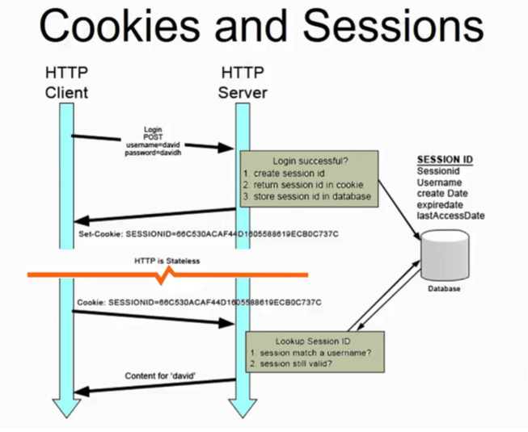
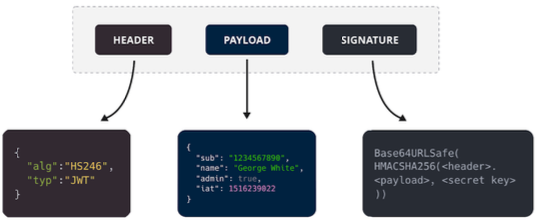
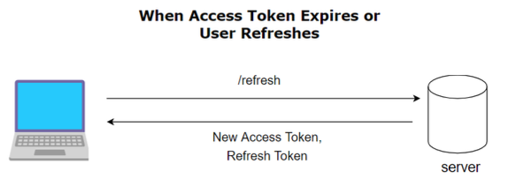
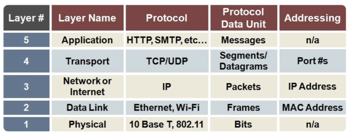
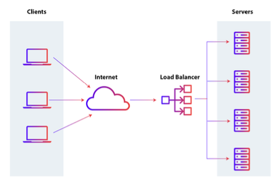
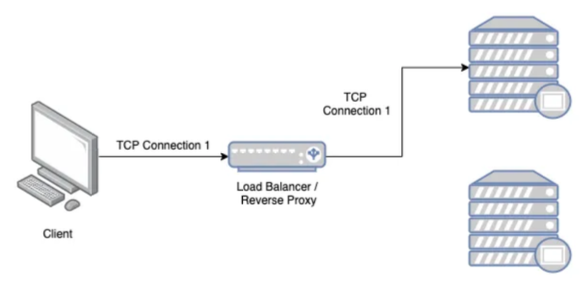
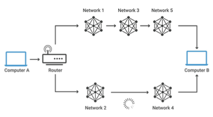

7주차
=

# 로그인

- HTTP의 특징 = 상태없음(stateless) → 그러면 로그인 상태 유지는 어떻게 하는것인가?
- 세션 : 서버와 클라이언트의 연결이 활성화된 상태를 의미
- 세션 ID : 웹 서버 또는 DB에 저장되는 클라이언트에 대한 유니크한 ID

## 세션 기반 로그인

  

- 세션 아이디는 DB에 저장될 수도 있고, 웹 서버에 저장될 수도 있다.
- DB에 저장
    - VARCHAR로 저장
    - 직렬화, 역직렬화에 대한 비용이 발생할 수 있다.
- 웹서버에 저장
    - 사용자가 많아지면 서버 과부화 → 많은 메모리가 소모될 수 있다.

## 토큰 기반 로그인

- 유저의 상태(state)를 token에 넣어두고 서버는 stateless한 상태를 유지
- MSA의 경우, 연쇄적 에러를 막기 위해 토큰과 관련된 서버를 분리한다.
- 토큰은 주로 JWT토큰이 활용된다.

    1. 인증로직 >> JWT토큰생성(access 토큰, refresh 토큰)
    2. 사용자가 이후에 access 토큰을 HTTP Header - Authorization 또는 HTTP Header Cookie에 담아 인증이 필요한 서버에 요청해 원하는 컨텐츠를 가져온다.

### JWT란?

- JSON WEB Token을 의미하며 헤더, 페이로드, 서명으로 이루어져 있다.
- JSON 객체로 인코딩되며 메세지 인증, 암호화에 사용된다.

    

- Header
    - 토큰 유형과 서명알고리즘, base64URI로 인코딩된다.
- Payload
    - 데이터, 토큰 발급자, 토큰 유효기간, base64URI로 인코딩 된다.
- Signature
    - (인코딩된 header + payload) + 비밀키를 기반으로 헤더에 명시된 알고리즘으로 다시 생성한 서명 값
- **장점**
    - 사용자 인증에 필요한 모든 정보는 토큰 자체에 포함하기 때문에 별도의 인증 저장소가 필요없다.
    - 다른 유형의 토큰과 비교했을 때 경량화되어있다. SAML(Security Assertion Markup Language Tokens)이란 토큰이 있지만 이에 비해 훨씬 경량화되어있다.
    - 디코딩했을 때 JSON이 나오기 때문에 JSON을 기반으로 쉽게 직렬화, 역직렬화가 가능하다.
- 단점
    - 토큰이 비대해질 경우 당연히 서버과부화에 영향을 줄 수 있다.
    - 토큰을 탈취당할 경우 디코딩했을 때 데이터를 볼 수 있다.

### access 토큰과 refresh 토큰

- 로그인은 refresh 토큰과 access 토큰 두개를 기반으로 구현한다.
- access 토큰의 수명은 짧게, refresh토큰의 수명은 길게 한다.
- refresh 토큰은 access 토큰이 만료되었을 때 다시 access 토큰을 얻기 위해 사용되는 토큰
- 이를 통해 access토큰이 만료됐을 때 마다 인증에 관한 비용이 줄어들게 된다.
- 로그인을 하게 되면 access 토큰과 refresh 토큰 두 개를 얻는다.

  

  

---

# HTTP 상태코드

## 1xx (정보)

- 서버가 요청을 잘 받았으며 해당 프로세스를 계속 이어가며 처리하는 것을 의미
  - 100 : 계속 함을 의미

### 2xx (성공)

- 서버가 요청을 잘 받았고 이를 기반으로 클라이언트에게 성공적으로 데이터를 보낸 것을 의미
  - 200 OK : 요청이 성공적으로 되었다.
  - 201 Created : 요청이 성공적이었으며 그 결과로 새로운 리소스가 생성되었다.

### 3xx (리다이렉션)

- 서버가 클라이언트의 요청에 대해 완료를 위해 추가 작업 조치가 필요하다.
  - 301 Moved Permanently : 이 응답 코드는 요청한 리소스의 URI가 변경되었음을 의미한다.
  - 변경된 새로운 URI를 301 상태코드와 함께 주어야 한다.

### 4xx (클라이언트 오류)

- 클라이언트가 요청한 페이지를 제공할 수 없거나 클라이언트의 요청이 잘못되어 결과적으로 요청을 처리할 수 없다.
  - 400 Bad Request : 서버가 클라이언트 요청을 이해할 수 없음을 의미
  - 401 Unauthorized : 클라이언트의 인증이 되지 않음을 의미
  - 404 Not Found : 요청 받은 컨텐츠를 찾을 수 없다는 것을 의미

### 5xx (서버 오류)

- 서버가 클라이언트의 요청을 처리하지 못하는 상태
  - 500 Internal Server Error : 서버에 오류가 있음을 의미
  - 502 Bad Gateway : 게이트웨이 또는 프록시서버가 오류가 생겼음을 의미
  - 504 Gateway Timeout : 게이트웨이 또는 프록시서버가 정해진 Timeout 시간동안 클라이언트의 요청을 처리하지 못함을 의미

---

# GET, POST, PUT, PATCH

## GET : 데이터를 읽다.

- url을 기반으로 데이터를 요구한다.
- url을 기반으로 하기 때문에 길이 제한(2000자 미만)이 있다.
- 성공 시 HTTP 상태 코드 200을 반환한다.
- 캐싱이 가능하다
- url을 기반으로 요청하기 때문에 해당 요청의 파라미터가 브라우저 기록에 남는다.
- url을 기반으로 요청하기 때문에 요청할 때 ASCII문자열만 보낼 수 있다.
- 사용자 이름, 비밀번호 등 민감한 정보를 전달할 때 사용하지 않는다.

### POST : 데이터를 생성하다.

- url이 아닌 HTTP message body를 통해 데이터를 전달한다.
- HTTP message body를 통해 전달되기 때문에 길이 제한이 없다.
- 성공적으로 데이터를 생성할 경우 HTTP 상태코드 201을 반환한다.
- 캐싱이 불가능하다.
- url을 기반으로 요청하지 않기 때문에 해당 요청의 파라미터가 브라우저 기록에 남지 않는다.

### PUT : 업데이트하는 데이터의 전체를 보낸다.

- 요청을 보낼 때 해당 데이터 전체를 보내야 하고 전체 데이터의 교체를 의미한다.
- 만약 해당 데이터가 없다면 새로 생성하고 있다면 해당 데이터와 교체를 진행한다.

### PATCH : 업데이트하는 데이터의 일부를 보낸다.

- 요청을 보낼 때 수정하는 일부분만 보내면 되고 일부분의 교체를 의미한다.

---

# 네트워크를 이루는 장치

- 네트워크 기기는 계층별로 나눌 수 있다.
- 상위 계층을 처리하는 기기는 하위계층을 처리할 수 있지만 그 반대는 불가능하다.
- 예를 들어 애플리케이션 계층을 담당하는 로드밸런서는 네트워크 분산처리도 가능하지만 물리계층의 장치 중 하나인 NIC는 이를 하지 못한다.

### 레이어 별 프로토콜, PDU 정리

  

### 레이어 별 담당 네트워크 장치

- 애플리케이션 계층 : L7 스위치
- 전송계층 : L4 스위치
- 인터넷 계층(네트워크 계층) : 라우터, L3 스위치

## 애플리케이션 계층 : L7 스위치

- 로드밸런서라고도 한다
- 서버의 부하를 분산하는 기기이다.
- 서버 이중화, 보안에 강점이 있는 장치
- IP, Port 뿐만 아니라 url, 헤더, 쿠키 등을 기반으로 트래픽을 분산한다.
- 헬스 체크를 통해 장애가 발생한 서버를 확인하고 해당 서버로 트래픽을 보내지 못하게 하는 역할을 한다.

  

- 헬스 체크
  - L4 스위치 또는 L7 스위치 모두 헬스 체크를 통해 정상적인 서버 또는 비정상적인 서버를 판별
  - 헬스 체크는 전송 주기와 재전송 횟수 등을 설정한 이후 반복적으로 서버에 요청을 보내는 것
  - AWS에서 L7 스위치를 이용한 로드밸런싱은 ALB라는 컴포넌트를 통해서 하며 L4 스위치를 이용한 로드밸런싱은 NLB 컴포넌트를 통해서 구축한다.

## 전송 계층 : L4 스위치

- 앞서 다룬 로드밸런서의 특징인 트래픽 분산 등을 할 수 있다.
- 패킷의 IP 주소와 Port 번호를 참고해서 적절히 트래픽 분산을 할 수 있따.
- 또한 전송 계층의 TCP, UDP 등의 헤더를 기반으로 우선순위를 판단해서 분산이 가능하다.
- L7와 똑같이 헬스체크가 가능하다. 

  

## 인터넷 계층 : 라우터

  

- 라우팅은 하나 이상의 네트워크에서 경로를 선택하는 프로세스
- 이 라우팅을 하는 장비를 의미
- 다른 네트워크에 존재하는 장치끼리 서로 데이터를 주고받을 때 패킷 소모 최소화, 경로 최적화를 하는 장비

### L3 스위치

- L2 스위치의 기능 + 라우팅을 하는 장비
- 라우팅 테이블을 참조해서 IP 패킷에 IP 주소를 담아 보낸다.

## 데이터 링크 계층

- 앞서 TCP 계층을 설명할 때 데이터 링크 계층과 물리 계층을 합쳐서 “링크계층”으로 설명을 했었다.
- 이 링크 계층을 쪼개서 데이터 링크 계층과 물리 계층으로 나눌 수 있다.
- 데이터 링크 계층은 ‘이더넷 프레임’을 통해 에러 확인, 흐름 제어, 접근 제어를 담당하는 계층
- 물리 계층은 무선 LAN과 유선 LAN을 통해 0-과 1로 이루어진 데이터를 보내는 계층을 말한다.
- 데이터 링크 계층을 담당하는 장비 2가지
  - L2 스위치
    - 장치들의 MAC 주소를 MAC 주소 테이블을 통해 관리하며 해당 테이블을 기반으로 인터넷 계층에서 받은 패킷을 기반으로 이더넷 프레임을 만들어 목적지 MAC 주소로 패킷을 보내주는 역할
  - 브릿지
    - 두 개의 근거리 통신망(LAN)을 상호 접속할 수 있도록 하는 통신망 연결 장치
    - 통신망의 범위를 확장하고 서로 다른 LAN을 기반으로 하나의 통신망을 구축할 때 쓴다.

## 물리 계층

- NIC
  - LAN 카드라고 하는 네트워크 인터페이스 카드는 네트워크에 연결하기 위해 PC에 설치된 회로기판
  - 이 장치에는 PC 고유의 식별번호인 MAC 주소가 있다.
- 리피터
  - 들어오는 약해진 신호 정도를 증폭하여 다른 쪽으로 전달하는 장치
- AP
  - 패킷을 복사하는 장치
  - AP에 유선 LAN을 연결한 후 무선 LAN 기술을 기반으로 무선 네트워크망을 구축할 수 있다.