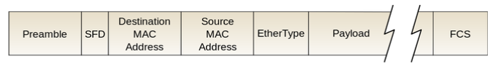

8주차
=

---

- [유선 LAN](#유선-lan)
- [무선 LAN](#무선-lan)
- [대규모 트래픽으로 인한 서버 과부하 해결방법](#대규모-트래픽으로-인한-서버-과부하-해결방법)
- [REST API](#REST-API)
- [브라우저 렌더링](#브라우저-렌더링)
- [www.naver.com을 쳤을 때 생기는 과정과 DNS](#wwwnavercom을-쳤을-때-생기는-과정과-DNS)
- [이더넷 프레임](#이더넷-프레임)
- [CORS](#CORS)

---

# 유선 LAN

## 전이중화 통신, CSMA/CD

- 전이중화(full duplex) 통신은 양쪽 장치가 동시에 송수신할 수 있는 방식을 말한다.
- 동축케이블, 광케이블 등을 기반으로 만들어진 유선 LAN을 이루는 이더넷은 IEEE802.3 프로토콜을 기반으로 전이중화 통신을 사용한다.
    - IEEE802.3 : 이더넷 프레임은 어떤 구조를 기반으로 할 것인지, 케이블의 최대 전송량, 어떤 케이블만이 가능하도록 할 것인지 등을 정한 규칙

### 전이중화 장치

- 양쪽장치가 동시에 송수신할 수 있는 방식, 송신로와 수신로를 나눠서 데이터를 주고 받을 수 있다.

### CSMA/CD

- 이전에는 유선 LAN에 ‘반이중화 통신’ 중 하나인 CSMA/CD (Carrier Sense Multiple Access with Collision Detection) 방식을 썼다.
- 이 방식은 회선을 사용하는지를 파악한 후 사용하지 안흔ㄴ다면 데이터를 보내고 충돌이 발생한다면 일정 시간 이후 재전송하는 방식을 말한다.

## 케이블

### 트위스트페어케이블

- 실드처리를 한 케이블이 STP 케이블
- 실드처리를 안한 케이블이 UTP 케이블
    - LAN 케이블 : 유선 LAN을 구축할 떄 쓰는 케이블

### 광섬유케이블

- 레이저를 이용해 통신하며 보통 100Gbps의 데이터를 전송하는 케이블
- 빛의 굴절률이 높은 부분을 코어, 낮은 부분을 클래딩 이렇게 다른 밀도를 가지는 유리나 플라스틱 섬유를 기반으로 제작
- 한 번 들어간 빛이 내부에서 계속해서 반사하며 전진하여 반대편 끝까지 가는 원리를 이용한 것

---

# 무선 LAN

- 무선랜은 IEEE802.11 표준규격을 따르며 반이중화 통신을 사용한다.
- 대표적인 기술 : wifi
    - 와이파이는 전자기기들이 무선 LAN 신호에 연결할 수 있게 하는 기술
    - 근거리 무선망이라고도 할 수 있지만 근거리무선망은 블루투스, 지그비 등도 있기 때문에 엄밀히 말하면 틀리다.

### 반이중화 통신

- 반이중화(half duplex) 통신은 양쪽 장치는 서로 통신할 수 있지만, 동시에는 통신할 수 없으며 한 번에 한 방향만 통신할 수 있는 방식을 말한다.

### CSMA/CA

- 반이중화 통신 중 하나로 데이터를 보내기 전에 일련의 과정을 기반으로 사전에 가능한 한 충돌을 방지하는 방식

## 주파수와 2.4GHz와 5GHz의 차이

- 무선 LAN(WLAN, Wireless Local Area Network)은 무선 신호 전달 방식을 이용하여 2대 이상의 장치를 연결하는 기술
- 비유도 매체인 공기에 주파수를 쏘아 무선 통신망을 구축하는데, 주파수 대역은 2.4GHz 대역 또는 5GHz 대역 중 하나를 써서 구축

---

# 대규모 트래픽으로 인한 서버 과부하 해결방법

### 서버 과부하

- 서버가 리소스를 소진하여 들어오는 요청을 처리하지 못할 때 발생한다.
- 이 때 서버는 사용자의 웹 요청을 처리하지 못해 응답없음이 뜨게 된다.

## 1. 모니터링을 통한 자원 할당

- 이러한 서버 과부하로 서버가 응답없음이 뜨는 여러 원인들 중 하나가 “자원의 한계점 도달”이다.
- 보통 서버의 CPU 사용량이 80~90%에 도달하거나 메모리가 부족해 계속해서 스와핑이 발생하면 과부화 상태가 된다.
- 이는 모니터링을 통한 자원의 적절한 할당으로 해결한다.
  - 자원은 CPU, 메모리, 대역폭도 포함한다.

### 모니터링을 하는 이유

- 먼저 서버 과부하로 인한 조치를 하기 위해서는
  1. 어떤 트래픽이 얼마나 발생했는지
  2. 어떤 네트워크에서 병목현상이 일어났는지

  등을 기준으로 해결할 수 있다.

- 또한 모니터링을 하면 활용도가 낮은 페이지, 높은 페이지를 파악할 수 있어 나중에 서비스 개선에도 도움이 된다.
- 즉, 해결하기 위한 문제점을 파악하기 위해 모니터링은 필수적이다.

### 로드밸런서

- 앞서 설명한 AWS 오토스케일링은 빠르긴 하나 구성에 시간이 걸리기 때문에 앞단에 로드밸런서를 통해 트래픽을 분산해야 한다.

### 블랙스완 프로토콜

- 블랙스완 : 예측할 수 없는 사고가 일어난 것
- 사후에는 이 사고의 원인 등을 분석할 수 있지만 사전에는 이 사고를 예측할 수 없는 것
- 매번 일어나기 때문에 이에 따라 대비를 해야한다. → 규칙을 정해야한다.
  1. 영향받은 시스템과 각 시스템의 상대적 위험 수준을 확인
    1. 체계적으로 데이터를 수집하고 원인에 대한 가설을 수립한 후 이를 테스팅
  2. 잠재적으로 영향을 받을 수 있는 내부의 모든 팀에 연락
  3. 최대한 빨리 취약점에 영향을 받는 모든 시스템을 업데이트
  4. 복원계획을 포함한 우리의 대응 과정을 파트너와 고객 등 외부에 전달

---

## 2. 서킷 브레이커

- 서킷 브레이커 패턴이라고도 불리며 서비스 장애를 감지하고 연쇄적으로 생기는 에러를 방지하는 기법
- 서비스와 서비스 사이에 서킷브레이커 계층을 두고 미리 설정해놓은 timeout 임계값에 도달하면 서킷브레이커가 그 이후의 추가호출에 무조건 에러를 반환하게 한다. (연쇄적인 오류전파를 끝내느 서킷브레이커)
- 필요한 사례
  - 스레드 차단
  - 계단식 실패 발생

### 동작 과정

  

  

### 상태

    

- closed, open, half_open 상태를 가진다.
- closed[정상] : 네트워크 요청의 실패율이 임계치보다 낮음
- open[에러] : 임계치이상의 상태를 의미한다. 요청을 서비스로 전송하지 않고 바로 오류를 반환 (fail fast)
- half_open[확인중] : open 상태에서 일정 timeout으로 설정된 시간이 지나면 장애가해결되었는지 확인하기 위해 half_open 상태로 전환된다. 여기서 요청을 전송하여 응답을 확인한다. 장애가 풀리는지를 확인해서 성공하면 closed, 실패하면 다시 open으로 변경한다.

### 장점

- 연속적인 에러 발생을 막아주며 일부서비스가 종료되더라도 다른 서비스들은 이상없이 동작하게 만들 수 있으며 사용자 경험을 높여준다.

### 서킷브레이커가 구현된 라이브러리

- 넷플릭스의 Hystrix
- Resilience4j

---

## 3. 컨텐츠 관리

1. 불필요한 컨텐츠 제거
2. CDN을 통한 컨텐츠 제공
  1. CDN을 통해 사용자 가까이, 그리고 분산된 대규모 서버 네트워크를 기반으로 컨텐츠를 제공해서 메인 서버에 대한 부하를 줄인다.
3. 컨텐츠 캐싱
  1. 네트워크 트래픽을 해결하는 가장 좋은 방법은 해당 트래픽이 발생하지 않도록 하는 것
  2. 브라우저 캐시(쿠키, 로컬저장소, 세션저장소)를 통해 해당 요청에 관한 항목을 캐시에서 응답을 읽어 네트워크 요청에 관한 비용을 모두 제거한다.
4. 컨텐츠 압축
  1. 텍스트 기반 리소스는 gzip 또는 Brotli를 통해 압축해야만 한다.
  2. 압축하면 70% 정도까지 압축할 수 있다.
  3. 다만 압축했기 때문에 압축을 풀기 위해 서버에서 자원(CPU)를 사용하는 양까지 고려해야 한다. (보통은 압축하면 좋다.)
5. 컨텐츠의 우하한 저하 (미리 준비된 응답)
  1. 시스템의 과도한 부하를 줄이기 위해 제공하는 컨텐츠 및 기능을 일시적으로 줄이는 전략
  2. 예를 들어 정적 텍스트 페이지를 제공하거나, 검색을 비활성화하거나 더 적은 수의 검색 결과를 반환하거나, 필수적이지 않은 기능을 비활성화 한다.

---

# REST API

- RESTful한 API를 말하며 일련의 특징과 규칙 등을 지키는 API를 일컫는다.
- 2000년에 Roy Thomas Fielding이 쓴 논문에서 처음으로 등장한 개념

## REST API의 특징

### 1. Uniform-Interface

- API에서 자원들은 각각 독립적인 인터페이스를 가지며 각각의 자원들이 url 자원식별, 표현을 통한 자원조작, Self-descriptive messages, HATEOAS 구조를 가지는 것을 말한다.
- 독립적인 인터페이스라는 것은 서로 종속적이지 않은 인터페이스를 말한다.
  - 예를들어 웹페이지를 변경했다고 웹 브라우저를 업데이트하는 일은 없어야 하고 HTTP 명세나 HTML 명세가 변경되어도 웹페이지는 잘 작동해야 하듯..
- url 자원 식별
  - identification of resources를 말한다. 자원은 url로 식별되어야 한다.
- 표현을 통한 자원조작
  - manipulation of resources through representations은 url과 GET, DELETE 등 HTTP 표준메서드 등을 통해 자원을 조회, 삭제 등 작업을 설명할 수 있는 정보가 담겨야 하는 것
- Self-descriptive messages
  - HTTP Header에 타입을 명시하고 각 메세지(자원)들은 MIME types에 맞춰 표현되어야 한다.
  - 예를들어 json을 반환한다면 application/json으로 명시해주어야한다.
  - MIME types는 문서, 파일 등의 특성과 형식을 나타내는 표준이다.
  - IETF의 RFC6838에 정의 및 표준화되어 있다. (’font/ttf’, ‘text/plain’, ‘text.csv’ 등)
  - 예를 들어 json타입의 데이터를 보낼 때는 헤더의 ‘Content-Type’ = ‘application/json’을 명시해야 함을 말한다.

### 2. Stateless

- 이 규칙은 HTTP 자체가 Stateless이기 때문에 HTTP를 이용하는 것만으로도 만족된다.
- 그리고 이는 REST API를 제공해주는 서버는 세션(session)을 해당 서버 쪽에 유지하지 않는다는 의미이다.

### 3. Cacheable

- HTTP는 원래 캐싱이 된다. (아무런 로직을 구현하지 않더라도 자동적으로 캐싱이된다.)
- 새로고침을 하면 304가 뜨면서 원래 있던 js와 css이미지 등을 불러오는 것을 볼 수 있다.
- 이는 HTTP 메서드 중 GET에 한정되며 `Cache-Control:max-age=100` 이런 식으로 한정된 시간을 정할 수 가 있으며 캐싱된 데이터가 유효한지를 판단하기 위해 ‘Last-modified’dhk ‘Etag’라는 헤더값을 쓴다.
- ‘Etag’는 전달되는 값에 태그를 붙여서 캐싱되는 자원인지를 확인해주는 것

### 4. Client-Server 구조

- 클라이언트와 서버가 서로 독립적인 구조를 가져야 한다.
- 물론 이는 HTTP를 통해 가능한 구조이다.
- 서버에서 HTTP 표준만 지킨다면 웹에서는 그에 따른 화면이 잘 나타나게 된다.
- 서버는 그저 API를 제공하고 그 API에 맞는 비즈니스 로직을 처리하면 된다.
- 마찬가지로 클라이언트에서는 HTTP로 받는 로직만 잘 처리하면 되는 것

### 5. Layered System

- 계층구조로 나누어져 있는 아키텍쳐를 뜻한다.
- WEB기반 서비스를 하면 보통 이러한 시스템을 구축하게 된다.

### REST API의 URI규칙

- 자원을 표기하는 URI의 아래 6가지 규칙을 적용해야 한다.
1. 동작은 HTTP 메서드로만 해야 하고 url에 해당 내용이 들어가면 안된다.
  1. 수정 = put, 삭제 = delete, 추가 = post, 조회 = get을 이용해야 한다.
  2. 예를 들어 /boos/delete/1 이렇게 표기하면 안된다는 것
2. .jpg, .png 등 확장자는 표시하지 말아야 한다.
3. 동사가 아닌 명사로만 표기해야 한다.
  1. 유저가 책을 소유한다는 것을 표현한다면 ‘유저/유저아이디/inclusion/책/책아이디’로 표현
  2. 유저가 소유한 아파트를 조회한다면 ‘/user/{userid}/aparts
4. 계층적인 내용을 담고 있어야 한다.
  1. ex) ‘/집/아파트/전세’
5. 대문자가 아닌 소문자로만 쓰며 너무 길 경우에 바를 써야할 경우 언더바_가 아닌 그냥 바-를 쓴다.
6. HTTP 응답 상태코드를 적재적소에 활용한다. 성공시에는 200, 리다이렉트는 301 등

### 쿼리스트링과 혼합한 url

- REST API는 / 를 기반으로만 구축되는 것도 있지만 적절히 쿼리스트링을 혼재해서 쓰기도 한다.
- 검색, 페이지네이션, 정렬 등 매개변수가 많거나 복잡할 때 쿼리스트링을 쓰는게 좋다.
- 실제 워드프레스에서 제공하는 REST API
  - post의 2번째 결과물을 나타냄
    - /wp/v2/posts?page=2
    - api를 설정할때 /v2 /v1 으로 버전을 명시해놓는게 좋다. 이를 통해 현재 버전을 사용하다가 새 버전이 안정되면 자체적으로 마이그레이션을 할 수 있다.
- 실제 KAKAO API
  - /oauth/token?grant_type=refresh_token&client_id=${REST_API_KEY}
- 바벨이 필요한 운동정보를 가져온다.
  - /api/v1/workouts?equipment=barbell
- 모든 운동정보를 생성날짜 기준으로 내림차순으로 가져온다면
  - /api/v1/workouts?sort=-createdAt

---

# 브라우저 렌더링

- 브라우저는 다음과 같이 브라우저 엔진, 렌더링엔진, 네트워크 통신부, 자바스크립트 해석기, UI 백엔드, 자료저장소로 이루어져 있다.

    

- 이 중 렌더링엔진이 브라우저 렌더링을 관장하며 다음과 같은 과정으로 이루어진다.
- DOM 트리 CSS 파서 등을 기반으로 렌더트리를 구축해 결과적으로 우리가 보는 화면을 구축하는 과정을 의미한다.

    

## 1. DOM 트리와 CSSOM트리 구축

### DOM트리 구축

- 하나의 html 페이지는 div, span 등의 요소를 가진다. 이러한 요소들이 HTML 파서에 의해 “구문분석”된다.
- 요소는 하나하나가 노드로 설정이 되어 트리 형태로 저장되는데, 이를 DOM 트리라고 한다.

    

### CSSOM 트리 구축

- 각각의 노드는 CSS 파서에 의해 정해진 스타일 규칙이 적용되어 있다.
- span.color = “red”는 노드의 색깔이 빨간색이다. → 이러한 것들을 기반으로 CSSOM이라는 트리가 만들어진다.
- 이 과정은 DOM트리 구축과 동시에 일어난다.

    

## 2. 렌더트리와 렌더레이어 생성

- DOM 트리와 CSSOM 트리가 합쳐져 렌더객체(Render Object)가 생성된다.
- 이들이 모여 병렬적인 렌더트리가 생성된다.

    

- 이때 `display:none`이 포함된 노드는 지워지고 font-size 등 상속적인 스타일은 부모노드에만 위치하도록 설계하는 등의 최적화를 거쳐 렌더레이어가 완성된다.
- 참고로, `display:none`은 렌더트리에서는 삭제되지만 `visibility: hidden`의 경우에는 요소를 보이지않게 하나 요소는 여전히 레이아웃에서 공간을 차지한다.

    

- 이 때 렌더레이어가 완성될 때 GPU에서 처리되는 부분(CSS3D / video & canvas / filter / animation/ transform : translateZ(0) 등)이 있으면 이 요소들은 각각 강제적으로 그래픽 레이어로 분리된다.

### 3. 렌더레이어를 대상으로 Layout 설정

- 이 때 좌표는 보통 부모를 기준으로 설정된다.
- Global Layout은 브라우저 사이즈가 증가하거나 폰트 사이즈가 커지면 변경된다.

### 4. 렌더레이어를 대상으로 칠하기 (paint)

- 픽셀마다 점을 찍듯 칠한다.
- 이를 레스터화라고도 한다.

### 5. 레이어 합치기(composite layer) 및 표기

- 각각의 레이어로부터 비트맵이 생성되고 GPU에 텍스쳐로 업로드된다.
- 그 다음 텍스쳐들은 서로 합쳐져 하나의 이미지로 렌더링되며 화면으로 출력된다.

### 자주 묻는 면접질문!

- 렌더트리와 DOM 트리는 1:1 대응인가?
  - 아니다. DOM트리 > 렌더객체 > 렌더트리가 되는 과정에서 display:none으로 사라지는 렌더 객체(노드)들이 있을 수 있기 때문에 1 : 1 대응이 아니다.

---

# www.naver.com을 쳤을 때 생기는 과정과 DNS

- 리다이렉트, 캐싱, DNS, IP 라우팅, TCP 연결 구축을 거쳐 요청, 응답이 일어나는 TTFB(Time to First Byte)가 시작되고 이 후 컨텐츠를 다운받게 되고 이 후 브라우저 렌더링 과정을 거쳐 네이버라는 화면이 나타나게 된다.

    

### 리다이렉트

- 리다이렉트가 있다면 리다이렉트를 진행하고 없다면 그대로 해당요청에 대한 과정이 진행된다.

### 캐싱

- 해당 요청이 캐싱이 가능한지 불가능한지 파악한다.
- 캐싱이 이미 된 요청이라면 캐싱된 값을 반환하며 캐싱이 되지 않은 새로운 요청이라면 그 다음 단계로 넘어간다.
- 캐싱은 요청된 값의 결과값을 저장하고 그 값을 다시 요청하면 다시 제공하는 기술이다.
- 이는 브라우저 캐시와 공유 캐시로 나눠진다.
- 브라우저 캐시
  - 쿠키, 로컬스토리지 등을 포함한 캐시로 개인캐시(private cache)라고도 한다.
  - 브라우저 자체가 사용자가 HTTP를 통해 다운로드하는 모든 문서를 보유하는 것을 말한다.
  - ex) 어떤 사이트를 갔다가 다시 방문하면 굉장히 빠르게 컨텐츠가 나타난다. → 브라우저 캐시
- 공유 캐시
  - 클라이언트와 서버 사이에 있으며 사용자간에 공유할 수 있는 응답을 저장할 수 있다.
  - ex) 요청한 서버 앞단에 프록시서버가 캐싱을 하는 것
    - 리버스 프록시를 둬서 내부서버로 포워드한다고도 말한다.
    - Node.js로 서버를 구축한다면 앞단의 프록시서버로 nginx서버를 둬서 이 서버를 캐싱 서버로도 사용할 수 있는 것
    - 또한 AWS Cloudfront 또는 Cloudflare와 같은 콘텐츠 전송 네트워크 (CDN)을 둬서 캐싱할 수 있다.

    

    

### DNS

- (Domain Name System)은 계층적인 도메인 구조와 분산된 데이터베이스를 이용한 시스템으로, FQDN을 인터넷 프로토콜인 IP로 바꿔주는 시스템이다.
  - FQDN (Fully Qualified Domain Name)은 호스트와 도메인이 합쳐진 완전한 도메인 이름을 말한다.
  - www등은 호스트, naver.com은 도메인이라고 한다.
- 이는 DNS 관련 요청을 네임서버로 전달하고 해당 응답값을 클라이언트에게 전달하는 리졸버, 도메인을 IP로 변환하는 네임서버 등으로 이루어져 있다.
- ex) www.naver.com에 DNS 쿼리가 오면 오른쪽부터 역순으로 [Root DNS] → [.com DNS] → [.naver DNS] → [.www DNS] 과정을 거쳐 완벽한 주소를 찾아 IP 주소를 매핑한다.

    

### DNS 캐싱

- 미리 해당 도메인이름을 요청했다면 로컬 PC에 자동적으로 저장된다.
- 브라우저 캐싱과 OS 캐싱이 있다.

### IP 라우팅

- 해당 IP를 기반으로 라우팅, ARP 과정을 거쳐 실제 서버를 찾음

### TCP 연결 구축

- 브라우저가 TCP 3way - handshake 및 SSL 연결 등을 통해 연결을 설정한다.
- 이후 요청을 보낸 다음 드디어 해당 요청한 서버로부터 응답을 받는다.
- TCP연결은 HTTP/2 까지만 일어난다. HTTP/3는 TCP연결이 아닌 QUIC연결이 일어난다.

### 컨텐츠 다운로드

- 요청한 컨텐츠를 서버로부터 다운받는다.
- 다운로드를 시작하는 시점을 TTFB(Time To First Byte)라고도 한다.

### 브라우저 렌더링

- 받은 데이터를 바탕으로 브라우저 엔진이 브라우저 렌더링 과정을 거쳐 화면을 만든다.

---

# 이더넷 프레임

- 이더넷 프레임이란 데이터 링크계층의 데이터 단위이며 이더넷 프레임을 기반으로 데이터가 전달되며 다음과 같은 필드로 구성되어 있다.

    

- Preamble[7바이트] : 이더넷 프레임이 시작임을 알려준다.
- SFD[1바이트] : Start frame delimiter, 다음 필드부터 주소필드가 시작됨을 알려준다.
- Destination Address[6바이트] : 목적지 주소
- Source Address[6바이트] : 시작지 주소
- EtherType[2바이트] : 데이터링크계층 위의 IP 프로토콜을 정의한다. (IPv4, Ipv6)
- Payload[가변바이트] : 데이터 또는 페이로드라고 한다. 가변길이 필드이다. 해당 필드는 이진데이터(0과1 로 이루어진 데이터)로 구성된다. IEEE 표준은 최대 페이로드를 1500 바이트로 지정하고 있다.
- FCS[4바이트] : frame check sequence이며 수신측의 에러검출을 위해 삽입하는 필드이다. CRC 에러검출 기법에 의해 생성된 비트배열이 여기에 담긴다. 비트배열을 기반으로 수신된 데이터가 손상되었는지를 확인하고에러 확인시에는 해당 프레임을 폐기하고 송신측에 재전송을 요구한다. 이를 위한 필드입니다.

---

# CORS

## 오리진과 SOP

### 오리진

  

### SOP

- Same-Origin Policy
- 브라우저 상에서 오로지 같은 오리진끼리만 요청을 허가하는 보안 정책
- 이러한 SOP가 없다면?
  - ex) 은행 계좌 서버에 로그인하고 악의적인 사이트를 방문하면 내가 모르는 사이에 은행 서버에 요청을 할 수 있게 되어 내 계정 정보가 변경되거나 유출될 수 있다.
  - 이를 1차적으로 막아주는 것이 바로 SOP 보안 정책이다.
- 다른 오리진끼리 요청해야하는 순간도 있다. → 이를 브라우저 상에서 조금 더 유연하게 바꿔서 어떠한 경우에는 다른 오리진끼리도 요청 및 응답할 수 있게 만든 것이 CORS 이다.

### CORS의 의미

- CORS(cross origin resource sharing)란 HTTP 헤더를 기반으로 브라우저가 다른 오리진에 대한 리소스로드를 허용할지 말지에 대한 메커니즘을 말한다.
- preflight request
  - 과정
    - 만약 요청을 보낼 때 다음의 메서드 타입, 헤더에 해당되지 않은게 하나라도 포함되어 있다면 preflight request를 보내게 된다.
    - OPTIONS 메서드로 해당 서버에 원래의 요청을 보내기 전 요청을 보내서 해당 서버의 Access-Control-*을 파악해 만약 없다면 CORS 에러를 뿌리게 되는 요청이다.
  - 메서드 타입
    - GET, HEAD, POST
  - 헤더
    - Accept
    - Accept-Language
    - Content-Language
    - Content-Type
    - application/x-www-form-urlencoded
    - - multipart/form-data
    - - text/plain
    - Range (참고로 fireforx 브라우저는 해당 헤더를 허용하지 않는다.)
- 이와 같은 메서드 타입, 헤더를 가진 요청을 간단한 요청(simple request)이자 안전한 요청이라고 한다.