9주차
=

---

- [운영체제 종류, 역할, 구조와 CPU](#운영체제-종류-역할-구조와-cpu)
- [CPU](#CPU)
- [인터럽트](#인터럽트)
- [시스템콜](#시스템콜)
- [메모리 계층](#메모리-계층)
- [페이지 교체 알고리즘](#페이지-교체-알고리즘)
- [프로세스와 스레드의 차이](#프로세스와-스레드의-차이)
- [프로그램의 컴파일 과정](#프로그램의-컴파일-과정)
- [프로세스의 메모리 구조](#프로세스의-메모리-구조)
- [PCB와 컨텍스트 스위칭](#PCB와-컨텍스트-스위칭)
- [프로세스의 상태](#프로세스의-상태)
- [멀티 프로세싱과 멀티 스레딩](#멀티-프로세싱과-멀티-스레딩)
- [IPC](#IPC)

---

# 운영체제 종류, 역할, 구조와 CPU
## 운영체제의 종류

- 운영체제는 앞단의 어떤 인터페이스를 두느냐에 따라 GUI와 CUI로 나눌 수 있다.
- GUI
    - Graphical User Interface
    - 그래픽을 사용하여 컴퓨터와 상호작용하는 인터페이스
- CUI
    - Character User Interface
    - 사용자가 키보드만을 사용하여 문자를 기반으로 컴퓨터와 상호작용하는 인터페이스
    - 예전 OS인 MS-DOS가 대표적이다. (1994 단종)

## 운영체제의 역할

- 운영체제의 커널이 담당한다.

  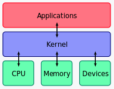  

  - 커널(kernel) : 컴퓨터 운영 체제의 핵심이 되는 컴퓨터 프로그램 (핵심)
  - 시스템의 모든 것을 완전히 제어하며 운영 체제의 다른 부분 및 응용 프로그램 수행에 필요한 여러 서비스를 제공한다.
  - 역할 : 보안, 자원관리, 추상화
- CPU 스케줄링, 프로세스 상태관리
    - 어떠한 프로세스를 먼저 실행할지
- 메모리 관리
    - 작은 메모리를 기반으로 어떤 프로세스를 실행시킬지 (스와핑)
- 디스크 파일 관리
    - 어떻게 저장할지
- I/O 디바이스 관리
    - 어떠한 기기들을 컨트롤할지

## 운영체제의 구조

- 유저프로그램
- OS
    - 인터페이스(GUI 또는 CUI)
    - 시스템콜
    - 커널(I/O 드라이버, 파일시스템 등)
- 하드웨어

## 컴퓨터 시스템의 구조

- CPU : 인터럽트에 의해 메모리에 존재하는 명령어를 해석해서 실행
- DMA 컨트롤러 : CPU의 일을 보조
- 메모리 : 전자회로에서 데이터, 상태 등을 기록(작업장)
- 타이머 : 특정프로그램에 시간을 다는 역할
- 디바이스 컨트롤러 : IO디바이스들의 작은 CPU
- 로컬버퍼 : 디바이스에 달려 있는 작은 메모리

---

# CPU

- 산술논리연산장치, 제어장치, 레지스터로 구성되어있는 장치
- 인터럽트에 의해 메모리에 존재하는 명령어를 해석해서 실행하는 일꾼
- 메모리에 있는 일을 해석해서 실행하는 일꾼

### 산술논리연산장치

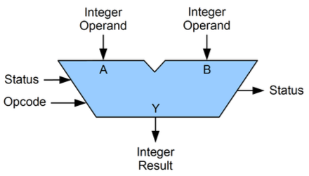  

- ALU(arithmetic and logical unit)
- 사칙연산과 같은 산술연산과 논리연산을 하는 회로장치

### 제어장치

- CU(control unit)
- 프로세스의 조작을 지시
- 명령어들을 읽고 해석하며 데이터 처리를 위한 순서를 결정

### 레지스터

- CPU 안에 있는 매우 빠른 임시기억장치(메모리)

### 정리

- CPU의 정확한 표현 : CPU는 메모리에서 레지스터로 올라간 값을 읽는 일꾼이다.
- 플로우
    1. 제어장치가 메모리에 있는 일을 레지스터에 로드한다.
    2. 제어장치가 레지스터에 있는 값을 읽으라고 ALU에게 전달한다.
    3. ALU가 레지스터에 있는 값을 읽어서 계산 한 뒤 레지스터에 전달한다.
    4. 레지스터에서 메모리로 다시 올린다.

---

# 인터럽트

- 어떤 신호가 들어왔을 때 CPU를 잠깐 정지시키는 것
- 0으로 숫자를 나누는 산술 연산오류, 프로세스 오류 등으로 발생한다.
- 오류뿐만 아니라 I/O 디바이스를 사용할 때의 인터럽트, 우선순위가 높은 프로세스의 발생 등으로도 발생한다.

### 과정

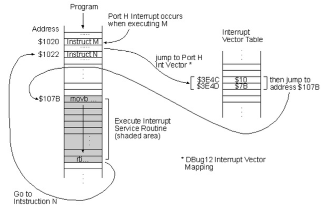  

- CPU는 메모리에 있는 명령어(instruction)을 순차적으로 실행한다.
- 인터럽트가 발생하면 점프해서 인터럽트 핸들러 함수가 모여있는 인터럽트 벡터로 간다.
- 인터럽트 핸들러 함수(인터럽트 서비스 루틴 = ISR)가 실행되며 특정 명령어를 실행한다.
- 인터럽트가 종료되면 다시 순차적으로 실행되게 된다.

### 종류

- 하드웨어 인터럽트
    - I/O 디바이스 등 하드웨어에서 발생하는 인터럽트
    - 마우스를 기반으로 버튼을 클릭하거나, 디스크에서 파일을 읽거나, 쓰기 작업이 완료되었을 때 등
- 소프트웨어 인터럽트
    - 트랩(trap)이라고도 한다.
    - 프로세스 오류, 프로세스 종료, 시작 등을 기반으로 프로세스에서 발생하는 인터럽트
    - 하드웨어 인터럽트보다 우선순위가 높은 인터럽트

---

# 시스템콜

- 운영체제가 커널에 접근하기 위한 인터페이스
- 유저프로그램이 운영체제의 서비스를 받기 위해 커널 함수를 호출할 때 이를 거쳐서 호출하도록 설계되어 있다.
- 프로세스 관리(생성, 삭제 등), 파일 관리, 디바이스 관리, 시간 및 날짜 관련 시스템, 프로세스 간 통신 때 이를 통해 커널함수를 호출한다.
- ex) 프로세스를 종료하는 `kill()` 함수 → 시스템콜을 거쳐서 커널함수가 호출되게 된다.

### 과정

- 만약 유저 프로그램이 I/O 요청을 위한 트랩을 발동했다고 하면 다음과 같은 과정이 발생한다.
1. 유저 프로그램이 I/O 요청 트랩발동을 한다.
2. 올바른 I/O 요청인지 확인한다.
3. 유저 모드가 시스템콜을 통해 커널모드로 변환한다.
4. 이후 커널함수를 실행한다.

### 커널함수

- 커널 안에 있는 여러 개의 함수를 뜻한다. (= native function)

### 커널

- 운영체제의 핵심 부분이자 시스템콜을 제공하며 보안, 메모리, 프로세스, 파일 시스템, I/O 디바이스, I/O 요청 관리 등 운영체제의 중추적인 역할을 한다.

### 유저 모드

- 유저가 접근할 수 있는 영역을 제한적으로 두며 컴퓨터 자원에 함부로 침범하지 못하는 모드

### 커널 모드

- 모든 컴퓨터 자원에 접근할 수 있는 모드

### modebit

- 시스템콜이 작동될 때 modebit을 기반으로 유저 모드와 커널 모드를 구분한다.
- modebit은 1 또는 0의 값을 가지는 플래그 변수이며 1은 유저모드, 0은 커널모드를 가리킨다.

### 시스템콜의 장점

- 유저 프로그램은 시스템콜을 기반으로 커널과 분리가 되게 된다.
- 즉, 유저프로그램은 복잡한 파일 시스템과 프로세스 생성 등에 대한 내부동작을 신경 쓸 필요가 없다.
- 운영체제의 관리하에 프로그램이 운영되므로 시스템의 안정성과 보안이 강화된다.

---

# 메모리 계층

- 레지스터, 캐시, 주기억장치, 보조기억장치로 구성되어 있다.
- 레지스터 : CPU 내의 작은 메모리, 휘발성, 속도 가장 빠름, 기억 용량이 가장 적음
- 캐시 : CPU 내의 L1, L2 캐시를 지칭한다. 휘발성, 속도 빠름, 기억 용량이 적음
- 주기억장치 : RAM을 가리킨다. 휘발성, 속도 보통, 기억 용량 보통
- 보조기억장치 : HDD, SDD를 일컬으며 비휘발성, 속도 낮음, 기억용량이 큼

### 계층이 존재하는 이유

- 더 빠른 접근과 처리속도 증가
    - 특정 데이터에 많이 접근하게 되는데 좀 더 작은 캐시 메모리에 해당 데이터가 있다면 더 빠르게 해당 데이터에 접근이 가능해진다.
- 비용 효율적 사용
    - 캐시 메모리는 비싸고 램 등 아래로 갈수록 비용은 더 저렴하다.
    - 계층이 있고 캐싱 때문에 비용을 좀 더 효율적으로 쓸 수 있다.
- 자원의 효율적 사용
    - 메모리 계층 구조는 자주 접근하는 데이터는 빠른 메모리에, 덜 접근하는 데이터는 느린 메모리에 저장하여 자원을 효율적으로 사용할 수 있다.
    - 이를 통해 거의 접근하지 않은 데이터에 비싸고 빠른 메모리를 사용하지 않게 되어 자원을 낭비하지 않게 된다.

## 가상 메모리

- virtual memory
- OS에서 사용되는 메모리 관리 기법의 하나
- 컴퓨터가 실제로 이용가능한 메모리 자원(실제 주소, physical address)을 추상화하여 이를 사용하는 사용자들에게 매우 큰 메모리로 보이게 만드는 것
- 참고
    - 가상주소 : MMU와 페이지 테이블에 의해 실제 주소로 변환된다.
    - 페이지 : 가상 메모리를 사용하는 최소 크기 단위
    - 프레임 : 실제 디스크나 메모리를 사용하는 최소 크기 단위 (페이지와 구분!!)

  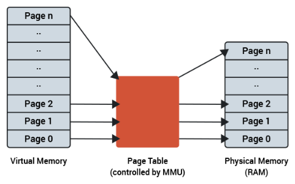  

### 페이지 테이블

- 가상 메모리는 가상 주소와 실제 주소가 매핑되어있는 페이지 테이블로 관리되며 이 때 속도 향상을 위해 캐싱계층인 TLB를 쓴다.
- 가상 주소에서 바로 페이지 테이블을 가는게 아니라 TLB에서 있는지를 확인하고 만약 없다면 페이지 테이블로 가서 실제 주소를 가져온다.

  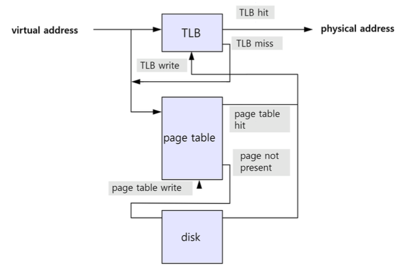  

### 페이지 폴트

- 앞서 설명한 것처럼 가상메모리는 작은 메모리를 매우 큰 메모리로 보이게끔 하는 것
- 참조하려는 메모리 영역이 실제에는 없을 수도 있다.
- 즉, 가상메모리에는 존재하지만 실제 메모리인 RAM에는 현재 없는 데이터나 코드에 접근할 경우가 있으며 이 때 페이지 폴트가 발생한다.
- 이 때 메모리의 당장 사용하지 않는 영역을 하드디스크로 옮기고 하드디스크의 일부분을 “마치 메모리처럼” 불러와 쓰는 것을 스와핑이라고한다.

  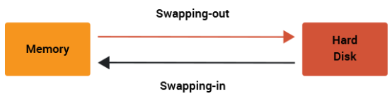  

### 페이지 폴트 과정

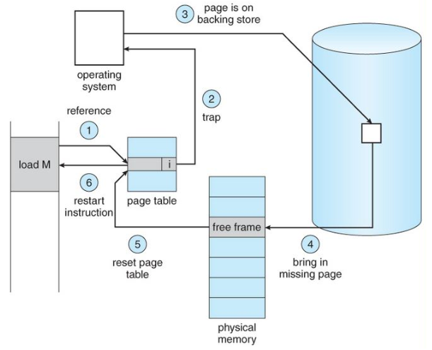

1. 어떤 명령어가 유효한 가상주소에 접근했으나 해당 페이지가 만약 없다면 트랩이 발생되어 운영체제에 알리게 된다.
2. 운영체제는 실제 디스크로부터 사용하지 않은 프레임을 찾는다.
3. 해당 프레임을 실제 메모리에 가져와서 페이지 교체 알고리즘을 기반으로 특정 페이지와 교체한다. (이 때 스와핑이 발생)
4. 페이지 테이블을 갱신시킨 후 해당 명령어를 다시 시작한다.

### 스레싱

- Thrashing : 페이지 폴트가 증가하여 CPU 이용율이 급격하게 떨어지는 현상
- 메모리의 페이지 폴트율이 높은 것을 의미한다.
- 메모리에 너무 많은 프로세스가 동시에 올라가게 되면 스와핑이 많이 일어나서 발생한다.
- 페이지 폴트가 일어나면 CPU 이용률은 낮아진다.
- CPU 이용률이 낮아지면 운영체제는 CPU의 가용성을 높이기 위해 더 많은 프로세스를 메모리에 올리게 된다.
- 이러한 악순환이 반복되어 스레싱이 발생하게 된다.

  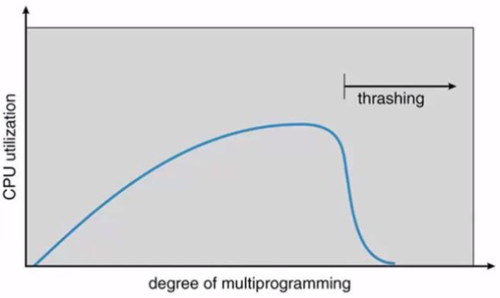  

- 하드웨어적 해결법
    - 메모리 증가
    - HDD 대신 SSD 사용
- 운영체제적 해결법
    - 작업세트
        - working set
        - 프로세스의 과거 사용이력을 기반으로 많이 사용하는 페이지 집합을 만들어 한꺼번에 미리 메모리에 로드하는 것
    - PFF
        - page fault frequency
        - 페이지 폴트 빈도를 조절하는 방법
        - 상한선과 하한선을 만들고 상한선에 도달한다면 프레임을 늘리고 하한선에 도달한다면 프레임을 줄이는 방법

  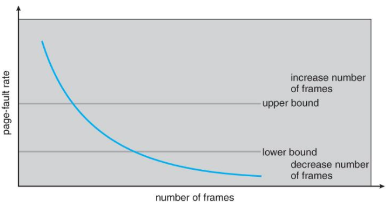  

### 가상 메모리의 필요성

- 주기억장치의 효율적 관리(스와핑)
    - 하드디스크를 주기억장치에 대한 캐시로 설정하여, 당장 사용하는 영역만 유지
    - 쓰지 않는 데이터는 하드디스크로 옮김
    - 필요할 때에만 램에 데이터를 불러와 올리고 다시 사용하지 않으면 하드디스크로 내림으로써 램을 효과적으로 관리
- 메모리 관리의 단순화
    - 각 프로세스마다 가상메모리의 통일된 주소 공간을 배정할 수 있으므로 메모리 관리가 단순해진다.
- 메모리 용량 및 안정성 보장
    - 한정된 공간의 램이 아닌 거의 무한한 가상메모리 공간을 배정함으로써 프로세스들끼리 메모리 침범이 일어날 여지를 크게 줄이게 된다.

---

# 페이지 교체 알고리즘

- 스와핑이 일어날 때 페이지 교체 알고리즘에 의해 페이지가 교체되게 된다.

### LFD (오프라인 알고리즘)

- 가장 좋은 알고리즘이라고 일컫는 알고리즘 (스와핑이 가장 적게 일어남)
- 이는 가장 먼 미래에 참조되는 페이지와 현재 페이지를 바꾸는 알고리즘(LFD, Longest Forward Distance)이다.
- ex) 0, 1, 2, 3, 4, 2 이렇게 들어온다고 가정하면 가장 미래에 참조되는 2와 스와핑하는 것을 말한다.
- 그러나 미래에 사용되는 프로세스를 알지 못하기 때문에 사용할 수 없는 알고리즘이다.
    - 다른 알고리즘과의 성능비교에 대한 상한선을 제공한다.

### FIFO

- First In First Out
- 가장 먼저 온 페이지부터 교체하는 방법

### LRU

- Least Recently Used
- 최근에 사용되지 않은 페이지를 바꾸는 방법
- 참조가 오래된 페이지를 바꾼다.
- 이를 위해 각 페이지마다 최근 사용한 횟수를 나타내는 자료구조를 따로 만들어야 할 수 도 있다.

### NRU

- Not Recently Used (NUR 이라고도 한다)
- LRU에서 발전한 알고리즘
- 일명 clock 알고리즘이라고도 한다.

### LFU

- Least Frequenly Used
- 가장 참조 횟수가 적은 페이지를 교체하는 알고리즘

---

# 프로세스와 스레드의 차이

### 프로세스

- 컴퓨터의 메모리에 올라와 실행되고 있는 프로그램
- task와 같은 의미로 쓰인다.

  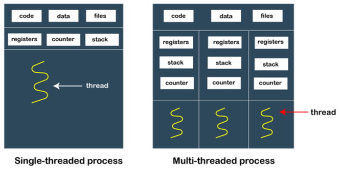  

### 스레드

- 프로세스 내 작업의 흐름을 지칭한다.

### 프로세스와 스레드의 차이

- 구성 : 스택 - 힙 - 데이터 - 코드
1. 프로세스는 스택, 힙 메모리, 데이터, 코드 영역을 기반으로 독립적으로 작업하는 반면
   스레드는 프로세스 내의 스택 메모리를 제외한 다른 메모리 영역을 프로세스 내의 다른 스레드들과 공유하기 때문에 메모리적 이점이 있다.
2. 프로세스는 다른 프로세스와 격리되어있기 때문에 서로 통신을 하기 위해서는 IPC를 사용해야 하지만
   스레드는 다른 스레드와 서로 격리되어있지 않으므로 그냥 통신할 수 있어서 프로세스보다 더 빠르다.
    1. IPC (Inter-Process Communication ) : 프로세스들 사이에 서로 데이터를 주고받는 행위, 방법, 경로
3. 프로세스는 한 프로세스에 문제가 생겨도 다른 프로세스에 영향을 끼치지 않지만
   스레드는 격리가 되어있지 않아 한 스레드에 문제가 생기면 다른 스레드에도 영향을 끼쳐 스레드로 이루어져 있는 프로세스에 영향을 줄 수 있다.
4. 프로세스는 생성과 종료에 더 많은 시간이 들며
   스레드는 더 적은 시간이 든다.

---

# 프로그램의 컴파일 과정

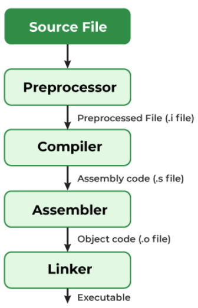  

- 프로그램은 컴파일러가 컴파일 과정을 거쳐 컴퓨터가 이해할 수 있는 기계어로 번역되어 실행될 수 있는 파일이 된 것을 의미한다. (PCLA)
1. 전처리
    1. 소스코드의 주석제거, #includ 등 헤더파일을 병합하고 매크로를 치환한다.
2. 컴파일러
    1. 오류처리, 코드최적화 작업을 하여 어셈블리어로 변환한다.
3. 어셈블러
    1. 어셈블리어는 목적코드(object code)로 변환된다.
    2. 이 때 확장자는 운영체제마다 다른데 리눅스에서는 `.o`이다.
    3. ex) `홍길동.o`이라는 파일을 만들면 `홍길동.c`라는 파일이 만들어지게 된다.
4. 링커
    1. 프로그램 내 있는 라이브러리 함수 등과 결합해 실행파일이 만들어진다.
    2. 이는 `.exe`, `.out`이라는 확장자를 갖게 된다.

---

# 프로세스의 메모리 구조

- 운영체제는 프로세스에 적절한 메모리를 할당하는데 다음 구조를 기반으로 할당한다.

  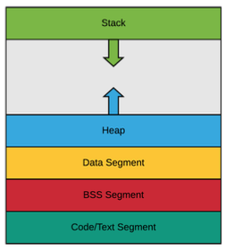  

- 위에서부터 스택(stack), 힙(heap), 데이터 영역(Data segment, BSS segment), 코드영역(code segment)로 나눠진다.
- 스택은 위 주소부터 할당되고 힙은 아래 주소부터 할당된다.
- 스택
    - 지역변수, 매개변수, 함수가 저장되고 컴파일 시에 크기가 결정된다. 그러나 함수가 함수를 호출 하는 등에 따라 런타임 시에도 크기가 변경된다. (동적인 특징)
- 힙
    - 힙은 동적할당을 할 때 사용되며 런타임 시 크기가 결정된다. (동적인 특징)
- 데이터영역
    - BSS 영역과 Data 영역으로 나뉘고 정적할당에 관한 부분을 담당한다. (정적인 특징)
- 코드영역
    - 소스코드 들어간다. (정적인 특징)

### 정적 할당

- 컴파일 단계에서 메모리를 할당하는 것을 말한다.
- BSS segment와 Data segment, code / text segment 로 나뉘어서 저장된다.

  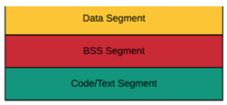  

- BSS segment는 전역변수, static, const로 선언되어있는 변수 중 0으로 초기화 또는 초기화가 어떠한 값으로도 되어있지 않은 변수들이 이 메모리 영역에 할당된다.
- Data segment는 전역변수, static, const로 선언되어있는 변수 중 0이 아닌 값으로 초기화된 변수가 이 메모리 영역에 할당된다.
- code / text segment는 프로그램의 코드가 들어간다.

### 동적 할당

- 런타임단계에서 메모리를 할당받는 것이며 Stack과 Heap으로 나눠진다.

  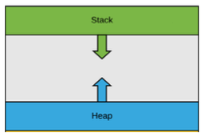  

- Stack
    - 지역변수, 매개변수, 실행되는 함수에 의해 늘어나거나 줄어드는 메모리 영역
    - 함수가 호출될 때마다 호출될 때의 환경 등 특정 정보가 stack에 계속해서 저장된다.
    - 참고로, 재귀함수가 호출된다고 했을 때 새로운 스택 프레임이 매번 사용되기 때문에 함수 내의 변수 집합이 해당 함수의 다른 인스턴스 변수를 방해하지 않는다.
- Heap
    - 동적으로 할당되는 변수들을 담는다.
    - `malloc()`, `free()` 함수를 통해 관리할 수 있으며 동적으로 관리되는 자료구조의 경우 Heap영역을 사용한다.
    - ex) vector는 내부적으로 heap영역을 사용한다.

---

# PCB와 컨텍스트 스위칭

## PCB

- Process Control Block
- 운영체제에서 관리하는 프로세스에 대한 메타데이터를 저장한 데이터 블록
    - 메타데이터
        - 데이터에 관한 구조화된 데이터이자 데이터를 설명하는 작은 데이터 (데이터를 위한 작은 데이터)
        - 대량의 정보 가운데에서 찾고 있는 정보를 효율적으로 찾아내서 이용하기 위해 일정한 규칙에 따라 콘텐츠에 대해 부여되는 데이터
- 커널 스택에 저장 (유저모드가 아닌 커널 모드일 때에만 접근 가능)
- 각 프로세스가 생성될 때마다 고유의 PCB가 생성되고 프로세스가 종료되면 PCB는 제거된다.

### PCB의 구조

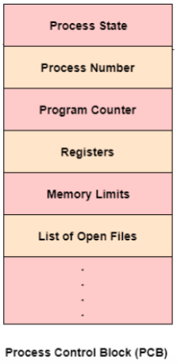  

- 프로세스 상태 : 대기중, 실행중 등 프로세스 의 상태
- 프로세스 번호(PID) : 각 프로세스의 고유 식별 번호(프로세스 ID)
- 프로그램 카운터(PC) : 이 프로세스에 대해 실행될 다음 명령의 주소에 대한 포인터
- 레지스터 : 레지스터 관련 정보
- 메모리 제한 : 프로세스의 메모리 관련정보
- 열린 파일 정보 : 프로세스를 위해 열린 파일 목록들

### 컨텍스트 스위칭

- PCB를 기반으로 프로세스의 상태를 저장하고 다시 복원시키는 과정 (스레드 또한 가능)
- 프로세스가 종료 or 인터럽트에 의해 발생된다.

  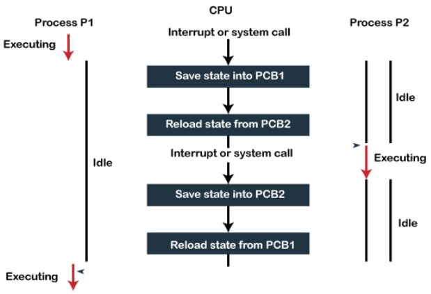  

### 비용

1. 유후시간의 발생
    1. 컨텍스트 스위칭을 할 때마다 유후시간이 생겨서 CPU의 가용성이 떨어지는 비용이 발생한다.
2. 캐시미스
    1. 프로세스가 가지고 있는 메모리 주소가 그대로 있으면 잘못된 주소 변환이 생기므로 캐시 클리어 과정이 무조건 일어나게 되고 이 때문에 캐시미스가 발생한다.

### 스레드에서의 컨텍스트 스위칭

- 스택메모리를 제외한 모든 메모리를 공유하기 때문에 비요잉 더 적고 시간도 더 적게 걸린다는 장점이 있다.

---

# 프로세스의 상태

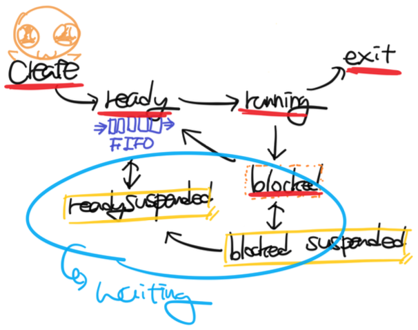

### 생성 상태

- create or new
- 프로세스가 생성된 상태를 의미하며 `fork()` 또는 `exec()` 함수를 통해 프로세스가 생성된 상태
- 이때 PCB가 할당된다.
- `fork()`
    - 부모 프로세스의 주소 공간을 그대로 복사하며, 새로운 자식 프로세스를 생성하는 함수
    - 주소 공간만 복사할 뿐이지 부모 프로세스의 비동기 작업 등을 상속하지는 않는다.
- `exec( )`
    - 새롭게 프로세스를 생성하는 함수

### 대기 상태

- ready
- 처음 프로세스가 생성된 이후 메모리 공간이 충분하면 메모리를 할당받고 아니면 아닌 상태로 준비 큐 (준비 순서열)에 들어가서 대기중인 상태를 말한다.
- 이는 CPU 스케줄러로부터 CPU 소유권이 넘어오기를 기다리는 상태이다.

### 대기 중단 상태

- ready suspended
- 준비큐가 꽉찬 상태 즉, 메모리 부족으로 일시 중단된 상태

### 실행 상태

- running
- CPU 소유권과 메모리를 할당받고 인스트럭션을 수행 중인 상태 (CPU burst)

### 중단 상태

- blocked
- 어떤 이벤트가 발생한 이후 기다리며 프로세스가 차단된 상태
- ex) 프린트 인쇄 버튼을 눌렀을 때 실행하고 있던 프로세스가 잠깐 멈춘 듯할 때
    - 프린트 인쇄에 관한 I/O요청으로 인해 인터럽트가 발생되어 현재 실행하고 있던 프로세스가 중단 상태로 잠시 변경된 것

### 일시 중단 상태

- blocked suspended
- 대기 중단과 유사하다.
- 중단된 상태에서 프로세스가 실행되려고 했지만 메모리 부족으로 일시 중단된 상태

### 종료상태

- terminated or exit
- 프로세스 실행이 완료되어 해당 프로세스에 대한 자원을 반납하며 PCB가 삭제되는 상태
- 종료는 자연스럽게 종료되는 것도 있지만 부모 프로세스가 자식 프로세스를 강제적으로 종료시켜 비자발적 종료(abort)로 종료되는 것도 있다.
- 자식 프로세스에 할당된 자원의 한계치를 넘어서거나 부모 프로세스가 종료되거나 사용자가 `process.kill` 등 여러 명령어로 프로세스를 종료시킬 때 발생한다.

---

# 멀티 프로세싱과 멀티 스레딩

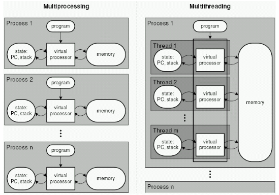  

- 여러 개의 스레드 또는 프로세스를 만든 상태를 멀티 스레드, 멀티 프로세스라고 한다.
- 이를 기반으로 작업을 하는 것을 멀티 스레딩, 멀티 프로세싱이라고 한다.

### 멀티 프로세싱

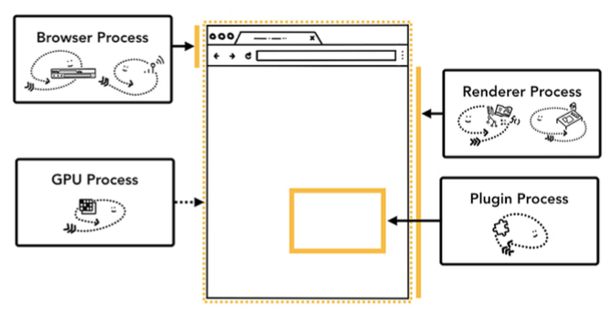  

- 여러 개의 프로세스, 즉 멀티 프로세스를 통해 동시에 두 가지 이상의 일을 수행할 수 있는 것
- 특정 프로세스 중 일부에 문제가 발생되더라도 다른 프로세스에 영향을 미치지 않으며 격리성과 신뢰성이 높은 강점이 있다.

### 멀티 스레딩

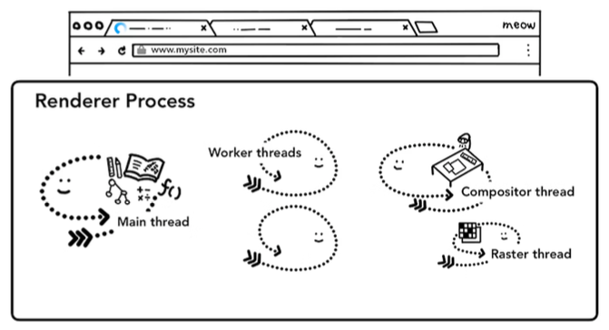  

- 스레드의 경우에는 프로세스와 달리, 스택을 제외한 메모리(힙, 데이터, 코드)를 공유한다.
- 프로세스 내 작업을 멀티 스레드로 처리하는 기법이며 스레드끼리 서로 자원을 공유하고 프로세스보다는 가볍기 때문에 효율성이 높은 장점이 있다.
- 그러나 한 스레드에 문제가 생기면 다른 스레드에도 영향을 끼쳐 스레드로 이루어져 있는 프로세스에 영향을 줄 수 있는 단점이 있다.

---

# IPC

- Inter-Process Communication
- 프로세스끼리 데이터를 주고받고 공유데이터를 관리하는 메커니즘
- 종류 : 공유메모리, 파일, 소켓, 파이프, 메세지 큐

### 공유메모리

- 여러 프로세스가 서로 통신할 수 있도록 메모리를 공유하는 것
- IPC 방식 중 어떠한 매개체를 통해 데이터를 주고 받는게 아니라 메모리 자체를 공유
- 불필요한 데이터 복사의 오버헤드가 발생하지 않아 가장 빠르다.
- 같은 메모리 영역을 여러 프로세스가 공유하기 때문에 동기화가 필요하다.

  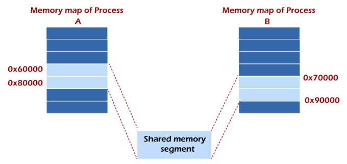  

- IPC 중에서 가장 빠른 통신 방법이다.

### 파일

- 디스크에 저장된 데이터를 기반으로 통신하는 것을 의미한다.
- 요즘 IPC로는 잘 사용하지 않는 방식 중 하나

### 소켓

- 네트워크 인터페이스(TCP, UDP, HTTP 등)를 기반으로 통신하는 것
- ex) 네이버

### 파이프

- 익명 파이프
    - anonymous pipe, unnamed pipe
    - 프로세스 사이에 FIFO 기반의 통신채널을 만들어 통신하는 것

      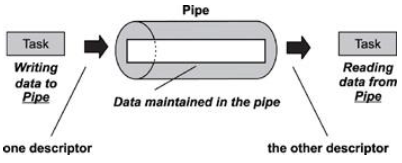  

    - 파이프 하나 당 단방향 통신이기 때문에 만약 양방향 통신을 하려면 2개의 익명 파이프를 만들어야 한다.

      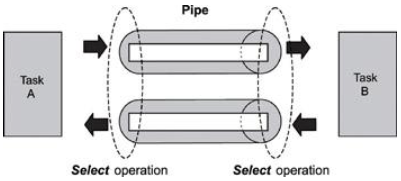  

    - 부모, 자식 프로세스 간에만 사용할 수 있으므로 다른 네트워크 상에서는 사용이 불가능하다.
    - 파이프의 데이터 용량은 제한되어 있으며 쓰기, 읽기 프로세스보다 더 빠르게 데이터를 쓸 수 없다.
        - 들어오는 양(읽기)과 나가는 양(쓰기)이 같다.
- 명명 파이프
    - named pipe
    - 익명 파이프의 확장된 개념이며 부모, 자식 뿐만 아니라 다른 네트워크 상에서도 통신할 수 있는 파이프
    - 보통 서버, 클라이언트용 파이프를 구분해서 동작한다.

      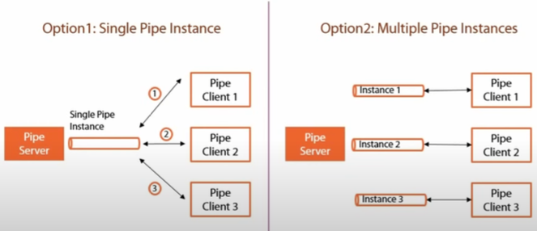  

### 메세지 큐

- 메세지를 큐(queue) 자료구조 형태로 관리하는 버퍼를 만들어 통신하는 것

  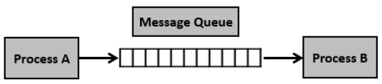  

1. 프로세스가 메세지를 보내거나 받기 전에 큐를 초기화한다.
2. 보내는 프로세스(sender)의 메세지는 큐에 복사되어 받는 프로세스(receiver)에 전달된다.
