10주차
=

---

- [공유자원, 경쟁상태, 임계영역](#공유자원-경쟁상태-임계영역)
- [뮤텍스, 세마포어, 모니터](#뮤텍스-세마포어-모니터)
- [교착상태](#교착상태)
- [비선점형(FCFS, SJF, 우선순위)](#비선점형fcfs-sjf-우선순위)
- [선점형(라운드로빈, SRF, 다단계큐)](#선점형라운드로빈-srf-다단계큐)
- [캐시](#캐시)
- [연속할당 : 고정분할과 가변분할](#연속할당--고정분할과-가변분할)
- [불연속할당 : 페이징, 세그멘테이션, 페이지드 세그멘테이션](#불연속할당--페이징-세그멘테이션-페이지드-세그멘테이션)
- [추가](#추가)

---

# 공유자원, 경쟁상태, 임계영역

### 공유 자원

- shared resource
- 시스템 안에서 각 프로세스, 스레드가 함께 접근할 수 있는 모니터, 프린터 메모리, 파일, 데이터 등의 자원이나 변수 등을 의미한다.

### 경쟁 상태

- race condition
- 이 공유 자원을 둘 이상의 프로세스 또는 스레드가 동시에 읽거나 쓰는 상황
- 동시에 접근을 시도할 때의 타이밍이 예상되는 결과 값에 영향을 줄 수 있는 상태를 의미한다.

### 임계 영역

- critical section
- 둘 이상의 프로세스 또는 스레드가 공유자원에 접근할 때 순서 등의 이유로 결과가 달라지는 코드영역을 의미한다.
- 예상한 결과와 달라지는 상황
- 이 영역은 한 번에 둘 이상의 프로세스나 스레드가 들어갈 수 없게 설계된다.

  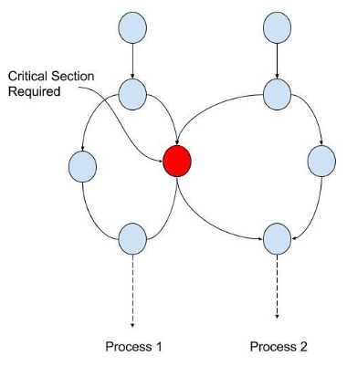  

### 경쟁 상태 관리의 중요성

- 경쟁 상태를 잘 해결하지 못하면 데이터 정합성, 데이터 무결성을 지키지 못할 수 있다.
- 데이터 정합성(data consistency)
    - 예상되는 데이터의 값과 다른 것을 말한다.
    - 읽을 때 0 원이어야 하는데 1000원인 경우
- 데이터 무결성(data integrity)
    - 데이터의 어떠한 규칙을 위반하면 안되는 것을 말한다.
    - 데이터가 전송, 저장되고 처리되는 모든 과정에서 변경되거나 손상되지 않고 완전성, 정확성, 일관성을 유지함을 보장하는 특성
    - 은행에서 0원인데 출금하는 경우

---

# 뮤텍스, 세마포어, 모니터

- 경쟁 상태를 해결하는 대표적인 방법에는 뮤텍스, 세마포어, 모니터 3가지가 있다.
- 이들은 상호배제, 한정대기, 진행의 융통성의 조건을 만족시키며 경쟁상태를 해결한다.
- 프로세스, 스레드 모두 다 적용되는 기법이다,

# 경쟁 상태 해결 조건

### 상호 배제

- mutual exclusion
- 한 프로세스가 임계 영역에 들어갔을 때 다른 프로세스는 들어갈 수 없음

### 한정 대기

- bounded wating
- 특정 프로세스가 임계영역 진입을 요청한 후 해당 요청이 승인되기 전까지 다른 프로세스가 임계영역에 진입하는 횟수를 제한하는 것을 의미한다.
- 이를 통해 특정 프로세스가 영원히 임계영역에 들어가지 못하게 하는 것을 방지한다.

### 진행의 융통성

- progress
- 만약 어떠한 프로세스도 임계영역을 사용하지 않는다면 임계영역 외부의 어떠한 프로세스도 들어갈 수 있으며 이 때 프로세스끼리 서로 방해하지 않는 것을 말한다.

# 경쟁 상태 해결 방법

## 뮤텍스

- 뮤텍스(mutex)는 공유 자원을 `lock()`을 통해 잠금설정하고 사용한 후에 `unlock()`을 통해 잠금해제가 되는 객체 lock을 기반으로 경쟁상태를 해결한다.
- 잠금이 설정되면 다른 프로세스나 스레드는 잠긴 코드 영역에 접근할 수 없고 해제는 그와 반대가 된다.
- 한번에 하나의 프로세스만 임계영역에 있을 수 있다.
- ex) 변기가 1개인 화장실

  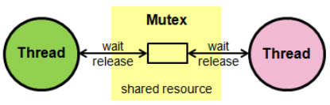  

## 세마포어

- 세마포어(semaphore)는 일반화된 뮤텍스를 의미한다.
- 간단히 정수 S와 두 가지 함수 `wait()`및 `signal()`로 공유 자원에 대한 접근을 처리한다.
- 이를 통해 여러 프로세스가 동시에 임계영역에 접근할 수 있다.
    - S
        - 현재 쓸 수 있는 공유자원의 수
    - `wait()` (P)
        - S를 1씩 감소시킨다.
        - 대기열에 집어 넣는다.
        - 감소시키다가 만약 S가 음수가 된다면 공유자원을 쓸 수 없기 때문에 프로세스는 차단되며 대기열에 프로세스를 집어넣는다.
    - `signal()` (V)
        - S를 1씩 증가시킨다.
        - 대기열에 있던 프로세스를 꺼내서 공유자원에 대한 작업을 진행한다.
        - 공유자원을 프로세스가 다 쓴 상태를 의미한다.
        - 이 때 만약 S가 0 이하라면 대기열에 있던 프로세스가 동작하게 된다.
    - ex) 5명의 사용자만이 로그인하여 들어갈 수 있는 게임

  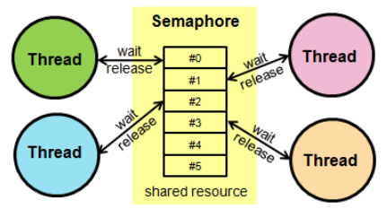  

- 세마포어는 바이너리 세마포어와 카운팅 세마포어로 나뉜다.

### 바이너리 세마포어

- 0과 1의 두가지 값만 가질 수 있는 세마포어이다.
- 구현의 유사성으로 뮤텍스는 바이너리 세마포어라고 할 수 있지만 엄밀히 말하면 뮤텍스는 잠금`(lock())`을 기반으로 상호배제가 일어나는 ‘잠금 매커니즘’을 사용했고, 세마포어는 신호를 기반으로 상호 배제가 일어나는 ‘신호 매커니즘’을 사용한 점이 다르다.
- ex) 신호 매커니즘 : 휴대폰에서 노래를 듣다가  전화가 오면 노래가 중지되고 통화 처리 작업에 대한 인터페이스가 등장하는 것

### 카운팅 세마포어

- 여러 개의 값을 가질 수 있는 세마포어

## 모니터

- 모니터(monior)는 둘 이상의 스레드나 프로세스가 공유 자원에 안전하게 접근할 수 있도록 공유자원을 숨기고 해당 접근에 대해 인터페이스만 제공하는 객체
- 이를 통해 공유자원에 대한 작업들을 순차적으로 처리한다.

  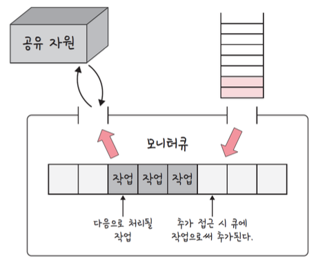  

### 모니터와 세마포어의 차이

- 모니터
    - 세마포어보다 구현하기 쉬우며 한 번에 하나의 프로세스만 공유자원에 접근할 수 있다.
    - 이러한 이유로 상호 배제가 자동이다.
    - 인터페이스를 기반으로 구축된다.
- 세마포어
    - 모니터보다 구현하기 어려우며 한 번에 여러 개의 프로세스가 공유자원에 접근할 수 있다.
    - 상호 배제를 명시적으로 구현해야 한다.
    - 정수 변수를 기반으로 구축된다.

---

# 교착상태

- 교착상태(deadlock)는 두 개 이상의 프로세스들이 서로가 가진 자원을 기다리며 중단된 상태를 의미한다.
- 각 프로세스는 서로가 원하는 자원을 유지한 채 다른 프로세스의 자원을 얻기를 기다리는 것

  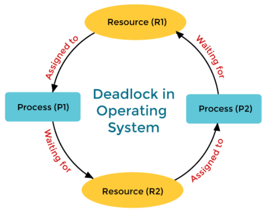  

### 교착 상태의 원인 (4가지 필요조건)

- 상호 배제
    - 주어진 시간 내에 하나의 프로세스만 자원을 독점할 수 있다. 즉, 다른 프로세스들은 접근이 불가능하다.
- 점유 대기
    - 특정 프로세스가 점유한 자원을 다른 프로세스가 요청하며 대기하는 상태
- 비선점
    - 다른 프로세스의 자원을 강제적으로 가져올 수 없다.
- 환형 대기
    - 프로세스 A는 프로세스 B의 자원을 요구하고, 프로세스 B는 프로세스 A의 자원을 요구하는 등 서로가 서로의 자원을 요구하는 상황을 의미한다.

### 교착 상태의 해결 방법

- 자원을 할당할 때 애초에 조건이 성립되지 않도록 설계한다.
- 교착 상태 가능성이 없을 때만 자원이 할당되며, 프로세스 당 요청할 자원들의 최대치를 통해 자원 할당 가능 여부를 파악하는 ‘은행원 알고리즘’을 쓴다.
- 교착 상태가 발생하면 사이클이 있는지 찾아보고 이에 관련된 프로세스를 한 개씩 지운다.
- 교착 상태는 매우 드물게 일어나기 때문에 이를 처리하는 비용이 더 커서 교착 상태가 발생하면 사용자가 작업을 종료한다.
    - 현대 운영 체제는 이 방법을 채택했다.
    - ex) 프로세스를 실행시키다가 ‘응답 없음’이라고 뜰 경우 → 교착 상태가 발생한 경우에 이와 같은 경우가 발생하기도 한다.

## 은행원 알고리즘

- 은행원 알고리즘(banker’s algorithm)은 교착상태를 회피하는 알고리즘으로 총 자원의 앙과 현재 할당한 자원의 양을 기준으로 안정 또는 불안정 상태로 나누고 안정 상태로 가도록 자원을 할당하는 알고리즘이다.
    - 안정 상태 : 교착상태를 일으키지 않은 상태이며 프로세스의 최대자원요구량을 운영체제가 충족시킬 수 있는 상태
    - 불안정 상태 : 안정 상태로 가는 순서열이 존재하지 않는 상태

### 자료구조

- 2차원 배열 (n * m) 3개
- 1차원 배열 (n) 2개

### 구조

- `available[i]` : 운영체제가 프로세스에게 자원을 줄 수 있는 양 / i번째 사용 가능한 자원의 양
- `max[i][j]` : 프로세스최대요구량 / 프로세스i가 자원 j를 최대 요청할 수 있는 양
- `allocation[i][j]` : 프로세스 자원 할당 양 / 프로세스 i에 자원 j를 할당한 양
- `need[i][j]` : 프로세스의 자원 추가 요구량 / 프로세스 i가 자원 j를 추가요청하는 양
- `finish[i]` : i번째 프로세스가 요청하는 양을 운영체제가 만족할 수 있는지를 파악할 수 있는 boolean 배열

### 순서

1. request[i] <= need[i] / 해당 조건 불충족시 오류
2. request[i] <= available[i] / 해당 조건 불충족시 대기
3. 이후 request[i]의 값이 available[i]에 더해지며 need[i]에 request[i] 값이 빼지게 됩니다.
4. 이러한 과정을 모든 프로세스에 대해 반복한 뒤 모든 finish[i]가 true라면 안정상태가 됩니다.

### 단점

- 프로세스가 시스템에 들어갈 때 필요한 최대 자원 수를 예측해야 하는데 이를 예측하기가 쉽지 않다.
- 해당 알고리즘에 대한 자원소모량이 증가하게 되며 프로그램의 수는 고정되어있지 않고 항상 변하기 때문에 쓰기가 어렵다.

---

CPU 스케줄링 알고리즘
=

# 비선점형(FCFS, SJF, 우선순위)

- CPU가 어떤 프로세스를 선택할 것인지는 스케줄링 알고리즘을 통해 선택되며 효율적으로 선택하는게 중요하다.
- 여기서 효율적이란 것은 다음과 같은 사항을 만족시킬 때 효율적이라고 한다.
    1. CPU 사용률이 높은가?
    2. 단위 시간 당 작업을 마친 프로세스의 수(처리량)가 높은가?
    3. 작업을 요청한 프로세스가 작업을 시작하기 전 대기하는 시간은 짧은가?
- 방식은 비선점형(중지시키지 않고 진행) 방식과 선점형(중지 후 강제로 삽입) 방식으로 나뉜다.

## 비선점형 방식

- 비선점형 방식(non-preemptive)은 프로세스가 스스로 CPU 소유권을 포기하는 방식이며, 강제로 프로세스를 중지하지 않는다.
- 따라서 컨텍스트 스위칭으로 인한 부하가 적다.

### FCFS

- FCFS(First Come, First Served)는 가장 먼저 온 것을 가장 먼저 처리하는 알고리즘
- 길게 수행되는 프로세스 때문에 콘보이 현상(convoy effect, 준비 큐에서 오래 기다리는 현상)이 발생하는 단점이 있다.

### SJF

- SJF(Shortest Job First)는 실행 시간이 가장 짧은 프로세스를 가장 먼저 실행하는 알고리즘
- 긴 시간을 가진 프로세스가 실행되지 않는 현상(starvation)이 일어날 수 있으며 평균 대기 시간이 가장 짧다.
- 하지만 실제로는 실행 시간을 알 수 없기 때문에 과거의 실행했던 시간을 토대로 추측해서 사용한다.

  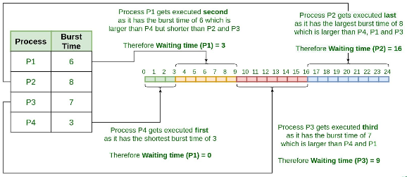  

### 우선순위

- 기존 SJF 스케줄링의 경우 긴 시간을 가진 프로세스가 실행되지 않는 현상이 있었다.
- 이를 오래된 작업일수록 ‘우선순위를 높이는 방법(aging)’을 통해 단점을 보완한 알고리즘을 말한다.
- 여기서 우선순위는 작업의 시간, 프로세스의 메모리 요구사항, 열린 파일 수 , 평균 CPU 사용량 등을 고려해서 설정된다.
- 우선순위 알고리즘은 앞서 설명한 SJF + 우선순위를 말하는 것 뿐만 아니라, FCFS를 활용하여 만들기도 하며 선점형, 비선점형적인 우선순위 스케줄링 알고리즘을 말하기도 한다.

# 선점형(라운드로빈, SRF, 다단계큐)

- 선점형 방식(preemptive)은 현대 운영체제가 쓰는 방식으로 지금 사용하고 있는 프로세스를 알고리즘에 의해 중단시켜 버리고 강제로 다른 프로세스에 CPU 소유권을 할당할 수 도 있는 방식을 말한다.

## 라운드 로빈

- 라운드 로빈(RR, Round Robin)은 현대 컴퓨터가 쓰는 스케줄링 방법이며 단순한 선점형 알고리즘이다.
- 각 프로세스는 동일한 할당 시간을 주고 그 시간 안에 끝나지 않으면 다시 준비 큐(ready queue)의 뒤로 가는 알고리즘이다.
- 예를 들어, q만큼의 할당 시간이 부여되었고 N개의 프로세스가 운영된다고 하면 (N - 1) *  q 시간이 지나면 자기 차례가 오게 된다.

  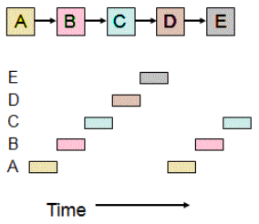  

- 할당시간이 너무 크면 FCFS가 되고 짧으면 컨텍스트 스위칭이 잦아져서 오버헤드, 즉 비용이 커진다.
- 일반적으로 전체 작업 시간은 길어지지만 평균 응답 시간은 짧아진다는 특징이 있다.
- 또한, 이 알고리즘은 로드밸런서에서 트래픽 분산 알고리즘으로도 쓰인다.

  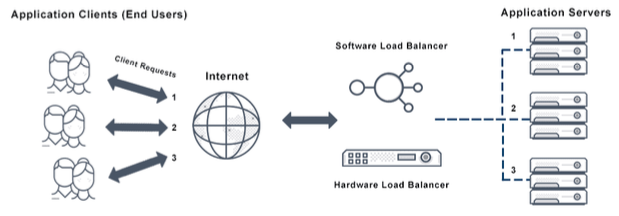  

## SRF

- 기존의 SJF는 짧은 것부터 수행
- 만약 ready queue에 더 짧은 것이 들어와도 기존의 큐를 순차적으로 실행시키고 그 다음을 실행
- 반대로 SRF(Shortedst Remaining Time First)는 중간에 더 짧은 작업이 들어오면 수행하던 프로세스를 중지하고 해당 프로세스를 수행하는 알고리즘이다.

## 다단계 큐

- 우선순위에 따른 준비 큐를 여러개 사용하고, 큐마다 라운드로빈이나 FCFS 등 다른 스케줄링 알고리즘을 적용한 것을 말한다.
- 큐 간의 프로세스 이동이 안되므로 스케줄링 부담이 적지만 유연성이 떨어지는 특징이 있다.
- 우선순위가 높은 큐부터 처리되기 때문에 낮은 큐의 프로세스가 처리가 안되는 기아 현상(starvation)이 발생할 수 도 있다.

  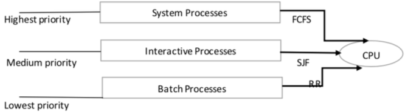  

- 비선점형 알고리즘으로만 이루어진 다단계 큐 스케줄링 알고리즘도 있다.

---

# 캐시

## 캐시

- 데이터를 미리 복사해 놓는 임시 저장소
- 빠른 장치와 느린 장치에서 속도 차이에 따른 병목 현상을 줄이기 위한 메모리를 말한다.
- 이를 통해 데이터 접근시간의 단축, 데이터를 다시 계산하는 등의 시간을 절약할 수 있다.
- 캐시의 예 : CPU 레지스터
    - CPU가 메모리로부터 데이터를 가져올 때의 시간이 너무나 크기 때문에 그 중간에 레지스터 계층을 둬서 속도 차이를 두어 해결한다.

  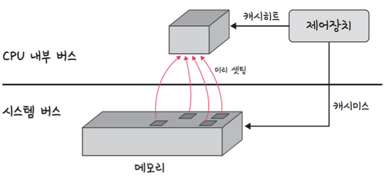  

### 캐시히트와 캐시미스

- 캐시히트 : 캐시에서 원하는 데이터를 찾은 것
- 캐시미스 : 캐시에서 원하는 데이터를 찾지 못한 것
- 앞의 예시 같은 경우는 캐시미스가 일어나면 메모리로 가서 원하는 데이터를 레지스터에 등록하게 된다.
- 참고로 이러한 캐시는 우리가 사용하는 서비스 내부에서도 많이 찾아볼 수 있다.

  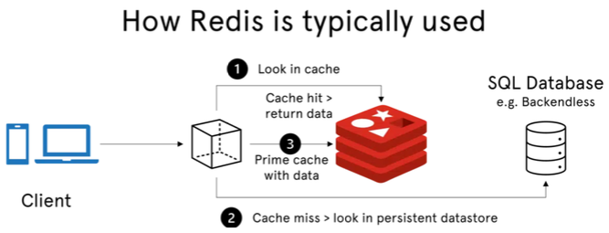  

  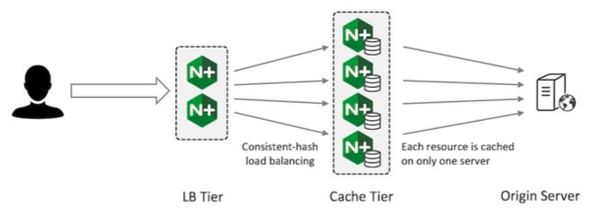  

## 캐시 - 지역성의 원리

- 캐시를 설정할 때에는 자주 사용하는 데이터를 기반으로 설정해야 한다.
- 이 때 지역성을 기반으로 설정되는데 지역성은 시간 지역성(temporal locality)과 공간 지역성(spatial locality)으로 나뉘게 된다.

### 시간 지역성

- 최근 사용한 데이터에 다시 접근하려는 특성

### 공간 지역성

- 최근 접근한 데이터를 이루고 있는 공간이나 그 가까운 공간에 접근하는 특성

## 캐시매핑 : 직접매핑, 연관매핑, 집합 - 연관매핑

- 캐시의 크기는 메모리보다 항상 작기 때문에 효율적으로 매핑하는 것이 중요하다.
- 매핑 방식에는 직접 매핑, 연관 매핑, 집합 - 연관 매핑이 있다.
    - 참고로 직접 사상, 연관 사상, 집합 - 연관 사상이라고도 한다.

### 직접 매핑

- 직접 매핑(direct mapping)이란 메모리의 특정 블록은 특정 캐시 라인에만 매핑할 수 있는 것을 말한다.
- 예를 들어 메모리가 A개의 페이지, 캐시가 B개의 페이지로 구성된다고 했을 때 메모리의 페이지 수 A를 B개로 나누는 것
- 이렇게 되면 메모리의 페이지의 수는 B * 블록의 수가 된다.
- 메모리가 1~100이 있고 캐시가 1~5이 있다면 1:1~20, 2:21~40... 이런 식으로 매핑하는 것을 말한다.

### 내부적 구성

- 운영체제는 메모리를 똑같은 크기의 페이지(보통 4kb)로 나눠서 관리를 한다.
- <P, D>로 나누어 관리한다.
- P(Page Number)는 페이지 번호이며 D(Page Offset)는 페이지 번호로부터 해당 주소까지의 거리를 의미한다.

  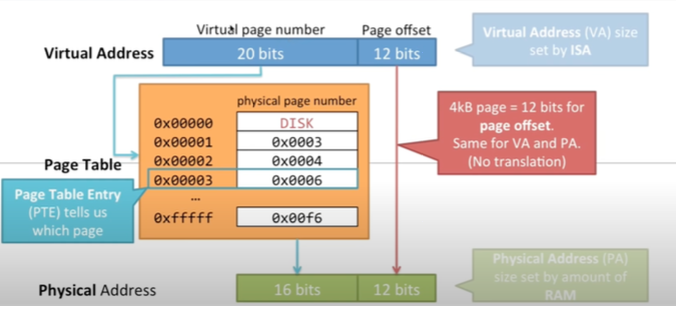  

- 위의 그림처럼 가상주소는 20bits로 주소를 관리하기 때문에 더 많은 주소를 할당하는 것을 볼 수 있으며 이러한 주소가 16bits의 실제주소로 페이지 테이블을 통해 변환되는 것을 볼 수 있다.
- 여기서 D(Page Offset)은 변환되지 않고 변환되는 것은 P(Page Number)입니다.

### 연관 매핑

- 연관 매핑(associative mapping)이란 순서를 일치시키지 않고 관련 있는 캐시와 메모리를 매핑하여 메모리의 컨텐츠가 캐시의 어느 위치에도 올라갈 수 있는 방법을 말한다.
- 스와핑이 덜 일어나겠지만 캐시의 모든 블록을 탐색해야 해서 속도가 직접매핑보다 느리다.

### 집합 연관 매핑

- 집합 연관매핑(set associate mapping)은 집합을 나누고(정해진 집합을 만들다 - 직접매핑) 해당 집합에는 bd(block distance)만 같으면 들어올 수 있게 하는, 이 때 어떤 블럭에도 들어올 수 있게 하는것
- 이를 통해 모든 블럭을 찾을 필요 없이 특정 블럭을 찾게 해 탐색비용을 낮춘 직접매핑의 장점과 스와핑을 완화시키는 연관매핑의 장점을 모두 지니게 된다.

---

# 연속할당 : 고정분할과 가변분할

- 프로그램에 필요한 메모리를 할당할 때 시작 메모리 위치, 메모리 할당 크기를 기반으로 할당하는데 이는 연속 할당과 불연속 할당으로 나뉜다.

## 연속 할당

- 연속 할당(contiguous memory allocation)은 메모리에 ‘연속적으로’ 공간을 할당하는 것
- 사용 가능한 모든 메모리 공간이 같은 위치에 함께 있다.
- 즉, 메모리 파티션이 전체 메모리 공간에서 여기저기서 분산되어있지 않다.

  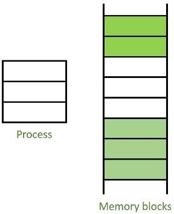  

- 여기에는 고정분할방식과 가변분할 방식이 있다.

### 고정 분할 방식

- 고정 분할 방식(fixed partition allocation)은 메모리를 미리 같은 크기로 분할해서 할당하는 방법
- 이는 내부단편화(Internal fragmentation)가 발생한다.

  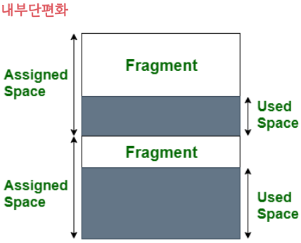  

- 내부단편화란 프로그램이 필요한 공간보다 더 많은 메모리가 할당되어 내부적으로 조각이 더 많이 생기는 것
- 이를 통해 추후에 프로그램에 필요한 메모리를 할당하지 못하는 현상이 일어나게 된다.

### 가변 분할 방식

- 가변 분할 방식(variable partition allocation)은 프로그램에 필요한만큼 동적으로 할당하는 방법
- 내부단편화는 발생하지 않고 외부단편화가 발생할 수 있다.

  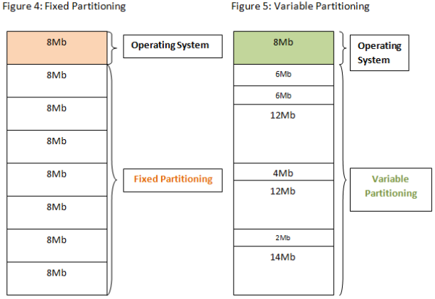  

- 가변분할방식에는 최초적합, 최적적합, 최악적합이 있다.
    - 최초적합(first fit) : 위쪽이나 아래쪽부터 시작해 홀을 찾으면 바로 할당한다.
    - 최적적합(best fit) : 필요한 메모리 크기 이상인 공간 중 가장 작은 홀부터 할당한다.
    - 최악적합(worst fit) : 프로세스의 크기와 가장 많이 차이가 나는 홀에 할당한다.
        - 홀(hole 이란 할당할 수 있는 비어있는 메모리 공간을 말한다.

    

### 외부 단편화

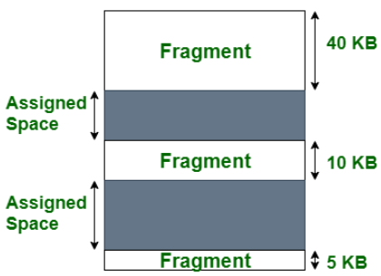  

- 외부단편화는 동적으로 할당하다보면 동적으로 할당한 외부에 작은 조각들이 생기게 되는 현상을 말한다.
- 저 조각들을 합하면 (40kb + 10kb)로 50kb짜리 프로그램을 충족시킬 수 있지만 외부의 조각들이 되어있기 때문에 50kb와 같은 큰 프로그램이 들어왔을 때 메모리를 할당못하는 현상이 발생할 수 있다.

---

# 불연속할당 : 페이징, 세그멘테이션, 페이지드 세그멘테이션

## 페이징

- 페이징(memory paging)은 동일한 크기(보통 4kb)의 페이지 단위로 나누어 메모리의 서로 다른 위치에 프로세스를 할당한다.
- 홀의 크기가 균일하지 않은 문제가 없어지지만 주소 변환을 페이지별로 해야 하기 때문에 주소변환이 복잡해지는 단점이 있다.
- 다음과 같이 4kb짜리 프로세스를 2kb, 2kb 이렇게 똑같은 크기로 나눠서 할당할 수 있기 때문에 외부 단편화가 해결되지만 내부 단편화가 생길 수 있다.

  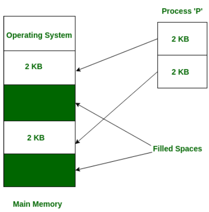  

## 세그멘테이션

- 세그멘테이션(memory segmentation)은 페이지 단위가 아닌 의미 단위인 세그먼트(segment)로 나누는 방식
- 프로세스는 코드, 데이터, 스택, 힙으로 나누어져 메모리가 할당되는데 코드와 데이터 또는 코드와 스택 등으로 나눌 수도 있으며 함수 단위로 나눌 수도 있음을 의미한다.
- 공유와 보안 측면에서 좋지만 홀 크기가 균일하지 않게 된다.
- 내부단편화가 해결될 수 있지만 외부단편화가 일어날 수 있다.

### 페이지드 세그멘테이션

- 페이지드 세그멘테이션(paged segmentation or segementation with paging)
- 세그멘테이션으로 나누되 해당 세그멘테이션을 동일한 크기의 페이지로 나누는 방법

---

# 추가

## LFD 알고리즘이 왜 최고의 페이지 교체 알고리즘인가?

- LFD(OPT) 알고리즘은 메모리 관리에서 사용되는 오프라인 알고리즘이며, 이론적으로 최적의 페이지 교체 방법을 제공한다.
- 이 알고리즘은 미래에 어떤 페이지가 사용될지를 사전에 알고 있다는 가정 하에 설계되었다.
- 실제 시스템에서는 이러한 정보를 알 수 없기 때문에, LFD 알고리즘은 주로 다른 페이지 교체 알고리즘의 성능 측정 기준으로 활용된다.
    - LFD 알고리즘의 주요 원리는 가장 오랫동안 사용되지 않을 페이지를 교체하는 것이다.
    - 현재 시점에서 미래에 가장 먼 시점까지 사용되지 않을 페이지를 메모리에서 제거하는 방식으로, 페이지 부재의 수를 최소화한다.
    - 이는 이론적으로 가장 효율적인 페이지 교체 방법으로 간주된다.
- 다른 알고리즘들, 예를 들어 LRU(Least Recently Used)나 FIFO(First-In, First-Out)는 과거의 사용 패턴을 기반으로 교체 대상을 결정한다.
- 반면, LFD는 미래의 사용 패턴을 이미 알고 있다는 점에서 차별화된다.
    - 하지만 미래의 페이지 접근 정보를 미리 알 수 없기 때문에, LFD 알고리즘은 실제 시스템에서 구현할 수 없다.
- 결론적으로, LFD 알고리즘은 페이지 부재를 최소화하는 최적의 방법이지만, 미래의 메모리 접근 패턴을 예측할 수 없어 실제 시스템에서는 사용되지 않는다.
- 주로 이론적 모델이나 다른 알고리즘과의 성능 비교에서 중요한 기준점으로 활용된다.

## convoy effect와 starvation의 차이

### convoy effect

- 몇 개의 시간이 오래 걸리는 프로세스로 인해 다른 프로세스의 실행이 느려지고 평균 대기시간이 길어지며 결과적으로 전체적인 프로세스의 성능을 저하시키는 현상을 의미한다.
- FCFS(First Come First Serve) 알고리즘을 사용할 때 나타날 수도 있는 현상이다.

  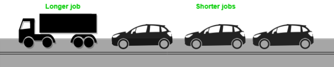  

### starvation

- starvation(기아)은 어떤 프로세스가 “무기한으로” 대기하며 CPU 소유권을 얻을 수 없음을 의미한다.
- SJF 알고리즘을 사용할 때 나타날 수도 있는 현상이다.
- 우선순위가 자꾸 밀려져서 해당 프로세스가 아예 실행이 안되는 것이다.
- 이를 극복하는 한 가지 방법은 aging을 통해 우선순위를 높이는 방법이 있다.
- 실행되지 않은 프로세스라면 시간이 지나가면서 우선순위를 높여서 실행되게 만드는 것이다.

  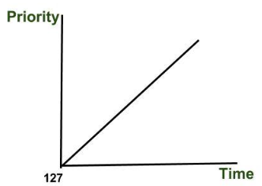  

## busy wait이란?

- busy wait은 프로세스, 스레드가 어떠한 일을 실행하기전에 만족하는 조건을 지속적으로 확인하는 동기화 기술이다.

  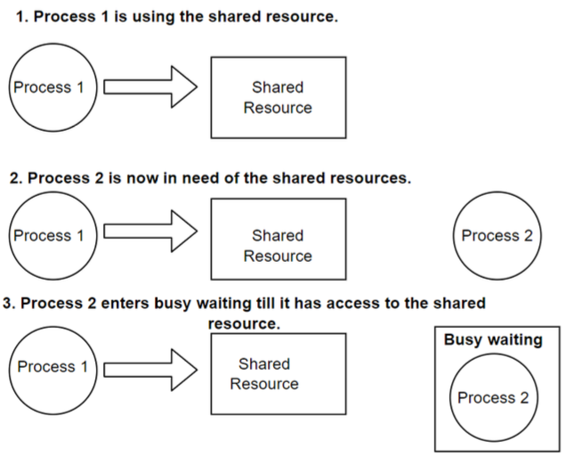  

- busy wait은 운영체제에서 프로세스가 공유자원에 동시에 접근하는 것을 방지하는 상호배제를 달성하는데 사용된다.
- busy wait 상태에서는 우선순위에 따라 작업을 바꿀 수 업식 대문에 우선 순위가 높은 작업을 완료해야 할 때 비효율적이다.
- 대기시간이 많이 걸릴 경우 계속해서 기다리는데 CPU자원을 쓰기 때문에 자원낭비가 심하다는 단점이 있다.

## 운영체제와 펌웨어의 차이

- 펌웨어
    - ROM이라 불리는 비휘발성 메모리 하나를 쓴다.
    - 자유로이 프로그램을 설치할 수 없으며 미리 설치해놓은 프로그램을 기반으로 업데이트가 일어난다.
    - ROM에 해당 소프트웨어를 지우고 덮어쓰고 쓰면서 업데이트가 일어난다.
    - 운영체제는 정기적으로 업데이트가 되며 운영체제 위에 프로그램을 자유로이 설치할 수 있다.
    - 종류로는 키보드, 세탁기 안에 들어가있는 소프트웨어
- 운영체제
    - 휘발성, 비휘발성 메모리를 계층화해서 쓴다.
    - 종류로는 MacOS, WindowOS가 있다.